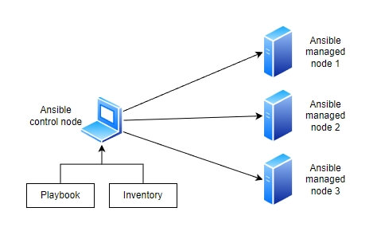

# Ansible ülevaade

## Eesmärk

Selles peatükis õpid:

- Mis on Ansible
- Kuidas Ansible töötab
- Kuidas Ansible't kasutada

## Mis on Ansible?

Kujuta ette, et sul on kümneid või isegi sadu servereid, mida pead seadistama, uuendama või millele lisama tarkvara, lisama uusi kasutajaid, muutma paroole. Käsitsi tehes oleks see tüütu ja aeganõudev töö. Siin tuleb appi **Ansible**.

Ansible on **tasuta ja avatud lähtekoodiga tööriist**, mis aitab automatiseerida IT-süsteemide haldamist. Selle abil saad ühe käsuga teha muudatusi sadades serverites. Ansible on "agentless" tööriist, mis tähendab, et hallatavatesse seadmetesse ei pea paigaldama ühtegi lisaprogrammi. Kõik toimub üle **SSH** (Linuxi ja Windowsi puhul) või **WinRM-i** (Windowsi puhul, kui SSH pole kasutusel). Hallatavates Linuxi masinates peab olema ainult **SSH** ja **Python**, Windowsi puhul kas **WinRM** või **OpenSSH-server**.

Ansible arendajaks on Red Hat, mis omandas Ansible 2015. aastal. Kuigi Red Hat pakub ka Ansible’ile tuge ja täiendavaid tööriistu (näiteks Red Hat Ansible Automation Platform), on Ansible’i põhiversioon ja paljud selle komponendid avatud lähtekoodiga ja kõigile tasuta kättesaadavad. Sellesse panustavad ka paljud teised arendajad ja IT-spetsialistid üle maailma.

### Milleks Ansible kasulik on?

- **Automatiseerib korduvaid töid.** Näiteks programmide paigaldamine või seadistuste muutmine.
- **Hoiab kõik süsteemid ühtemoodi.** Kui seadistad midagi ühes serveris, saad sama teha kõigis teistes.
- **Säästab aega.** Ühe käsuga saab hallata kümneid või sadu servereid.
- **Vähendab vigu.** Kui töö on automatiseeritud, jääb vähem ruumi inimlikele eksimustele.
- **Kontrollib enne tegevust.** Kui midagi on juba õigesti seadistatud, jätab Ansible selle rahule.
- **Kergesti loetavad juhised.** Kõik seadistused kirjutatakse YAML-formaadis — lihtne lugeda ka neil, kellel pole palju kogemust programmeerimisega. Tuleb järgida vaid rangeid taandereeglid.

> **Näide elust:** Kui pead igal nädalal uuendama paroole 30 serveris, võid teha selleks ühe Ansible playbooki ja töö on tehtud paari minutiga.

---

## Kuidas Ansible töötab?

Ansible koosneb mitmest osast, mis kõik aitavad automatiseerimist ellu viia. Vaatame neid lühidalt:

| Komponent         | Mis see on?                                                                 |
|-------------------|---------------------------------------------------------------------------|
| **Control Node (CN)**  | Arvuti, kust Ansible’i käsud teele lähevad. See on nagu halduskeskus, kust Ansible’i käske ja playbooke käivitatakse ja hallatavaid masinaid kontrollitakse.            |
| **Managed Nodes** | Need on kõik süsteemid, mida Control Node haldab ehk masinad, kuhu Ansible saadab käske ja ülesandeid.                      |
| **Inventory**     | Fail, kuhu pannakse kirja kõik hallatavad masinad.    |
| **Playbook**      | Fail, kus ütled täpselt, mida hallatavates masinates tegema peab. Playbookid on Ansible’i skriptid, mis määravad ülesannete jada ja nende täitmise järjekorra. Need on kirjutatud YAML-formaadis ja määravad, milliseid ülesandeid tuleb teatud hostidel täita. Iga playbook koosneb "playdest", mis kirjeldavad konkreetset ülesannete kogumit, mida käivitatakse sihtmasinates.        |
| **Modules**       | Moodulid on nagu tööriistad, mis täidavad konkreetseid toiminguid, näiteks tarkvara paigaldamine, teenuse taaskäivitamine või failide kopeerimine. Ansible sisaldab sadu sisseehitatud mooduleid, kuid võimaldab ka luua kohandatud mooduleid vastavalt vajadusele. |
| **Roles**         | Rollid võimaldavad suuremad projekte paremini organiseerida ja koodi taaskasutada. Rollid jagavad ülesanded erinevatesse kaustadesse ja failidesse, näiteks tasks, vars, handlers, templates, files. 
| **Plugins**       | Laiendused, mis võimaldavad Ansible’il teha rohkem: nt logimine, ühenduse seadistamine või tulemuste töötlemine. Ansible sisaldab sisseehitatud pluginaid, kuid toetab ka kohandatud pluginate loomist. |
| **Variables**     | Muutujad hoiavad väärtusi nagu kasutajanimed, paroolid või muud seaded võimaldades konfiguratsioonidesse paindlikkust lisada.  Ansible võimaldab määrata muutujate väärtusi mitmetel eri tasanditel, näiteks globaalsed, rollipõhised või hostipõhised muutujad. |
| **Templates**     | Mallid on failid, mis kohanduvad vastavalt muutujatele, võimaldades dünaamilisi konfiguratsioone. Need on tavaliselt kirjutatud Jinja2-süntaksis. |

### Lihtne skeem:


---

## Kuidas Ansible't kasutada?

Vaatame kõiki etappe ka järgnevates teemades lähemalt, aga lühike näide, kuidas asnible't kasutada, oleks järgmine:

1. **Paigalda ansible**
2. **Kirjuta inventuurifail** — näiteks `hosts.ini`, kus loetled kõik serverid.
3. **Kirjuta playbook** — määrad, mida igas serveris teha tuleb.
4. **Käivita Ansible käsk** — `ansible-playbook -i hosts.ini minu-playbook.yml`

### Näide inventuurifailist:

Siin näites kirjeldatakse ära 2 veebiserverit.

```ini
[webservers]
192.168.1.10
192.168.1.12
```

### Näide playbookist:

Siin playbookis paigaldatakse kõigile veebiserveritele peale NGINX.

```yaml
- name: Paigalda NGINX
  hosts: webservers
  become: true
  tasks:
    - name: Installi NGINX
      apt:
        name: nginx
        state: present
        update_cache: yes
```

---

## Rohkem infot

[Getting started with Ansible](https://docs.ansible.com/ansible/latest/getting_started/index.html){:target="_blank"}  
[Ansible concepts](https://docs.ansible.com/ansible/latest/getting_started/basic_concepts.html){:target="_blank"}