icon:material/debian

# Debian Linuxi paigaldamine

##  Riistvara nõuded

Debian Linuxi puhul saab paigaldada ühest iso failist operatsioonisüsteemi nii graafilise töölauaga (GUI) kui ilma (CLI). Järgnevalt on toodud soovitatavad parameetrid virutaalmasinal (VM) ülesannete sooritamiseks.

Graafilise keskkonnaga VM-i jaoks on vajalikud kõrgemad ressursid, kuna kasutajaliides ja GUI-rakendused nõuavad rohkem mälu ja protsessorijõudlust.

Ilma graafilise töölauata VM-i jaoks on vaja vähem mälu ja töötlemisvõimsust, sest töö toimib ainult CLI-režiimis.

Soovitavad parameetrid:

=== "GUI"

    Soovitavad parameetrid GUI puhul:
  
    - Protsessor (CPU): Vähemalt 2 virtuaalset protsessorit
    - Mälu (RAM): Vähemalt 4 GB
    - Kõvaketas: Vähemalt 16 GB
    - Graafikamälu Vähemalt 16MB suurte monitoride jaoks
    - Soovitav kasutada Xfce töölauda, sest see on vähem ressursinõudlikum ja tööta seetõttu VM-il sujuvamalt.

=== "CLI"

    Soovitavad parameetrid CLI puhul:

    - Protsessor (CPU): Vähemalt 1 virtuaalset protsessor
    - Mälu (RAM): Vähemalt 2 GB
    - Kõvaketas: Vähemalt 16 GB

## Paigaldusprotsess

Käivitades VM-i saab kõigepealt valida paigaldusviisi vahel ehk millist installerit kasutatakse. 

- Graphical Install: Installer koos hiire toega
- Install: Installer ilma hiire toeta

!!! info

    Pane tähele, et antud valik mõjutab ainult paigaldusprotsessi, mitte tulemust. Ehk Graphical Install ei tähenda, et paigalduks Debian koos GUI-ga. GUI või CLI Debiani saame tehes valikuid hiljem paigaldusprotsessi tarkvara osas.

Antud juhend on loodud "Graphical install" näitel. Vali paigaldusprotsessi alustamiseks "Graphical install".

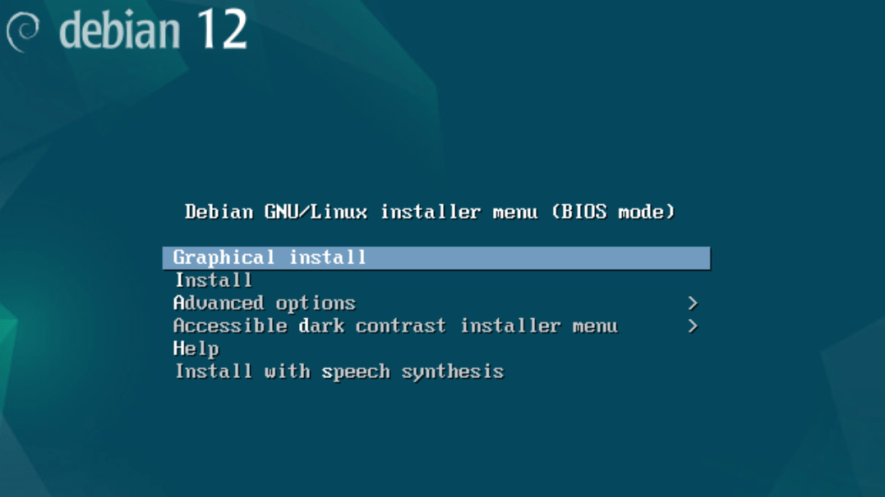

Kõigepealt tuleb teha keele ja asukoha ning klaviatuuri valik. Järgnevalt on antud soovituslikud valikud, mida võid vastavalt oma soovile kohadada:

- Select a language: English
- Select your location: other -> Europe -> Estonia
- Configure locales: en_US-UTF-8
- Configure the keyboard: Estonian

=== "Keel"

    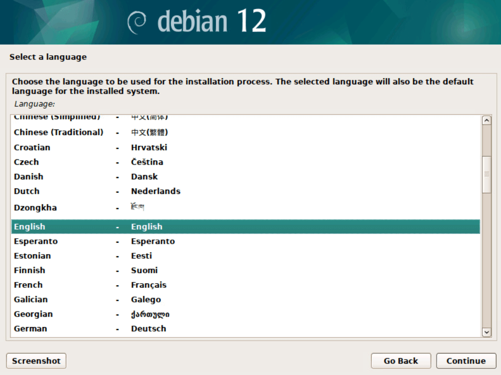

=== "Asukoht"

    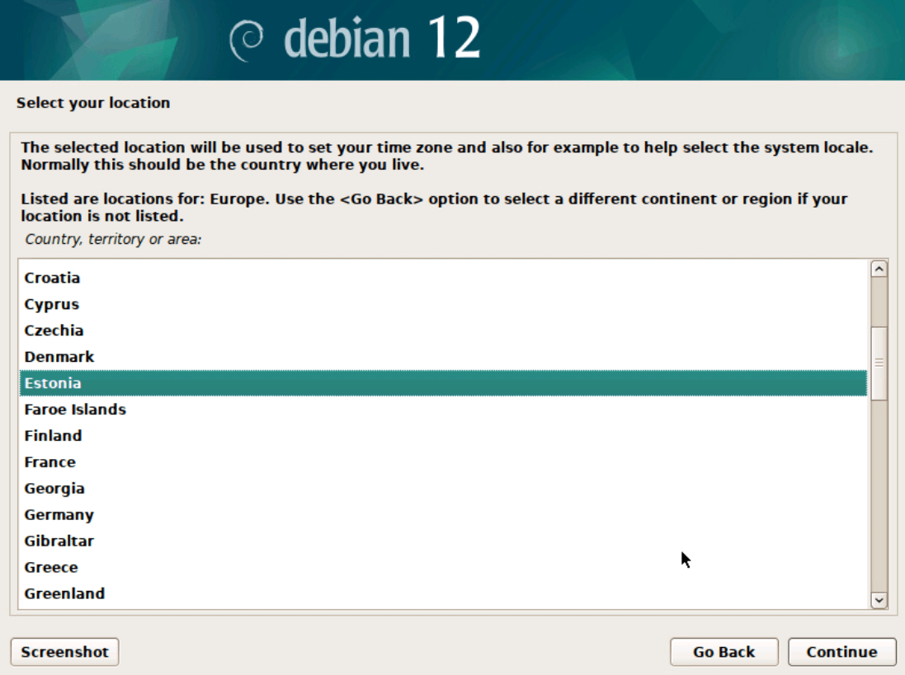

=== "Lokaaslus"

    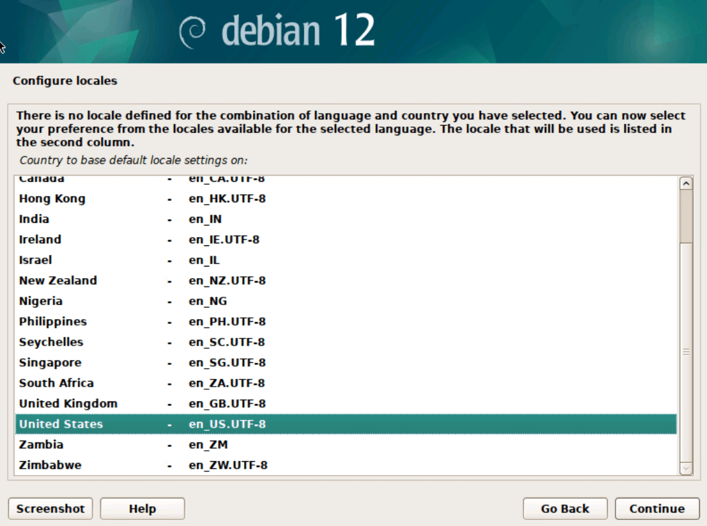

=== "Klaviatuur"

    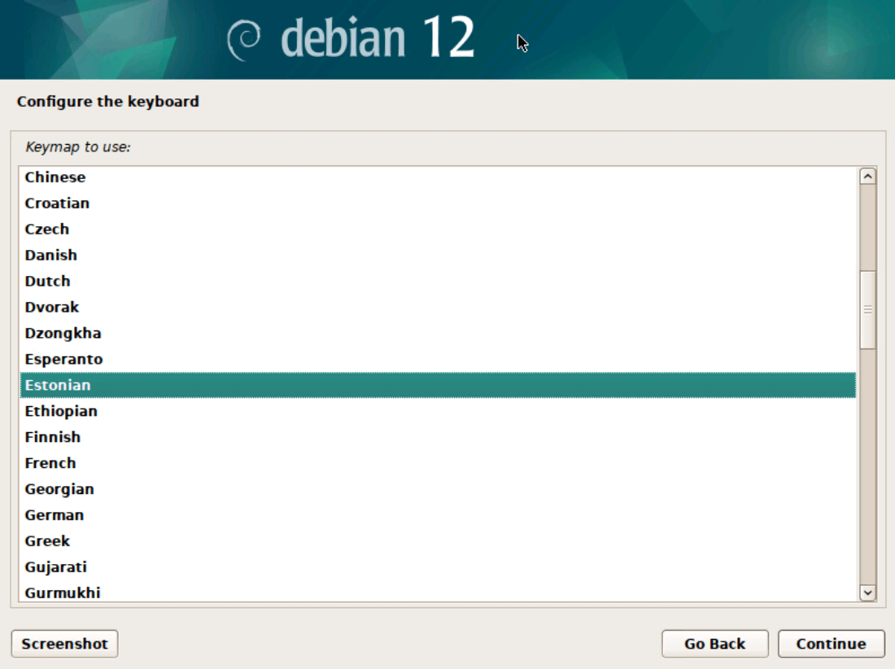

Edasi toimub võrgu seadistamine:

- Kui VM-il on võrgukaart, mis on ühendatud võrguga, mis jagab DHCP kaudu parameetreid automaatselt, siis saadakse ka võrguparameetrid automaatselt ja paigaldusprotsess jätkub.
- Kui võrguparameetreid automaatselt ei tuvastata, siis tuleb teade, et "Network autoconfiguration failed" ja tuleb lisada käsitsi oma võrgule sobivad parameetrid (IP address, subnet mask, gateway, DNS servers).

=== "Autoconfiguration failed"

    

=== "Manually"

    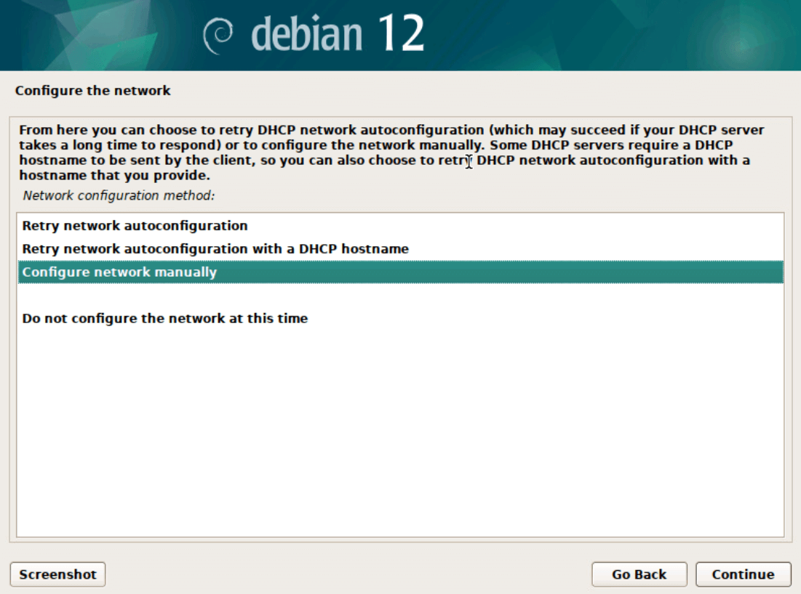

=== "IP/subnet"

    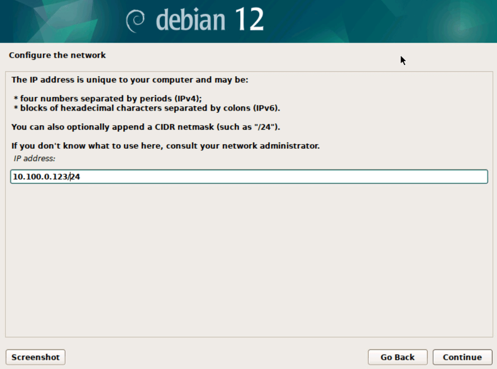

=== "Gateway"

    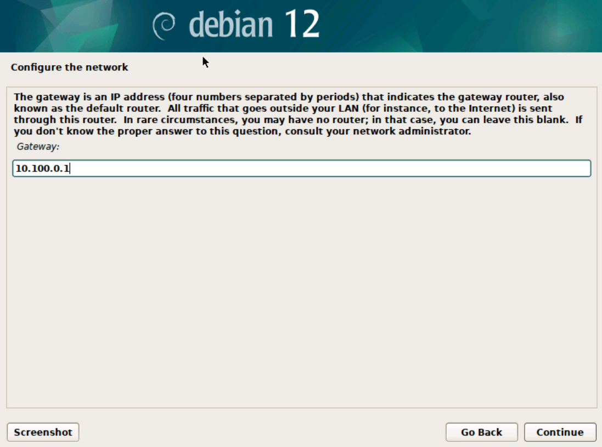

=== "DNS"

    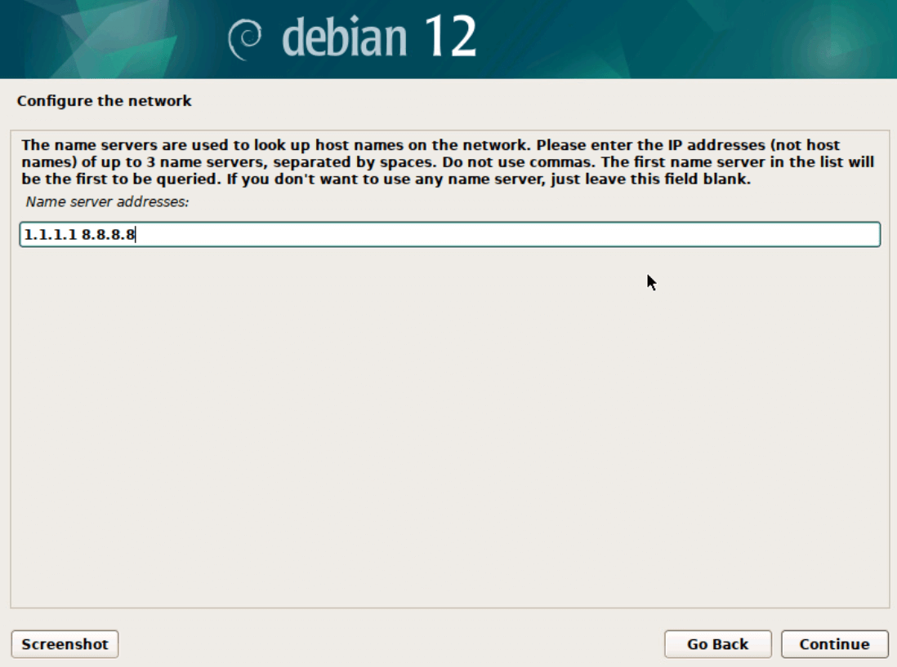

Järgnevalt on vaja määrata arvutile võrgunimi (hostname) ja domeen. Kui domeeni ei kasutata, siis võib välja täitmata jätta ja edasi liikuda.

=== "Hostname"

    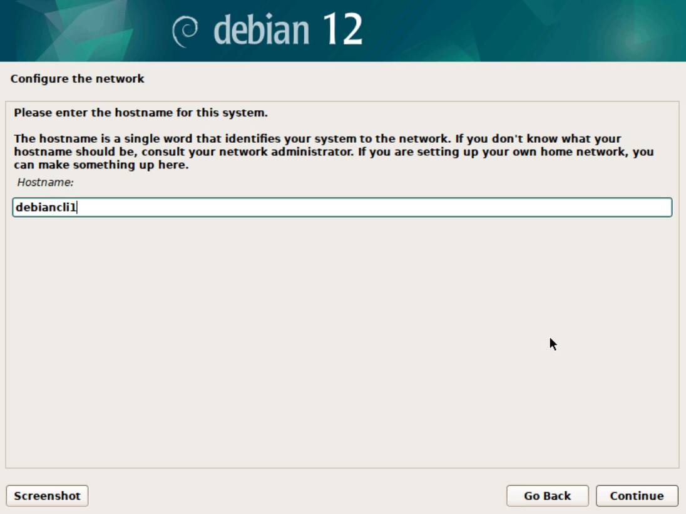

=== "Domain"

    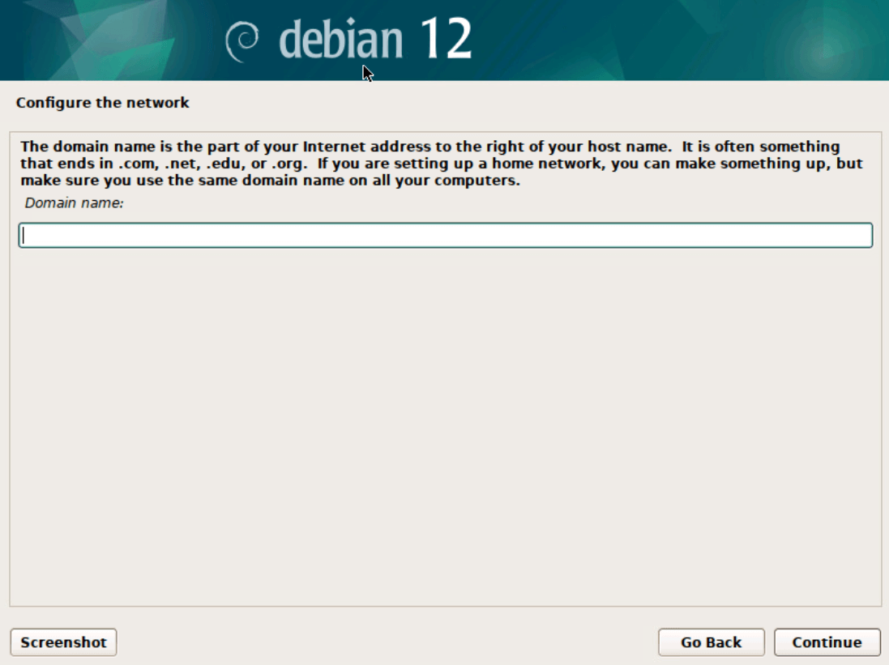

