icon:material/debian

# Debian Linuxi paigaldamine

##  Riistvara nõuded

Debian Linuxi puhul saab paigaldada ühest iso failist operatsioonisüsteemi nii graafilise töölauaga (GUI) kui ilma (CLI). Järgnevalt on toodud soovitatavad parameetrid virutaalmasinal (VM) ülesannete sooritamiseks.

Graafilise keskkonnaga VM-i jaoks on vajalikud kõrgemad ressursid, kuna kasutajaliides ja GUI-rakendused nõuavad rohkem mälu ja protsessorijõudlust.

Ilma graafilise töölauata VM-i jaoks on vaja vähem mälu ja töötlemisvõimsust, sest töö toimib ainult CLI-režiimis.

Soovitavad parameetrid:

=== "GUI"

    Soovitavad parameetrid GUI puhul:
  
    - Protsessor (CPU): Vähemalt 2 virtuaalset protsessorit
    - Mälu (RAM): Vähemalt 4 GB
    - Kõvaketas: Vähemalt 16 GB
    - Graafikamälu Vähemalt 16MB suurte monitoride jaoks
    - Soovitav kasutada Xfce töölauda, sest see on vähem ressursinõudlikum ja töötab seetõttu VM-il sujuvamalt.

=== "CLI"

    Soovitavad parameetrid CLI puhul:

    - Protsessor (CPU): Vähemalt 1 virtuaalne protsessor
    - Mälu (RAM): Vähemalt 2 GB
    - Kõvaketas: Vähemalt 16 GB

## Paigaldusprotsess

Käivitades VM-i saab kõigepealt valida paigaldusviisi vahel ehk millist paigaldajat (installerit) kasutatakse. 

- Graphical Install: Installer koos hiire toega
- Install: Installer ilma hiire toeta

!!! info

    Pane tähele, et antud valik mõjutab ainult paigaldusprotsessi, mitte tulemust. Ehk "graphical install" ei tähenda, et paigalduks Debian koos GUI-ga. GUI või CLI Debiani saame tehes valikuid hiljem paigaldusprotsessi tarkvara osas.

Antud juhend on loodud "Graphical install" näitel, kasutades legacy virtuaalmasinat (MBR). Vali paigaldusprotsessi alustamiseks "Graphical install".

Kõigepealt tuleb teha keele ja asukoha ning klaviatuuri valik. Järgnevalt on antud soovituslikud valikud, mida võid vastavalt oma soovile kohadada:

- Select a language: English
- Select your location: other -> Europe -> Estonia
- Configure locales: en_US-UTF-8
- Configure the keyboard: Estonian

=== "Language"

    

=== "Location"

    

=== "Locales"

    

=== "Keyboard"

    

Edasi toimub võrgu seadistamine:

- Kui VM-il on võrgukaart, mis on ühendatud võrguga, mis jagab DHCP kaudu parameetreid automaatselt, siis saadakse ka võrguparameetrid automaatselt ja paigaldusprotsess jätkub.
- Kui võrguparameetreid automaatselt ei tuvastata, siis tuleb teade, et "Network autoconfiguration failed" ja tuleb lisada käsitsi oma võrgule sobivad parameetrid (IP address, subnet mask, gateway, DNS servers).

!!! info

    Mitme DNS serveri puhul eralda need tühikuga, ära kasuta koma.

=== "Autoconfiguration failed"

    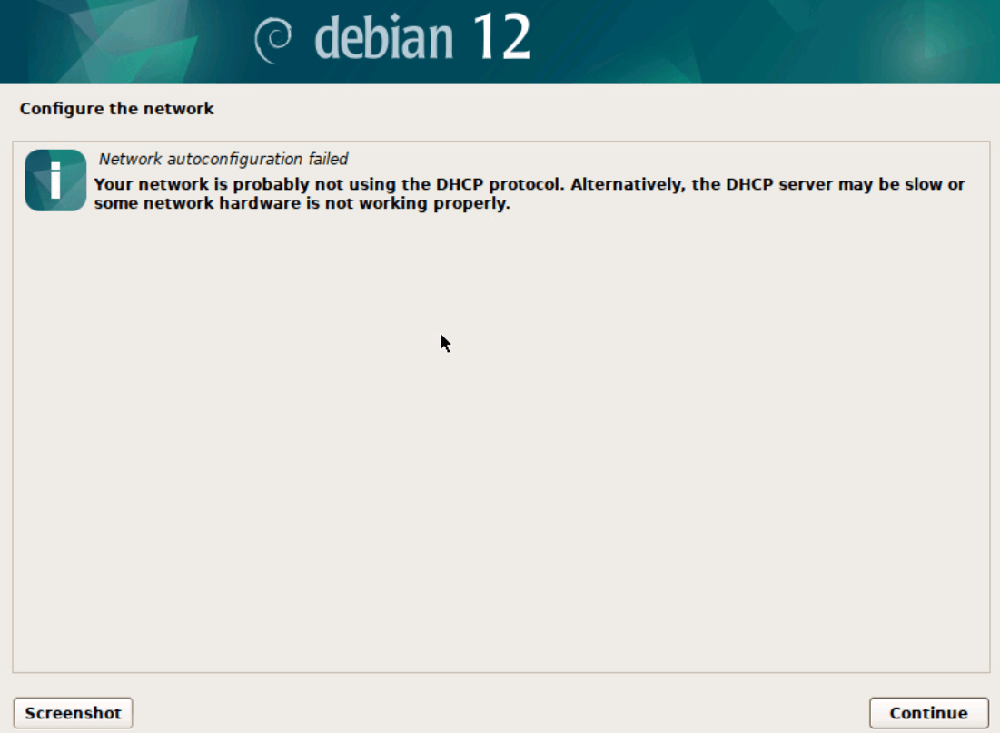

=== "Manually"

    

=== "IP/subnet"

    

=== "Gateway"

    

=== "DNS"

    

Järgnevalt on vaja määrata arvutile võrgunimi (hostname) ja domeen. Kui domeeni ei kasutata, siis võib välja täitmata jätta ja edasi liikuda.

=== "Hostname"

    

=== "Domain"

    

Edasi toimub kasutajate ja paroolide seadistamine

- Küsitakse root kasutaja ehk juurkasutaja parooli. Parooli võib seadistada või jätta määramata.

!!! info

    Soovitus on jätta 'root' kasutaja parool määramata. Selle tulemuena paigaldatakse 'sudo' ja kasutatakse seda kui soovime käske käivitada juurkasutaja õigustes. Parooli määramisel sudo ei paigaldata ja juurkasutaja alla saab siseneda näiteks 'su -' käsuga.

- Seejärel tuleb sisestada kasutaja andmed (nimi, kasutajanimi ja luua parool).

=== "Root password"

    

=== "Name for the user"

    

=== "Username"

    

=== "Password"

    

Paigaldus jätkub kettajaotuse ehk partitsioonide seadistamisega. Kasutame automaatset ketaste jaotust, mis on soovitav algajatele ja paigaldame kõik failid ühele partitsioonile.

- Partitioning method: Guided - use entire Disk
- Select disk to partition: ühe ketta puhul on see juba valitud
- Partitioning scheme: All files in one partiton
- Write changes to disk: Yes

=== "Partitioning method"

    

=== "Select disk to partition"

    

=== "Partitioning scheme"

    

=== "Write changes to disk"

    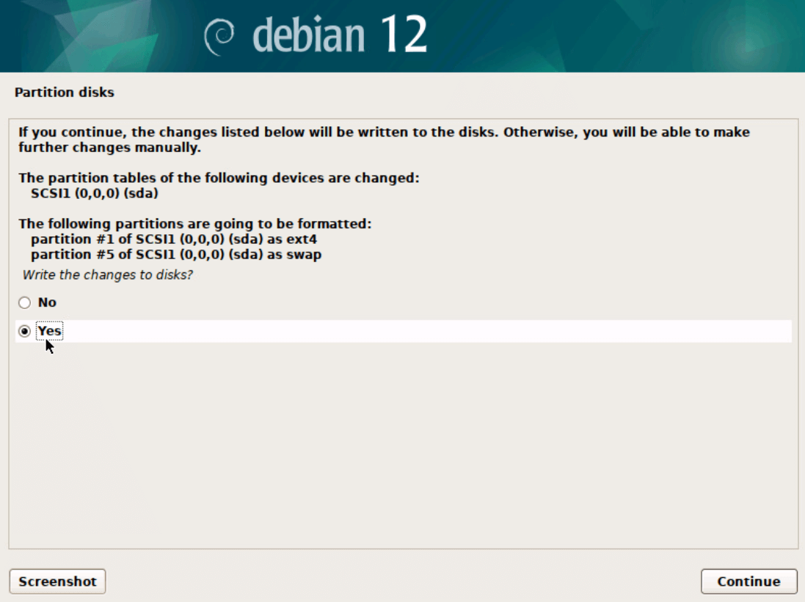

Järgmisena jõuame tarkvara allalaadisega seotud valikute juurde. 
- Küsitakse, kas meil on veel mõni paigaldusmeedium peale praeguse, vastame eitavalt. 
- Seejärel soovib Debian pöörduda tarkvara allalaadimiseks tarkvara varamu poole. Vali riigiks Eesti ja nimekirjast ükskõik milline ametilikest Debiani tarkvara varamutest. 
- Kui välisvõrku pääsemiseks kasutatakse puhverserverit, siis on järgmises aknas võimalik see määrata, kuid tavaliselt jäetakse see tühjaks. 
- Seejärel küsitakse veel pakettide populaarsusuuringuses osalemise kohta, selle saab valida vastavalt isiklikule eelistusele.

=== "Exrta installation media"

    

=== "Archive mirror country"

    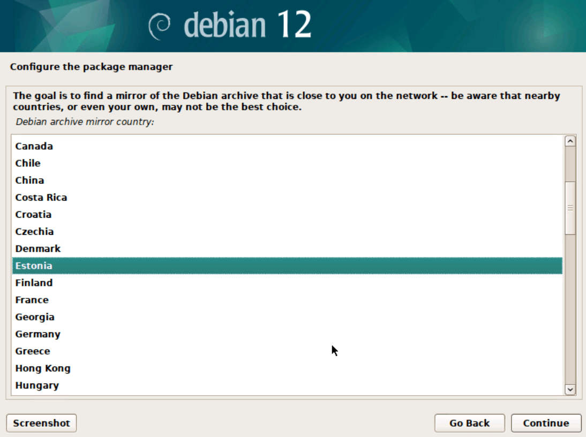

=== "Archive mirror"

    

=== "Proxy"

    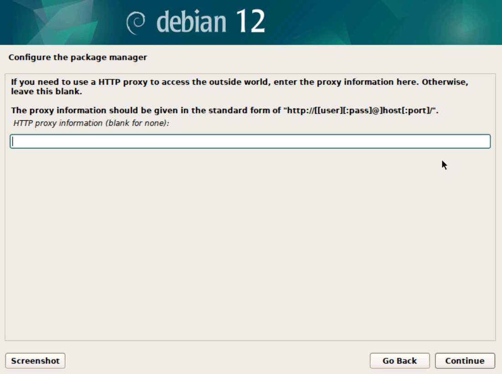

=== "Popularity-contest"

    

Tarkvara valiku aknas saame linnukestega valida millise tarkvara me valime. 

!!!
    Vastavalt siin tehtud valikule saamegi GUI või CLI Debiani.

 Graafilise kasutajaliidesega Debiani puhul tuleb valida meelepärane kasutajaliides. Ilma graafilise liidesega Debiani puhul tuleb eemaldada linnukesed kasutajaliideste eest.

- GUI: valime Xfce töölaua, SSH serveri ja standard system utilities
- CLI: SSH serveri ja standard system utilities

=== "GUI"

    

=== "CLI"

    

Viimaseks valikuks on paigaldusprotsessid alglaaduri paigaldamine. Kui tegemist on ainukese operatsioonisüsteemiga arvutis tule GRUB alglaadus kindlasti paigaldada ja valida ketas kuhu alglaadur lisatakse (N: sda).

=== "Install GRUB"

    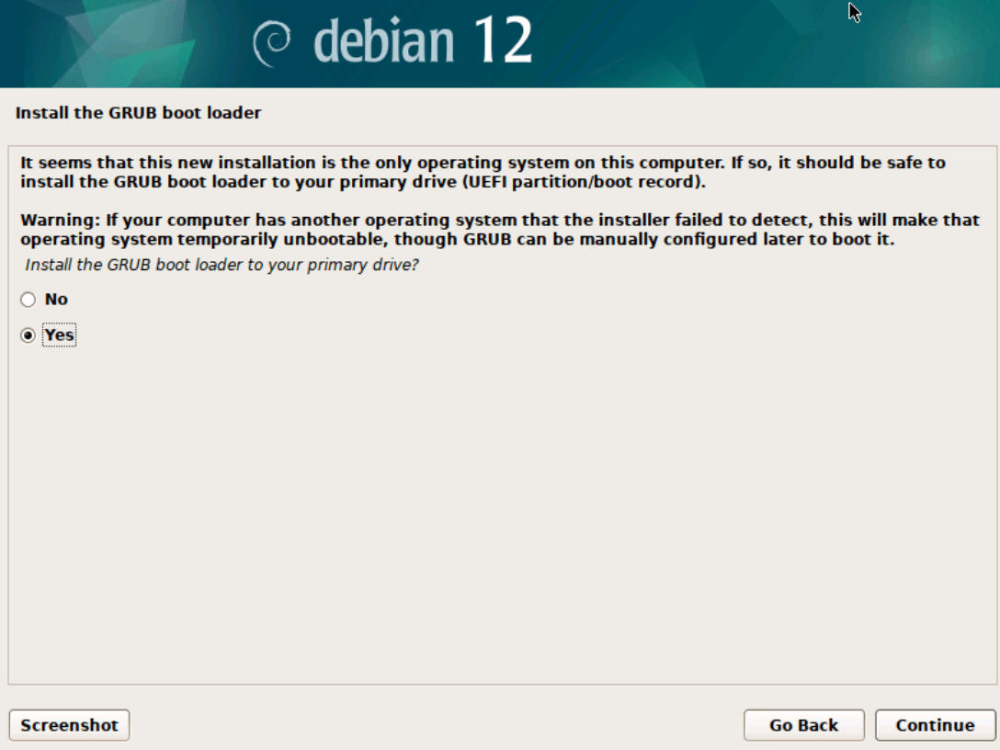

=== "Device for boot loader"

    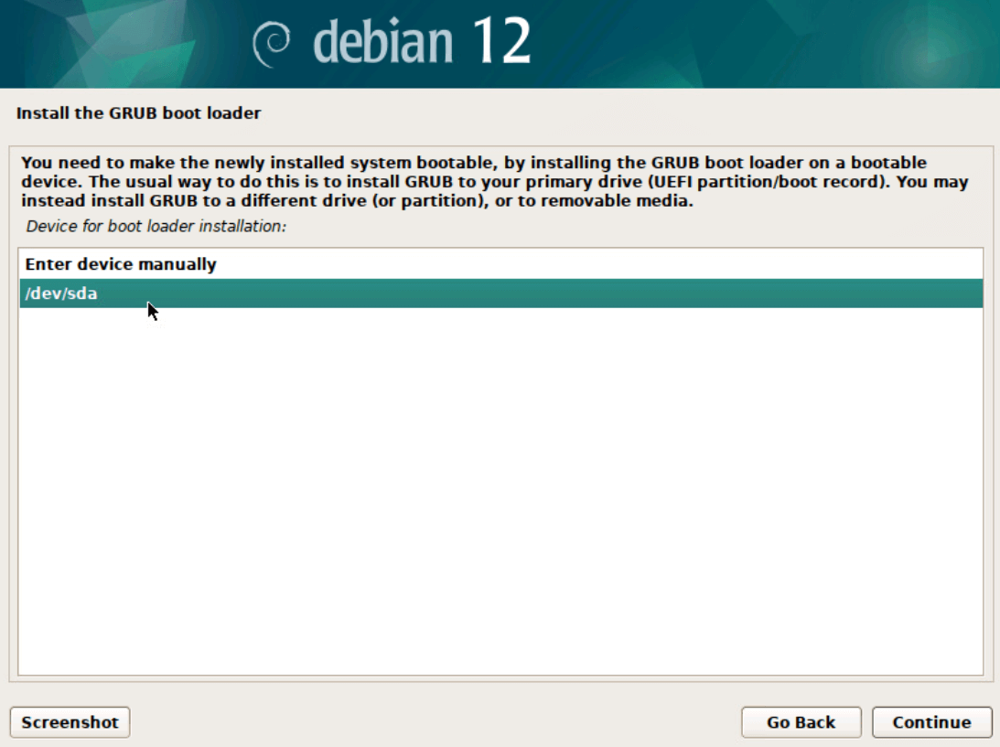

Seejärel on paigaldusprotsess lõppenud ja vajalik on taaskäivitus, mille järgselt käivitub GUI versiooni puhul valitud kasutajaliides ja CLI versiooni puhul mittegraafiline Debian.

=== "Finish"

    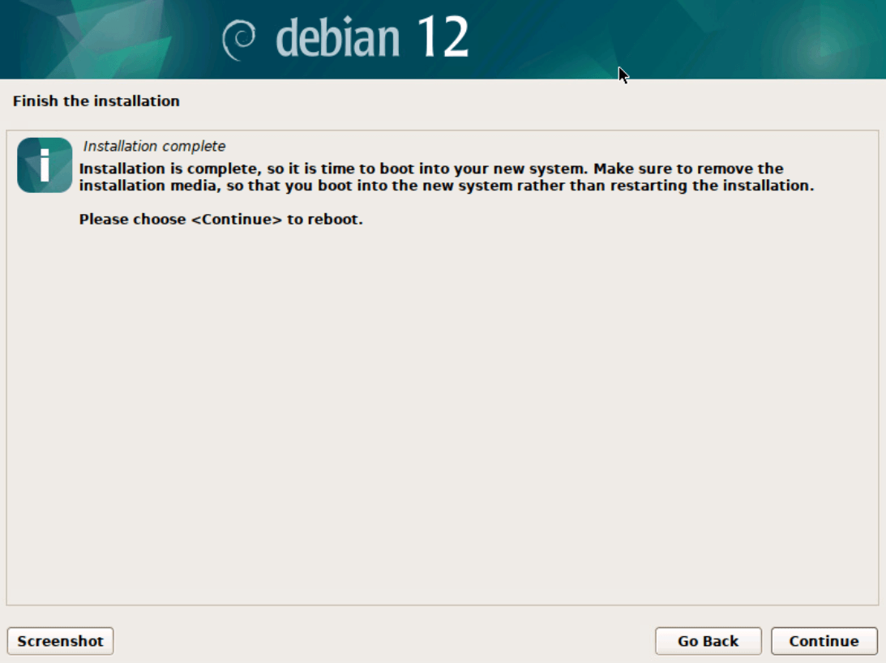

=== "GUI"

    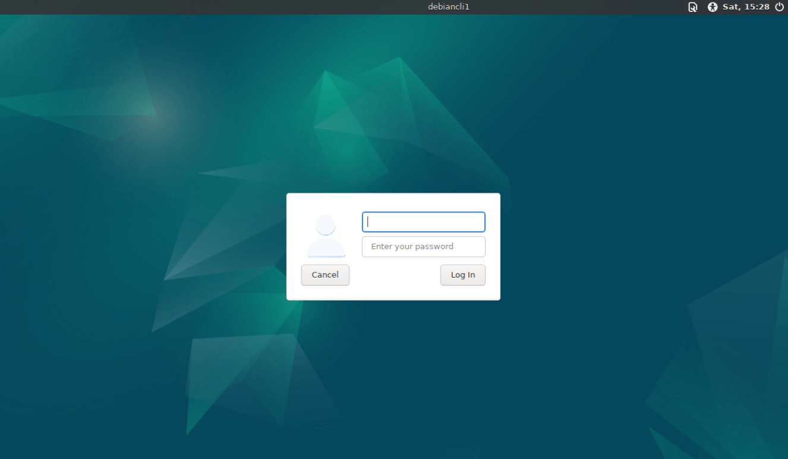

=== "GUI login"

    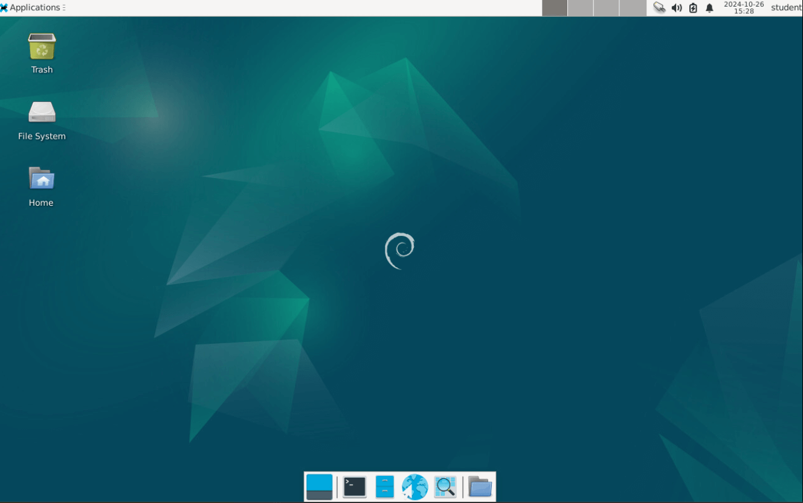

=== "CLI"

    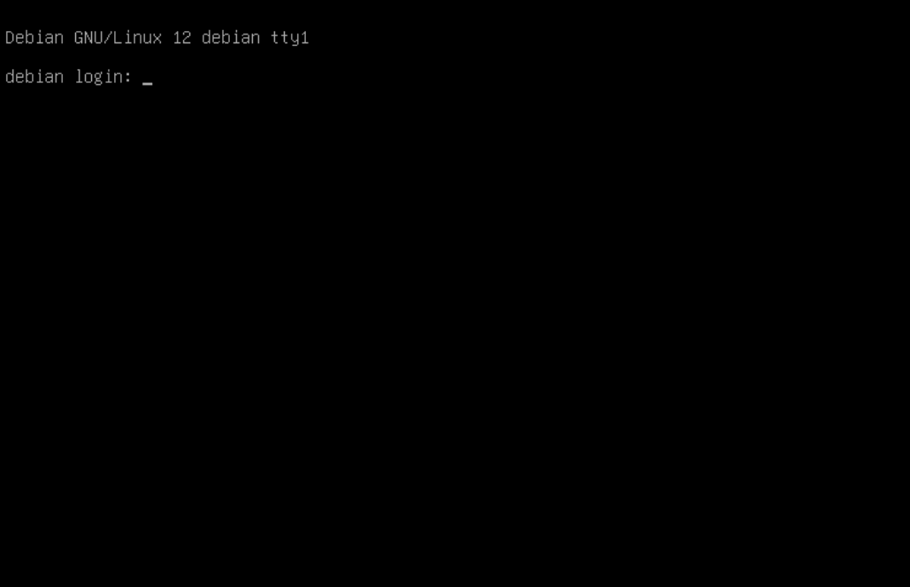

=== "CLI login"

    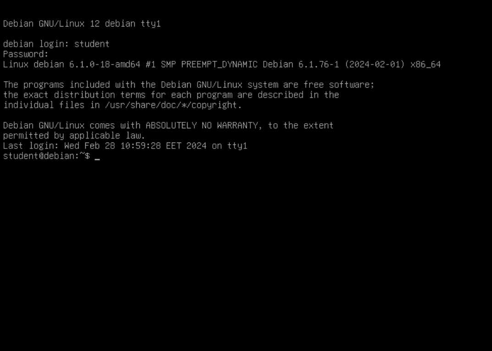

!!! info

    CLI Debiani puhul võib esmase Linuxi kasutja jaoks tunduda, et parooli sisestamisel ei teki tärne, see on tavapärane nähtus. Tuleb sisestada parool ja vajutada "Enterit".

