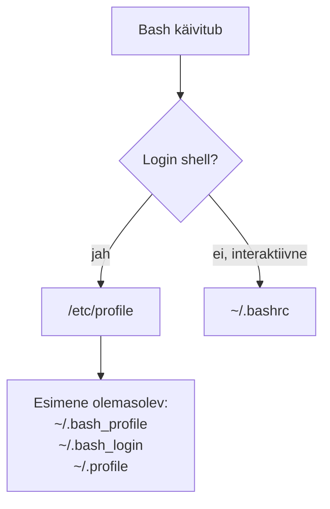

icon: material/console

# Bashi kasutajakeskkonna seadistamine 

Bash võimaldab kasutajal oma käsureakeskkonda kohandada. Näiteks saab määrata, millised seadistused rakenduvad shelli käivitamisel, luua sageli kasutatavatele käskudele lühemaid nimesid ning säilitada neid seadistusi järgmiste terminaliseansside jaoks.

Selles materjalis keskendume **Bashi käivitusfailidele, käsuajaloole ja aliastele**. Bashi enda põhimõtted on Debiani ja Red Hati laadsetes distributsioonides samad, kuid distributsioonide vaikimisi loodud failid ja süsteemiülesed seadistused võivad mõnevõrra erineda.

!!! info "Seos varasemate teemadega"
    Otsinguvahendite teemas kasutasid `journalctl`-i, `grep`-i ja toru `|`. Selles teemas saad sageli kasutatava käsujada muuta enda jaoks lühemaks käsualiaste abil.

---

## Õpieesmärgid

Pärast materjali läbimist oskad:

- selgitada, milleks kasutatakse Bashi käivitusfaile;
- eristada login shell'i ja interaktiivset non-login shell'i;
- kirjeldada `~/.profile`, `~/.bash_profile` ja `~/.bashrc` üldist rolli;
- kasutada käsuajalugu käsuga `history`;
- luua ja vaadata käsualiasi;
- lisada püsiva aliase `~/.bashrc` faili;
- rakendada muudetud `~/.bashrc` seadistusi käsuga `source`.

---

## Mis on shelli kasutajakeskkond?

Kui Bash käivitub, võib see lugeda erinevaid seadistusfaile. Nende abil saab määrata näiteks:

- aliaseid;
- shelli käitumist;
- käsuviiba seadistusi;
- keskkonnamuutujaid;
- kasutaja enda käivitatavaid seadistuskäske.

Kõiki seadistusfaile ei loeta igas olukorras. See sõltub sellest, **kuidas Bash käivitati**.

---

## Login shell ja interaktiivne shell

Bashi seadistusfailide mõistmiseks on kasulik eristada kahte olukorda.

**Login shell** on shell, mis käivitatakse kasutaja sisselogimisseansi osana.

**Interaktiivne non-login shell** on tüüpiliselt shell, mille saad graafilises töölauas uue terminaliakna avamisel.

Lihtsustatud käivitusloogika:



!!! note "Tegelik käivitusloogika on detailsem"
    Bashil on ka mitteinteraktiivsed shellid, SSH-ga seotud erijuhud ja POSIX-režiim. Algkursusel keskendume kahele kõige olulisemale olukorrale: login shell ja tavaline interaktiivne terminal.

---

## Bashi käivitusfailid

### `/etc/profile`

`/etc/profile` on süsteemiülene login shell'i seadistusfail. Seda loetakse enne kasutaja enda login-seadistusi.

Distributsioon võib selle kaudu laadida ka täiendavaid süsteemiüleseid seadistusi.

### `~/.bash_profile`, `~/.bash_login` ja `~/.profile`

Interaktiivse login shell'i korral otsib Bash kasutaja kodukataloogist järgmisi faile selles järjekorras:

```text
~/.bash_profile
~/.bash_login
~/.profile
```

Bash loeb neist **esimese olemasoleva ja loetava faili**.

!!! warning "Kõiki kolme faili ei loeta järjest"
    Kui `~/.bash_profile` on olemas, ei jätka Bash login-seadistuste otsimist `~/.bash_login` ega `~/.profile` failist. Seetõttu tuleb teada, millist faili sinu süsteem ja kasutajakonto tegelikult kasutab.

### `~/.bashrc`

`~/.bashrc` on kasutaja Bashi seadistusfail, mida loetakse tavaliselt **interaktiivse non-login shell'i** käivitamisel.

Graafilises töölauas uue terminaliakna avamine on tüüpiline olukord, kus `~/.bashrc` kasutatakse.

Sinna sobivad näiteks:

- aliased;
- interaktiivse shelli seaded;
- käsuviiba seadistused.

```bash
nano ~/.bashrc
```

!!! tip
    Kui soovid luua endale püsiva käsualiase, on `~/.bashrc` selleks tavaliselt sobiv koht.

### `~/.bash_logout`

Login shell võib väljalogimisel lugeda faili:

```text
~/.bash_logout
```

Sellesse võib paigutada käske, mida soovitakse käivitada login shell'ist väljumisel.

### `/etc/profile.d/`

Paljud distributsioonid kasutavad kataloogi:

```text
/etc/profile.d/
```

süsteemiüleste shelliseadistuste jagamiseks eraldi failidesse.

!!! note "Bash ise ja distributsiooni seadistus"
    `/etc/profile.d/` kasutamine tuleneb distributsiooni `/etc/profile` seadistusest, mitte Bashi nõudest, et selline kataloog peab alati olemas olema.

---

## Debian ja Red Hat - võimalikud erinevused

Bashi enda käivitusreeglid ei sõltu sellest, kas kasutad Debianit või Red Hati laadset distributsiooni. Erineda võivad aga distributsiooni vaikimisi seadistusfailid.

Debiani kasutajakontol kohtab tavaliselt näiteks:

```text
~/.profile
~/.bashrc
~/.bash_logout
```

Red Hati laadsetes süsteemides kohtab sageli ka:

```text
~/.bash_profile
~/.bashrc
~/.bash_logout
```

Süsteemiülesed Bashi seadistusfailid võivad samuti distributsiooniti erineda.

!!! tip "Kontrolli oma süsteemi"
    Ära eelda, et kõik juhendis nimetatud failid on sinu kodukataloogis olemas. Kontrolli näiteks:

    ```bash
    ls -la ~
    ```

---

## Bashi käsuajalugu

Bash hoiab interaktiivses shellis sisestatud käskude ajalugu.

Ajaloo vaatamiseks:

```bash
history
```

Näiteks:

```text
  41  pwd
  42  ls -la
  43  journalctl -b
  44  systemctl status ssh
```

Käsuajaloost saab otsida eelmises teemas õpitud `grep`-iga:

```bash
history | grep ssh
```

### `~/.bash_history`

Bash kasutab vaikimisi ajaloo salvestamiseks sageli faili:

```text
~/.bash_history
```

!!! note "Ajalugu ei kirjutata alati faili kohe"
    Praeguse Bashi seansi käsud hoitakse esmalt shelli ajalooloendis ning ajaloo faili kirjutamise hetk sõltub Bashi seadistusest ja seansi lõpetamisest. Seetõttu ei pruugi `~/.bash_history` sisu olla täpselt sama mis hetkel käsuga `history` nähtav loend.

---

## Käsualiased

**Alias** võimaldab anda käsule või lihtsale käsujadale lühema nime.

Kõigi praeguses shellis määratud aliaste vaatamiseks:

```bash
alias
```

Uue aliase üldkuju:

```bash
alias nimi='käsk'
```

Näiteks:

```bash
alias ll='ls -lah'
```

Nüüd käivitab:

```bash
ll
```

tegelikult käsu:

```bash
ls -lah
```

---

## Aliase kontrollimine käsuga `type`

Enne uue nime kasutuselevõttu on mõistlik kontrollida, kas sama nimi juba midagi tähendab:

```bash
type ll
```

Kui alias on olemas, võib väljund olla näiteks:

```text
ll is aliased to `ls -lah'
```

`type` on kasulik, sest käsunimi võib viidata näiteks:

- aliasele;
- shellifunktsioonile;
- Bashi sisseehitatud käsule;
- käivitatavale programmile.

---

## Praktiline alias logide vaatamiseks

Otsinguvahendite teemas õppisid vaatama journali värskeid veateateid:

```bash
journalctl -p err -b -r
```

Kui kasutad seda sageli, võid luua lühema aliase:

```bash
alias jerrors='journalctl -p err -b -r'
```

Seejärel piisab käsust:

```bash
jerrors
```

Kontrolli aliast:

```bash
type jerrors
```

!!! note
    Terminalis käsuga `alias` loodud alias kehtib ainult selles shelliseansis. Uues shellis seda enam ei ole, kui sa pole aliast seadistusfaili salvestanud.

---

## Aliase eemaldamine

Aliase eemaldamiseks praegusest shellist kasutatakse:

```bash
unalias nimi
```

Näiteks:

```bash
unalias jerrors
```

Kontrolli tulemust:

```bash
type jerrors
```

Kui alias oli ainult praeguses shellis, on see nüüd eemaldatud.

---

## Aliase püsivaks muutmine

Kui soovid, et alias oleks olemas ka uue terminali avamisel, lisa see `~/.bashrc` faili.

Näiteks:

```bash
nano ~/.bashrc
```

Lisa faili:

```bash
alias jerrors='journalctl -p err -b -r'
```

Salvesta fail.

Muudatus rakendub automaatselt järgmise sobiva Bashi käivitamisel.

---

## `source` - seadistusfaili uuesti lugemine

Kui sa ei soovi uue terminali avamist oodata, saad `~/.bashrc` faili praeguses shellis uuesti lugeda:

```bash
source ~/.bashrc
```

Sama saab kirjutada lühemalt:

```bash
. ~/.bashrc
```

Kontrolli:

```bash
type jerrors
```

!!! warning "Ära käivita tundmatut seadistusfaili pimesi"
    `source` käivitab faili käsud **praeguses shellis**. Seetõttu vaata tundmatust allikast saadud shellifail enne üle.

---

## Millal aliasest enam ei piisa?

Alias sobib hästi:

- käsu lühendamiseks;
- sageli kasutatavate võtmete lisamiseks;
- lihtsa käsujada mugavamaks käivitamiseks.

Näiteks:

```bash
alias ports='ss -tulpn'
```

Keerulisema loogika või argumentide töötlemise jaoks sobivad paremini:

- shellifunktsioonid;
- shelliskriptid.

!!! tip
    Alias on mugav lühend, mitte asendus skriptile. Kui lahendus vajab tingimusi, kordusi või sisendparameetrite töötlemist, on mõistlik kasutada skripti.

---

## Hea töövõte: kontrolli → muuda → laadi → kontrolli

Bashi kasutajakeskkonna seadistamisel kasuta järjekorda:

```text
kontrolli olemasolevat seadistust
        ↓
muuda sobivat faili
        ↓
laadi seadistus uuesti
        ↓
kontrolli tulemust
```

Näiteks:

```bash
type jerrors
nano ~/.bashrc
source ~/.bashrc
type jerrors
```

!!! tip
    Tee `~/.bashrc` muudatusi väikeste sammudena. Kui lisad korraga palju seadistusi ja tekib viga, on põhjust raskem leida.

---

## Praktilise töö soovituslik järjekord

1. Vaata oma kodukataloogis olevaid peidetud faile käsuga `ls -la ~`.
2. Leia `~/.bashrc` ja `~/.profile` või `~/.bash_profile`.
3. Vaata nende sisu `less` või tekstiredaktoriga.
4. Vaata käsuga `history` oma käsuajalugu.
5. Otsi ajaloost `grep` abil mõnda varem kasutatud käsku.
6. Vaata olemasolevaid aliaseid käsuga `alias`.
7. Kontrolli käsunime `ll` käsuga `type`.
8. Loo ajutine alias `ll='ls -lah'`.
9. Kontrolli aliast ja kasuta seda.
10. Eemalda alias käsuga `unalias`.
11. Loo alias `jerrors='journalctl -p err -b -r'`.
12. Lisa `jerrors` oma `~/.bashrc` faili.
13. Laadi seadistus käsuga `source ~/.bashrc`.
14. Kontrolli käsuga `type jerrors`, et alias töötab.

---

## Käskude spikker

| Käsk | Eesmärk |
|---|---|
| `history` | kuvab Bashi käsuajaloo |
| `history \| grep muster` | otsib käsuajaloost |
| `alias` | kuvab praegused aliased |
| `alias nimi='käsk'` | loob aliase |
| `type nimi` | näitab, kuidas Bash käsunime tõlgendab |
| `unalias nimi` | eemaldab aliase |
| `source ~/.bashrc` | loeb `~/.bashrc` faili praeguses shellis uuesti |
| `. ~/.bashrc` | `source ~/.bashrc` lühem kuju |

---

## Olulised mõisted

| Mõiste | Selgitus |
|---|---|
| **shell** | käsukeskkond, mis tõlgendab kasutaja käske |
| **Bash** | levinud Unix-laadne shell |
| **login shell** | sisselogimisseansi osana käivitatud shell |
| **interactive shell** | shell, milles kasutaja sisestab käske interaktiivselt |
| **startup file** | fail, mida shell sobivas käivitusolukorras loeb |
| **alias** | käsule või lihtsale käsujadale antud alternatiivne nimi |
| **`~/.bashrc`** | kasutaja interaktiivse Bashi seadistusfail |
| **`history`** | Bashi käsuajaloo vaatamise käsk |
| **`source`** | loeb ja käivitab faili käsud praeguses shellis |

---

## Kontrollküsimused

1. Milleks kasutatakse Bashi käivitusfaile?
2. Mis vahe on login shell'il ja interaktiivsel non-login shell'il?
3. Millist süsteemiülest faili loeb Bash login shell'i käivitamisel?
4. Millises järjekorras otsib Bash faile `~/.bash_profile`, `~/.bash_login` ja `~/.profile`?
5. Kas Bash loeb login shell'i korral kõik kolm eelmist faili?
6. Milleks kasutatakse `~/.bashrc` faili?
7. Milleks kasutatakse `~/.bash_logout` faili?
8. Miks ei pruugi kõikidel distributsioonidel olla täpselt samad vaikimisi kasutajafailid?
9. Milleks kasutatakse käsku `history`?
10. Miks ei pruugi `~/.bash_history` kohe sisaldada kõiki praeguse seansi käske?
11. Mis on käsualias?
12. Kuidas kuvada kõik praegused aliased?
13. Milleks kasutatakse käsku `type`?
14. Kuidas luua alias `ll`, mis käivitab `ls -lah`?
15. Kuidas eemaldada alias?
16. Miks kaob terminalis loodud alias tavaliselt uue shelliseansi alustamisel?
17. Kuhu võib kasutaja püsiva aliase lisada?
18. Milleks kasutatakse `source ~/.bashrc` käsku?
19. Miks tuleb tundmatust allikast saadud faili enne `source` kasutamist kontrollida?
20. Millal oleks aliase asemel mõistlik kasutada shellifunktsiooni või skripti?

---

## Kokkuvõte

Bash loeb sõltuvalt käivitamisviisist erinevaid seadistusfaile. Login shell kasutab süsteemiülest `/etc/profile` faili ja kasutaja login-seadistusi, tavaline interaktiivne non-login shell aga tavaliselt `~/.bashrc` faili.

Bashi käsuajalugu saab vaadata käsuga `history` ning ajaloost saab otsida näiteks `grep` abil.

Alias võimaldab anda sageli kasutatavale käsule või lihtsale käsujadale lühema nime. Terminalis loodud alias on ajutine; püsiva aliase saab lisada `~/.bashrc` faili. Muudetud faili saab praeguses shellis uuesti lugeda käsuga `source ~/.bashrc`.

Kõige olulisem põhimõte on:

> **Muuda shelli seadistusi väikeste sammudena ning kontrolli pärast muudatust, et tulemus töötab ootuspäraselt.**

---

## Allikad ja lisalugemine

- [GNU Bash manual: Bash Startup Files](https://www.gnu.org/software/bash/manual/html_node/Bash-Startup-Files.html){ target="_blank" rel="noopener" }
- [GNU Bash manual: Aliases](https://www.gnu.org/software/bash/manual/html_node/Aliases.html){ target="_blank" rel="noopener" }
- [GNU Bash manual: Bash History Facilities](https://www.gnu.org/software/bash/manual/html_node/Bash-History-Facilities.html){ target="_blank" rel="noopener" }
- [Debian Manpages: bash(1)](https://manpages.debian.org/stable/bash/bash.1.en.html){ target="_blank" rel="noopener" }
- [Red Hat Enterprise Linux documentation](https://docs.redhat.com/en/documentation/red_hat_enterprise_linux/){ target="_blank" rel="noopener" }

---
*Õppematerjali koostaja: Priit Paap, 2026*
