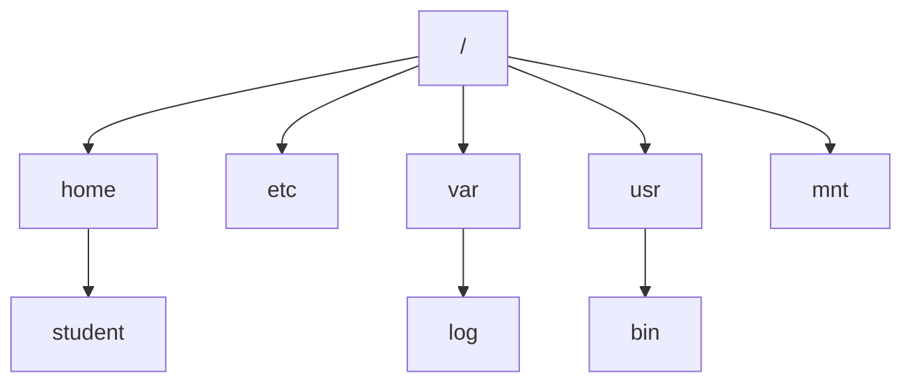
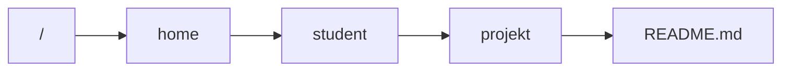
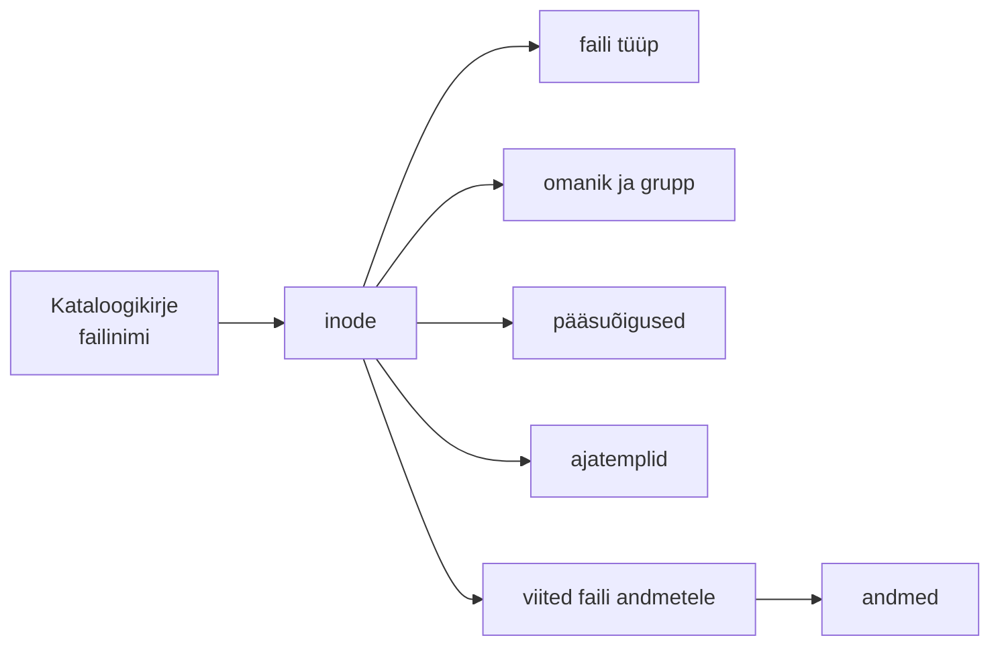
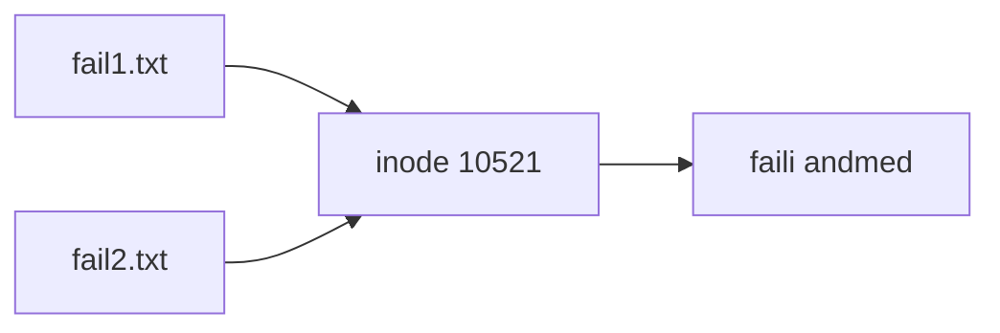
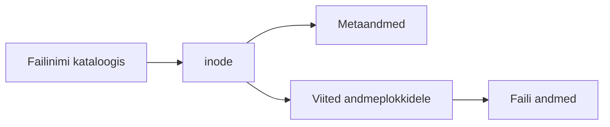
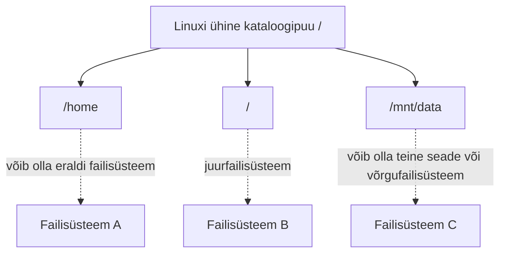

icon:material/debian

# Linuxi kataloogipuu ja failisüsteemi alused

Linuxis moodustavad failid ja kataloogid ühe ühise hierarhilise kataloogipuu. Erinevalt Windowsist ei tähistata erinevaid kettaid tavaliselt eraldi draivitähtedega nagu `C:` või `D:`. Kõik failid, kataloogid, seadmed ja ühendatud failisüsteemid paigutuvad ühe juurkataloogi `/` alla.

Selles materjalis vaatleme Linuxi kataloogipuu loogikat, tähtsamate süsteemikataloogide otstarvet ning Linuxi failimudeli põhialuseid. Ketaste ja partitsioonide haldamist selles teemas ei käsitleta.

## Õpieesmärgid

Pärast materjali läbimist oskad:

- selgitada Linuxi kataloogipuu ülesehitust;
- kirjeldada Filesystem Hierarchy Standardi eesmärki;
- selgitada olulisemate Linuxi süsteemikataloogide otstarvet;
- eristada absoluutset ja suhtelist failiteed;
- selgitada peidetud failide ja kataloogide põhimõtet;
- kirjeldada Linuxi peamisi failitüüpe;
- selgitada faili nime, inode'i ja faili andmete vahelist seost;
- eristada hard link'i ja symbolic link'i;
- selgitada seadmefailide ning virtuaalsete failisüsteemide põhimõtet;
- kirjeldada failisüsteemi üldist ülesannet.

---

## Linuxi kataloogipuu

Linuxi kataloogistruktuur on **hierarhiline**. Kogu failisüsteem algab ühest punktist – juurkataloogist:

```text
/
```

Selle alla paigutuvad kõik teised kataloogid ja failid.

Lihtsustatud Linuxi kataloogipuu võib välja näha näiteks nii:

```text
/
├── boot
├── dev
├── etc
├── home
│   └── student
├── proc
├── root
├── run
├── sys
├── tmp
├── usr
│   ├── bin
│   ├── lib
│   ├── local
│   ├── sbin
│   └── share
└── var
    ├── cache
    ├── lib
    ├── log
    └── tmp
```

!!! note "Juurkataloog ja root-kasutaja ei ole sama asi"
    Märk `/` tähistab **juurkataloogi** (*root directory*).

    Kataloog `/root` on aga **root-kasutaja kodukataloog**.

### Üks ühine kataloogipuu

Linuxis ühendatakse erinevad salvestusseadmed ja failisüsteemid kataloogipuu sobivatesse kohtadesse ehk **ühenduspunktidesse** (*mount points*).

Seetõttu ei pea kasutaja tavaliselt teadma, millisel füüsilisel kettal mingi kataloog asub.



!!! info
    Failisüsteemide ühendamist, ketaste jaotamist ja `/etc/fstab` seadistamist käsitletakse eraldi Linuxi serverite teemas.

---

## Filesystem Hierarchy Standard

Linuxi distributsioonides kasutatakse kataloogide paigutuse ühtlustamiseks standardit **Filesystem Hierarchy Standard (FHS)**.

FHS kirjeldab, millist tüüpi failid ja andmed peaksid asuma Linuxi ja teiste Unix-laadsete süsteemide erinevates kataloogides.

Standardi eesmärk on:

- muuta Linuxi süsteemide struktuur etteaimatavaks;
- lihtsustada tarkvara arendamist ja paigaldamist;
- parandada erinevate süsteemide ühilduvust;
- lihtsustada süsteemiadministraatori tööd;
- võimaldada dokumentatsioonil kasutada üldtuntud failiteid.

Näiteks võib administraator tavaliselt eeldada, et `/etc` sisaldab süsteemi konfiguratsiooni ja `/var/log` logifaile.

!!! note "Standard ja tegelik süsteem"
    FHS kirjeldab üldisi põhimõtteid, kuid Linuxi distributsioonid ei pea olema üksteisega täiesti identsed. Konkreetse kataloogi sisu võib sõltuda distributsioonist ja paigaldatud tarkvarast.

### Tänapäevane merged `/usr`

Vanemates Linuxi materjalides kirjeldatakse `/bin`, `/sbin` ja `/lib` katalooge sageli eraldiseisvate kataloogidena.

Tänapäevases Debianis kasutatakse **merged `/usr`** ülesehitust. Sellises süsteemis on näiteks:

```text
/bin  -> /usr/bin
/sbin -> /usr/sbin
/lib  -> /usr/lib
```

Need vanad failiteed töötavad jätkuvalt, kuid tegelikud failid asuvad enamasti `/usr` hierarhias.

Näiteks:

```bash
ls -ld /bin /sbin /lib
```

võib näidata, et need on symbolic link'id.

!!! info "Miks see on õppimisel oluline?"
    Vanem dokumentatsioon võib öelda, et `/bin` ja `/usr/bin` täidavad rangelt erinevat ülesannet. Tänapäevases Debianis ei ole see füüsilise paigutuse mõttes enam tingimata nii. Neid ajaloolisi failiteid kasutatakse dokumentatsioonis ja skriptides siiski endiselt.

---

## Juurkataloogi olulisemad kataloogid

### `/home` – kasutajate kodukataloogid

Tavakasutajate isiklikud failid paiknevad tavaliselt `/home` all.

Näiteks kasutaja `student` kodukataloog:

```text
/home/student
```

Kodukataloogis võivad asuda kasutaja dokumendid, projektid, allalaaditud failid, kasutajapõhised seadistusfailid ja rakenduste andmed.

Shellis tähistab hetkel sisse logitud kasutaja kodukataloogi `~`.

---

### `/root` – root-kasutaja kodukataloog

Juurkasutaja ehk `root` kodukataloog on:

```text
/root
```

See ei asu `/home` all.

---

### `/etc` – süsteemi konfiguratsioon

Kataloog `/etc` sisaldab süsteemi ja installitud teenuste konfiguratsioonifaile.

Näiteid:

```text
/etc/passwd
/etc/group
/etc/hostname
/etc/hosts
/etc/fstab
/etc/ssh/
/etc/systemd/
```

!!! note
    `/etc` sisaldab peamiselt **süsteemipõhist konfiguratsiooni**. Kasutaja isiklikud rakenduse seaded asuvad tavaliselt tema kodukataloogis.

---

### `/var` – muutuvad andmed

`/var` (*variable*) sisaldab andmeid, mis süsteemi töötamise ajal muutuvad.

| Kataloog | Otstarve |
|---|---|
| `/var/log` | logifailid |
| `/var/lib` | programmide ja teenuste püsivad muutuvad andmed |
| `/var/cache` | rakenduste vahemälu |
| `/var/spool` | töötlemist ootavad andmed ja järjekorrad |
| `/var/tmp` | ajutised failid, mida võib säilitada üle taaskäivituse |
| `/var/mail` | lokaalsed kasutajate postkastid, kui neid kasutatakse |

!!! note "Kõik logid ei pruugi olla tavalistes tekstifailides"
    Systemd-põhistes süsteemides haldab suurt osa süsteemilogidest `systemd-journald`. Neid vaadatakse tavaliselt käsuga `journalctl`.

---

### `/tmp` – ajutised failid

`/tmp` on mõeldud ajutiste failide jaoks.

!!! warning "Ära eelda, et `/tmp` tühjeneb alati taaskäivitamisel"
    Ajutiste failide puhastamise poliitika sõltub distributsioonist ja süsteemi seadistusest. Faile võidakse eemaldada käivitamisel või perioodilise puhastamise käigus.

Kui ajutist faili peab üldiselt säilitama ka pärast taaskäivitust, kasutatakse pigem `/var/tmp`.

---

### `/run` – käimasoleva süsteemi ajutine olek

`/run` sisaldab süsteemi jooksva käivitussessiooni kohta käivaid andmeid, näiteks PID-faile, sokleid ja teenuste runtime-andmeid.

Vanemates materjalides võib sama otstarbe juures näha `/var/run`. Tänapäevastes süsteemides on `/var/run` sageli symbolic link kataloogile `/run`.

---

### `/usr` – programmid ja jagatavad süsteemiandmed

`/usr` on tänapäevases Linuxis väga oluline süsteemihierarhia.

Selle all asuvad muu hulgas:

```text
/usr/bin
/usr/sbin
/usr/lib
/usr/share
/usr/local
```

#### `/usr/bin`

Sisaldab suurt osa süsteemi käsureaprogrammidest ja kasutajarakendustest.

#### `/usr/sbin`

Sisaldab peamiselt süsteemiadministreerimiseks mõeldud programme.

#### `/usr/lib`

Sisaldab programme toetavaid teeke ja muid süsteemifaile.

#### `/usr/share`

Sisaldab arhitektuurist sõltumatuid jagatavaid andmeid, näiteks dokumentatsiooni, lokaliseerimisfaile, manuaalilehti ja ikoone.

#### `/usr/local`

`/usr/local` on mõeldud administraatori poolt lokaalselt paigaldatud tarkvarale, mida distributsiooni paketihaldur tavaliselt ei halda.

---

### `/boot` – alglaadimiseks vajalikud failid

`/boot` sisaldab Linuxi käivitamisega seotud faile, näiteks kernelit, initramfs-i ja GRUB-i faile.

UEFI-süsteemis kasutatakse lisaks EFI System Partition'i, mis ühendatakse sageli näiteks `/boot/efi` alla.

---

### `/dev` – seadmefailid

Linux esitab paljud seadmed programmidele spetsiaalsete failidena kataloogis `/dev`.

Näiteid:

```text
/dev/sda
/dev/nvme0n1
/dev/tty
/dev/null
/dev/random
```

Need on liidesed, mille kaudu programmid suhtlevad kerneli hallatavate seadmete või pseudo-seadmetega.

---

### `/proc` – protsesside ja kerneli virtuaalne info

`/proc` on **virtuaalne failisüsteem**, mille kaudu kernel esitab infot protsesside ja süsteemi oleku kohta.

Näiteks:

```text
/proc/cpuinfo
/proc/meminfo
/proc/uptime
```

Igal protsessil on `/proc` all tavaliselt oma numbriline kataloog, mille number vastab protsessi ID-le ehk PID-le.

---

### `/sys` – seadmete ja kerneli objektide info

`/sys` on samuti virtuaalne failisüsteem. See esitab struktureeritud kujul infot seadmete, draiverite, süsteemisiinide ja kerneli objektide kohta.

---

### `/opt` – täiendav rakendustarkvara

`/opt` on mõeldud täiendavalt paigaldatud terviklike rakenduste või tarkvarapakettide jaoks.

Näiteks:

```text
/opt/minurakendus/
```

---

### `/srv` – teenuste pakutavad andmed

`/srv` on mõeldud süsteemi pakutavate teenustega seotud andmete jaoks.

Näiteks:

```text
/srv/www
/srv/ftp
```

!!! note
    `/srv` ei ole ainult Red Hatiga seotud kataloog. See on FHS-is üldotstarbelise teenuseandmete asukohana kirjeldatud kataloog.

---

### `/mnt` – ajutine ühenduspunkt

`/mnt` on traditsiooniliselt mõeldud failisüsteemide ajutiseks käsitsi ühendamiseks.

---

### `/media` – eemaldatavad andmekandjad

`/media` on mõeldud eemaldatavate andmekandjate ühenduspunktidele. Tänapäevastes töölauasüsteemides võib tegelik automaatse ühendamise asukoht sõltuda distributsioonist ja töölauakeskkonnast ning kasutada ka `/run/media/...` struktuuri.

---

### Kataloogide kokkuvõte

| Kataloog | Peamine otstarve |
|---|---|
| `/` | kogu kataloogipuu alguspunkt |
| `/home` | tavakasutajate kodukataloogid |
| `/root` | root-kasutaja kodukataloog |
| `/etc` | süsteemi konfiguratsioon |
| `/var` | muutuvad süsteemi- ja rakendusandmed |
| `/tmp` | ajutised failid |
| `/run` | jooksva käivitussessiooni runtime-andmed |
| `/usr` | programmid, teegid ja jagatavad andmed |
| `/usr/local` | lokaalselt paigaldatud tarkvara |
| `/boot` | alglaadimiseks vajalikud failid |
| `/dev` | seadmefailid |
| `/proc` | protsesside ja kerneli virtuaalne info |
| `/sys` | seadmete ja kerneli objektide virtuaalne info |
| `/opt` | täiendavad tarkvarapaketid |
| `/srv` | teenuste pakutavad andmed |
| `/mnt` | ajutised käsitsi ühenduspunktid |
| `/media` | eemaldatavate andmekandjate ühenduspunktid |

---

## Failiteed

Faili või kataloogi asukohta kirjeldatakse **failiteega** (*path*).

### Absoluutne tee

Absoluutne tee algab alati juurkataloogist `/`.

Näiteks:

```text
/home/student/dokument.txt
/etc/ssh/sshd_config
```

### Suhteline tee

Suhteline tee sõltub aktiivsest töökataloogist.

Kui asud `/home/student`, siis:

```text
projekt/README.md
```

tähendab:

```text
/home/student/projekt/README.md
```

### Eritähendusega nimed `.` ja `..`

`.` tähendab aktiivset kataloogi ja `..` vanemkataloogi.

Näiteks:

```text
./skript.sh
../fail.txt
```



---

## Failinimed Linuxis

Linuxi failinimed on **tõstutundlikud** (*case-sensitive*).

Seetõttu on `fail.txt`, `Fail.txt` ja `FAIL.txt` kolm erinevat nime.

### Faililaiend ei määra faili tüüpi

Linux ei sõltu faili tüübi määramisel ainult faililaiendist.

Faili tüübi tuvastamisel saab kasutada näiteks:

```bash
file failinimi
```

### Peidetud failid

Linuxis loetakse fail või kataloog tavaliselt peidetuks siis, kui selle nimi algab punktiga.

Näiteks:

```text
.bashrc
.profile
.ssh
.config
```

Nende kuvamiseks kasutatakse näiteks:

```bash
ls -a
```

!!! note
    Punkt faili nime alguses ei anna failile erilisi turvaomadusi. See on kokkulepe, mille järgi paljud programmid peidavad selliseid faile tavavaates.

---

## „Kõik on fail“ – Unix-laadne failimudel

Unix-laadsete süsteemide juures kasutatakse sageli põhimõtet **„Everything is a file“**.

See on kasulik lihtsustus: Linux kasutab ühtset faililaadset liidest väga erinevate objektide käsitlemiseks.

Näiteks:

- tavalised andmed on failid;
- kataloogid on eriliigilised failisüsteemi objektid;
- seadmeid esitatakse seadmefailidena;
- protsesside infot saab lugeda `/proc` kaudu;
- protsessid võivad suhelda socket'ite ja named pipe'ide kaudu.

---

## Linuxi peamised failitüübid

Käsk `ls -l` kuvab rea alguses objekti tüübi.

| Märk | Tüüp |
|---|---|
| `-` | tavaline fail |
| `d` | kataloog |
| `l` | symbolic link |
| `c` | character device |
| `b` | block device |
| `p` | named pipe ehk FIFO |
| `s` | socket |

Failiõiguste `rwx` osa käsitletakse eraldi failiõiguste teemas.

---

## Kataloog ja inode

Kataloog ei sisalda tavaliselt oma failide andmeid. Lihtsustatult sisaldab kataloog seoseid:

```text
failinimi → inode
```

### Inode

Linuxi tavapärastes Unix-laadsetes failisüsteemides on failiga seotud **inode**.

Inode sisaldab faili kohta metaandmeid, näiteks:

- faili tüüp;
- omanik ehk UID;
- grupp ehk GID;
- pääsuõigused;
- faili suurus;
- erinevad ajatemplid;
- linkide arv;
- infot faili andmete leidmiseks.

Faili **nimi ei asu tavaliselt inode'is**. Failinime ja inode'i vaheline seos asub kataloogikirjes.



Inode'i numbrit saab vaadata näiteks:

```bash
ls -li fail.txt
```

või:

```bash
stat fail.txt
```

!!! note
    Inode'i number on unikaalne **ühe failisüsteemi piires**, mitte kõigis arvuti failisüsteemides korraga.

---

## Lingid

Linuxis saab samadele andmetele või failiteele viidata erinevate linkide abil.

Kaks põhitüüpi on:

- **hard link** ehk otselink;
- **symbolic link** ehk sümbollink või nimelink.

### Hard link

Hard link loob samale inode'ile veel ühe failinime.



Hard link'i loomine:

```bash
ln fail1.txt fail2.txt
```

Omadused:

- viitab samale inode'ile;
- kõik hard link'id on sama faili võrdväärsed nimed;
- ühe nime kustutamine ei kustuta andmeid seni, kuni mõni hard link veel alles on;
- tavakasutaja ei loo tavaliselt hard link'e kataloogidele;
- hard link ei saa tavaliselt ületada failisüsteemi piiri.

### Symbolic link

Symbolic link ehk **symlink** on eraldi failisüsteemi objekt, mis sisaldab viidet teisele failiteele.


Symlink'i loomine:

```bash
ln -s /home/student/fail.txt link.txt
```

Omadused:

- viitab failiteele ehk nimele;
- võib viidata kataloogile;
- võib viidata teises failisüsteemis asuvale objektile;
- sihtobjekti eemaldamisel võib link muutuda katkiseks;
- symlink'il on oma inode.

### Hard link ja symbolic link võrrelduna

| Omadus | Hard link | Symbolic link |
|---|---|---|
| Viitab | samale inode'ile | failiteele |
| Oma inode | ei, nimi viitab sama faili inode'ile | jah |
| Võib viidata kataloogile | tavaliselt ei | jah |
| Võib ületada failisüsteemi piiri | ei | jah |
| Sihtnime kustutamisel | andmed jäävad teiste hard link'ide kaudu alles | võib muutuda katkiseks |
| Loomine | `ln lähtefail uusnimi` | `ln -s sihtkoht link` |

---

## Seadmefailid

Seadmefailid paiknevad tavaliselt `/dev` all.

### Character device

Character device ehk märgiseade töötleb andmeid üldjuhul märgi- või baidivoo kujul.

Näited:

```text
/dev/tty
/dev/null
/dev/random
```

`ls -l` väljundis tähistab seda `c`.

### Block device

Block device ehk plokkseade töötab plokkidena käsitletavate andmetega.

Näited:

```text
/dev/sda
/dev/nvme0n1
```

`ls -l` väljundis tähistab seda `b`.

!!! info
    Plokkseadmete partitsioneerimine ja failisüsteemide ühendamine kuuluvad ketaste halduse teemasse.

---

## Virtuaalsed failisüsteemid

Kõik Linuxis nähtavad failisüsteemid ei esinda kettale salvestatud andmeid.

Olulised näited on `/proc` ja `/sys`.

### `/proc`

`procfs` esitab muu hulgas protsesside, mälu, CPU ja kerneli jooksva oleku infot.

Näiteks:

```bash
cat /proc/cpuinfo
cat /proc/meminfo
```

### `/sys`

`sysfs` esitab infot kerneli seadmemudeli kohta.

Näiteks:

```text
/sys/class/net/
/sys/block/
```

---

## Mis on failisüsteem?

**Failisüsteem** (*filesystem*) on meetod, mille abil operatsioonisüsteem organiseerib ja haldab faile, katalooge ning nende metaandmeid.

Failisüsteem peab muu hulgas võimaldama:

- failide ja kataloogide nimetamist;
- hierarhilist kataloogistruktuuri;
- faili andmete asukoha leidmist;
- metaandmete hoidmist;
- omanike ja pääsuõiguste haldamist;
- vaba ruumi haldamist;
- failide loomist, muutmist ja kustutamist.



Tegeliku failisüsteemi sisemine ülesehitus on sellest keerukam ja sõltub konkreetsest failisüsteemist.

---

## Levinud Linuxi failisüsteemid

Selles teemas ei tegele me failisüsteemide loomise ega ketaste haldamisega, kuid Linuxi kasutajana tasub mõnda nime teada.

### ext4

**ext4** on pika ajalooga üldotstarbeline Linuxi failisüsteem ja seda kasutatakse endiselt väga laialdaselt.

### XFS

**XFS** on küps ja suure jõudlusega journaling-failisüsteem, mida kasutatakse palju serverites ning suurte failisüsteemide puhul.

### Btrfs

**Btrfs** on copy-on-write failisüsteem, mis toetab muu hulgas snapshot'e, alamköiteid, checksume ja kompressiooni.

Btrfs ei ole enam „väga uus eksperimentaalne failisüsteem“, nagu seda kirjeldati vanemates Linuxi õppematerjalides.

### Muud failisüsteemid

Linux oskab töötada paljude teiste failisüsteemidega, näiteks:

- FAT32;
- exFAT;
- NTFS;
- ISO 9660;
- tmpfs;
- NFS.

!!! note
    Failisüsteemi valik, loomine, kontrollimine, ühendamine ja `/etc/fstab` käsitletakse serverite ja ketaste halduse juures.

---

## Kataloogipuu ja failisüsteem ei ole sama asi

**Kataloogipuu** kirjeldab kasutajale nähtavat hierarhiat.

**Failisüsteem** kirjeldab mehhanismi, millega faile ja katalooge salvestatakse ning hallatakse.

Ühe Linuxi kataloogipuu alla võib olla ühendatud mitu erinevat failisüsteemi.



Kasutaja jaoks moodustavad need siiski ühe ühise hierarhia.

---

## Olulised mõisted

| Mõiste | Selgitus |
|---|---|
| **juurkataloog `/`** | Linuxi kataloogipuu alguspunkt |
| **FHS** | Linuxi ja Unix-laadsete süsteemide kataloogide paigutust ühtlustav standard |
| **absoluutne tee** | failitee, mis algab `/` märgiga |
| **suhteline tee** | aktiivse kataloogi suhtes määratud failitee |
| **inode** | failisüsteemi struktuur, mis sisaldab faili metaandmeid ja viiteid selle andmetele |
| **hard link** | uus failinimi, mis viitab samale inode'ile |
| **symbolic link** | eraldi objekt, mis viitab teisele failiteele |
| **seadmefail** | `/dev` all olev liides kerneli hallatava seadme või pseudo-seadmega suhtlemiseks |
| **virtuaalne failisüsteem** | faililaadne vaade kerneli genereeritud infole, näiteks `/proc` või `/sys` |
| **failisüsteem** | meetod failide, kataloogide ja nende metaandmete organiseerimiseks ja haldamiseks |

---

## Kontrollküsimused

1. Millisest kataloogist algab Linuxi kataloogipuu?
2. Mis on Filesystem Hierarchy Standardi eesmärk?
3. Mis vahe on `/` ja `/root` kataloogidel?
4. Millist tüüpi failid asuvad tavaliselt `/etc` all?
5. Milleks kasutatakse `/var` kataloogi?
6. Mis vahe on `/tmp` ja `/var/tmp` üldisel otstarbel?
7. Milleks kasutatakse `/run` kataloogi?
8. Mida tähendab Debianis merged `/usr`?
9. Mis vahe on absoluutsel ja suhtelisel failiteel?
10. Mida tähistavad `.` ja `..` failitees?
11. Miks ei määra faili laiend Linuxis tingimata faili tegelikku tüüpi?
12. Kuidas tunneb Linuxis tavaliselt ära peidetud faili?
13. Mida tähendab väljend „kõik on fail“?
14. Millist infot sisaldab inode?
15. Kas failinimi asub inode'is?
16. Mis juhtub hard link'i puhul, kui üks sama inode'i nimedest kustutatakse?
17. Mis vahe on hard link'il ja symbolic link'il?
18. Miks võib symbolic link muutuda katkiseks?
19. Mis vahe on character device'il ja block device'il?
20. Mille poolest erinevad `/proc` ja `/sys` tavalisest kettal olevast kataloogist?
21. Mis vahe on kataloogipuul ja failisüsteemil?
22. Nimeta vähemalt kolm Linuxis kasutatavat failisüsteemi.

---

## Kokkuvõte

Linuxis paiknevad kõik failid ja kataloogid ühe ühise juurkataloogi `/` alla moodustuvas hierarhias. FHS aitab määratleda, millist tüüpi andmed erinevates süsteemikataloogides asuvad.

Olulisemad kataloogid on näiteks `/home`, `/etc`, `/var`, `/usr`, `/dev`, `/proc`, `/sys` ja `/run`.

Linuxi failimudeli mõistmisel on oluline eristada faili nime, inode'i ja faili andmeid. See seos aitab mõista ka hard link'ide ja symbolic link'ide erinevust.

Failisüsteem ja kataloogipuu ei ole üks ja sama. Linux võib ühendada mitu failisüsteemi üheks kasutajale nähtavaks kataloogipuuks.

---

## Allikad ja lisalugemine

- The Linux Foundation – *Filesystem Hierarchy Standard 3.0*: [https://refspecs.linuxfoundation.org/FHS_3.0/fhs-3.0.html](https://refspecs.linuxfoundation.org/FHS_3.0/fhs-3.0.html){ target="_blank" rel="noopener" }
- Debian Wiki – *UsrMerge*: [https://wiki.debian.org/UsrMerge](https://wiki.debian.org/UsrMerge){ target="_blank" rel="noopener" }
- Debian – *Release Notes*: [https://www.debian.org/releases/](https://www.debian.org/releases/)
- freedesktop.org – *Filesystem Hierarchy Standard*: [https://specifications.freedesktop.org/fhs/](https://specifications.freedesktop.org/fhs/){ target="_blank" rel="noopener" }
- Linux man pages online: [https://man7.org/linux/man-pages/](https://man7.org/linux/man-pages/){ target="_blank" rel="noopener" }
