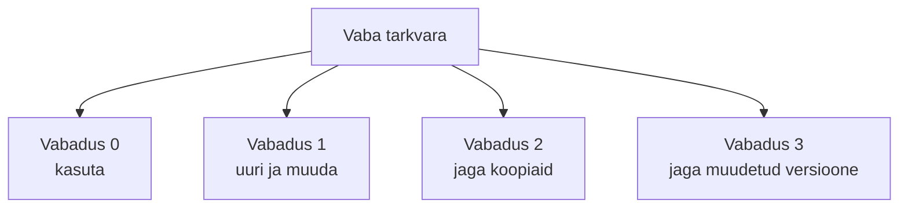
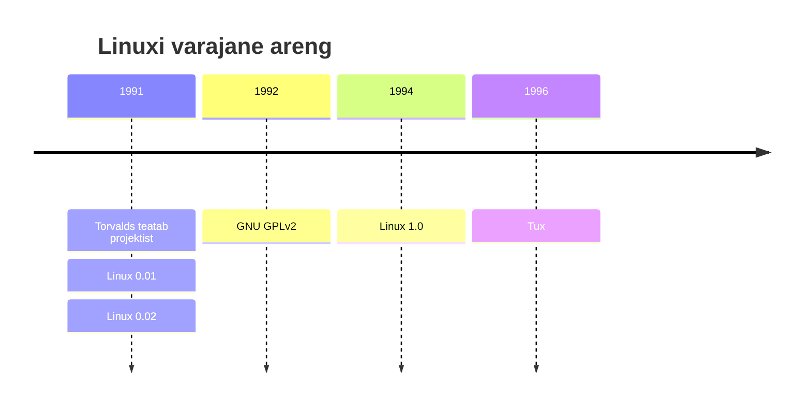
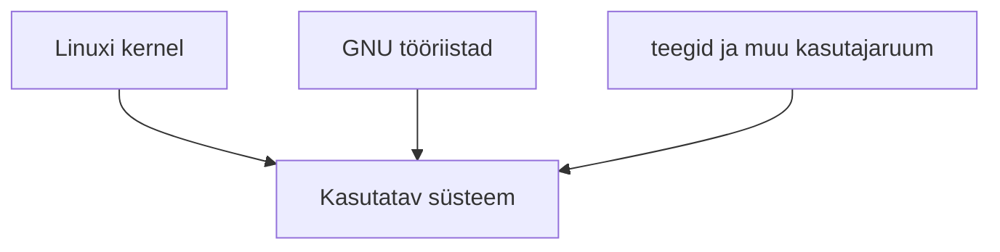
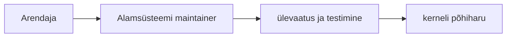

icon:material/history

# Linuxi ajalugu

Linuxi kujunemist ei saa mõista ainult ühe inimese või ühe kerneli loona. Selle taustal kohtuvad mitu arengusuunda: UNIX-i tehnilised ideed, vaba tarkvara liikumine, GNU projekt, MINIX kui õppekeskkond ning avatud ja hajutatud koostöö internetis.

!!! info "Õppematerjali eesmärk"
    Selgitada, kuidas 1970.–1980. aastate tarkvarakultuurist kasvas välja vaba tarkvara liikumine, GNU projekt ja Linux ning kuidas neist kujunes tänapäeva IT üks olulisemaid tehnoloogilisi ökosüsteeme.

    Fookus on **seostel ja põhimõistetel**, mitte aastaarvude päheõppimisel.

## Õpiväljundid

Pärast teema läbimist õppija:

- kirjeldab, kuidas tarkvara jagamise kultuur muutus 1970.–1980. aastatel;
- selgitab Richard Stallmani, GNU projekti ja Free Software Foundationi rolli vaba tarkvara arengus;
- nimetab vaba tarkvara neli põhivabadust ning selgitab, miks „vaba“ ei tähenda tingimata „tasuta“;
- selgitab copyleft'i ja GNU GPL-i põhimõtet;
- kirjeldab GNU süsteemi kujunemist ning kerneli rolli operatsioonisüsteemis;
- selgitab MINIX-i mõju Linuxi sünnile;
- kirjeldab Linuxi kerneli algust 1991. aastal ja selle edasist arengut;
- eristab mõisteid Linux, GNU/Linux ja Linuxi distributsioon;
- toob näiteid Linuxi peamistest distributsiooniperekondadest ja kasutusvaldkondadest.

---

## 1. Tarkvara jagamise kultuur 1960.–1970. aastatel

Varases arvutimaailmas arendati suur osa tarkvarast:

- ülikoolides;
- teadusasutustes;
- arvutitootjate juures.

Programmeerijad jagasid sageli omavahel:

- lähtekoodi;
- parandusi;
- uusi programme.

Tarkvara ei käsitletud alati eraldiseisva tootena samal viisil nagu tänapäeval ning eriti akadeemilises keskkonnas oli tavapärane uurida teiste programme, neid kohandada ja edasi arendada.

!!! note "Oluline täpsustus"
    See ei tähenda, et kogu tollane tarkvara oleks olnud tänapäevases mõttes vaba või avatud lähtekoodiga.

    Mõisted **free software** ja **open source** koos selgete litsentsitingimustega kujunesid välja hiljem.

!!! abstract "Põhisõnum"
    Varajases programmeerijate kogukonnas oli tarkvara jagamine tavalisem, kuid formaalne vaba tarkvara mõiste ja selle õigusi tagavad litsentsid tekkisid alles hiljem.

---

## 2. Tarkvarast saab järjest enam kommertstoode

1970. aastate lõpus ja 1980. aastatel muutus tarkvaratööstus kiiresti.

Tarkvara hakati üha enam:

- müüma eraldi tootena;
- siduma rangemate litsentsitingimustega;
- levitama ilma lähtekoodita.

See muutus puudutas ka teadus- ja arenduskeskkondi.

Programmeerijad, kes olid harjunud tarkvara uurima ja parandusi jagama, puutusid järjest sagedamini kokku süsteemidega, mille muutmine ja edasi jagamine oli litsentsiga piiratud.

!!! warning "Oluline täpsustus"
    Vaba tarkvara liikumise tekkimist ei põhjustanud ühe konkreetse arvutiseeria tootmise lõpp.

    Olulisem oli üldine muutus: **tarkvara muutus iseseisvaks kommertstooteks ja kasutusõigusi hakati rohkem piirama.**

---

## 3. Richard Stallman ja GNU projekt

**Richard Stallman** töötas MIT-i tehisintellekti laboris, kus ta oli harjunud programmeerijate koostöökultuuriga.

Proprietaarse tarkvara levikuga muutus tema jaoks järjest raskemaks tarkvara:

- vabalt uurida;
- parandada;
- muuta;
- teistega jagada.

27. septembril 1983 kuulutas Stallman välja **GNU projekti**.

GNU eesmärk oli luua täielik vaba operatsioonisüsteem, mis oleks UNIX-iga ühilduv, kuid mille kasutajad saaksid tarkvara vabalt kasutada, uurida, muuta ja levitada.

Tegelik arendustöö algas 1984. aasta alguses.

### Mida tähendab GNU?

GNU on rekursiivne akronüüm:

```text
GNU's Not Unix
```

Nimi rõhutab, et süsteem kavandati UNIX-i sarnaseks ja ühilduvaks, kuid see ei olnud AT&T UNIX-i lähtekoodi koopia.

!!! tip "Seos UNIX-i ajalooga"
    GNU valis teadlikult UNIX-i laadse ülesehituse, sest UNIX oli programmeerijatele tuttav ja tehniliselt mõjukas.

    GNU eesmärk oli luua sarnase kasutuskeskkonnaga, kuid **vaba süsteem**.

---

## 4. Mis on vaba tarkvara?

**Vaba tarkvara** (*free software*) ei tähenda eelkõige hinda, vaid kasutajale antud vabadusi.

Programmi võib müüa raha eest ja see võib siiski olla vaba tarkvara, kui kasutajal säilivad vajalikud õigused.

Free Software Foundation kirjeldab nelja põhivabadust.

### Vabadus 0

Kasutada programmi mis tahes eesmärgil.

### Vabadus 1

Uurida, kuidas programm töötab, ning muuta seda vastavalt vajadusele.

### Vabadus 2

Jagada programmi koopiaid teistega.

### Vabadus 3

Jagada enda muudetud versioone teistega.



Programmi uurimiseks ja muutmiseks peab lähtekood olema kättesaadav. Seetõttu on lähtekoodi kättesaadavus vabaduste 1 ja 3 praktiline eeltingimus.

!!! abstract "Pea meeles"
    **Free software = vabadus, mitte tingimata tasuta tarkvara.**

    Ingliskeelne sõna *free* võib tähendada mõlemat, mistõttu kasutatakse sageli selgitust **„free as in freedom“**.

---

## 5. Copyleft ja GNU GPL

Kui autor lihtsalt avaldab lähtekoodi, ei pruugi see veel tagada, et hilisemad edasiarendused jäävad samadel tingimustel vabaks.

Selle probleemi lahendamiseks kasutas GNU projekt **copyleft'i** põhimõtet.

### Copyleft

Copyleft kasutab autoriõigust selleks, et säilitada tarkvara kasutajate vabadused ka programmi edasi levitamisel.

### GNU GPL

**GNU General Public License (GPL)** on üks tuntumaid copyleft-litsentse.

GPL-i esimene versioon avaldati 1989. aastal.

GPL annab õiguse programmi:

- kasutada;
- uurida;
- muuta;
- levitada.

Kui GPL-i alla kuuluvat programmi või selle tuletatud versiooni edasi levitatakse, tuleb täita GPL-i tingimusi ja anda saajale vastavad õigused ning vajalikul juhul lähtekood.

!!! note "Oluline nüanss"
    GPL ei keela GPL-tarkvara kasutamist koos proprietaarse tarkvaraga ega proprietaarses operatsioonisüsteemis.

    Litsentsi nõuded muutuvad eriti oluliseks siis, kui GPL-i alla kuuluvat tarkvara või tuletatud teost **levitatakse edasi**.

---

## 6. Free Software Foundation

1985. aastal asutati **Free Software Foundation (FSF)**.

FSF-i eesmärk oli toetada:

- vaba tarkvara liikumist;
- GNU projekti;
- vaba tarkvara litsentse;
- vaba tarkvara kasutajate õigusi.

!!! note "GNU ja FSF ei ole sama asi"
    **GNU** on tarkvaraprojekt ja operatsioonisüsteemi ökosüsteem.

    **FSF** on organisatsioon, mis toetab vaba tarkvara liikumist ja GNU eesmärke.

---

## 7. GNU ehitab operatsioonisüsteemi

GNU eesmärk oli terviklik operatsioonisüsteem.

Selle loomiseks oli vaja palju komponente:

- kompilaatorit;
- shelli;
- teeke;
- tekstiredaktorit;
- käsureatööriistu;
- linkerit;
- silurit;
- kernelit.

GNU projektist kujunesid või sellega on tihedalt seotud näiteks:

| Komponent | Otstarve |
|---|---|
| **GCC** | GNU Compiler Collection |
| **GNU Emacs** | tekstiredaktor ja arenduskeskkond |
| **glibc** | GNU C Library |
| **Bash** | laialt kasutatav shell |
| **GNU Coreutils** | põhikäsud, näiteks `ls`, `cp`, `mv`, `rm`, `cat` |

1990. aastate alguseks oli suur osa GNU kasutajaruumi süsteemist valmis.

Puudu oli praktiliselt kasutatav kernel, mis oleks kogu süsteemi tervikuks ühendanud.

---

## 8. GNU Hurd – puuduv kernel

GNU projekti kerneliks kavandati **GNU Hurd**.

Selle arendus algas 1990. aastal ning see kasutab Machi mikrokerneli arhitektuuri.

Hurd oli tehniliselt ambitsioonikas, kuid arendus kujunes keeruliseks ja aeglaseks.

GNU Hurd on endiselt olemas ja seda arendatakse, kuid sellest ei ole saanud laialt kasutatavat üldotstarbelist kernelit.

Just sel ajal, kui GNU-l oli enamik kasutajaruumi komponente olemas, ilmus teine vaba kernel – **Linux**.

!!! info "Kernel"
    Kernel ehk tuum on operatsioonisüsteemi keskne osa, mis haldab:

    - protsessorit;
    - mälu;
    - seadmeid;
    - protsesse;

    ning vahendab riistvara ja programmide suhtlust.

---

## 9. MINIX – süsteem õppimiseks

1987. aastal avaldas arvutiteadlane **Andrew S. Tanenbaum** õppeotstarbelise UNIX-like operatsioonisüsteemi **MINIX**.

MINIX-i kasutati koos operatsioonisüsteemide ehitust käsitleva õpikuga ning selle lähtekoodi sai uurida.

Algse MINIX-i lähtekood oli küll õppimiseks kättesaadav, kuid selle litsents ei olnud tänapäevases mõttes täielikult avatud lähtekoodiga.

Hilisemad MINIX-i versioonid on vabamate litsentsitingimustega.

Linus Torvalds kasutas MINIX-i 1991. aastal oma arvutis ning see oli tema jaoks oluline õppe- ja arenduskeskkond.

!!! warning "Hea eristus"
    Linux **ei ole MINIX-i lähtekoodi edasiarendus**.

    Torvalds kirjutas oma kerneli iseseisvalt.

Samuti:

> „Lähtekood on nähtav“ ei tähenda automaatselt „avatud lähtekoodiga“.

Open-source litsents peab andma ka selged õigused koodi kasutada, muuta ja levitada.

---

## 10. 1991: Linus Torvalds alustab Linuxit

1991. aastal oli **Linus Torvalds** Helsingi Ülikooli üliõpilane.

Ta soovis oma Intel 386 arvutil paremini kasutada UNIX-laadset keskkonda ning hakkas hobi korras kirjutama uut kernelit.

25. augustil 1991 kirjutas Torvalds Useneti `comp.os.minix` uudisgruppi kuulsaks saanud sõnumi, milles teatas oma tasuta hobiprojektist.

Üks kuulsamaid katkeid sellest sõnumist oli:

> “I'm doing a (free) operating system (just a hobby...)”

Esimene Linuxi kerneli versioon **0.01** avaldati septembris 1991 ning versioon **0.02** järgnes oktoobris.

Esimesed versioonid olid väga piiratud, kuid projekt äratas kiiresti teiste arendajate huvi.

Internet võimaldas:

- lähtekoodi;
- parandusi;
- ideid

kiiresti jagada.

---

## 11. Linuxi varajane ajajoon

| Aeg | Sündmus |
|---|---|
| **25.08.1991** | Torvalds teatab projektist Usenetis |
| **09.1991** | Linux 0.01 – esimene avaldatud lähtekood |
| **05.10.1991** | Linux 0.02 – Torvalds kutsub teisi süsteemi proovima ja panustama |
| **1992** | Linux läheb üle GNU GPLv2 litsentsile |
| **14.03.1994** | Linux 1.0 – esimene stabiilseks märgitud suurem versioon |
| **1996** | Tuxist saab Linuxi tuntud maskott |



---

## 12. GNU + Linux

Linux ise oli **kernel**, mitte terviklik kasutajakeskkond.

Samal ajal oli GNU projekt loonud suure osa UNIX-like operatsioonisüsteemi kasutajaruumi komponentidest.

Linuxi kernelit hakati kasutama koos GNU:

- kompilaatori;
- C-teegi;
- shelli;
- käsureatööriistade;
- muude süsteemikomponentidega.

Sellest kombinatsioonist kujunes kiiresti praktiliselt kasutatav vaba operatsioonisüsteem.



1990. aastate alguses hakkasid tekkima ka esimesed Linuxi distributsioonid, mis koondasid kerneli, GNU tarkvara ja muud komponendid paigaldatavaks tervikuks.

---

## 13. Linux või GNU/Linux?

Mõiste **Linux** võib sõltuvalt kontekstist tähendada kahte asja.

### Linux

Tehniliselt on Linux:

```text
kernel
```

Igapäevases kasutuses nimetatakse Linuxiks sageli ka tervet Linuxi-põhist operatsioonisüsteemi.

### GNU/Linux

Free Software Foundation eelistab GNU tööriistu kasutavate süsteemide kohta nimetust:

```text
GNU/Linux
```

See rõhutab GNU projekti panust.

Paljud distributsioonid kasutavad tõepoolest Linuxi kernelit koos GNU kasutajaruumi komponentidega.

### Linuxi distributsioon

Linuxi distributsioon on kasutusvalmis tervik:

- Linuxi kernel;
- süsteemiteegid;
- paketihaldur;
- käsureatööriistad;
- seadistusvahendid;
- teenused;
- rakendused.

| Mõiste | Tähendus |
|---|---|
| **Linux** | tehniliselt kernel; tavakeeles sageli kogu Linuxi-põhine operatsioonisüsteem |
| **GNU/Linux** | Linuxi kernel + GNU kasutajaruumi komponendid; FSF-i eelistatud termin paljude distributsioonide kohta |
| **Linuxi distributsioon** | kasutusvalmis tervik: kernel, süsteemiteegid, paketihaldur, tööriistad, seadistus ja rakendused |

!!! info
    Iga Linuxi kernelit kasutav süsteem ei ole tingimata GNU/Linux.

    Näiteks **Android** kasutab Linuxi kernelit, kuid selle kasutajaruumi ülesehitus erineb tavalisest GNU/Linux distributsioonist.

---

## 14. Kuidas Linuxit arendatakse?

Linux kasvas ühe inimese hobiprojektist väga suureks rahvusvaheliseks arendusprojektiks.

Tänapäeva kernelisse panustavad:

- vabatahtlikud;
- sõltumatud arendajad;
- ettevõtete töötajad;
- riistvaratootjad;
- distributsioonide arendajad;
- pilve- ja internetiettevõtted;
- turbe- ja süsteemitarkvara arendajad.

Arendus toimub hajutatult.

Muudatused liiguvad tavaliselt läbi vastava alamsüsteemi hooldajate (*maintainers*) ning lõpuks põhiharusse.

### Git

2005. aastal lõi Linus Torvalds Linuxi kerneli arenduse vajaduste jaoks versioonihaldussüsteemi **Git**.

Gitist on hiljem saanud üks maailma enim kasutatavaid versioonihaldussüsteeme.



!!! abstract "Põhisõnum"
    Linux on avatud lähtekoodiga kogukonnaprojekt, kuid suur osa arendusest toimub tänapäeval professionaalse tööna ettevõtetes.

    Seetõttu oleks kirjeldus **„Linux on lihtsalt vabatahtlike projekt“** liiga kitsas.

---

## 15. Mis on Linuxi distributsioon?

Linuxi kernel üksi ei anna tavakasutajale täielikku operatsioonisüsteemi.

Distributsioon koondab kerneli ning suure hulga muid komponente ühtseks paigaldatavaks ja hallatavaks süsteemiks.

Linuxi distributsioon sisaldab tavaliselt:

- Linuxi kernelit;
- süsteemiteeke;
- käsureatööriistu;
- paketihaldurit;
- tarkvarahoidlaid;
- süsteemi käivitamise ja teenuste halduse lahendust, näiteks `systemd`;
- võrgundus-, turbe- ja haldusvahendeid;
- vajadusel graafilist töölauakeskkonda;
- kasutajarakendusi.

---

## 16. Linuxi distributsioonide perekonnad

Distributsioone on väga palju, kuid neid on lihtsam mõista perekondadena.

Sama perekonna süsteemid jagavad sageli:

- paketiformaati;
- paketihaldust;
- tööriistu;
- ajaloolist päritolu.

| Perekond | Näited | Iseloomustus |
|---|---|---|
| **Debian** | Debian, Ubuntu, Linux Mint | DEB paketid ja APT; väga suur tarkvaravalik; levinud serverites ja töölaual |
| **Red Hat** | Fedora, RHEL, CentOS Stream | RPM paketid ja DNF; oluline ettevõtte- ja serverikeskkondades |
| **SUSE** | openSUSE, SUSE Linux Enterprise | RPM-põhine perekond; tugev haldus- ja ettevõttefookus |
| **Arch** | Arch Linux, EndeavourOS, CachyOS | Rolling release, Pacman; paindlik ja sageli tehnilisema kasutaja valik |
| **Muud** | Alpine Linux jt | spetsiifiliste eesmärkidega süsteemid; Alpine on populaarne väikestes konteineripiltides |

---

## 17. Linux tänapäeval

Linux on tänapäeva IT-taristu üks põhitehnoloogiaid.

Selle tähtsus ei piirdu personaalarvuti töölauaga – kõige suurem mõju on serverites, pilves, seadmetes ja arenduskeskkondades.

### Serverid ja veebiteenused

Suur osa internetiteenustest töötab Linuxil.

### Pilvandmetöötlus

Linux on AWS-i, Azure'i, Google Cloudi ja teiste pilveplatvormide keskne külalis- ja hostoperatsioonisüsteem.

### Konteinerid

Docker ja Kubernetes toetuvad suurel määral Linuxi kerneli funktsioonidele.

### Android

Android kasutab Linuxi kernelit.

### Võrguseadmed ja sisseehitatud süsteemid

Ruuterid, tulemüürid, telerid, IoT- ja tööstusseadmed kasutavad sageli Linuxit.

### Superarvutid

Linux on valdav operatsioonisüsteem maailma kiireimates superarvutites.

### Arendus ja DevOps

Linuxi shell, paketihaldus, Git, SSH ja automatiseerimisvahendid on igapäevased tööriistad.

!!! abstract "Kokkuvõttev mõte"
    Linuxi lugu ühendab kolm suurt arengusuunda:

    1. UNIX-i tehnilised ideed;
    2. GNU vaba tarkvara liikumise;
    3. avatud koostöise arendusmudeli.

    Linuxi kernel koos vabade kasutajaruumi komponentide ja distributsioonidega kujunes süsteemiks, millel põhineb suur osa tänapäeva digitaristust.

---

## 18. Kiirkordamine

| Küsimus | Lühivastus |
|---|---|
| **Miks tekkis GNU projekt?** | Et luua täielikult vaba UNIX-iga ühilduv operatsioonisüsteem. |
| **Mida tähendab vaba tarkvara?** | Kasutajal on õigused programmi kasutada, uurida, muuta ja levitada; see ei tähenda tingimata tasuta hinda. |
| **Mis on copyleft?** | Litsentsimispõhimõte, mis kasutab autoriõigust selleks, et säilitada tarkvara vabadused ka edasi levitamisel. |
| **Mis on GNU GPL?** | Üks tuntumaid copyleft-litsentse, mida kasutab ka Linuxi kernel GPLv2 kujul. |
| **Mis oli GNU süsteemil 1990. aastate alguses puudu?** | Laialt kasutatav valmis kernel. |
| **Mis oli MINIX-i roll?** | Õppeotstarbeline UNIX-like süsteem, mida Torvalds kasutas ja millest ta õppis; Linux ei ole MINIX-i lähtekoodi jätk. |
| **Millal Linux alguse sai?** | 1991. aastal, kui Linus Torvalds alustas oma kerneli arendamist ja avaldas esimesed versioonid. |
| **Kas Linux on kernel või operatsioonisüsteem?** | Tehniliselt kernel; tavakeeles kasutatakse Linuxi nime sageli ka terve distributsiooni kohta. |
| **Mis on Linuxi distributsioon?** | Kasutusvalmis süsteem, mis ühendab Linuxi kerneli, kasutajaruumi tarkvara, paketihalduse ja muud komponendid. |
| **Kes Linuxit arendavad?** | Nii vabatahtlikud ja sõltumatud arendajad kui ka paljude ettevõtete palgalised insenerid. |

---

## Kontrollküsimused

1. Milline oli tarkvara jagamise kultuur 1960.–1970. aastatel?
2. Miks muutus tarkvara 1970.–1980. aastatel järjest rohkem kommertstooteks?
3. Kes oli Richard Stallman?
4. Mis oli GNU projekti eesmärk?
5. Mida tähendab nimi GNU?
6. Millised on vaba tarkvara neli põhivabadust?
7. Miks ei tähenda *free software* tingimata tasuta tarkvara?
8. Mis on copyleft?
9. Mis on GNU GPL?
10. Mis vahe on GNU projektil ja Free Software Foundationil?
11. Milliseid olulisi programme ja komponente GNU projekt lõi?
12. Mis oli GNU Hurd?
13. Mis roll oli MINIX-il Linuxi kujunemisel?
14. Kas Linux põhineb MINIX-i lähtekoodil?
15. Mis juhtus 25. augustil 1991?
16. Mis muutus Linuxi arengus 1992. aastal?
17. Mis vahe on mõistetel Linux ja GNU/Linux?
18. Mis on Linuxi distributsioon?
19. Kuidas Linuxi kernelit tänapäeval arendatakse?
20. Miks oli Git Linuxi ajaloo seisukohalt oluline?
21. Nimeta vähemalt kolm Linuxi distributsiooniperekonda.
22. Millistes tänapäeva IT-valdkondades Linuxit kasutatakse?
23. Millised kolm arengusuunda ühendab Linuxi ajalugu?

---

## Ajajoon

| Aeg | Sündmus |
|---|---|
| **1960.–1970. aastad** | tarkvara jagamine on paljudes teadus- ja arenduskeskkondades tavaline |
| **1970. aastate lõpp – 1980. aastad** | tarkvara kommertsialiseerumine ja rangemad litsentsid |
| **1983** | Richard Stallman kuulutab välja GNU projekti |
| **1984** | GNU tegelik arendustöö algab |
| **1985** | asutatakse Free Software Foundation |
| **1987** | ilmub MINIX |
| **1989** | GNU GPL versioon 1 |
| **1990** | GNU Hurdi arendus algab |
| **1991** | Linus Torvalds alustab Linuxi kerneli arendamist |
| **1992** | Linux läheb üle GNU GPLv2 litsentsile |
| **1994** | Linux 1.0 |
| **1996** | Tux |
| **2005** | Linus Torvalds loob Giti |

---

## Allikad ja lisalugemine

1. GNU Project – *GNU History*  
   https://www.gnu.org/gnu/gnu-history.html

2. Richard Stallman – *Initial Announcement of the GNU Project* (1983)  
   https://www.gnu.org/gnu/initial-announcement.html

3. GNU Project – *What is Free Software?*  
   https://www.gnu.org/philosophy/free-sw.html

4. GNU Project – *GNU licenses / GPL*  
   https://www.gnu.org/licenses/

5. Linux Foundation – Linuxi kerneli ajalugu ja koostöine arendus  
   https://www.linuxfoundation.org/

6. The Linux Kernel Archives  
   https://www.kernel.org/

7. MINIX 3 dokumentatsioon  
   https://www.minix3.org/

   
