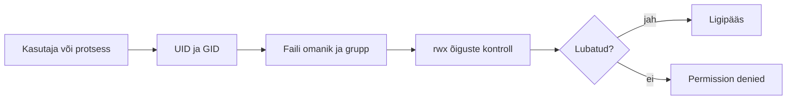

icon:material/debian

# Linuxi failiõigused

Linux on mitme kasutajaga operatsioonisüsteem. Selleks, et kasutajad ja programmid ei pääseks ligi andmetele, millele neil õigust ei ole, kasutab Linux failide ja kataloogide juures omanikku, gruppi ning pääsuõigusi.

Failiõigused moodustavad ühe osa Linuxi turvamudelist. Need määravad, kes võib faili või kataloogi lugeda, muuta või kasutada.

!!! info "Seos eelmise teemaga"
    Kasutajate halduse teemas õppisid, et Linux identifitseerib kasutajaid UID ja gruppe GID abil.

    Failiõigused seovad need identiteedid failide ja kataloogidega:

    ```text
    kasutaja → UID
    grupp    → GID
    fail     → omanik + grupp + õigused
    ```

## Õpieesmärgid

Pärast materjali läbimist oskad:

- selgitada Linuxi failiõiguste eesmärki;
- lugeda `ls -l` väljundist faili tüüpi, omanikku, gruppi ja õigusi;
- eristada omaniku, grupi ja teiste kasutajate õigusi;
- selgitada `r`, `w` ja `x` tähendust faili ning kataloogi puhul;
- muuta õigusi käsuga `chmod`;
- kasutada nii sümboolset kui numbrilist õiguste määramist;
- muuta faili omanikku ja gruppi käskudega `chown` ja `chgrp`;
- selgitada `umask` põhimõtet;
- kirjeldada setuid, setgid ja sticky bit eriõiguste eesmärki;
- mõista, millal võib vaja minna ACL-e.

---

## Miks failiõigusi vaja on?

Linuxi failiõigused kontrollivad, kas kasutajal või protsessil on lubatud konkreetsele failisüsteemi objektile ligi pääseda. Kontrolli teeb operatsioonisüsteemi kernel.



Failiõigused aitavad:

- eraldada erinevate kasutajate andmeid;
- piirata süsteemifailide muutmist;
- anda grupile ühiseid ligipääsuõigusi;
- piirata teenuste ja protsesside õigusi;
- vähendada juhuslike või pahatahtlike muudatuste mõju.

!!! warning "Failiõigused ei ole krüpteerimine"
    Tavalised Linuxi failiõigused toimivad siis, kui failisüsteemi kasutab Linuxi kernel. Kui krüpteerimata ketas või andmekandja eemaldatakse arvutist ja loetakse teise süsteemi kaudu, ei pruugi tavalised Unix-tüüpi failiõigused andmete sisu kaitsta.

---

## Omanik, grupp ja teised

Iga Unix-tüüpi failiõigustega failisüsteemi objekti juures on kolm peamist õiguste sihtrühma.

| Tähis | Inglise keeles | Tähendus |
|---|---|---|
| `u` | user | faili või kataloogi omanik |
| `g` | group | faili või kataloogi grupp |
| `o` | others | kõik ülejäänud kasutajad |
| `a` | all | kõik kolm eelmist korraga |

Näiteks:

```text
-rw-r----- student praktikandid raport.txt
```

Siin:

- omanik on `student`;
- grupp on `praktikandid`;
- omanikul on `rw-`;
- grupil on `r--`;
- teistel õigused puuduvad.

!!! note "Õiguseid ei liideta lihtsalt kokku"
    Linux valib kasutaja jaoks sobiva õiguste kategooria. Kui kasutaja on faili omanik, rakendatakse omaniku õigusi. Kui ta ei ole omanik, kuid kuulub faili gruppi, rakendatakse grupi õigusi. Muul juhul rakendatakse `others` õigusi.

---

## Failiõiguste vaatamine

Failide ja kataloogide õigusi saab vaadata käsuga:

```bash
ls -l
```

Näiteks:

```text
-rwxr-x--- 1 student praktikandid 1250 Sep 5 10:30 skript.sh
```

Esimese välja saab jagada neljaks osaks:

```text
- rwx r-x ---
│ │   │   │
│ │   │   └── teised
│ │   └────── grupp
│ └────────── omanik
└──────────── objekti tüüp
```

### Esimene märk – objekti tüüp

| Märk | Tähendus |
|---|---|
| `-` | tavaline fail |
| `d` | kataloog |
| `l` | symbolic link |

### Järgmised üheksa märki – õigused

```text
rwx rwx rwx
│   │   │
│   │   └── teised
│   └────── grupp
└────────── omanik
```

Miinusmärk `-` tähendab vastava õiguse puudumist.

---

## `r`, `w` ja `x` faili puhul

| Õigus | Nimi | Tähendus |
|---|---|---|
| `r` | read | faili sisu saab lugeda |
| `w` | write | faili sisu saab muuta |
| `x` | execute | faili saab käivitada programmina või skriptina |

Näiteks:

```text
-rwxr-x--- student praktikandid skript.sh
```

- omanik saab faili lugeda, muuta ja käivitada;
- grupp saab faili lugeda ja käivitada;
- teistel kasutajatel õigused puuduvad.

!!! note "Faili kustutamine"
    Faili enda `w` õigus ei määra otseselt seda, kas faili saab kustutada. Faili kustutamine muudab faili sisaldava kataloogi kirjet, mistõttu sõltub kustutamisõigus peamiselt kataloogi `w` ja `x` õigustest.

---

## `r`, `w` ja `x` kataloogi puhul

Kataloogi puhul on `rwx` tähendus mõnevõrra teistsugune.

### `r` – read

Lubab lugeda kataloogikirjete ehk objektide nimede loendit.

### `w` – write

Lubab kataloogikirjeid muuta, näiteks:

- luua uusi faile;
- kustutada faile;
- luua alamkatalooge;
- nimetada objekte ümber.

### `x` – execute

Kataloogi puhul tähendab `x` õigust kataloogi **läbida** (*traverse/search*). See võimaldab kataloogi siseneda, kasutada teadaoleva nimega objekti ja liikuda läbi kataloogi alamkataloogidesse.

!!! tip "Kataloogi `x` õigus on eriti oluline"
    Kataloogi puhul ei tähenda `x` programmi käivitamist. See tähendab õigust kataloogi läbida ja seal olevaid objekte nime järgi kasutada.

| Õigused | Üldine tulemus |
|---|---|
| `r--` | nimesid võib näha, kuid objekte ei saa tavaliselt kasutada |
| `--x` | teadaoleva nimega objektile võib ligi pääseda, kuid kataloogi sisu ei saa loetleda |
| `r-x` | kataloogi saab sirvida ja objekte kasutada |
| `-wx` | saab objekte luua, kustutada ja ümber nimetada, kui nimed on teada |
| `rwx` | täielik tavapärane ligipääs |

!!! warning
    Kataloogi `w` õigus ilma `x` õiguseta on praktiliselt väga piiratud. Failide tavapäraseks loomiseks, kustutamiseks ja ümbernimetamiseks on üldjuhul vaja mõlemat.

---

## Õiguste muutmine käsuga `chmod`

Faili või kataloogi õiguste muutmiseks kasutatakse käsku:

```bash
chmod
```

Üldkuju:

```bash
chmod õigused objekt
```

Õiguseid saab määrata kahel põhilisel viisil:

1. sümboolselt;
2. numbriliselt.

---

## Sümboolne `chmod`

### Kelle õigusi muudetakse?

```text
u = owner / user
g = group
o = others
a = all
```

### Kuidas õigusi muudetakse?

```text
+ = lisa õigus
- = eemalda õigus
= = määra täpselt
```

### Näited

```bash
chmod u+x skript.sh
chmod g+w raport.txt
chmod o-r fail.txt
chmod ug+rw fail.txt
chmod a-x fail.txt
chmod u=rw,g=r,o= fail.txt
```

Viimase käsu tulemuseks on:

```text
-rw-r-----
```

!!! tip
    Sümboolne meetod on hea siis, kui soovid muuta ainult ühte konkreetset õigust ja jätta ülejäänud puutumata.

---

## Numbriline `chmod`

Numbrilise meetodi puhul vastab igale õigusele arvuline väärtus.

```text
r = 4
w = 2
x = 1
```

| Number | Õigused | Arvutus |
|---:|---|---|
| `0` | `---` | 0 |
| `1` | `--x` | 1 |
| `2` | `-w-` | 2 |
| `3` | `-wx` | 2 + 1 |
| `4` | `r--` | 4 |
| `5` | `r-x` | 4 + 1 |
| `6` | `rw-` | 4 + 2 |
| `7` | `rwx` | 4 + 2 + 1 |

### Näide: `640`

```bash
chmod 640 raport.txt
```

```text
6 = rw-  omanik
4 = r--  grupp
0 = ---  teised
```

### Näide: `660`

```bash
chmod 660 fail.txt
```

Tulemus:

```text
-rw-rw----
```

### Näide: `750`

```bash
chmod 750 skript.sh
```

Tulemus:

```text
-rwxr-x---
```

---

## Levinud õiguste kombinatsioonid

| Režiim | Õigused | Tüüpiline kasutus |
|---:|---|---|
| `600` | `rw-------` | privaatne fail |
| `640` | `rw-r-----` | fail, mida grupp võib lugeda |
| `644` | `rw-r--r--` | tavaline teistele loetav fail |
| `660` | `rw-rw----` | grupiga jagatav fail |
| `700` | `rwx------` | privaatne kataloog või programm |
| `750` | `rwxr-x---` | omanik + grupile lugemine/läbimine |
| `755` | `rwxr-xr-x` | avalikult läbitav kataloog või käivitatav programm |
| `770` | `rwxrwx---` | grupiga jagatav kataloog |

!!! danger "`777` ei ole universaalne lahendus"
    `chmod 777 objekt` annab kõigile lugemis-, kirjutamis- ja käivitusõiguse. Seda ei tohiks kasutada lihtsalt selleks, et „asi tööle saada“.

---

## Omaniku ja grupi vaatamine

`ls -l` näitab lisaks õigustele ka faili omanikku ja gruppi.

```text
-rw-r----- 1 student praktikandid 250 Sep 5 11:00 raport.txt
```

Detailsemat infot saab vaadata:

```bash
stat raport.txt
```

---

## Omaniku muutmine käsuga `chown`

### Ainult omaniku muutmine

```bash
sudo chown jyri raport.txt
```

### Omaniku ja grupi muutmine

```bash
sudo chown jyri:praktikandid raport.txt
```

### Ainult grupi muutmine

```bash
sudo chown :praktikandid raport.txt
```

Näiteks:

```bash
sudo chown www-data:www-data index.php
```

---

## Grupi muutmine käsuga `chgrp`

Kui soovid muuta ainult objekti gruppi:

```bash
sudo chgrp praktikandid raport.txt
```

---

## Rekursiivne omaniku muutmine

```bash
sudo chown -R student:student /var/koopia
```

See muudab kataloogi enda, alamkataloogid ja failid omanikuks ning grupiks `student`.

!!! warning
    Rekursiivseid käske tuleb kasutada ettevaatlikult. Valesti määratud tee võib muuta suure hulga süsteemifailide omanikku.

---

## Rekursiivne `chmod`

```bash
chmod -R õigused kataloog
```

Näiteks:

```bash
chmod -R 755 projekt/
```

muudab ka kõik tavalised failid käivitatavaks, mis pole sageli soovitud.

!!! danger "Failid ja kataloogid vajavad sageli erinevaid õigusi"
    Rekursiivset `chmod` käsku ei tohiks kasutada pimesi. Enne muutmist kontrolli, milliseid õigusi vajavad kataloogid, tavalised failid ja käivitatavad failid.

---

## Vaikimisi õigused ja `umask`

Uute objektide vaikimisi õigusi mõjutab:

```bash
umask
```

Näiteks:

```text
0022
```

### Lihtsustatud põhimõte

Tavalise faili maksimaalne tavapärane lähteõigus on:

```text
666 = rw-rw-rw-
```

Kataloogil:

```text
777 = rwxrwxrwx
```

Kui `umask` on `022`, saadakse tavaliselt:

```text
uus fail       → 644 → rw-r--r--
uus kataloog   → 755 → rwxr-xr-x
```

!!! note
    `umask` eemaldab vaikimisi õigustest bitte. See ei lisa õigusi, mida programmi poolt loodavale objektile algselt ei küsitud.

### Miks fail ei saa vaikimisi `x` õigust?

Uue tavalise faili lähteõigustes kasutatakse tavaliselt `666`, mitte `777`. Seetõttu ei teki tavalisel failil automaatselt käivitusõigust.

---

## Eriõigused

Lisaks tavapärastele `rwx` õigustele on Unix-laadsetes süsteemides kolm tuntud eriõigust:

- setuid;
- setgid;
- sticky bit.

Need võivad `ls -l` väljundis ilmuda tähtedena `s`, `S`, `t` või `T`.

---

## setuid

**setuid** (*set user ID*) mõjutab käivitatavat faili. Kui sobiv binaarprogramm on setuid bitiga, saab protsess programmi käivitamisel efektiivse kasutajaidentiteedi faili omaniku järgi.

```bash
chmod u+s programm
```

Tüüpiline näide on:

```text
/usr/bin/passwd
```

!!! danger
    Setuid-programmid on turvatundlikud. Programmeerimisviga setuid-programmis võib põhjustada õiguste eskaleerimise.

!!! note
    Linux ei rakenda tavaliselt setuid/setgid mehhanismi interpreter-skriptidele samal viisil nagu natiivsetele binaarprogrammidele. Turvakaalutlustel ignoreeritakse neid bitte tavaliselt skriptidel.

---

## setgid

**setgid** (*set group ID*) käivitataval failil töötab sarnaselt setuid-le, kuid mõjutab efektiivset grupiidentiteeti.

```bash
chmod g+s programm
```

### setgid kataloogil

Kataloogi puhul on setgid eriti kasulik grupitööks.

```bash
chmod g+s projekt/
```

Kui kataloogil on setgid, pärivad sinna loodavad failid ja alamkataloogid tavaliselt kataloogi grupi.

Näiteks:

```text
drwxrws--- student praktikandid projekt
```

!!! tip "Hea kasutusjuht"
    Kui mitu kasutajat kuuluvad gruppi `praktikandid` ja töötavad ühises kataloogis, aitab setgid hoida uute failide grupi õigena.

---

## Sticky bit

Sticky bit on tänapäeva Linuxis praktiliselt oluline eelkõige jagatud kirjutatavates kataloogides.

Tuntuim näide on:

```text
/tmp
```

Selle õigused on sageli:

```text
drwxrwxrwt
```

Sticky bit aitab vältida olukorda, kus üks kasutaja kustutab või nimetab ümber teise kasutaja faili lihtsalt seetõttu, et kõigil on kataloogile kirjutusõigus.

```bash
chmod +t jagatud/
```

või:

```bash
chmod o+t jagatud/
```

!!! note
    Sticky biti ajalooline tähendus tavalistel failidel ei ole tänapäevases Linuxis praktiliselt oluline. Seda kasutatakse peamiselt kataloogidel.

---

## Eriõigused numbriliselt

| Väärtus | Eriõigus |
|---:|---|
| `4` | setuid |
| `2` | setgid |
| `1` | sticky bit |

Näiteks grupiga jagatav setgid-kataloog:

```bash
chmod 2770 projekt/
```

Sticky bit'iga jagatud kataloog:

```bash
chmod 1777 jagatud/
```

---

## Root ja failiõigused

Root-kasutaja UID on `0`.

Root saab tavapärastest Unix DAC (*Discretionary Access Control*) failiõigustest suurel määral mööda minna. See ei tähenda siiski, et root oleks kõigi võimalike süsteemikaitsete suhtes piiranguteta.

Ligipääsu võivad mõjutada näiteks:

- read-only failisüsteem;
- failiatribuudid;
- SELinux või AppArmor;
- mount-valikud;
- krüpteerimine;
- kerneli turvamehhanismid.

Selles teemas keskendume klassikalistele Unix `rwx` õigustele.

---

## ACL – kui `owner/group/others` ei ole piisav

Klassikaline Unix õigustemudel võimaldab määrata õigused:

```text
owner
group
others
```

Vahel on vaja täpsemat lahendust. Näiteks faili omanik on `jyri`, grupp on `praktikandid`, kuid lisaks peab ainult kasutaja `mari` saama faili muuta.

Sellistes olukordades saab kasutada **ACL-e** (*Access Control Lists*).

ACL-i vaatamiseks kasutatakse sageli:

```bash
getfacl fail
```

ACL-i muutmiseks:

```bash
setfacl
```

!!! info
    ACL-i detailne seadistamine ei ole selle teema põhifookus. Oluline on teada, et klassikalise `owner/group/others` mudeli kõrval on Linuxis olemas ka täpsemad juurdepääsuloendid.

---

## Praktiline õiguste lugemine

### Näide 1 – fail

```text
-rw-r----- student praktikandid raport.txt
```

| Küsimus | Vastus |
|---|---|
| Kas `student` saab lugeda? | jah |
| Kas `student` saab muuta? | jah |
| Kas grupi `praktikandid` liige saab lugeda? | jah |
| Kas grupi liige saab muuta? | ei |
| Kas ülejäänud kasutaja saab lugeda? | ei |

### Näide 2 – skript

```text
-rwxr-x--- student praktikandid backup.sh
```

- omanik saab lugeda, muuta ja käivitada;
- grupp saab lugeda ja käivitada;
- teistel õigused puuduvad.

### Näide 3 – jagatud kataloog

```text
drwxrwx--- student praktikandid projekt
```

- omanik saab kataloogi täielikult kasutada;
- grupi liikmed saavad kataloogi täielikult kasutada;
- teistel kasutajatel puudub ligipääs.

Kui lisame setgid:

```bash
chmod g+s projekt
```

võib väljund muutuda:

```text
drwxrws--- student praktikandid projekt
```

---

## Hea töövõte: vaata → mõtle → muuda → kontrolli

Enne failiõiguste muutmist vaata olemasolevat olukorda:

```bash
ls -l fail
```

või:

```bash
stat fail
```

Seejärel otsusta:

1. kes peab objektile ligi pääsema;
2. milliseid tegevusi tal vaja teha on;
3. kas sobib omanik, grupp või `others`;
4. kas piisab `chmod`-ist või tuleb muuta ka omanikku/gruppi.

Muuda õigusi ja kontrolli tulemust uuesti.

!!! tip
    Süsteemiadministraatori eesmärk ei ole anda võimalikult palju õigusi, vaid anda **täpselt vajalikud õigused**.

---

## Käskude kokkuvõte

| Käsk | Eesmärk |
|---|---|
| `ls -l` | õiguste, omaniku ja grupi vaatamine |
| `stat` | detailse failiinfo vaatamine |
| `chmod` | faili või kataloogi õiguste muutmine |
| `chown` | omaniku ja/või grupi muutmine |
| `chgrp` | grupi muutmine |
| `umask` | uute objektide vaikimisi õiguste mõjutamine |
| `getfacl` | ACL-i vaatamine |
| `setfacl` | ACL-i muutmine |

### Õiguste numbrid

```text
r = 4
w = 2
x = 1
```

| Number | Õigused |
|---:|---|
| `0` | `---` |
| `1` | `--x` |
| `2` | `-w-` |
| `3` | `-wx` |
| `4` | `r--` |
| `5` | `r-x` |
| `6` | `rw-` |
| `7` | `rwx` |

---

## Olulised mõisted

| Mõiste | Selgitus |
|---|---|
| **owner** | faili või kataloogi omanik |
| **group** | failiga seotud grupp |
| **others** | kõik kasutajad, kes pole faili omanik ega sobiva grupi liikmed |
| **`r`** | lugemisõigus |
| **`w`** | kirjutamisõigus |
| **`x`** | faili käivitamis- või kataloogi läbimisõigus |
| **`chmod`** | õiguste muutmise käsk |
| **`chown`** | omaniku ja grupi muutmise käsk |
| **`chgrp`** | grupi muutmise käsk |
| **`umask`** | uute failide ja kataloogide vaikimisi õigusi piirav mask |
| **setuid** | käivitatava faili omaniku efektiivse UID kasutamine |
| **setgid** | faili efektiivse GID kasutamine või kataloogi grupi pärimine |
| **sticky bit** | piirab jagatud kataloogis teiste kasutajate objektide kustutamist/ümbernimetamist |
| **ACL** | täiendav juurdepääsuloend konkreetsete kasutajate ja gruppide õiguste määramiseks |

---

## Kontrollküsimused

1. Miks on Linuxis failiõigusi vaja?
2. Millised kolm kasutajakategooriat on klassikalises Unix õigustemudelis?
3. Mida tähistavad `u`, `g`, `o` ja `a`?
4. Mida näitab `ls -l` väljundi esimene märk?
5. Kuidas jagunevad üheksa `rwx` õiguse märki?
6. Mida tähendab `r` tavalise faili puhul?
7. Mida tähendab `w` tavalise faili puhul?
8. Mida tähendab `x` tavalise faili puhul?
9. Mida tähendab `r` kataloogi puhul?
10. Mida tähendab `w` kataloogi puhul?
11. Mida tähendab `x` kataloogi puhul?
12. Miks ei sõltu faili kustutamine ainult faili enda `w` õigusest?
13. Milleks kasutatakse käsku `chmod`?
14. Mis vahe on `chmod u+x fail` ja `chmod u=x fail` käskudel?
15. Millised õigused annab `chmod 640 fail`?
16. Millised õigused annab `chmod 755 kataloog`?
17. Miks ei ole `chmod 777` hea universaalne lahendus?
18. Milleks kasutatakse `chown` käsku?
19. Mis vahe on `chown` ja `chgrp` käskudel?
20. Milline oht kaasneb `chmod -R 755 kataloog` käsuga?
21. Milleks kasutatakse `umask` väärtust?
22. Millised õigused tekivad tüüpiliselt `umask 022` korral uuele failile ja kataloogile?
23. Mis on setuid?
24. Milleks kasutatakse setgid õigust kataloogil?
25. Milleks kasutatakse sticky bit'i?
26. Milline tuntud Linuxi kataloog kasutab tavaliselt sticky bit'i?
27. Mida tähistavad numbrilises `chmod` käsus eriõiguste väärtused `4`, `2` ja `1`?
28. Milleks kasutatakse ACL-e?
29. Miks ei ole root-kasutaja kirjeldamine kui „täiesti piiranguteta kasutaja“ päris täpne?
30. Milline peaks olema hea tööjärjekord enne ja pärast failiõiguste muutmist?

---

## Kokkuvõte

Linuxi klassikaline failiõiguste süsteem kasutab kolme kasutajakategooriat:

```text
owner
group
others
```

Iga kategooria jaoks saab määrata `r`, `w` ja `x` õigused.

Faili ja kataloogi puhul ei ole nende tähendus täiesti sama. Eriti oluline on mõista kataloogi `x` õigust ning seda, et faili kustutamise võimalus sõltub suuresti faili sisaldava kataloogi õigustest.

Õigusi muudetakse käsuga `chmod`, omanikku ja gruppi käskudega `chown` ning `chgrp`. Uute failide ja kataloogide vaikimisi õigusi mõjutab `umask`.

Setuid, setgid ja sticky bit võimaldavad lahendada erijuhtumeid ning ACL-id laiendavad klassikalist `owner/group/others` mudelit.

Kõige olulisem põhimõte on sama mis kasutajate halduses:

> **anna ainult need õigused, mida kasutajal või teenusel tegelikult vaja on.**

---

## Allikad ja lisalugemine

Algmaterjali põhiteemad põhinevad varasemal õppematerjalil **„Linuxi failiõigused“ (2020)**.

Täiendavaks lugemiseks:

- `man chmod`
- `man chown`
- `man chgrp`
- `man umask`
- `man stat`
- `man acl`
- `man getfacl`
- `man setfacl`

