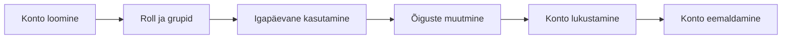

icon:material/debian

# Kasutajate haldus Linuxis

Linux on mitme kasutajaga operatsioonisüsteem. Igal kasutajal on oma identiteet, õigused ja juurdepääs süsteemi ressurssidele. Kasutajakontode ja gruppide korrektne haldamine on üks Linuxi süsteemiadministraatori põhioskusi.

Kasutajate haldamisel lähtutakse põhimõttest, et kasutajal peaksid olema ainult need õigused, mida ta oma töö tegemiseks tegelikult vajab.

## Õpieesmärgid

Pärast materjali läbimist oskad:

- selgitada Linuxi kasutajakonto eesmärki;
- eristada tavakasutajat, administraatorit ja teenusekontot;
- selgitada UID ja GID tähendust;
- eristada primaarset ja täiendavaid gruppe;
- kirjeldada failide `/etc/passwd`, `/etc/shadow`, `/etc/group` ja `/etc/gshadow` otstarvet;
- vaadata kasutaja ja gruppide infot käskudega `id`, `groups` ja `getent`;
- luua ja kustutada kasutajaid;
- luua ja kustutada gruppe;
- lisada kasutaja gruppi ning eemaldada kasutaja grupist;
- muuta kasutaja parooli;
- lukustada ja avada kasutajakonto;
- muuta olemasoleva kasutaja nime, kodukataloogi ja shelli;
- kasutada `sudo` õiguste andmisel gruppi.

---

## Minimaalsete õiguste põhimõte

Linuxi kasutajate ja gruppide haldamise üks olulisemaid põhimõtteid on **least privilege** ehk minimaalsete vajalike õiguste põhimõte.

See tähendab, et:

> kasutajal, protsessil või teenusel peaksid olema ainult need õigused, mida tal on oma ülesande täitmiseks vaja.

Liigsed õigused suurendavad riski, et:

- kasutaja teeb kogemata süsteemi kahjustava muudatuse;
- pahavara saab kasutaja konto kaudu rohkem õigusi;
- kompromiteeritud konto kaudu pääseb ligi rohkematele andmetele;
- kasutajatevaheline vastutuse piir hägustub.

!!! tip "Hea süsteemihalduse põhimõte"
    Tavakasutajana tehtavad toimingud tuleks teha tavakasutajana. Administraatori õigusi kasutatakse ainult siis, kui neid päriselt vaja on.

---

## Kasutajakonto mõiste

Linuxis identifitseeritakse kasutajad kasutajakontode abil.

Kasutajakontoga on seotud näiteks:

- kasutajanimi;
- UID ehk kasutaja ID;
- primaarne grupp;
- täiendavad grupid;
- kodukataloog;
- vaikimisi shell;
- parooliga seotud andmed;
- konto ja parooli aegumise seaded.

Kasutajakontot kasutatakse nii inimese kui ka teenuse või protsessi identifitseerimiseks.

---

## Kasutajate tüübid

### Tavakasutaja

Tavakasutaja töötab piiratud õigustega.

Ta saab tavaliselt:

- hallata oma kodukataloogis olevaid faile;
- käivitada programme;
- kasutada talle lubatud süsteemiressursse;
- kuuluda erinevatesse gruppidesse.

Tavakasutaja ei saa vaikimisi muuta süsteemifaile ega teiste kasutajate faile.

---

### Juurkasutaja ehk `root`

Linuxi süsteemi juurkasutaja nimi on:

```text
root
```

Tema UID on alati:

```text
0
```

Root-kasutajal on väga ulatuslikud õigused kogu süsteemi üle.

!!! warning
    Root-kasutajana tehtud viga võib mõjutada kogu süsteemi. Seetõttu kasutatakse igapäevases töös tavaliselt tavakasutajat ning vajaliku administraatori käsu jaoks `sudo`-t.

---

### Administraator

Linuxis ei tähenda "administraator" tingimata eraldi kasutajatüüpi.

Tavakasutajale saab anda õiguse käivitada teatud käske kõrgendatud õigustega, näiteks `sudo` kaudu.

Debianis kuuluvad täieliku `sudo` õigusega kasutajad tavaliselt gruppi:

```text
sudo
```

Red Hat Enterprise Linuxi laadsetes süsteemides kasutatakse sageli gruppi:

```text
wheel
```

---

### Teenusekonto

Paljud Linuxi teenused töötavad eraldi kasutajakonto õigustes.

Näiteks võivad süsteemis olla kasutajad:

```text
www-data
systemd-timesync
messagebus
```

Teenusekontol ei ole sageli vaja tavalist interaktiivset sisselogimist.

!!! info
    Teenusekonto eesmärk on piirata teenuse õigusi. Kui teenus kompromiteeritakse, ei tohiks see automaatselt anda ründajale kogu süsteemi õigusi.

---

## UID ja GID

Linux ei identifitseeri kasutajat sisemiselt peamiselt kasutajanime järgi, vaid numbrilise identifikaatori abil.

### UID

**UID** (*User Identifier*) on kasutaja numbriline identifikaator.

Näiteks:

```text
student → UID 1000
root    → UID 0
```

UID `0` kuulub root-kasutajale.

!!! note "UID vahemikud sõltuvad süsteemist"
    Vanemates õppematerjalides kasutatakse sageli lihtsustust, et UID 1–999 on süsteemikasutajad ja UID 1000+ tavakasutajad. Praktikas sõltuvad piirid distributsiooni ja süsteemi seadistusest.

---

### GID

**GID** (*Group Identifier*) on grupi numbriline identifikaator.

Igal kasutajal on vähemalt üks grupp.

---

## Primaarne ja täiendavad grupid

### Primaarne grupp

Igal kasutajal on üks **primaarne grupp**.

Selle GID on salvestatud kasutaja kontoandmetes.

Debianis luuakse tavakasutaja loomisel sageli temaga sama nimega primaarne grupp.

Näiteks:

```text
kasutaja: jyri
primaarne grupp: jyri
```

---

### Täiendavad grupid

Kasutaja võib kuuluda lisaks mitmesse **täiendavasse gruppi** (*supplementary groups*).

Näiteks:

```text
jyri
├── jyri
├── praktikandid
└── sudo
```

Gruppe kasutatakse sageli ligipääsuõiguste jagamiseks.

---

## Kasutaja info vaatamine

### `id`

Käsk:

```bash
id
```

kuvab aktiivse kasutaja identiteedi.

Näiteks:

```text
uid=1000(student) gid=1000(student) groups=1000(student),27(sudo)
```

Teise kasutaja info:

```bash
id jyri
```

`id` näitab:

- UID;
- primaarset GID-d;
- täiendavaid gruppe.

---

### `groups`

Käsk:

```bash
groups
```

kuvab aktiivse kasutaja grupid.

Teise kasutaja grupid:

```bash
groups jyri
```

Näiteks:

```text
jyri : jyri praktikandid sudo
```

---

## Kus kasutajate andmeid hoitakse?

Linuxi lokaalse kasutajahalduse põhiandmed paiknevad mitmes süsteemifailis.

Olulisemad:

```text
/etc/passwd
/etc/shadow
/etc/group
/etc/gshadow
```

---

## `/etc/passwd`

Fail:

```text
/etc/passwd
```

sisaldab kasutajakontode põhiandmeid.

Näiteks:

```text
student:x:1000:1000:Student User:/home/student:/bin/bash
```

Väljad eraldatakse kooloniga `:`.

| Väli | Näide | Tähendus |
|---|---|---|
| 1 | `student` | kasutajanimi |
| 2 | `x` | parooliinfo asub `/etc/shadow` failis |
| 3 | `1000` | UID |
| 4 | `1000` | primaarse grupi GID |
| 5 | `Student User` | GECOS ehk lisainfo |
| 6 | `/home/student` | kodukataloog |
| 7 | `/bin/bash` | vaikimisi shell |

!!! note
    `/etc/passwd` ei sisalda tänapäevases Linuxis kasutaja tegelikku parooliräsi. Selle asemel on teises väljas tavaliselt `x`.

---

## `/etc/shadow`

Fail:

```text
/etc/shadow
```

sisaldab tundlikumat autentimisinfot.

Seal võib olla näiteks:

- parooliräsi;
- parooli muutmise kuupäev;
- parooli aegumise seaded;
- konto aegumise seaded.

Seda faili ei saa tavakasutaja tavaliselt lugeda.

!!! warning
    Parooliräsi ei ole sama mis parool. Räsi on ühesuunalise funktsiooni tulemus, mida kasutatakse sisestatud parooli kontrollimiseks.

### `!` ja `*`

Parooliväljal võivad olla erimärgid, näiteks:

```text
!
```

või:

```text
*
```

Need tähistavad tavaliselt olukorda, kus olemasolevat parooliräsi ei saa kasutada tavapäraseks parooliga autentimiseks.

Täpset tähendust tuleb hinnata konkreetse konto ja süsteemi kontekstis.

---

## `/etc/group`

Fail:

```text
/etc/group
```

sisaldab gruppide andmeid.

Näiteks:

```text
praktikandid:x:1005:jyri,mari
```

Väljad:

| Väli | Tähendus |
|---|---|
| `praktikandid` | grupi nimi |
| `x` | grupi parooli placeholder |
| `1005` | GID |
| `jyri,mari` | täiendavad grupiliikmed |

---

## `/etc/gshadow`

Fail:

```text
/etc/gshadow
```

sisaldab gruppidega seotud tundlikumat infot.

Seda kasutatakse muu hulgas grupi parooli- ja administraatoriinfo jaoks.

Tavakasutaja ei saa seda faili tavaliselt lugeda.

---

## `getent` – süsteemi andmebaasidest info küsimine

Kasutajainfo vaatamiseks ei ole alati parim lahendus lugeda otse `/etc/passwd` või `/etc/group` faili.

Käsk:

```bash
getent
```

küsib infot süsteemi nimeservice'i andmeallikatest.

Näiteks kõik kasutajad:

```bash
getent passwd
```

Ühe kasutaja info:

```bash
getent passwd student
```

Grupi info:

```bash
getent group sudo
```

Konkreetne grupp:

```bash
getent group praktikandid
```

!!! info "Miks `getent` on kasulik?"
    Süsteemi kasutajainfo ei pea tulema ainult lokaalsetest failidest. Ettevõtte süsteem võib kasutada näiteks LDAP-i või muud keskset kasutajahaldust. `getent` kasutab süsteemi seadistatud NSS-andmeallikaid.

---

## Kasutaja loomine Debianis

Debianis kasutatakse tavakasutaja loomiseks sageli käsku:

```bash
sudo adduser kasutajanimi
```

Näiteks:

```bash
sudo adduser jyri
```

`adduser`:

- loob kasutajakonto;
- määrab UID ja GID;
- loob tavaliselt kasutajaga sama nimega primaarse grupi;
- loob kodukataloogi;
- kopeerib sinna vaikimisi algfailid;
- küsib parooli;
- võimaldab sisestada kasutaja lisainfo.

---

### GECOS ehk kasutaja lisainfo

Kasutaja loomisel võib `adduser` küsida näiteks:

```text
Full Name
Room Number
Work Phone
Home Phone
Other
```

Neid välju nimetatakse ajalooliselt **GECOS-väljadeks**.

Praktikas kasutatakse sageli ainult täisnime.

---

## `adduser` ja `useradd`

Linuxis on kasutaja loomiseks kaks levinud käsku:

```text
adduser
useradd
```

### `adduser`

Debianis on `adduser` kõrgema taseme tööriist, mis teeb tavakasutaja loomise mugavaks ja interaktiivseks.

```bash
sudo adduser kasutaja
```

### `useradd`

`useradd` on madalama taseme utiliit, mida kasutatakse sageli skriptides või juhul, kui konto omadused soovitakse täpselt võtmetega määrata.

Näiteks:

```bash
sudo useradd -m -s /bin/bash kasutaja
```

!!! note
    `useradd` vaikekäitumine sõltub süsteemi konfiguratsioonist. Seetõttu on Debiani tavakasutaja käsitsi loomisel `adduser` sageli lihtsam ja turvalisem valik.

---

## Kasutaja loomine ilma kasutatava paroolita

Teenusekonto puhul ei pruugi olla vaja kasutajale tavalist parooliga sisselogimist.

Debiani `adduser` toetab näiteks parooli loomata jätmist:

```bash
sudo adduser --disabled-password teenus
```

Sellisel kontol ei ole tavalist kasutatavat parooli.

!!! warning
    "Ilma paroolita konto" ei tähenda automaatselt, et konto kaudu ei saa ühelgi viisil sisse logida. Autentimine võib toimuda ka näiteks SSH võtmega. Teenusekonto puhul tuleks vajadusel piirata ka shelli ja muid sisselogimisviise.

---

## Parooli muutmine

Aktiivne kasutaja saab muuta oma parooli:

```bash
passwd
```

Administraator saab muuta teise kasutaja parooli:

```bash
sudo passwd jyri
```

Käsk küsib uue parooli.

!!! note
    Paroolipoliitika ja keerukuse kontroll sõltub süsteemi PAM-seadistusest. Ei saa eeldada, et administraatori määratud paroolile ei rakendata kunagi keerukusreegleid.

---

## Gruppide loomine ja eemaldamine

### Grupi loomine

Debianis:

```bash
sudo addgroup praktikandid
```

Teine näide:

```bash
sudo addgroup abilised
```

---

### Grupi kustutamine

```bash
sudo delgroup ajutine
```

!!! warning
    Enne grupi kustutamist tuleb kontrollida, kas gruppi kasutatakse failide õigustes või mõne teenuse konfiguratsioonis.

---

## Kasutaja lisamine gruppi

Debianis saab kasutaja olemasolevasse gruppi lisada:

```bash
sudo adduser jyri praktikandid
```

Teine levinud variant on:

```bash
sudo usermod -aG praktikandid jyri
```

Siin:

- `-G` määrab täiendavad grupid;
- `-a` tähendab *append* ehk olemasolevatele gruppidele lisamist.

!!! danger "`usermod -G` ilma `-a` võtmeta"
    Käsk:

    ```bash
    sudo usermod -G praktikandid jyri
    ```

    võib eemaldada kasutaja teistest täiendavatest gruppidest, mida loendis ei nimetata.

    Seetõttu kasutatakse olemasolevasse gruppi lisamisel tavaliselt:

    ```bash
    sudo usermod -aG praktikandid jyri
    ```

---

## Sudo õiguste andmine

Debianis saab kasutaja lisada gruppi `sudo`:

```bash
sudo adduser jyri sudo
```

või:

```bash
sudo usermod -aG sudo jyri
```

Pärast gruppi lisamist peab kasutaja tavaliselt uue sisselogimissessiooni alustama, et uus grupikuuluvus tema sessioonis rakenduks.

!!! warning
    `sudo` grupp annab Debianis tavaliselt väga ulatuslikud administraatori õigused. Kasutajat ei tohiks sellesse gruppi lisada ilma vajaduseta.

---

## Kasutaja eemaldamine grupist

Debianis:

```bash
sudo deluser kasutaja grupp
```

Näiteks:

```bash
sudo deluser pille raamatupidajad
```

Pärast muudatust kontrolli tulemust:

```bash
groups pille
```

või:

```bash
id pille
```

---

## Kasutajakonto muutmine – `usermod`

Olemasoleva kasutaja omadusi muudetakse käsuga:

```bash
usermod
```

Üldkuju:

```bash
sudo usermod [võtmed] kasutaja
```

---

### Kasutajanime muutmine

```bash
sudo usermod -l uusnimi vananimi
```

Näiteks:

```bash
sudo usermod -l kersti sekretar
```

`-l` muudab sisselogimisnime.

!!! note
    Kasutajanime muutmine ei muuda automaatselt kõiki kasutajaga seotud nimesid ega faile.

---

### Kodukataloogi muutmine

Uue kodukataloogi määramine:

```bash
sudo usermod -d /home/uusnimi kasutaja
```

Kui olemasolevad failid tuleb samuti uude kodukataloogi liigutada:

```bash
sudo usermod -d /home/uusnimi -m kasutaja
```

`-m` tähendab olemasoleva kodukataloogi sisu liigutamist uude asukohta.

---

### Kasutajanime ja kodukataloogi muutmine ühe käsuga

Võtmeid saab kombineerida:

```bash
sudo usermod -l uusnimi -d /home/uusnimi -m vananimi
```

See võimaldab muuta korraga:

- kasutajanime;
- kodukataloogi teed;
- olemasolevate kodufailide asukohta.

---

### Shelli muutmine

Kasutaja vaikimisi shelli saab muuta võtmega `-s`:

```bash
sudo usermod -s /bin/bash kasutaja
```

Teenusekonto puhul võib kasutada sisselogimist mitte võimaldavat shelli, näiteks:

```bash
sudo usermod -s /usr/sbin/nologin teenus
```

---

## Konto lukustamine

### `passwd -l`

Kasutaja parooliga autentimise saab lukustada:

```bash
sudo passwd -l mari
```

Avamine:

```bash
sudo passwd -u mari
```

---

### `usermod -L` ja `-U`

Alternatiivina:

```bash
sudo usermod -L mari
```

ja avamiseks:

```bash
sudo usermod -U mari
```

!!! warning "Parooli lukustamine ei pruugi blokeerida kõiki autentimisviise"
    Konto parooli lukustamine takistab parooliräsi kasutamist tavapäraseks parooliga autentimiseks.

    Kui kasutajal on näiteks SSH avaliku võtme autentimine lubatud, võib konto olla sellegipoolest kasutatav. Täielik konto sulgemine võib vajada täiendavaid meetmeid.

---

## Kasutaja kustutamine

Debianis kasutatakse kasutaja eemaldamiseks sageli:

```bash
sudo deluser kasutaja
```

See eemaldab konto, kuid vaikimisi ei pruugi eemaldada kasutaja kodukataloogi.

Kodukataloogi eemaldamiseks:

```bash
sudo deluser --remove-home kasutaja
```

Näiteks:

```bash
sudo deluser --remove-home kalmer
```

---

### `userdel`

Teine võimalus on:

```bash
sudo userdel kasutaja
```

Koos kodukataloogiga:

```bash
sudo userdel -r kasutaja
```

!!! warning "Enne kasutaja kustutamist"
    Kontrolli alati:

    - kas kasutaja kodukataloogi andmeid on vaja säilitada;
    - kas kasutaja omab faile mujal süsteemis;
    - kas konto on seotud mõne teenuse või tööprotsessiga;
    - kas kasutajaga sama nimega gruppi on veel vaja.

---

## Kasutaja elutsükkel

Kasutajahaldust on kasulik vaadelda tervikliku protsessina.



### 1. Konto loomine

Luuakse kasutaja, kodukataloog ja vajalik autentimisinfo.

### 2. Roll ja grupid

Kasutaja lisatakse ainult nendesse gruppidesse, mida tema töö vajab.

### 3. Igapäevane kasutamine

Kasutaja töötab tavakasutaja õigustes ja kasutab kõrgendatud õigusi ainult vajadusel.

### 4. Õiguste muutmine

Rolli muutudes muudetakse ka grupikuuluvusi ja õigusi.

### 5. Konto lukustamine

Kui konto kasutamine tuleb ajutiselt peatada, saab autentimise lukustada.

### 6. Konto eemaldamine

Töö- või õppesuhte lõppedes eemaldatakse konto ja vajaduse järgi säilitatakse või arhiveeritakse andmed.

---

## Praktiline näide

Loo testkasutaja:

```bash
sudo adduser testuser
```

Loo grupp:

```bash
sudo addgroup projekt
```

Lisa kasutaja gruppi:

```bash
sudo adduser testuser projekt
```

Kontrolli:

```bash
id testuser
```

```bash
groups testuser
```

Vaata kontoandmeid:

```bash
getent passwd testuser
```

Vaata grupi andmeid:

```bash
getent group projekt
```

Muuda kasutaja parooli:

```bash
sudo passwd testuser
```

Kui test on lõpetatud:

```bash
sudo deluser --remove-home testuser
```

ja vajadusel:

```bash
sudo delgroup projekt
```

---

## Kasutajahalduse käskude kokkuvõte

| Tegevus | Käsk |
|---|---|
| kasutaja loomine Debianis | `adduser` |
| kasutaja loomine madalama taseme utiliidiga | `useradd` |
| kasutaja muutmine | `usermod` |
| kasutaja kustutamine Debianis | `deluser` |
| kasutaja kustutamine | `userdel` |
| parooli muutmine | `passwd` |
| grupi loomine Debianis | `addgroup` |
| grupi kustutamine Debianis | `delgroup` |
| kasutaja gruppi lisamine | `adduser kasutaja grupp` |
| kasutaja grupist eemaldamine | `deluser kasutaja grupp` |
| kasutaja identiteet | `id` |
| kasutaja grupid | `groups` |
| kasutaja- ja grupiinfo päring | `getent` |
| konto parooli lukustamine | `passwd -l`, `usermod -L` |
| konto parooli avamine | `passwd -u`, `usermod -U` |

---

## Olulised mõisted

| Mõiste | Selgitus |
|---|---|
| **UID** | kasutaja numbriline identifikaator |
| **GID** | grupi numbriline identifikaator |
| **root** | UID 0-ga juurkasutaja |
| **primaarne grupp** | kasutaja põhigrupp |
| **täiendav grupp** | lisagrupp, mille kaudu saab kasutajale õigusi anda |
| **GECOS** | kasutajakontoga seotud lisainfo, näiteks täisnimi |
| **`/etc/passwd`** | kasutajakontode põhiandmed |
| **`/etc/shadow`** | parooliräsid ja parooli/konto aegumise info |
| **`/etc/group`** | gruppide põhiandmed |
| **`getent`** | süsteemi kasutaja- ja grupiandmete pärimise tööriist |
| **least privilege** | minimaalsete vajalike õiguste põhimõte |

---

## Kontrollküsimused

1. Miks kasutatakse Linuxis kasutajakontosid?
2. Mida tähendab minimaalsete vajalike õiguste põhimõte?
3. Mis vahe on tavakasutajal ja root-kasutajal?
4. Milline UID kuulub root-kasutajale?
5. Mis vahe on UID-l ja GID-l?
6. Mis vahe on primaarsel ja täiendaval grupil?
7. Milliseid andmeid sisaldab `/etc/passwd`?
8. Miks ei asu parooliräsi tavaliselt `/etc/passwd` failis?
9. Milleks kasutatakse `/etc/shadow` faili?
10. Mis vahe on käskudel `id` ja `groups`?
11. Milleks kasutatakse `getent` käsku?
12. Miks võib `getent passwd kasutaja` olla parem kui ainult `/etc/passwd` faili otsimine?
13. Mis vahe on `adduser` ja `useradd` käskudel?
14. Kuidas lisada kasutaja Debianis olemasolevasse gruppi?
15. Miks on `usermod -G` kasutamisel vaja olla ettevaatlik?
16. Millist gruppi kasutatakse Debianis tavaliselt `sudo` õiguste andmiseks?
17. Kuidas muuta teise kasutaja parooli?
18. Mis vahe on konto parooli lukustamisel ja konto täielikul blokeerimisel?
19. Milleks kasutatakse `usermod -d` ja `-m` võtmeid?
20. Milliseid asju tuleb enne kasutaja kustutamist kontrollida?

---

## Kokkuvõte

Linux kasutab kasutajate ja gruppide identifitseerimiseks UID- ja GID-väärtusi. Kasutajate põhiandmed paiknevad lokaalses süsteemis failides `/etc/passwd`, `/etc/shadow`, `/etc/group` ja `/etc/gshadow`.

Debianis kasutatakse tavakasutajate ja gruppide mugavaks haldamiseks sageli käske `adduser`, `deluser`, `addgroup` ja `delgroup`. Olemasoleva konto omaduste muutmiseks kasutatakse `usermod` käsku.

Gruppide abil saab kasutajatele anda ühiseid ligipääsuõigusi. Administraatori õigusi ei tohiks kasutajale anda rohkem kui vajalik ning kasutaja elutsükli lõpus tuleb ligipääs süsteemile eemaldada.

Järgmises teemas vaatleme, kuidas kasutajate ja gruppide identiteeti kasutatakse Linuxi **failiõigustes**.

---

## Allikad ja lisalugemine

Linux man pages online: [https://man7.org/linux/man-pages/](https://man7.org/linux/man-pages/){ target="_blank" rel="noopener" }
