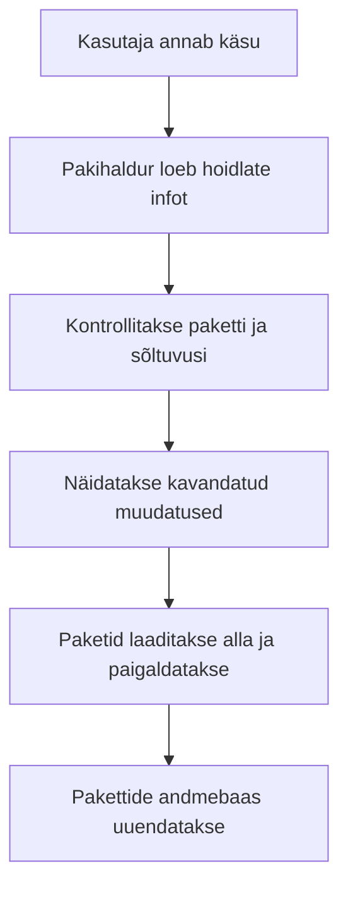

icon:material/package-variant-closed

# Linuxi tarkvarahalduse ülevaade

Linuxis paigaldatakse, uuendatakse ja eemaldatakse tarkvara tavaliselt **pakihalduri** abil. Pakihaldur peab arvestust paigaldatud tarkvara üle, laadib paketid hoidlatest ning aitab lahendada sõltuvusi.

See materjal selgitab ühist loogikat. Praktilised käsud on eraldi materjalides:

- [Tarkvarahaldus Debiani laadsetes distributsioonides](tarkvarahaldus-debiani-laadsetes.md)
- [Tarkvarahaldus Red Hati laadsetes distributsioonides](tarkvarahaldus-red-hati-laadsetes.md)

## Õpieesmärgid

Pärast materjali läbimist oskad:

- selgitada paketi, pakihalduri, hoidla ja sõltuvuse tähendust;
- tuvastada Linuxi distributsiooni ning valida sobiva pakihalduri;
- kirjeldada paketi otsimise, paigaldamise, uuendamise ja eemaldamise töövoogu;
- võrrelda APT-i ja DNF-i põhilisi tegevusi;
- valida tarkvara jaoks usaldusväärse allika;
- kontrollida, kas tehtud muudatus andis soovitud tulemuse.

---

## Miks kasutada pakihaldurit?

Programmi võib veebist alla laadida ja failid käsitsi süsteemi kopeerida, kuid siis on keeruline teada:

- millised failid süsteemi lisati;
- milliseid teisi pakette programm vajab;
- kas saadaval on turvauuendusi;
- kuidas programm hiljem korrektselt eemaldada.

Pakihaldur teeb suure osa sellest tööst automaatselt.



!!! tip
    Eelista distributsiooni ametlikku hoidlat. Nii saab pakihaldur tarkvara koos ülejäänud süsteemiga uuendada ja hiljem korrektselt eemaldada.

## Põhimõisted

| Mõiste | Selgitus |
|---|---|
| **tarkvarapakett** (*software package*) | fail või failikogum, mis sisaldab programmi, metaandmeid ja paigaldusjuhiseid |
| **pakihaldur** (*package manager*) | vahend pakettide otsimiseks, paigaldamiseks, uuendamiseks ja eemaldamiseks |
| **hoidla** (*repository*) | kohalikus seadmes või võrgus asuv korrastatud tarkvarapakettide kogu |
| **pakettide nimekiri** (*package index*) | kohalik info hoidlas saadaolevate pakettide, versioonide ja sõltuvuste kohta |
| **sõltuvus** (*dependency*) | teine pakett, mida programm paigaldamiseks või töötamiseks vajab |
| **konflikt** (*conflict*) | olukord, kus kahte paketti ei saa korraga sobivalt paigaldada |
| **versioon** (*version*) | tarkvara väljalaske tunnus |
| **arhitektuur** (*architecture*) | protsessori või süsteemi tüüp, näiteks `amd64` või `arm64` |
| **pakihaldustoiming** (*package transaction*) | ühe käsuga kavandatud paigaldamiste, uuendamiste ja eemaldamiste terviklik kogum |

### Sõltuvuse näide

Kui programm vajab töötamiseks teeki, mida süsteemis veel pole, võib pakihaldur paigaldada korraga:

```text
soovitud programm + vajalik teek + teegi sõltuvused
```

Seepärast tuleb enne kinnitamist vaadata, milliseid pakette pakihaldur kavatseb paigaldada või eemaldada.

## Kuidas Linuxis tarkvara levitatakse?

| Vorm | Näide | Iseloomustus |
|---|---|---|
| distributsiooni pakett | `.deb`, `.rpm` | mõeldud vastava distributsiooni pakihaldurile |
| universaalne rakenduspakett | Flatpak, Snap | kasutab rakenduse jaoks osaliselt eraldatud keskkonda |
| iseseisev rakendusfail | AppImage | rakendus käivitatakse tavaliselt ühest failist |
| lähtekood | arhiiv või Git-projekt | programm tuleb ise kompileerida ja paigaldada |
| keele paketihaldur | `pip`, `npm`, `cargo` | haldab peamiselt vastava keele teeke ja tööriistu |

Süsteemi põhikomponente, teeke ja teenuseid halda üldjuhul distributsiooni pakihalduriga.

!!! warning "Veebist laaditud fail ei ole automaatselt turvaline"
    Faililaiend `.deb`, `.rpm` või `.AppImage` ei tõesta faili usaldusväärsust. Kontrolli allikat ja eelista ametlikku hoidlat või tarkvara tootja ametlikku juhendit.

## Pakihalduse vahendid

| Distributsioonipere | Paketivorming | Madalama taseme vahend | Tavakasutaja pakihaldur |
|---|---|---|---|
| Debian, Ubuntu | `.deb` | `dpkg` | `apt` |
| AlmaLinux, Rocky Linux, RHEL, Fedora | `.rpm` | `rpm` | `dnf` |
| openSUSE | `.rpm` | `rpm` | `zypper` |
| Arch Linux | `.pkg.tar.zst` | – | `pacman` |

Madalama taseme vahend töötab üksiku paketifaili ja kohaliku paketiandmebaasiga. Kõrgema taseme pakihaldur kasutab hoidlaid ning lahendab tavaliselt ka sõltuvused.

## Distributsiooni tuvastamine

```bash
cat /etc/os-release
```

Pakihalduri olemasolu saad kontrollida nii:

```bash
command -v apt
command -v dnf
```

!!! warning
    Ära vali käsku ainult internetist leitud näite järgi. Esmalt tee kindlaks distributsioon ja selle versioon.

## APT-i ja DNF-i kiirvõrdlus

| Tegevus | Debian: APT | Red Hati laadne süsteem: DNF |
|---|---|---|
| vaata hoidlaid | vaata APT-i lähtefaile | `dnf repolist` |
| värskenda metaandmeid | `sudo apt update` | `sudo dnf makecache` |
| vaata uuendusi | `apt list --upgradable` | `dnf check-update` |
| otsi paketti | `apt search nimi` | `dnf search nimi` |
| näita infot | `apt show nimi` | `dnf info nimi` |
| paigalduse eelvaade | `apt install -s nimi` | `dnf install nimi --assumeno` |
| paigalda | `sudo apt install nimi` | `sudo dnf install nimi` |
| uuenda süsteemi | `sudo apt update` ja `sudo apt upgrade` | `sudo dnf upgrade --refresh` |
| eemalda | `sudo apt remove nimi` | `sudo dnf remove nimi` |
| kohalik pakett | `sudo apt install ./fail.deb` | `sudo dnf install ./fail.rpm` |

Täpsed selgitused ja erandid on distributsioonipõhistes failides.

## Tarkvaraallika turvalisus

Enne uue hoidla või veebist laaditud paketi kasutamist kontrolli:

1. kas allikas on distributsiooni või tootja ametlik veebileht;
2. kas juhend sobib sinu distributsiooni versiooniga;
3. kas ühendus kasutab HTTPS-i;
4. kas GPG-võtme sõrmejälg või kontrollsumma vastab ametlikule väärtusele;
5. milliseid pakette ja seadistusi käsk muudab.

!!! danger
    Ära käivita tundmatult veebilehelt kopeeritud käsku kujul `curl ... | sudo bash`. See annab allalaaditud skriptile kohe administraatori õigused.

### GPG-võtme sõrmejälg ja kontrollsumma

**GPG-võtme sõrmejälg** (*GPG key fingerprint*) on avaliku võtme kordumatu tunnus. Pakihaldur kasutab GPG-võtit kontrollimaks, kas hoidla andmed või tarkvarapakett pärinevad väidetud avaldajalt ja neid pole vahepeal muudetud.

Võtme sõrmejälje vaatamiseks:

```bash
gpg --show-keys --fingerprint hoidla-voti.gpg
```

Võrdle kuvatud sõrmejälge tarkvara tootja või distributsiooni **ametlikul veebilehel** avaldatud väärtusega. Kõik märgid peavad kattuma.

**Kontrollsumma** (*checksum*) on faili sisust arvutatud väärtus. Kui failis muutub kasvõi üks bitt, muutub tavaliselt ka kontrollsumma.

SHA-256 kontrollsumma arvutamiseks:

```bash
sha256sum programm.rpm
```

Sama käsk sobib ka teiste failide kontrollimiseks:

```bash
sha256sum programm.deb
```

Võrdle tulemust ametlikul veebilehel avaldatud SHA-256 väärtusega.


!!! warning "Hoiatus"
    Kui sõrmejälg või kontrollsumma ei kattu ametliku väärtusega, ära võtit ega faili kasuta. Laadi see uuesti alla usaldusväärsest allikast.


!!! note "Märkus"
    Kontrollsumma näitab, kas fail vastab avaldatud failile, kuid ei tõesta üksinda, et avaldaja on usaldusväärne. Seetõttu peab võrdlusväärtus pärinema tootja või distributsiooni ametlikust allikast. Ametlike hoidlate kasutamisel teeb pakihaldur allkirjade kontrolli tavaliselt automaatselt.


## Hea töövõte

> **Vaata → mõtle → simuleeri → tee → kontrolli.**

1. **Vaata:** tuvasta süsteem, uuri paketti ja selle päritolu.
2. **Mõtle:** kontrolli sõltuvusi, eemaldatavaid pakette ja kettaruumi vajadust.
3. **Simuleeri:** kasuta võimaluse korral APT-i `-s` või DNF-i `--assumeno` valikut.
4. **Tee:** käivita vajalik käsk ja loe enne kinnitamist kokkuvõtet.
5. **Kontrolli:** vaata paketi olekut ning testi programmi või teenust.

## Muud levitusviisid lühidalt

### Flatpak

**Flatpak** on distributsioonist suuresti sõltumatu rakenduste levitamise viis. Flatpaki rakendus kasutab oma sõltuvusi ja jagatud käituskeskkonda (*runtime*), mistõttu saab sama rakenduse paigaldada eri Linuxi distributsioonidesse.

Flatpaki kohtab peamiselt **graafiliste töölauarakenduste** puhul, näiteks Discordi, Spotify, GIMPi või mänguplatvormide paigaldamisel. Kõige levinum Flatpaki rakenduste hoidla on **Flathub**.

Flatpaki rakendused töötavad osaliselt eraldatud keskkonnas ehk **liivakastis** (*sandbox*). Rakendusele saab piirata näiteks juurdepääsu kasutaja failidele, seadmetele ja teistele süsteemi osadele.

Mõned käskude näited (kuigi graafilises keskkonnas pole neid alati vaja teada):

```bash
flatpak search gimp
flatpak install flathub org.gimp.GIMP
flatpak update
flatpak uninstall org.gimp.GIMP
```

### Snap

**Snap** on Canonicali loodud universaalne paketivorming ja tarkvara levitamise süsteem. Snap-pakett sisaldab rakendust ning suurt osa selle töötamiseks vajalikest sõltuvustest. Snap-rakendusi haldab taustal töötav teenus **`snapd`**.

Snap-pakette kohtab kõige sagedamini **Ubuntu** süsteemides. Rakendusi hangitakse tavaliselt Canonicali hallatavast **Snap Store'ist**. Näiteks võib Ubuntu mõne töölauarakenduse, nagu Firefoxi, paigaldada vaikimisi Snap-paketina.

Mõned käskude näited:

```bash
snap find gimp
sudo snap install gimp
sudo snap refresh
sudo snap remove gimp
```

Snap-rakendused töötavad samuti tavapakettidest eraldatumalt ning nende uuendamine toimub tavaliselt automaatselt. Debianis ja AlmaLinuxis ei pruugi Snap vaikimisi paigaldatud olla.

!!! note
    Flatpak ja Snap ei asenda täielikult distributsiooni pakihaldurit. Süsteemi põhikomponente, teeke ja serveriteenuseid hallatakse tavaliselt endiselt APT-i või DNF-iga. Flatpaki ja Snapi kasutatakse peamiselt kasutajarakenduste paigaldamiseks.

### Teised võimalused

- **AppImage** on tavaliselt üks käivitatav fail; süsteemi pakihaldur seda enamasti ei uuenda.
- **Lähtekoodist paigaldamine** annab rohkem kontrolli, kuid uuendamine ja eemaldamine jäävad sageli administraatori vastutuseks.
- **`pip`, `npm` ja teised keele pakihaldurid** ei ole operatsioonisüsteemi pakihalduri asendajad. Väldi süsteemsete teekide juhuslikku ülekirjutamist.

## Kontrollküsimused

1. Miks on pakihalduri kasutamine turvalisem ja mugavam kui failide käsitsi kopeerimine?
2. Mis vahe on paketil, pakihalduril ja hoidlal?
3. Mis on sõltuvus?
4. Kuidas tuvastad kasutatava distributsiooni?
5. Mis vahe on kõrgema ja madalama taseme pakihaldusvahendil?
6. Miks tuleb enne kinnitamist kavandatud muudatused üle vaadata?
7. Miks ei tõesta faililaiend paketi turvalisust?
8. Kirjelda head viieosalist tööjärjekorda.

## Allikad ja lisalugemine

- [Debian Reference: Debiani pakihaldus](https://www.debian.org/doc/manuals/reference/ch02.en.html){ target="_blank" rel="noopener" }
- [Debian Manpages: APT-i turvamehhanismid](https://manpages.debian.org/stable/apt/apt-secure.8.en.html){ target="_blank" rel="noopener" }
- [Red Hat: tarkvara haldamine DNF-iga](https://docs.redhat.com/en/documentation/red_hat_enterprise_linux/9/htmlsingle/managing_software_with_the_dnf_tool/){ target="_blank" rel="noopener" }

- [AppImage'i tutvustus](https://docs.appimage.org/introduction/index.html){ target="_blank" rel="noopener" }

- [GnuPG: GPG-võtme sõrmejälg](https://wiki.gnupg.org/Fingerprint){ target="_blank" rel="noopener" }
- [GNU Coreutils: SHA-256 kontrollsumma](https://www.gnu.org/software/coreutils/manual/html_node/sha2-utilities.html){ target="_blank" rel="noopener" }
- [Flatpaki ametlik dokumentatsioon](https://docs.flatpak.org/en/latest/)
- [Snapi ametlik dokumentatsioon](https://snapcraft.io/docs/)