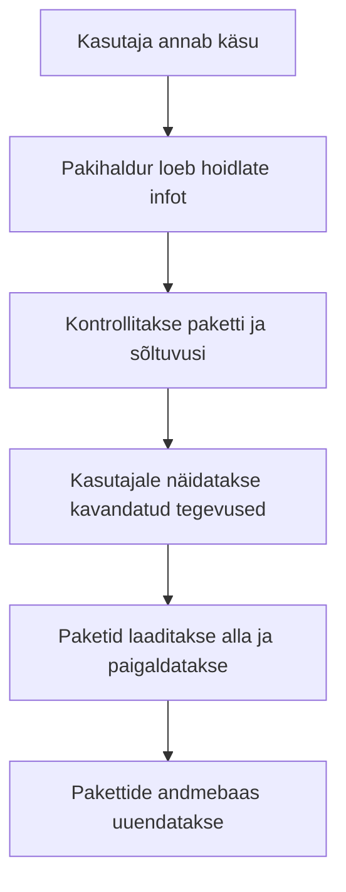

icon:material/debian

# Linuxi tarkvarahaldus

Linuxis paigaldatakse, uuendatakse ja eemaldatakse tarkvara tavaliselt **pakihalduri** abil. Pakihaldur peab arvestust paigaldatud tarkvara üle, laadib paketid hoidlatest ning aitab lahendada nende sõltuvusi.

Selles materjalis keskendume Debiani ja Ubuntu süsteemides kasutatavale APT-ile. Teiste levinud Linuxi distributsioonide käsud on toodud võrdluseks.

## Õpieesmärgid

Pärast materjali läbimist oskad:

- selgitada paketi, pakihalduri, hoidla ja sõltuvuse tähendust;
- tuvastada Linuxi distributsiooni ning valida sobiva pakihalduri;
- otsida pakette ja vaadata nende infot;
- paigaldada, uuendada ja eemaldada tarkvara;
- eristada käske `apt update`, `apt upgrade` ja `apt full-upgrade`;
- selgitada käskude `remove`, `purge`, `autoremove` ja `clean` erinevust;
- paigaldada kohalikku `.deb`-paketti;
- kontrollida pakihalduse tulemust ja lahendada lihtsamaid probleeme;
- kirjeldada kolmanda osapoole hoidlate peamisi turvariske;
- võrrelda APT-i teiste levinud pakihalduritega.

---

## Miks kasutada pakihaldurit?

Programmi võiks põhimõtteliselt veebist alla laadida, failid käsitsi süsteemi kopeerida ja vajalikud lisad eraldi paigaldada. Sellisel juhul on aga keeruline teada:

- millised failid programm süsteemi lisas;
- milliseid teisi programme või teeke see vajab;
- kas programmile on saadaval turvauuendusi;
- kuidas programm hiljem korrektselt eemaldada.

Pakihaldur teeb suure osa sellest tööst automaatselt.



!!! tip
    Tarkvara tasub eelistatult paigaldada distributsiooni ametlikust hoidlast. Nii saab pakihaldur tarkvara koos ülejäänud süsteemiga uuendada ja hiljem korrektselt eemaldada.

---

## Põhimõisted

| Mõiste | Selgitus |
|---|---|
| **tarkvarapakett** | fail või failikogum, mis sisaldab programmi, metaandmeid ja paigaldusjuhiseid |
| **pakihaldur** | vahend pakettide otsimiseks, paigaldamiseks, uuendamiseks ja eemaldamiseks |
| **hoidla** | serveris asuv korrastatud tarkvarapakettide kogu |
| **pakettide nimekiri** | kohalik info hoidlas saadaolevate pakettide ja versioonide kohta |
| **sõltuvus** | teine pakett, mida programm töötamiseks vajab |
| **konflikt** | olukord, kus kahte paketti ei saa korraga sobivalt paigaldada |
| **versioon** | tarkvara väljalaske tunnus |
| **arhitektuur** | protsessori või süsteemi tüüp, mille jaoks pakett on loodud, näiteks `amd64` või `arm64` |
| **tehing** | ühe pakihalduskäsuga kavandatud paigaldamiste, uuendamiste ja eemaldamiste kogum |

### Sõltuvuse näide

Kui programm vajab töötamiseks teeki, mida süsteemis veel pole, võib pakihaldur paigaldada korraga:

```text
soovitud programm + vajalik teek + teegi sõltuvused
```

Enne muudatuse kinnitamist tuleb alati vaadata, milliseid pakette pakihaldur kavatseb paigaldada või eemaldada.

---

## Kuidas Linuxis tarkvara levitatakse?

| Vorm | Näide | Iseloomustus |
|---|---|---|
| distributsiooni pakett | `.deb`, `.rpm` | mõeldud vastava distributsiooni pakihaldurile |
| universaalne rakenduspakett | Flatpak, Snap | sisaldab või kasutab rakenduse jaoks vajalikku eraldi keskkonda |
| iseseisev rakendusfail | AppImage | rakendus käivitatakse tavaliselt ühest failist |
| lähtekood | lähtekoodiarhiiv või Git-projekt | programm tuleb ise kompileerida ja paigaldada |
| skript või vahekood | Python, PHP, Java `.jar` | käivitamiseks on vaja sobivat interpretaatorit või käituskeskkonda |

Süsteemi põhikomponente, teeke ja teenuseid on üldjuhul kõige mõistlikum hallata distributsiooni enda pakihalduriga.

!!! warning "Veebist alla laaditud fail ei ole automaatselt turvaline"
    Faililaiend `.deb`, `.rpm` või `.AppImage` ei tõesta faili usaldusväärsust. Kontrolli alati allikat ja eelista ametlikku hoidlat või tarkvara tootja ametlikku juhendit.

---

## Pakihalduse vahendid

Linuxi distributsioonides kasutatakse eri paketivorminguid ja pakihaldureid.

| Distributsioonipere | Paketivorming | Madalama taseme vahend | Tavakasutajale mõeldud pakihaldur |
|---|---|---|---|
| Debian, Ubuntu | `.deb` | `dpkg` | `apt` |
| Fedora, RHEL | `.rpm` | `rpm` | `dnf` |
| openSUSE | `.rpm` | `rpm` | `zypper` |
| Arch Linux | `.pkg.tar.zst` | - | `pacman` |

Madalama taseme vahend oskab töötada üksiku paketifailiga, kuid ei pruugi ise kõiki sõltuvusi hoidlatest lahendada. Kõrgema taseme pakihaldur kasutab hoidlaid ja lahendab tavaliselt ka sõltuvused.

!!! note "APT ja `dpkg`"
    APT kasutab Debiani-põhises süsteemis taustal `dpkg`-d. Tavaliseks paigaldamiseks eelista APT-i ning kasuta `dpkg`-d paketiandmebaasi või üksiku `.deb`-faili täpsemaks uurimiseks.

---

## Distributsiooni ja pakihalduri tuvastamine

Süsteemi info vaatamiseks:

```bash
cat /etc/os-release
```

Näiteks võivad väljundis olla väljad:

```text
NAME="Debian GNU/Linux"
ID=debian
VERSION_CODENAME=trixie
```

Kontrolli, milline pakihaldur on süsteemis olemas:

```bash
command -v apt
command -v dnf
command -v zypper
command -v pacman
```

!!! warning
    Ära vali käsku ainult internetist leitud näite järgi. Esmalt tee kindlaks, millist distributsiooni ja versiooni kasutad.

---

## Tarkvarahoidlad

Hoidla sisaldab pakette ja nende metaandmeid, näiteks:

- paketi nime ja kirjeldust;
- saadaolevat versiooni;
- arhitektuuri;
- sõltuvusi;
- kontrollsummasid ja allkirjastatud hoidlaandmeid.

APT-i hoidlate seadistus võib paikneda:

```text
/etc/apt/sources.list
/etc/apt/sources.list.d/*.list
/etc/apt/sources.list.d/*.sources
```

`.list` on vanem üherealine vorming. `.sources` kasutab uuemat deb822-vormingut, milles hoidla omadused paiknevad eraldi väljadel.

### Mida teeb `apt update`?

```bash
sudo apt update
```

Käsk laadib seadistatud hoidlatest alla värske info pakettide ja versioonide kohta. See **ei uuenda veel paigaldatud programme**.

```text
apt update  → uuendab pakettide nimekirja
apt upgrade → uuendab paigaldatud pakette
```

!!! tip
    Käivita `apt update` enne pakettide otsimist, paigaldamist või süsteemi uuendamist, et pakihaldur kasutaks värsket hoidlate infot.

---

## Paketi otsimine

Paketi nime või kirjelduse järgi otsimiseks:

```bash
apt search otsingusõna
```

Näiteks:

```bash
apt search monitoring
apt search nginx
```

Pika väljundi saab avada programmi `less` abil:

```bash
apt search monitoring | less
```

Programmist `less` väljumiseks vajuta `q`.

### Otsimine eri distributsioonides

=== "Debian/Ubuntu"

    ```bash
    apt search nginx
    ```

=== "Fedora/RHEL"

    ```bash
    dnf search nginx
    ```

=== "openSUSE"

    ```bash
    zypper search nginx
    ```

=== "Arch Linux"

    ```bash
    pacman -Ss nginx
    ```

---

## Paketi info vaatamine

Enne paigaldamist vaata paketi kirjeldust, versiooni, mahtu ja sõltuvusi:

```bash
apt show pakinimi
```

Näiteks:

```bash
apt show nginx
```

Paigaldatud ja hoidlas saadaoleva versiooni võrdlemiseks:

```bash
apt policy nginx
```

Paketi sõltuvuste vaatamiseks:

```bash
apt depends nginx
```

Kõigi paigaldatud pakettide nimekiri võib olla väga pikk:

```bash
apt list --installed
```

Ühe paketi paigaldatuse kontrollimiseks sobib näiteks:

```bash
dpkg -s nginx
```

---

## Tarkvara paigaldamine

Paketi paigaldamiseks hoidlast:

```bash
sudo apt install pakinimi
```

Näiteks:

```bash
sudo apt install nginx
```

Pakihaldur näitab enne kinnitamist:

- millised paketid paigaldatakse;
- millised sõltuvused lisatakse;
- kui palju andmeid laaditakse alla;
- kui palju kettaruumi kasutatakse.

### Paigalduse simuleerimine

Simuleerimine näitab kavandatud muudatusi, kuid ei tee neid:

```bash
apt install --simulate nginx
```

Lühike variant on:

```bash
apt install -s nginx
```

!!! tip "Hea töövõte"
    Kui käsk võib muuta palju pakette, käivita see esmalt võtmega `--simulate` või `-s`. Loe väljund läbi ja alles seejärel tee tegelik muudatus.

### Paigaldamine eri distributsioonides

=== "Debian/Ubuntu"

    ```bash
    sudo apt install nginx
    ```

=== "Fedora/RHEL"

    ```bash
    sudo dnf install nginx
    ```

=== "openSUSE"

    ```bash
    sudo zypper install nginx
    ```

=== "Arch Linux"

    ```bash
    sudo pacman -S nginx
    ```

!!! note
    Sama programm ei pruugi kõigis distributsioonides olla sama paketinimega ega sama versiooniga.

---

## Paigalduse kontrollimine

Käsu edukas lõppemine ei tähenda alati, et teenus või rakendus töötab täpselt soovitud viisil. Kontrollime vähemalt kolme asja.

### 1. Kas pakett on paigaldatud?

```bash
dpkg -s nginx
```

### 2. Kas käivitatav fail on leitav?

```bash
command -v nginx
```

### 3. Kas teenus töötab?

Kui paketiga paigaldati systemd teenus:

```bash
systemctl status nginx
```

!!! note
    Kõik paketid ei sisalda käivitatavat programmi ega teenust. Mõni pakett sisaldab näiteks teeki, dokumentatsiooni või teise paketi jaoks vajalikke faile.

---

## Tarkvara uuendamine

### Uuendatavate pakettide vaatamine

```bash
sudo apt update
apt list --upgradable
```

### `apt upgrade`

```bash
sudo apt upgrade
```

See uuendab paigaldatud pakette. Vajaduse korral võib APT paigaldada uusi sõltuvusi, kuid `apt upgrade` ei eemalda uuenduse tegemiseks olemasolevaid pakette. Kui uuendus vajaks eemaldamist, jäetakse vastav pakett ootele.

### `apt full-upgrade`

```bash
sudo apt full-upgrade
```

See lahendab keerukamaid sõltuvuste muudatusi ja võib süsteemi terviklikuks uuendamiseks mõne paigaldatud paketi eemaldada.

!!! warning
    Loe enne kinnitamist eemaldatavate pakettide nimekiri hoolikalt läbi. Tööjaamas või serveris võib ootamatu eemaldamine mõjutada teisi programme või teenuseid.

### Ühe paketi uuendamine

```bash
sudo apt install --only-upgrade nginx
```

### Uuendamine eri distributsioonides

=== "Debian/Ubuntu"

    ```bash
    sudo apt update
    sudo apt upgrade
    ```

=== "Fedora/RHEL"

    ```bash
    sudo dnf upgrade --refresh
    ```

=== "openSUSE"

    ```bash
    sudo zypper refresh
    sudo zypper update
    ```

=== "Arch Linux"

    ```bash
    sudo pacman -Syu
    ```

!!! note "Kas pärast uuendamist on vaja taaskäivitada?"
    Kõik uuendused ei vaja arvuti taaskäivitamist. Kerneli, oluliste süsteemiteekide või mõne töötava teenuse uuendamisel võib olla vaja taaskäivitada teenus või kogu süsteem. Debianis ja Ubuntus võib kontrollida faili `/var/run/reboot-required` olemasolu.

---

## Tarkvara eemaldamine

### `remove` - eemalda programm

```bash
sudo apt remove pakinimi
```

Paketi failid eemaldatakse, kuid süsteemsed konfiguratsioonifailid jäetakse tavaliselt alles. See teeb programmi hilisema uuesti paigaldamise lihtsamaks.

### `purge` - eemalda ka süsteemne konfiguratsioon

```bash
sudo apt purge pakinimi
```

`purge` eemaldab lisaks paketi hallatud süsteemsed konfiguratsioonifailid.

!!! note
    `purge` ei kustuta tavaliselt kasutaja kodukataloogis olevaid isiklikke seadistusi ega kasutaja loodud andmeid.

### `autoremove` - eemalda mittevajalikud sõltuvused

```bash
sudo apt autoremove
```

See eemaldab automaatselt sõltuvustena paigaldatud paketid, mida ükski allesjäänud pakett enam ei vaja.

!!! warning
    Kontrolli alati eemaldatavate pakettide nimekirja. Ära kinnita tegevust ainult harjumusest.

### `clean` ja `autoclean` - puhasta allalaaditud pakette

```bash
sudo apt clean
sudo apt autoclean
```

| Käsk | Tulemus |
|---|---|
| `apt clean` | eemaldab APT-i vahemälust allalaaditud paketifailid |
| `apt autoclean` | eemaldab vahemälust paketifailid, mida hoidlast enam tavaliselt alla laadida ei saa |

`autoremove` ja `clean` ei tee sama asja: esimene eemaldab paigaldatud sõltuvuspakette, teine allalaaditud paketifailide koopiaid.

### Eemaldamine eri distributsioonides

=== "Debian/Ubuntu"

    ```bash
    sudo apt remove nginx
    ```

=== "Fedora/RHEL"

    ```bash
    sudo dnf remove nginx
    ```

=== "openSUSE"

    ```bash
    sudo zypper remove nginx
    ```

=== "Arch Linux"

    ```bash
    sudo pacman -R nginx
    ```

---

## Kohaliku `.deb`-paketi paigaldamine

Kui paketti ametlikus hoidlas pole, võib tarkvara tootja pakkuda allalaadimiseks `.deb`-faili.

Soovitatav paigaldusviis on:

```bash
sudo apt install ./tarkvara.deb
```

Punkt ja kaldkriips `./` näitavad, et tegemist on praeguses kataloogis oleva failiga, mitte hoidlast otsitava paketinimega.

Teises kataloogis oleva faili puhul kasuta selle teed:

```bash
sudo apt install /home/student/Allalaadimised/tarkvara.deb
```

APT saab vajaduse korral paigaldada hoidlatest ka kohaliku paketi sõltuvused.

### Paigaldamine `dpkg` abil

```bash
sudo dpkg -i tarkvara.deb
```

`dpkg` paigaldab paketifaili, kuid ei laadi puuduvaid sõltuvusi ise hoidlast alla. Pooleli jäänud seadistuse korral võivad aidata:

```bash
sudo apt --fix-broken install
sudo dpkg --configure -a
```

!!! warning
    Ära kasuta paranduskäske pimesi. Loe enne kinnitamist, milliseid pakette APT kavatseb paigaldada või eemaldada.

---

## Kasulikud `dpkg` käsud

| Käsk | Eesmärk |
|---|---|
| `dpkg -s pakinimi` | näitab paigaldatud paketi olekut ja infot |
| `dpkg -l` | loetleb pakettide andmebaasi kirjed |
| `dpkg -L pakinimi` | näitab paketiga süsteemi paigaldatud faile |
| `dpkg -S /faili/tee` | otsib, millisele paigaldatud paketile fail kuulub |
| `dpkg -c fail.deb` | näitab kohaliku `.deb`-faili sisu |
| `dpkg -i fail.deb` | paigaldab kohaliku paketifaili |
| `dpkg -r pakinimi` | eemaldab paketi, kuid jätab konfiguratsiooni alles |
| `dpkg -P pakinimi` | eemaldab paketi koos süsteemse konfiguratsiooniga |

Näiteks saab uurida, millise paketiga paigaldati käsk `mkdir`:

```bash
dpkg -S /usr/bin/mkdir
```

Paigaldatud paketi seadistusküsimuste uuesti esitamiseks saab mõne paketi puhul kasutada:

```bash
sudo dpkg-reconfigure tzdata
```

Kõik paketid ei paku `dpkg-reconfigure` abil muudetavaid valikuid.

---

## APT, `apt-get` ja skriptid

Käsud `apt` ja `apt-get` kasutavad sama APT-i pakihaldussüsteemi, kuid nende kasutuseesmärk on veidi erinev.

| Vahend | Sobiv kasutus |
|---|---|
| `apt` | inimese interaktiivne töö terminalis |
| `apt-get` | skriptid ja automatiseerimine, kus on oluline stabiilsem käsureakäitumine |
| `apt-cache` | paketiandmete täpsem pärimine, kuigi tavatoiminguteks piisab sageli `apt`-ist |

Algkursusel kasutame terminalis eelkõige käsku `apt`.

!!! warning "Ära lisa `-y` võtit harjumusest"
    Võti `-y` vastab kinnitusküsimustele automaatselt ja võib peita olulise võimaluse muudatused enne tegemist üle vaadata. Interaktiivses õppetöös loe kavandatud tegevused ise läbi.

---

## Hoidlate ja pakettide turvalisus

APT kontrollib hoidla allkirjastatud metaandmeid. See aitab tuvastada, kas hoidla info on teel muudetud ja kas see pärineb usaldatud hoidla haldajalt.

See ei tähenda, et iga allkirjastatud hoidla oleks automaatselt hea valik. Hoidla lisamisega annad selle haldajale võimaluse pakkuda sinu süsteemi paigaldatavat tarkvara ja uuendusi.

### Kolmanda osapoole hoidla lisamisel

1. kontrolli, et juhend pärineb tarkvara tootja ametlikult veebilehelt;
2. vaata, milline hoidla ja võti süsteemi lisatakse;
3. eelista võtme sidumist konkreetse hoidlaga välja `Signed-By` abil;
4. ära keela allkirjakontrolli lihtsalt veateatest möödumiseks;
5. eemalda hoidla, kui sa seda enam ei vaja.

Kohalikke võtmeid hoitakse tänapäevases APT-i seadistuses tavaliselt kataloogis:

```text
/etc/apt/keyrings/
```

!!! danger
    Ära käivita tundmatult veebilehelt kopeeritud käsku kujul `curl ... | sudo bash`. Selline käsk laadib internetist skripti ja annab sellele kohe administraatori õigused, ilma et jõuaksid sisu üle vaadata.

---

## Flatpak, Snap ja AppImage

Need vormingud võimaldavad levitada rakendusi distributsiooni tavapakettidest erineval viisil.

| Omadus | Flatpak | Snap | AppImage |
|---|---|---|---|
| põhiline kasutus | eelkõige töölauarakendused | töölaua- ja serverirakendused | iseseisev rakendusfail |
| tarkvara allikas | Flatpaki hoidla, sageli Flathub | Snapi pood | faili pakkuv veebileht |
| sõltuvused | kasutab käituskeskkondi ja rakendusega kaasas olevaid teeke | pakett sisaldab vajalikke komponente | vajalikud komponendid on enamasti failis kaasas |
| isoleerimine | kasutab liivakasti ja õigusi | kasutab piirangumudeleid | ei tähenda iseenesest liivakasti |
| uuendamine | `flatpak update` | tavaliselt automaatne | sõltub rakendusest või tuleb uus fail alla laadida |

Flatpaki põhinäited:

```bash
flatpak search gimp
flatpak install flathub org.gimp.GIMP
flatpak update
flatpak uninstall org.gimp.GIMP
```

Snapi põhinäide:

```bash
sudo snap install pakinimi
```

AppImage-failile võib olla vaja anda käivitusõigus:

```bash
chmod u+x Rakendus.AppImage
./Rakendus.AppImage
```

!!! note
    Flatpak, Snap ja AppImage ei asenda täielikult distributsiooni pakihaldurit. Kerneli, süsteemiteekide ja põhiteenuste haldamiseks kasutatakse endiselt APT-i, DNF-i või muud süsteemi pakihaldurit.

---

## Lähtekoodist ja keele pakihalduriga paigaldamine

Mõnda tarkvara levitatakse lähtekoodina või programmeerimiskeele pakihalduri kaudu, näiteks `pip`, `npm` või `cargo`.

Selline tarkvara ei pruugi ilmuda APT-i pakettide nimekirjas ning APT ei pruugi osata seda uuendada ega eemaldada.

!!! warning
    Väldi käsku `sudo pip install ...` süsteemi Pythoni keskkonnas. Python-projekti sõltuvused paigaldatakse tavaliselt virtuaalkeskkonda. Süsteemse programmi puhul eelista distributsiooni paketti, kui see on olemas.

Lähtekoodist paigaldamine on põhjendatud siis, kui tead:

- miks hoidlas olev pakett ei sobi;
- milliseid kompileerimisvahendeid ja sõltuvusi vajad;
- kuidas programm hiljem uuendada ning eemaldada.

---

## Automaatsed turvauuendused

Tööjaama turvalisuse jaoks on oluline, et turvauuendused ei jääks pikaks ajaks paigaldamata. Debiani-põhistes süsteemides saab automaatseks uuendamiseks kasutada paketti `unattended-upgrades`.

```bash
sudo apt install unattended-upgrades
sudo dpkg-reconfigure -plow unattended-upgrades
```

Automaatne uuendamine ei vabasta administraatorit kontrollimisest. Jälgida tuleb:

- kas uuendamine õnnestus;
- kas teenus vajab taaskäivitamist;
- kas süsteem vajab reboot'i;
- kas uuendus tekitas rakendusega ühilduvusprobleeme.

!!! note
    Organisatsioonis määratakse automaatsete uuenduste reeglid keskse halduse ja muutmiskorra järgi. Ära muuda tööandja või kooli seadmete uuenduspoliitikat omal algatusel.

---

## Levinud probleemid

| Probleem või teade | Võimalik põhjus | Esimene kontroll |
|---|---|---|
| paketti ei leita | vale paketinimi või vananenud pakettide nimekiri | kontrolli nime ja käivita `sudo apt update` |
| hoidlat ei saa kasutada | võrgu-, DNS-, kella- või hoidla seadistuse probleem | loe `apt update` veateade lõpuni |
| sõltuvused on katki | pooleli jäänud paigaldus või sobimatud paketid | vaata `apt --fix-broken install` simulatsiooni |
| pakihaldur on lukustatud | teine APT-i või `dpkg` protsess töötab | oota ja kontrolli töötavaid protsesse |
| kettaruum on täis | pakettidele või ajutistele failidele pole ruumi | kasuta `df -h` ja kontrolli vahemälu |
| teenus ei käivitu | vigane seadistus või puuduv ressurss | kasuta `systemctl status teenus` ja `journalctl` |

### Pakihaldur on lukustatud

Kui näed teadet lukufaili kohta, võib taustal töötada teine uuendusprotsess.

```bash
ps aux | grep -E 'apt|dpkg'
```

!!! danger
    Ära kustuta APT-i või `dpkg` lukufaile lihtsalt veateatest vabanemiseks. Kõigepealt selgita välja, kas teine pakihaldusprotsess veel töötab. Lukufaili jõuga eemaldamine võib rikkuda poolelioleva tehingu.

### Pakihalduse ajaloo vaatamine

Debiani-põhistes süsteemides võivad aidata:

```text
/var/log/apt/history.log
/var/log/dpkg.log
```

Näiteks:

```bash
less /var/log/apt/history.log
```

---

## Distributsiooni versiooniuuendus

Pakettide tavapärane uuendamine ja kogu distributsiooni uuele versioonile viimine ei ole sama tegevus.

```text
apt upgrade        → uuendab praeguse väljalaske pakette
versiooniuuendus   → viib süsteemi järgmisele distributsiooni väljalaskele
```

Versiooniuuendus võib muuta hoidlaid, süsteemiteeke, konfiguratsiooni ja toetatud tarkvaraversioone. Enne seda tuleb:

1. lugeda konkreetse distributsiooni ametlikku uuendusjuhendit;
2. kontrollida varukoopiat;
3. kontrollida vaba kettaruumi;
4. uuendada praegune süsteem toetatud seisundisse;
5. planeerida võimalik katkestus ja taastamisvõimalus.

!!! warning
    Ära koosta versiooniuuenduse käske mõne teise distributsiooni või väljalaske juhendi põhjal. Järgi alati konkreetse tootja ja versiooni ametlikku juhendit.

---

## Hea töövõte: vaata → mõtle → simuleeri → tee → kontrolli

### 1. Vaata süsteemi ja paketi infot

```bash
cat /etc/os-release
apt policy pakinimi
apt show pakinimi
```

### 2. Mõtle läbi soovitud tulemus

- Kas pakett on vajalik?
- Kas allikas on usaldusväärne?
- Millised sõltuvused lisatakse?
- Kas mõni pakett eemaldatakse?

### 3. Simuleeri võimaluse korral

```bash
apt install --simulate pakinimi
apt remove --simulate pakinimi
apt full-upgrade --simulate
```

### 4. Tee muudatus

```bash
sudo apt install pakinimi
```

### 5. Kontrolli tulemust

```bash
dpkg -s pakinimi
command -v programmi_nimi
```

Teenuse puhul kontrolli lisaks:

```bash
systemctl status teenus
```

---

## Praktiline harjutus

Tee harjutus õppeotstarbelises virtuaalmasinas.

### 1. Tuvasta süsteem

```bash
cat /etc/os-release
command -v apt
```

Pane kirja distributsiooni nimi, versioon ja kasutatav pakihaldur.

### 2. Uuenda pakettide nimekiri

```bash
sudo apt update
```

Selgita ühe lausega, mida see käsk muutis ja mida see veel ei teinud.

### 3. Uuri paketti `cowsay`

```bash
apt search cowsay
apt show cowsay
apt policy cowsay
```

Pane kirja paketi kirjeldus, kandidaatversioon ja allalaadimise maht.

### 4. Simuleeri ja paigalda

```bash
apt install --simulate cowsay
sudo apt install cowsay
```

Kontrolli enne kinnitamist, millised paketid lisatakse.

### 5. Kontrolli ja kasuta

```bash
dpkg -s cowsay
/usr/games/cowsay "Pakihaldus töötab"
```

Kui käsk `cowsay` ei ole otsinguteel, selgita, miks täieliku tee kasutamine töötab.

### 6. Eemalda pakett

```bash
apt remove --simulate cowsay
sudo apt remove cowsay
```

Kontrolli pärast eemaldamist:

```bash
dpkg -s cowsay
```

Kirjelda, mille järgi saad aru, et pakett pole enam paigaldatud.

---

## Käskude kokkuvõte

### Debian ja Ubuntu

| Käsk | Eesmärk |
|---|---|
| `sudo apt update` | uuendab hoidlatest pakettide nimekirja |
| `apt search sõna` | otsib paketti nime ja kirjelduse järgi |
| `apt show pakinimi` | näitab paketi kirjeldust ja metaandmeid |
| `apt policy pakinimi` | näitab paigaldatud ja saadaolevaid versioone |
| `sudo apt install pakinimi` | paigaldab paketi |
| `apt install -s pakinimi` | simuleerib paigaldamist |
| `apt list --upgradable` | näitab uuendatavaid pakette |
| `sudo apt upgrade` | uuendab paigaldatud pakette neid eemaldamata |
| `sudo apt full-upgrade` | uuendab süsteemi ja võib vajadusel pakette eemaldada |
| `sudo apt remove pakinimi` | eemaldab paketi, jättes tavaliselt konfiguratsiooni alles |
| `sudo apt purge pakinimi` | eemaldab paketi ja selle süsteemse konfiguratsiooni |
| `sudo apt autoremove` | eemaldab mittevajalikud automaatsed sõltuvused |
| `sudo apt clean` | eemaldab allalaaditud paketifailid APT-i vahemälust |
| `sudo apt install ./fail.deb` | paigaldab kohaliku `.deb`-paketi koos sõltuvuste lahendamisega |
| `dpkg -s pakinimi` | kontrollib paigaldatud paketi olekut |
| `dpkg -L pakinimi` | näitab paketiga paigaldatud faile |
| `dpkg -S /faili/tee` | otsib faili omavat paketti |

### Distributsioonide kiirvõrdlus

| Tegevus | Debian/Ubuntu | Fedora/RHEL | openSUSE | Arch Linux |
|---|---|---|---|---|
| otsi | `apt search nimi` | `dnf search nimi` | `zypper search nimi` | `pacman -Ss nimi` |
| näita infot | `apt show nimi` | `dnf info nimi` | `zypper info nimi` | `pacman -Si nimi` |
| paigalda | `apt install nimi` | `dnf install nimi` | `zypper install nimi` | `pacman -S nimi` |
| uuenda süsteemi | `apt update` ja `apt upgrade` | `dnf upgrade --refresh` | `zypper refresh` ja `zypper update` | `pacman -Syu` |
| eemalda | `apt remove nimi` | `dnf remove nimi` | `zypper remove nimi` | `pacman -R nimi` |

---

## Kontrollküsimused

1. Mis on tarkvarapakett?
2. Mille poolest erinevad pakihaldur ja tarkvarahoidla?
3. Mis on paketi sõltuvus?
4. Kuidas saad teada, millist Linuxi distributsiooni kasutad?
5. Mis vahe on programmidel `apt` ja `dpkg`?
6. Mida teeb `apt update` ja mida see ei tee?
7. Millist infot näitavad `apt show` ja `apt policy`?
8. Miks on kasulik paigaldamist enne simuleerida?
9. Mis vahe on käskudel `apt upgrade` ja `apt full-upgrade`?
10. Mis vahe on käskudel `apt remove` ja `apt purge`?
11. Mis vahe on käskudel `apt autoremove` ja `apt clean`?
12. Miks kirjutatakse kohaliku paketi paigaldamisel `./tarkvara.deb`?
13. Miks on APT-iga kohaliku `.deb`-faili paigaldamine tavaliselt mugavam kui `dpkg -i`?
14. Kuidas kontrollid, kas pakett on paigaldatud?
15. Miks ei tohiks pakihalduri lukufaile kohe kustutada?
16. Milline risk kaasneb kolmanda osapoole hoidla lisamisega?
17. Mille poolest erinevad Flatpak ja AppImage distributsiooni tavapakettidest?
18. Miks ei ole pakettide uuendamine sama mis distributsiooni versiooniuuendus?
19. Milliseid kontrolle teed pärast teenust sisaldava paketi paigaldamist?
20. Kirjelda head tööjärjekorda enne ja pärast pakihalduskäsu käivitamist.

---

## Kokkuvõte

Linuxi pakihaldur aitab tarkvara otsida, paigaldada, uuendada ja eemaldada ning hoiab arvestust pakettide sõltuvuste üle. Debiani-põhistes süsteemides kasutatakse tavaliselt APT-i, mis töötab koos madalama taseme vahendiga `dpkg`.

Enne muudatust vaata paketi infot ja pakihalduri kavandatud tegevusi. Pärast muudatust kontrolli nii paketi olekut kui ka programmi või teenuse tegelikku toimimist.

Pea meeles:

> **Vaata → mõtle → simuleeri → tee → kontrolli.**

---

## Allikad ja lisalugemine

- Debian Manpages: [`apt(8)`](https://manpages.debian.org/stable/apt/apt.8.en.html){ target="_blank" rel="noopener" }
- Debian Manpages: [`sources.list(5)`](https://manpages.debian.org/stable/apt/sources.list.5.en.html){ target="_blank" rel="noopener" }
- Debian Manpages: [`apt-secure(8)`](https://manpages.debian.org/stable/apt/apt-secure.8.en.html){ target="_blank" rel="noopener" }
- Debian Administrator's Handbook: [APT](https://www.debian.org/doc/manuals/debian-handbook/apt.en.html){ target="_blank" rel="noopener" }
- DNF5 dokumentatsioon: [DNF5 Package Management Utility](https://dnf5.readthedocs.io/en/stable/dnf5.8.html){ target="_blank" rel="noopener" }
- Flatpaki dokumentatsioon: [Basic concepts](https://docs.flatpak.org/en/latest/basic-concepts.html){ target="_blank" rel="noopener" }
- Snapcrafti dokumentatsioon: [Snap documentation](https://snapcraft.io/docs){ target="_blank" rel="noopener" }
- AppImage'i dokumentatsioon: [AppImage documentation](https://docs.appimage.org/){ target="_blank" rel="noopener" }
