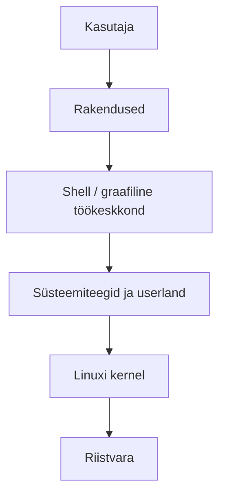
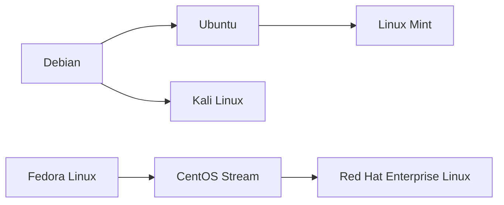
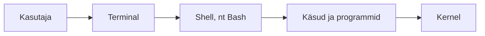
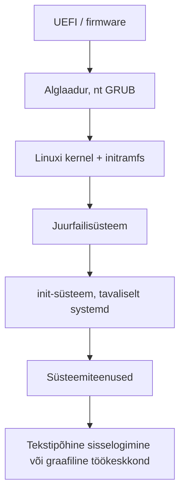
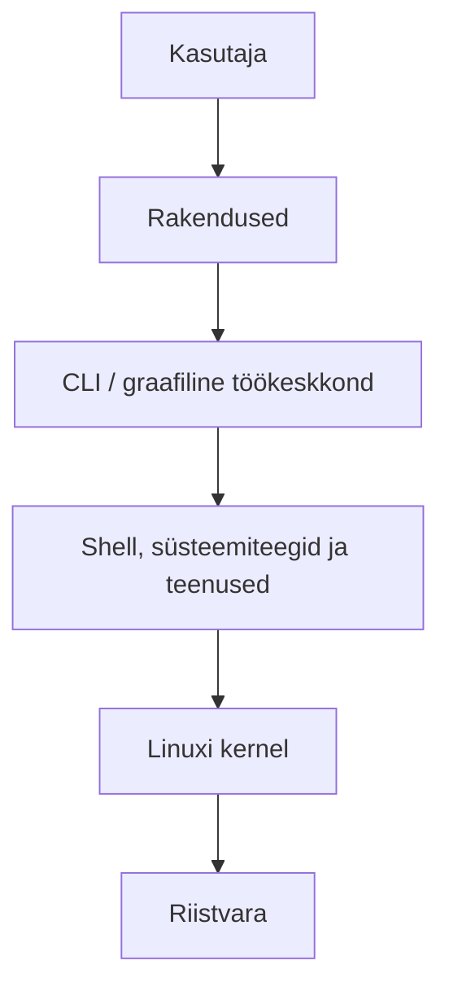

icon:material/debian

# Linuxi ülesehitus ja töökeskkond

Linux on tänapäeval kasutusel väga erinevates seadmetes: serverites, lauaarvutites, pilvekeskkondades, võrguseadmetes, nutiseadmetes, superarvutites ja paljudes manussüsteemides. Linuxi õppimisel on oluline eristada **Linuxi kernelit**, terviklikku **Linuxi distributsiooni** ning kasutajale nähtavat **töökeskkonda**.

Selles materjalis vaatleme Linuxi süsteemi üldist ülesehitust. Käsurea süntaksit ja baaskäske käsitletakse järgmises õppematerjalis.

## Õpieesmärgid

Pärast materjali läbimist oskad:

- selgitada, mis on Linux ja mis on Linuxi kernel;
- kirjeldada Linuxi distributsiooni põhikomponente;
- tuua näiteid Linuxi kasutusvaldkondadest;
- eristada levinumaid Linuxi distributsiooniperesid;
- selgitada CLI, terminali ja shelli erinevust;
- kirjeldada graafilise Linuxi töökeskkonna põhiosi;
- kirjeldada Linuxi käivitumise üldist loogikat.

---

## Mis on Linux?

Linux on **Unix-laadne operatsioonisüsteemi kernel**, mille arendamist alustas Linus Torvalds 1991. aastal. Kernel on operatsioonisüsteemi keskne osa, mis vahendab suhtlust riistvara ja programmide vahel.

Igapäevases kõnes kasutatakse sõna *Linux* sageli kogu operatsioonisüsteemi kohta. Täpsemalt koosneb kasutatav Linuxi süsteem Linuxi kernelist ja suurest hulgast muudest komponentidest.

!!! note "Linux ei tähenda ainult kernelit igapäevases kasutuses"
    Tehniliselt on **Linux kernel**. Kui räägitakse näiteks Debianist, Ubuntust või Fedorast kui „Linuxist“, mõeldakse tavaliselt terviklikku Linuxi distributsiooni.

Linuxi olulisemad omadused on näiteks:

- avatud lähtekood;
- mitme kasutaja tugi;
- multitasking ehk mitme protsessi samaaegne töö;
- tugev võrguvõimekus;
- mitme protsessoriarhitektuuri tugi;
- paindlikkus alates väikestest manussüsteemidest kuni suurte serverite ja superarvutiteni.

## Avatud lähtekood

Linuxi kernel on avatud lähtekoodiga. See tähendab, et lähtekood on kättesaadav ning vastavalt kasutatava litsentsi tingimustele saab seda uurida, muuta ja edasi levitada.

Avatud lähtekood võimaldab Linuxi arendamises osaleda väga suurel hulgal üksikisikutel, organisatsioonidel ja ettevõtetel. Linuxi ökosüsteemis teevad koostööd nii vabatahtlikud arendajad kui ka suured tehnoloogiaettevõtted.

!!! info "Vaba tarkvara ei tähenda tingimata tasuta tarkvara"
    Ingliskeelne *free software* viitab eelkõige kasutaja vabadustele, mitte hinnale. Avatud lähtekoodiga tarkvara võib olla tasuta kasutatav, kuid selle ümber võib pakkuda ka tasulisi teenuseid, tuge ja terviklahendusi.

---

## Kus Linuxit kasutatakse?

Linuxit leidub märksa rohkemates seadmetes kui ainult Linuxi töölauaarvutites.

Tüüpilised kasutusvaldkonnad on:

| Valdkond | Näited |
|---|---|
| Serverid | veebiserverid, andmebaasiserverid, failiserverid |
| Pilvandmetöötlus | virtuaalmasinad, pilveserverid, konteineriplatvormid |
| Võrguseadmed | ruuterid, tulemüürid, võrguseadmed |
| Nutiseadmed | Androidi seadmed kasutavad Linuxi kernelit |
| Manussüsteemid | telerid, digiboksid, tööstusseadmed, IoT-seadmed |
| Lauaarvutid | tööjaamad ja personaalarvutid |
| Teadusarvutus | superarvutid ja arvutusklastrid |

Linuxi tugevuseks on võimalus kohandada süsteem väga erineva riistvara ja kasutusotstarbe jaoks.

---

## Kernel ja distributsioon

Üksi Linuxi kernelist ei piisa tavapärase arvuti või serveri kasutamiseks. Kasutaja vajab lisaks programme, teeke, süsteemiteenuseid, paketihaldust ja muid tööriistu.

Sellist terviklikku süsteemi nimetatakse **Linuxi distributsiooniks** ehk lühidalt *distroks*.

Tüüpiline distributsioon sisaldab:

- Linuxi kernelit;
- süsteemiteeke ja kasutajaruumi programme (*userland*);
- shelli ja käsureatööriistu;
- paketihaldurit ja tarkvarahoidlaid;
- süsteemiteenuseid;
- konfiguratsioonivahendeid;
- soovi korral graafilist töökeskkonda;
- paigaldus- ja uuendustööriistu.

### Kernel

Kernel tegeleb muu hulgas:

- protsesside käivitamise ja ajastamisega;
- mälu haldamisega;
- seadmete ja draiveritega;
- failisüsteemidega;
- võrguliiklusega;
- kasutaja- ja protsessiõiguste jõustamisega;
- riistvararessursside jagamisega programmide vahel.

Rakendused ei suhtle tavaliselt riistvaraga otse, vaid kasutavad kerneli pakutavaid võimalusi.

### Userland

**Userland** ehk kasutajaruum tähendab programme ja teeke, mis töötavad väljaspool kernelit.

Userlandi kuuluvad näiteks:

- shellid;
- süsteemsed käsureaprogrammid;
- süsteemiteegid;
- paketihaldusvahendid;
- süsteemiteenused;
- graafilise keskkonna komponendid;
- kasutajarakendused.

!!! example "Näide"
    `bash`, tekstiredaktor `nano`, veebiserver Apache ja graafiline töölauakeskkond GNOME töötavad kasutajaruumis. Linuxi kernel ise on neist eraldi süsteemi keskne komponent.

---

## Linuxi distributsioonid

Linuxil ei ole ühte ainsat ametlikku tervikversiooni. Erinevad projektid ja ettevõtted kombineerivad Linuxi kerneli, kasutajaruumi tarkvara, paketihalduse ja muud komponendid distributsioonideks.

Distributsioonid võivad erineda näiteks järgmiste omaduste poolest:

- paketihaldus;
- tarkvaraversioonide värskus;
- väljalasketsükkel;
- vaikimisi seadistus;
- toetatud töölauakeskkond;
- sihtrühm;
- tehnilise toe mudel.

### Olulisemad distributsioonipered

| Distributsioon / perekond | Iseloomustus |
|---|---|
| **Debian** | kogukonnapõhine distributsioon, tuntud stabiilsuse ja suure paketivaliku poolest |
| **Ubuntu** | Debianil põhinev distributsioon, mida arendab ja toetab Canonical; levinud nii serverites kui töölaual |
| **Linux Mint** | peamiselt Ubuntul põhinev töölauale suunatud distributsioon; olemas on ka Debianil põhinev LMDE |
| **Fedora Linux** | kogukonnapõhine ja kiiresti arenev distributsioon, mis on tihedalt seotud Red Hati ökosüsteemiga |
| **Red Hat Enterprise Linux (RHEL)** | ettevõtetele suunatud kommertsdistributsioon pika toe ja ametliku tootjatoega |
| **CentOS Stream** | Fedora ja RHEL-i vahel paiknev pidevalt arenev distributsioon, mis näitab RHEL-i järgmise arendusastme suunda |
| **openSUSE** | kogukonnapõhine SUSE ökosüsteemi distributsioon; saadaval nii stabiilse Leap kui jooksva Tumbleweed variandina |
| **Arch Linux** | minimalistlik ja jooksva väljalaskega distributsioon, kus kasutaja paneb suure osa süsteemist ise kokku |
| **Kali Linux** | Debianil põhinev spetsialiseeritud distributsioon küberturbe testimiseks ja digitaalseks forensikaks |

!!! warning "Distributsiooni populaarsus ei tähenda, et see sobib igaks ülesandeks"
    Näiteks Kali Linux sisaldab palju turbetestimise tööriistu, kuid see ei tee Kalist tavakasutaja jaoks paremat üldotstarbelist töölaua- või serveridistributsiooni.

### Distributsioonide sugulus

Linuxi distributsioonid moodustavad sageli perekondi. Näiteks:

Skeem on lihtsustatud: distributsioonide arendusmudelid ja nendevahelised suhted on tegelikkuses keerukamad kui lihtsalt ühe süsteemi „kopeerimine“ teisest.

### Debian ja vaba tarkvara

Debiani põhiosa `main` koosneb Debian Free Software Guidelines nõuetele vastavast vabast tarkvarast. Debian pakub eraldi ka `contrib`, `non-free` ja `non-free-firmware` alasid. Alates Debian 12-st võib ametlik paigaldusmeedia sisaldada ka riistvara toimimiseks vajalikku mittevaba püsivara (*firmware*).

See on oluline erinevus võrreldes vanema lihtsustusega, et „Debian sisaldab ainult vaba tarkvara“.

---

## CLI, terminal ja shell

Linuxi saab kasutada nii graafilise kasutajaliidese kui ka käsurea kaudu. Serverite haldamisel kasutatakse käsurida väga palju, sest see on kiire, täpne, automatiseeritav ja töötab hästi ka kaugühenduse kaudu.

Kolm mõistet tuleb omavahel eristada.

### CLI

**CLI** (*Command Line Interface*) tähendab käsureapõhist kasutajaliidest. Kasutaja annab süsteemile tekstilisi käske ja saab vastuse tekstina.

### Terminal

**Terminal** on keskkond, milles käsureaga suheldakse.

Tänapäevases graafilises Linuxis kasutatakse tavaliselt **terminaliemulaatorit**, näiteks GNOME Terminali, Konsole'i või mõnda muud terminaliprogrammi.

Serveriga SSH kaudu ühendudes on samuti kasutusel terminalipõhine sessioon.

### Shell

**Shell** ehk kest on programm, mis tõlgendab kasutaja sisestatud käske ja käivitab vajalikud tegevused.

Linuxis kasutatakse mitut erinevat shelli, näiteks:

- Bash;
- Zsh;
- Fish;
- Dash.

Selles kursuses keskendume eelkõige **Bashile** (*Bourne Again Shell*), sest see on Linuxi maailmas väga levinud ja sobib hästi nii interaktiivseks käsureatööks kui skriptimiseks.

!!! note "Terminal ja shell ei ole sama asi"
    Terminal kuvab käsureakeskkonna ja vahendab sisendit-väljundit. Shell tõlgendab seal sisestatud käske. Ühes terminalis saab põhimõtteliselt käivitada erinevaid shelle.

---

## Graafiline töökeskkond

Linux ei nõua graafilise kasutajaliidese olemasolu. Paljud serverid töötavadki ilma graafilise töölauata.

Lauaarvuti Linuxis moodustavad graafilise keskkonna mitu komponenti. Lihtsustatud kujul võib eristada:

- **kuvasüsteemi** – tänapäeval kasutatakse sageli Waylandi, vanemates või teatud keskkondades ka X11/X.Org-i;
- **aknahaldurit või komposiitorit** – juhib akende paigutust ja ekraanile kuvamist;
- **töölauakeskkonda** – pakub paneele, menüüsid, seadistusrakendusi, failihaldurit ja muud kasutajaliidest;
- **graafilisi rakendusi**.

### Levinumad töölauakeskkonnad

#### GNOME

GNOME on üks levinumaid Linuxi töölauakeskkondi. Seda kasutatakse vaikimisi näiteks Fedora Workstationis ja Ubuntu põhiväljaandes.

#### KDE Plasma

KDE Plasma on väga seadistatav ja funktsioonirohke töölauakeskkond. Selle rakenduste hulka kuulub näiteks failihaldur Dolphin ja terminal Konsole.

#### Xfce

Xfce on traditsioonilisema ülesehitusega ning üldiselt suhteliselt ressursisäästlik töölauakeskkond.

#### Cinnamon

Cinnamon on Linux Minti peamine töölauakeskkond ja selle kasutajaliides on paljudele Windowsist tulnud kasutajatele tuttava ülesehitusega.

!!! info "Töölauakeskkond ei ole distributsioon"
    Sama Linuxi distributsiooni saab sageli kasutada erinevate töölauakeskkondadega. Näiteks Debianile saab paigaldada GNOME'i, KDE Plasma, Xfce või muid keskkondi.

---

## Linuxi käivitumise üldpilt

Linuxi käivitumine koosneb mitmest etapist. Täpne protsess sõltub arvuti riistvarast, distributsioonist ja seadistusest, kuid tänapäevase Linuxi puhul võib seda lihtsustatult kujutada järgmiselt.

### 1. Firmware

Arvuti käivitamisel alustab tööd emaplaadi püsivara. Tänapäevastes arvutites on selleks tavaliselt **UEFI**. Firmware tuvastab vajalikud seadmed ja leiab käivitatava alglaaduri.

### 2. Alglaadur

Alglaadur (*bootloader*) laadib Linuxi kerneli. Levinud alglaadur on **GRUB**, kuid võimalikud on ka teised lahendused, näiteks systemd-boot.

Alglaadur võib lubada valida:

- erinevate operatsioonisüsteemide vahel;
- erinevate Linuxi kernelite vahel;
- täiendavate käivitusvalikute vahel.

!!! note
    Vanemates Linuxi materjalides kirjeldatakse GRUB-i sageli BIOS-i ja ketta alglaadesektori kaudu. Tänapäeval kasutatakse arvutites valdavalt UEFI-d ning alglaadimisfailid paiknevad tavaliselt EFI System Partition'il (ESP).

### 3. Kernel ja initramfs

Alglaadur laadib Linuxi kerneli mällu. Koos kerneliga kasutatakse tavaliselt ajutist algfailisüsteemi **initramfs**, mis sisaldab käivitumise varases faasis vajalikke draivereid ja tööriistu.

Kernel:

1. käivitub;
2. tuvastab ja seadistab riistvara;
3. valmistab ette süsteemi põhifunktsioonid;
4. ühendab vajaliku juurfailisüsteemi;
5. käivitab esimese kasutajaruumi protsessi.

### 4. init-süsteem

Esimese kasutajaruumi protsessina käivitatakse init-süsteem. Enamikus tänapäevastes üldotstarbelistes Linuxi distributsioonides kasutatakse selleks **systemd**-d.

Systemd käivitab ja haldab süsteemiteenuseid ning viib süsteemi soovitud tööolekusse.

### 5. Sisselogimine ja töökeskkond

Süsteem võib jõuda:

- tekstipõhise sisselogimiseni;
- graafilise sisselogimiskuvani;
- serveris otse taustal töötavate teenusteni.

Tekstikonsoolis kasutatakse terminaliliini ettevalmistamiseks tavaliselt `getty`-tüüpi teenust. Kasutaja autentimisega tegelevad eraldi sisselogimis- ja autentimiskomponendid.

!!! warning "Vana getty käsitlus võib olla eksitav"
    `getty` ei ole ise kogu autentimissüsteem. Selle põhiülesanne on terminaliseansi ettevalmistamine ja kasutajanime küsimine; kasutaja autentimine toimub sisselogimisprotsessi ja PAM-i kaudu.

---

## Linuxi süsteemi kihid tervikuna

Õppimise seisukohast võib Linuxi süsteemi vaadelda järgmiste kihtidena:

Oluline on mõista, et need kihid ei ole täiesti iseseisvad. Rakendused kasutavad süsteemiteeke ja kerneli pakutavaid süsteemikutseid ning kernel suhtleb omakorda riistvaraga draiverite kaudu.

---

## Põhimõisted

| Mõiste | Selgitus |
|---|---|
| **Linux** | operatsioonisüsteemi kernel; kõnekeeles ka Linuxi-põhine terviksüsteem |
| **kernel** | operatsioonisüsteemi keskne osa, mis haldab riistvara ja süsteemiressursse |
| **distributsioon** | kernelist ja kasutajaruumi tarkvarast koostatud terviklik Linuxi süsteem |
| **userland** | väljaspool kernelit töötavad programmid, teegid ja teenused |
| **CLI** | tekstipõhine käsureakasutajaliides |
| **terminal** | keskkond, milles toimub tekstipõhine sisend ja väljund |
| **shell** | käske tõlgendav programm, näiteks Bash |
| **GUI** | graafiline kasutajaliides |
| **töölauakeskkond** | terviklik graafiline töökeskkond, näiteks GNOME või KDE Plasma |
| **bootloader** | programm, mis käivitab operatsioonisüsteemi kerneli |
| **systemd** | paljudes Linuxi distributsioonides kasutatav init- ja teenusehaldussüsteem |

---

## Kontrollküsimused

1. Mis vahe on Linuxi kernelil ja Linuxi distributsioonil?
2. Milliseid ülesandeid täidab kernel?
3. Mida tähendab *userland*?
4. Nimeta vähemalt kolm valdkonda, kus Linuxit kasutatakse.
5. Mille poolest võivad Linuxi distributsioonid üksteisest erineda?
6. Mis vahe on CLI-l, terminalil ja shellil?
7. Mis on Bash?
8. Kas Linuxi server vajab töötamiseks graafilist töölauakeskkonda? Põhjenda.
9. Nimeta vähemalt kolm Linuxi töölauakeskkonda.
10. Millised on Linuxi käivitumise peamised etapid?
11. Mis on alglaaduri ülesanne?
12. Mis roll on systemd-l?

---

## Kokkuvõte

Linuxi süsteemi keskmes on **Linuxi kernel**, mis haldab riistvara ja süsteemiressursse. Kernel koos kasutajaruumi programmide, süsteemiteekide, paketihalduse ja muude komponentidega moodustab **Linuxi distributsiooni**.

Kasutaja saab Linuxiga suhelda nii graafilise kasutajaliidese kui ka käsurea kaudu. Käsureal kasutatakse terminali sees shelli, näiteks Bashi. Graafilises süsteemis lisanduvad kuvasüsteem, aknahaldus ja töölauakeskkond.

Linuxi käivitamisel liigub süsteem üldjoontes firmware'ist alglaadurini, sealt kerneli ja initramfs-i kaudu init-süsteemini ning lõpuks teenuste ja kasutaja töökeskkonnani.

Järgmises õppematerjalis keskendume Linuxi käsurea kasutamisele ja baaskäskudele.

---

## Allikad ja lisalugemine

- Linux Kernel Archives – *About Linux Kernel*: https://www.kernel.org/linux.html
- GNU Project – *Bash Reference Manual*: https://www.gnu.org/software/bash/manual/
- Debian – *About Debian*: https://www.debian.org/intro/about
- Debian – *Packages*: https://www.debian.org/distrib/packages
- Fedora Project – *Fedora Release Life Cycle*: https://fedoraproject.org/wiki/Fedora_Release_Life_Cycle
- CentOS Project – *CentOS Stream*: https://www.centos.org/centos-stream/

