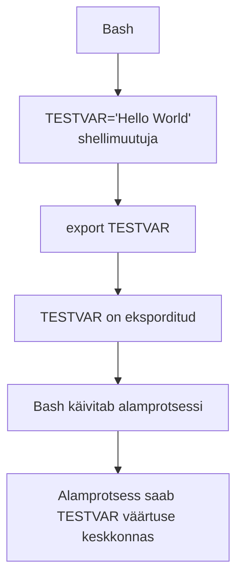

icon: material/variable

# Shelli- ja keskkonnamuutujad

Shell kasutab muutujaid väärtuste hoidmiseks. Muutujates võivad olla näiteks kasutaja kodukataloogi asukoht, kasutatav keel, tekstiredaktor või nende kataloogide nimekiri, millest shell programme otsib.

Oluline on eristada **shellimuutujat** ja **keskkonnamuutujat**. Shellimuutuja kuulub praegusele shellile. Eksporditud keskkonnamuutuja antakse edasi ka sellest shellist käivitatud programmidele.

!!! info "Seos Bashi seadistamise teemaga"
    Eelmises teemas õppisid, et `~/.bashrc` ja teised Bashi käivitusfailid võimaldavad kasutajakeskkonda seadistada. Nendes failides saab määrata ka muutujaid ja keskkonnamuutujaid.

---

## Õpieesmärgid

Pärast materjali läbimist oskad:

- selgitada, mis on shellimuutuja;
- selgitada, mis on keskkonnamuutuja;
- eristada shellimuutujat ja eksporditud keskkonnamuutujat;
- luua ja kasutada muutujat Bashis;
- kasutada muutuja väärtust kujul `$VAR` ja `${VAR}`;
- vaadata keskkonnamuutujaid käskudega `env` ja `printenv`;
- kasutada `export` käsku;
- eemaldada muutuja käsuga `unset`;
- selgitada levinud muutujate `HOME`, `USER`, `SHELL`, `PWD`, `LANG`, `EDITOR` ja `PATH` eesmärki;
- selgitada `PATH` muutuja tööpõhimõtet;
- lisada kataloogi ajutiselt ja püsivalt `PATH` muutujasse.

---

## Mis on muutuja?

Muutuja seob **nime** mingi **väärtusega**.

Näiteks:

```bash
TERVITUS="Tere maailm"
```

Siin:

```text
TERVITUS       → muutuja nimi
Tere maailm    → muutuja väärtus
```

Muutuja väärtuse kuvamiseks:

```bash
echo "$TERVITUS"
```

Tulemus:

```text
Tere maailm
```

!!! warning "Ära pane omistamisel `=` ümber tühikuid"
    Bashis on:

    ```bash
    TERVITUS="Tere maailm"
    ```

    muutuja omistamine, kuid:

    ```bash
    TERVITUS = "Tere maailm"
    ```

    ei tähenda sama asja ja põhjustab tavaliselt vea.

---

## Muutuja väärtuse kasutamine

Muutuja väärtusele viitamiseks kasutatakse `$` märki:

```bash
echo "$HOME"
```

Muutuja nime saab kirjutada ka loogeliste sulgudega:

```bash
echo "${HOME}"
```

Looksulud on eriti kasulikud siis, kui muutuja nime järel tuleb kohe muu tekst.

Näiteks:

```bash
FAIL="${HOME}/raport.txt"
echo "$FAIL"
```

Tulemus võib olla:

```text
/home/student/raport.txt
```

**Miks kasutatakse jutumärke?**

Hea üldine harjumus on kirjutada:

```bash
echo "$HOME"
```

mitte:

```bash
echo $HOME
```

Jutumärgid aitavad säilitada muutuja väärtuse ühe argumendina ka siis, kui väärtuses on tühikuid või teisi shelli jaoks erilise tähendusega märke.

---

## Shellimuutuja

Tavalise omistamisega loodud muutuja on Bashi **shellimuutuja**:

```bash
TESTVAR="Hello World"
```

Kontrolli väärtust:

```bash
echo "$TESTVAR"
```

See muutuja on olemas praeguses shellis, kuid seda ei anta automaatselt kõigile shellist käivitatud programmidele keskkonnamuutujana edasi.

---

## Keskkonnamuutuja

Kui shellimuutuja eksporditakse:

```bash
export TESTVAR
```

lisab Bash selle enda käivitatud programmide **keskkonda**.

Sama saab teha ühe käsuga:

```bash
export TESTVAR="Hello World"
```

Oluline seos:



!!! warning "`export` ei tee muutujat süsteemiüleseks"
    `export TESTVAR` ei tähenda, et muutuja muutub kogu Linuxi süsteemi või kõigi kasutajate jaoks kehtivaks. See muudab muutuja praeguse shelli käivitatud alamprotsessidele pärandatavaks.

---

## Muutujate pärimine alamprotsessidele

Keskkonnamuutuja mõtet saab katsetada uue Bashi käivitamisega.

Loo shellimuutuja:

```bash
TESTVAR="Hello"
```

Kontrolli:

```bash
echo "$TESTVAR"
```

Käivita sellest shellist uus Bash:

```bash
bash
```

Uues shellis:

```bash
echo "$TESTVAR"
```

Muutuja väärtust ei pruugita näha, sest seda ei eksporditud.

Välju alam-shellist:

```bash
exit
```

Ekspordi muutuja:

```bash
export TESTVAR
```

Käivita uuesti:

```bash
bash
echo "$TESTVAR"
```

Nüüd pärib uus Bash muutuja keskkonna kaudu.

!!! note "Pärimine toimub vanemalt protsessilt lapsele"
    Alamprotsess saab käivitamisel koopia vanemprotsessi eksporditud keskkonnast. Alamprotsess ei saa tavaliselt oma muutuja muutmisega vanem-shelli keskkonda tagasi muuta.

---

## Keskkonna vaatamine

Kõigi praeguse protsessi keskkonnas olevate muutujate vaatamiseks:

```bash
env
```

Teine kasulik käsk on:

```bash
printenv
```

Konkreetse keskkonnamuutuja vaatamiseks:

```bash
printenv HOME
```

või:

```bash
printenv PATH
```

`echo` ja `printenv` ei tee päris sama asja

```bash
echo "$HOME"
```

korral laiendab Bash kõigepealt `$HOME` väärtuseks ning annab tulemuse `echo` käsule.

```bash
printenv HOME
```

palub `printenv` programmil lugeda keskkonnast muutuja `HOME`.

Alguses võivad tulemused tunduda samad, kuid tööpõhimõte on erinev.

---

## Levinud keskkonnamuutujad

| Muutuja | Üldine tähendus |
|---|---|
| `HOME` | kasutaja kodukataloog |
| `USER` | kasutajanimi |
| `SHELL` | kasutajakontole määratud shelli tee |
| `PWD` | praegune töökataloog |
| `LANG` | vaikimisi lokaadi- ja keeleseadistus |
| `EDITOR` | eelistatud tekstiredaktor, kui programm seda muutujat kasutab |
| `PATH` | kataloogid, millest shell käsunimele programmi otsib |

Vaata väärtusi:

```bash
echo "$HOME"
echo "$USER"
echo "$SHELL"
echo "$PWD"
echo "$LANG"
echo "$EDITOR"
echo "$PATH"
```

!!! note "Kõik muutujad ei pea olema määratud"
    Näiteks `EDITOR` ei pruugi sinu süsteemis olla määratud. Samuti sõltub mõne muutuja tähendus sellest, milline programm seda kasutab.

---

## Muutuja eemaldamine

Muutuja eemaldamiseks praegusest shellist kasutatakse:

```bash
unset TESTVAR
```

Kontrolli:

```bash
echo "$TESTVAR"
```

Kui muutuja eemaldati, ei kuvata selle väärtust.

!!! note "`unset` mõjutab praegust shelli"
    Kui muutuja määratakse mõnes käivitusfailis uuesti, võib see järgmise shelliseansi alustamisel tagasi ilmuda.

---

## `PATH` - programmide otsingutee

`PATH` on üks olulisemaid keskkonnamuutujaid.

Vaata selle väärtust:

```bash
echo "$PATH"
```

Tulemus võib olla näiteks:

```text
/usr/local/bin:/usr/bin:/bin
```

`PATH` sisaldab **koolonitega `:` eraldatud kataloogide nimekirja**.

```text
/usr/local/bin : /usr/bin : /bin
      │             │         │
      └─────────────┴─────────┴── kataloogid
```

Kui sisestad:

```bash
ssh
```

otsib shell käivitatavat faili `PATH` kataloogidest järjekorras.

Käsu tegeliku lahenduse kontrollimiseks saad kasutada eelmises teemas õpitud käsku:

```bash
type ssh
```

või:

```bash
command -v ssh
```

---

## Kataloogi lisamine `PATH` muutujasse

Oletame, et sul on enda programmid kataloogis:

```text
/home/student/bin
```

Selle saab praeguse shelli `PATH` lõppu lisada:

```bash
export PATH="$PATH:$HOME/bin"
```

Kontrolli:

```bash
echo "$PATH"
```

Nüüd saab shell otsida programme ka kataloogist:

```text
/home/student/bin
```

!!! warning "Järjekord on oluline"
    Kui sama nimega programm leidub mitmes `PATH` kataloogis, kasutatakse tavaliselt esimest sobivat.

---

## Miks `.` ei ole hea üldine `PATH` täiendus?

Punkt `.` tähendab praegust töökataloogi.

Tehniliselt saab kirjutada:

```bash
export PATH=".:$PATH"
```

See paneb shelli otsima programme ka kataloogist, kus parasjagu asud.

!!! danger "Ära lisa praegust kataloogi pimesi PATH-i"
    Kui `.` on `PATH`-is, võib mõnes kataloogis olev sama nimega pahatahtlik või juhuslik programm käivituda oodatud süsteemikäsu asemel. Turvalisem on käivitada praeguses kataloogis olev programm teadlikult kujul:

    ```bash
    ./programm
    ```

---

## `PATH` muudatuse püsivaks tegemine

Terminalis tehtud:

```bash
export PATH="$PATH:$HOME/bin"
```

kehtib ainult selle shelliseansi ja selle alamprotsesside jaoks.

Kui soovid seadistuse järgmiste Bashi seansside jaoks säilitada, tuleb see lisada sobivasse Bashi käivitusfaili.

Interaktiivse Bashi jaoks võib see olla näiteks:

```text
~/.bashrc
```

Lisa:

```bash
export PATH="$PATH:$HOME/bin"
```

Seejärel:

```bash
source ~/.bashrc
```

!!! note "Sobiv fail sõltub eesmärgist"
    Keskkonnamuutujate püsiva seadistamise koht sõltub sellest, millistes sisselogimis- ja käivitusolukordades muutujat vaja on. `~/.bashrc` sobib interaktiivse Bashi seadistamiseks, kuid login-keskkonna jaoks kasutatakse sageli `~/.profile` või `~/.bash_profile` faili.

---

## Hea töövõte: vaata → muuda → kontrolli

Keskkonnamuutujatega töötades:

1. vaata olemasolevat väärtust;
2. tee ajutine muudatus;
3. kontrolli tulemust;
4. alles seejärel tee vajaduse korral muudatus püsivaks.

Näiteks:

```bash
echo "$PATH"
export PATH="$PATH:$HOME/bin"
echo "$PATH"
command -v minuprogramm
```

Kui tulemus on õige, lisa seadistus sobivasse käivitusfaili.

---

## Käskude spikker

| Käsk | Eesmärk |
|---|---|
| `VAR="väärtus"` | loob või muudab shellimuutuja |
| `echo "$VAR"` | kuvab shelli laiendatud muutuja väärtuse |
| `echo "${VAR}"` | kuvab väärtuse üheselt piiritletud muutujanimega |
| `export VAR` | märgib muutuja alamprotsessidele eksporditavaks |
| `export VAR="väärtus"` | määrab väärtuse ja ekspordib muutuja |
| `unset VAR` | eemaldab muutuja praegusest shellist |
| `env` | kuvab keskkonna |
| `printenv` | kuvab keskkonnamuutujad |
| `printenv VAR` | kuvab konkreetse keskkonnamuutuja |
| `echo "$PATH"` | kuvab `PATH` väärtuse |
| `export PATH="$PATH:$HOME/bin"` | lisab kataloogi praeguse `PATH` lõppu |
| `command -v käsk` | näitab, kuidas shell käsu leiab |

---

## Olulised mõisted

| Mõiste | Selgitus |
|---|---|
| **muutuja** | nimega seotud väärtus |
| **shellimuutuja** | praeguses shellis määratud muutuja |
| **keskkonnamuutuja** | protsessi keskkonnas olev muutuja, mille vanemprotsess saab lapsele käivitamisel edasi anda |
| **`export`** | märgib shellimuutuja käivitatavatele alamprotsessidele eksporditavaks |
| **`unset`** | eemaldab muutuja |
| **alamprotsess** | teise protsessi käivitatud protsess |
| **`PATH`** | koolonitega eraldatud programmide otsingukataloogide nimekiri |
| **`HOME`** | kasutaja kodukataloogi kirjeldav muutuja |
| **`LANG`** | vaikimisi lokaadiseadistust kirjeldav muutuja |

---

## Kontrollküsimused

1. Mis on muutuja?
2. Kuidas luua Bashis shellimuutuja?
3. Milleks kasutatakse `$` märki muutuja nime ees?
4. Mis vahe on `$HOME` ja `${HOME}` kujul?
5. Miks on muutuja kasutamisel sageli hea kasutada jutumärke?
6. Mis on shellimuutuja?
7. Mis on keskkonnamuutuja?
8. Milleks kasutatakse `export` käsku?
9. Kas `export VAR` muudab muutuja süsteemiüleseks? Põhjenda.
10. Kuidas kontrollida keskkonda käsuga `env`?
11. Milleks kasutatakse `printenv` käsku?
12. Milleks kasutatakse `unset` käsku?
13. Mida kirjeldavad `HOME`, `USER`, `SHELL`, `PWD`, `LANG` ja `EDITOR`?
14. Milleks kasutatakse `PATH` muutujat?
15. Kuidas lisada `$HOME/bin` praeguse `PATH` lõppu?
16. Miks kaob terminalis tehtud `PATH` muudatus tavaliselt uue shelliseansi alustamisel?
17. Kuidas saab `PATH` muudatuse püsivaks teha?
18. Miks ei ole `~/.bashrc` ainus võimalik koht keskkonnamuutuja püsivaks seadistamiseks?

---

## Kokkuvõte

Bashis saab väärtusi hoida shellimuutujates. Muutuja väärtusele viidatakse `$VAR` või `${VAR}` kujul.

`export` märgib muutuja nii, et Bash annab selle enda käivitatud alamprotsessidele keskkonnas edasi. See ei muuda muutujat automaatselt süsteemiüleseks.

Keskkonnamuutujaid saab vaadata `env` ja `printenv` abil ning muutuja saab eemaldada käsuga `unset`.

`PATH` on üks tähtsamaid keskkonnamuutujaid. See määrab kataloogid ja nende järjekorra, millest shell käsunimele käivitatavat programmi otsib.

Kõige olulisem põhimõte on:

> **Erista muutuja eksportimist sellest, millise kasutaja või süsteemi konfiguratsioonis muutuja püsivalt määratakse.**

---

## Allikad ja lisalugemine

- [GNU Bash manual: Bourne Shell Variables](https://www.gnu.org/software/bash/manual/html_node/Bourne-Shell-Variables.html){ target="_blank" rel="noopener" }
- [GNU Bash manual: Environment](https://www.gnu.org/software/bash/manual/html_node/Environment.html){ target="_blank" rel="noopener" }
- [GNU Bash manual: Bash Startup Files](https://www.gnu.org/software/bash/manual/html_node/Bash-Startup-Files.html){ target="_blank" rel="noopener" }
- [Debian Wiki: Environment Variables](https://wiki.debian.org/EnvironmentVariables){ target="_blank" rel="noopener" }

---
*Õppematerjali koostaja: Priit Paap, 2026*
