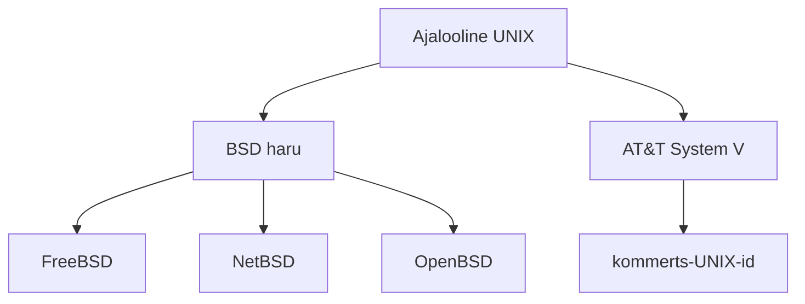
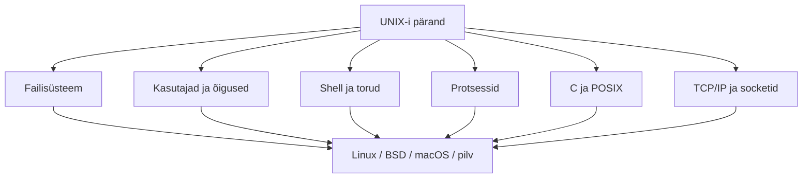

icon:material/history

# UNIX-i ja BSD ajalugu

UNIX-i ajalugu aitab mõista, miks tänapäevased Linuxi ja BSD süsteemid töötavad just sellisel viisil nagu nad töötavad. Paljud praegused käsurea-, failisüsteemi-, protsessi- ja võrgunduspõhimõtted pärinevad otseselt 1960.–1980. aastatel kujunenud UNIX-i traditsioonist.

!!! info "Õppematerjali eesmärk"
    Anda terviklik ülevaade UNIX-i sünnist, põhimõtetest ja mõjust ning näidata, kuidas UNIX-ist kujunesid BSD, kommerts-UNIX-id ja UNIX-i ideedest inspireeritud Linux.

    Fookus on **seostel ja tänapäevase IT mõistmisel**, mitte aastaarvude päheõppimisel.

## Õpiväljundid

Pärast teema läbimist õppija:

- selgitab, miks UNIX 1960.–1970. aastatel tekkis ja milliseid probleeme see lahendas;
- nimetab UNIX-i kujunemise võtmeisikuid ja olulisemaid tehnoloogilisi samme;
- kirjeldab UNIX-i filosoofia põhimõtet **„üks tööriist – üks ülesanne“** ning programmide ühendamist torudega (*pipes*);
- selgitab C-keele rolli UNIX-i kaasaskantavuse ja leviku juures;
- kirjeldab BSD kujunemist ning BSD mõju TCP/IP ja Interneti arengule;
- eristab ajaloolist UNIX-i, BSD-perekonda, kommerts-UNIX-e ja UNIX-like süsteeme, näiteks Linuxit;
- toob näiteid UNIX-i pärandist tänapäeva serverites, pilves, macOS-is, Androidis ja võrguseadmetes.

---

## 1. Miks UNIX üldse tekkis?

1960. aastate arvutid olid suured ja kallid suurarvutid. Ühe masina ressursse pidid jagama paljud kasutajad.

Oluliseks arengusuunaks kujunes **ajajaotus** (*time-sharing*): arvuti protsessoriaega jagati kiiresti mitme kasutaja ja programmi vahel, nii et kasutajale jäi mulje, nagu töötaks ta masinaga iseseisvalt.

Üks selle ajastu ambitsioonikamaid projekte oli **Multics** (*Multiplexed Information and Computing Service*), mida arendasid:

- MIT;
- Bell Laboratories;
- General Electric.

Multics püüdis luua väga võimekat mitme kasutaja süsteemi, kuid projekt osutus keerukaks ja selle areng oli aeglane. Bell Labs loobus projektis osalemisest 1969. aastal.

Multicsi kogemus andis siiski hulga ideid, millest UNIX-i loojad lähtusid.

!!! abstract "Põhisõnum"
    UNIX ei tekkinud tühjalt kohalt. See oli osaliselt reaktsioon Multicsi keerukusele: eesmärgiks sai **väiksem, lihtsam ja praktilisem süsteem**.

---

## 2. UNIX sünnib Bell Labsis

1969. aastal hakkas **Ken Thompson** Bell Labsis kasutama vähekasutatud **DEC PDP-7** miniarvutit.

Ta oli varem tegelenud mänguga *Space Travel* ning selle PDP-7-le viimine sundis looma vajalikke süsteemseid vahendeid.

Töö käigus kujunesid välja:

- failisüsteem;
- protsesside juhtimine;
- käsutõlgendaja;
- muud operatsioonisüsteemi põhikomponendid.

Nendest kasvas välja UNIX.

**Dennis Ritchie** ja teised Bell Labsi teadlased osalesid süsteemi edasises arendamises.

### Nime kujunemine

Nimi **UNIX** kujunes sõnamänguna Multicsi nimega.

Esmalt kasutati kuju:

```text
Unics
```

hiljem:

```text
UNIX
```

!!! note
    UNIX-i algus paigutatakse 1969. aastasse, kuid nimetus UNIX kujunes välja veidi hiljem.

---

## 3. Mis tegi UNIX-i eriliseks?

UNIX-i edu ei tulenenud ühest uuendusest, vaid mitmest lihtsast ja hästi koos töötavast ideest.

Paljud neist põhimõtetest on Linuxis ja teistes UNIX-like süsteemides tänaseni äratuntavad.

### Mitme kasutaja tugi

Sama süsteemi saavad kasutada mitu kasutajat, kelle failid ja õigused on üksteisest eraldatud.

### Mitme protsessi käitamine

Süsteem suudab täita korraga mitut programmi.

### Hierarhiline failisüsteem

Failid ja kataloogid moodustavad ühe puu, mille juur on:

```text
/
```

### Shell

Kasutaja suhtleb süsteemiga käsutõlgendaja kaudu ning saab käske skriptideks ühendada.

### Väikesed tööriistad

Paljud programmid teevad ühe konkreetse ülesande ning neid saab omavahel kombineerida.

### Tekstipõhisus

Seadistused, käsud ja programmide väljund on sageli lihtne tekst, mida teised programmid saavad töödelda.

---

## 4. UNIX-i filosoofia ja torud

UNIX-i üheks kõige mõjukamaks ideeks kujunes väikeste programmide kombineerimine.

Selle asemel, et üks programm teeks kõike, luuakse hulk tööriistu, millest igaüks lahendab ühte ülesannet hästi.

Programmi väljundi saab suunata järgmise programmi sisendiks.

Näiteks:

```bash
cat system.log | grep error | sort
```

Selles käsus:

1. `cat` loeb faili;
2. `grep` jätab alles read, kus esineb sõna `error`;
3. `sort` järjestab tulemuse.

Püstkriipsu:

```text
|
```

nimetatakse **toruks** (*pipe*).


Torude idee võimaldas lihtsatest tööriistadest koostada keerukamaid töövooge ilma, et iga ülesande jaoks oleks vaja kirjutada uus suur programm.

!!! tip "Seos tänapäevaga"
    Sama mõtteviis on Linuxi käsureal endiselt keskne. `grep`, `sort`, `cut`, `awk`, `sed`, `head`, `tail` ja paljud teised tööriistad on eriti kasulikud seetõttu, et neid saab omavahel kombineerida.

---

## 5. C-keel muudab UNIX-i kaasaskantavaks

Varajane UNIX oli kirjutatud peamiselt assemblerkeeles.

See sidus süsteemi tugevalt konkreetse protsessoriga.

**Ken Thompson** arendas BCPL-ist programmeerimiskeele **B** ning **Dennis Ritchie** arendas B-st edasi **C-keele**.

1973. aasta suvel kirjutati UNIX-i kernel suures osas C-keelde ümber.

See oli operatsioonisüsteemide ajaloos oluline samm.

Kõrgtaseme keeles kirjutatud süsteemi oli palju lihtsam kohandada uuele riistvarale. UNIX ei olnud enam nii tugevalt seotud ühe konkreetse arvutimudeliga ning seda sai hakata portima erinevatele arvutitele.

!!! abstract "Miks see oluline oli?"
    UNIX-i ja C-keele areng toetasid teineteist.

    - UNIX andis C-le praktilise kasutusala süsteemiprogrammeerimises.
    - C aitas UNIX-il levida väga erinevale riistvarale.

---

## 6. UNIX levib ülikoolidesse

AT&T tegutses toona reguleeritud telekommunikatsiooniettevõttena ning UNIX-i ei turustatud alguses tavalise tarkvaratootena.

Süsteemi litsentse ja lähtekoodi jõudis:

- ülikoolidesse;
- teadusasutustesse;
- õppe- ja uurimiskeskkondadesse.

Õppijad ja teadlased said UNIX-i uurida ning täiendada.

See muutis UNIX-i oluliseks nii:

- operatsioonisüsteemide õpetamisel;
- uurimistöös;
- uute süsteemilahenduste arendamisel.

Ülikoolides tekkinud arendustest kõige mõjukam oli **California Ülikooli Berkeley UNIX-i haru**, millest kasvas BSD.

---

## 7. BSD – Berkeley Software Distribution

California Ülikoolis Berkeleys kasutati UNIX-i ning sellele hakati lisama uusi programme ja täiustusi.

**Bill Joy** ja teised arendajad koondasid täiendused paketiks nimega:

**Berkeley Software Distribution ehk BSD**.

Esimesed BSD versioonid olid UNIX-ile lisatavad tarkvarakogumikud, mitte veel täiesti sõltumatu operatsioonisüsteem.

Järgmiste versioonidega muutus BSD järjest terviklikumaks ning sellest kujunes AT&T System V kõrval UNIX-maailma teine oluline arenguharu.

BSD-st pärinevad või BSD-ga tugevalt seotud hilisemad süsteemid:

- FreeBSD;
- NetBSD;
- OpenBSD.

---

## 8. BSD ja Interneti areng

BSD üks tähtsamaid panuseid oli **võrgundus**.

**4.2BSD**, mis ilmus 1983. aastal, tõi laialdaselt kasutatavasse UNIX-keskkonda:

- TCP/IP võrgupinu;
- socket-liidese võrguprogrammide loomiseks.

See aitas TCP/IP kasutamist teadus- ja ülikoolivõrkudes märkimisväärselt laiendada.

### Socket API

Socket API mõju on väga pikaajaline.

Sama programmeerimismudel on endiselt aluseks suurele osale võrguprogrammeerimisest UNIX-like süsteemides.


!!! tip "Seos tänapäevaga"
    Kui programm avab võrgus socketi, loob ühenduse serveriga või kuulab TCP-porti, kasutab see kontseptsioone, mille populaarseks muutmisel oli BSD-l suur roll.

---

## 9. Kaks suurt UNIX-i haru: BSD ja System V

1980. aastatel kujunes UNIX-i maailmas kaks suuremat tehnilist suunda:

- Berkeley arendas BSD-d;
- AT&T arendas kommertslikku UNIX System V haru.

Riistvaratootjad ehitasid nende ideede põhjal omakorda oma süsteeme.

Näiteks:

- **SunOS** oli algselt tugevalt BSD mõjutustega;
- **HP-UX**;
- **AIX**;
- mitmed teised süsteemid sisaldasid eri aegadel nii System V kui ka BSD mõjusid.



### UNIX Wars

Erinevused tekitasid nn **UNIX Wars** olukorra.

UNIX-i nimega või UNIX-i moodi süsteeme oli palju, kuid nende:

- käsud;
- teegid;
- süsteemiliidesed

ei olnud alati täielikult ühilduvad.

---

## 10. Standardid: POSIX ja Single UNIX Specification

UNIX-i süsteemide killustatuse vähendamiseks hakati standardiseerima operatsioonisüsteemi liideseid.

### POSIX

**POSIX** määratleb muu hulgas:

- rakenduste jaoks vajalikud süsteemiliidesed;
- shelli;
- levinud käsureatööriistade käitumise.

POSIX aitab tarkvara erinevate UNIX-like süsteemide vahel teisaldada.

### Single UNIX Specification

Tänapäeval moodustab POSIX olulise osa **Single UNIX Specificationist**.

!!! info "UNIX kui kaubamärk ja standard"
    UNIX on tänapäeval ka kaubamärk ja standard.

    The Open Group lubab UNIX-i kaubamärki kasutada süsteemidel, mis läbivad vastava sertifitseerimise.

Seetõttu ei tähenda:

```text
UNIX-like
```

automaatselt sama asja kui:

```text
UNIX-sertifitseeritud
```

---

## 11. Linux ilmub 1991. aastal

1991. aastal alustas **Linus Torvalds** uue UNIX-like kerneli arendamist.

Sellest kasvas Linuxi kernel.

Linux kasutab paljusid UNIX-i ideid ja POSIX-laadseid liideseid, kuid Linuxi kernel **ei pärine algse AT&T UNIX-i lähtekoodist**.

Täielik Linuxi süsteem koosneb kernelist ning suurest hulgast:

- kasutajaruumi programmidest;
- teekidest;
- haldusvahenditest.

Paljud neist pärinevad GNU projektist.

Seetõttu kasutatakse ajaloolises kontekstis ka nimetust:

```text
GNU/Linux
```

kuigi igapäevases kasutuses öeldakse enamasti lihtsalt **Linux**.

!!! warning "Oluline eristus"
    Linux on UNIX-like süsteem: selle disain ja kasutuskeskkond on tugevalt UNIX-ist mõjutatud, kuid Linux ei ole lihtsalt „UNIX-i uus versioon“.

---

## 12. UNIX-i perekond tänapäeval

UNIX-i ajalugu on kõige lihtsam mõista perekonnana, kus:

- osa süsteeme pärineb otsesemalt ajaloolisest UNIX-i koodibaasist;
- osa järgib UNIX-i standardeid;
- osa on UNIX-i ideedest inspireeritud.

| Rühm | Näited | Iseloomustus |
|---|---|---|
| **BSD-perekond** | FreeBSD, OpenBSD, NetBSD | Ajalooliselt Berkeley UNIX-i harust kujunenud süsteemid |
| **Kommerts-UNIX** | AIX, HP-UX, Solaris | Traditsioonilised UNIX-i tooteliinid; standardite ja sertifitseerimise roll on oluline |
| **Apple’i süsteemid** | Darwin, macOS | Darwin ühendab Machi ja BSD päritolu komponente; macOS kasutab UNIX-i standarditega ühilduvat kasutuskeskkonda |
| **UNIX-like** | Linux | UNIX-i ideedel ja liidestel põhinev süsteem, kuid mitte algse UNIX-i lähtekoodi otsene järglane |

---

## 13. UNIX sinu ümber

UNIX-i mõju ei piirdu ajalooliste serveritega.

Selle ideid kohtab väga paljudes tänapäeva süsteemides.

- Linux domineerib suurel osal serveri- ja pilvekeskkondadest.
- Android kasutab Linuxi kernelit.
- macOS-i kasutuskeskkonnas on palju UNIX-i ja BSD traditsioonist pärit tööriistu.
- Paljud võrguseadmed, salvestussüsteemid, tulemüürid ja sisseehitatud seadmed kasutavad Linuxit või BSD-põhiseid komponente.
- Konteinerid ja DevOps-tööriistad kasutavad sageli Linuxi protsesse, failisüsteeme, õigusi, shelli ja käsureatööriistu.
- C-keel, POSIX-liidesed, torud ja tekstipõhine automatiseerimine on süsteemihalduse ning tarkvaraarenduse jaoks endiselt olulised.

---

## 14. Mida UNIX meile pärandas?

UNIX-i kõige olulisem pärand ei ole üks konkreetne operatsioonisüsteemi versioon, vaid terve kogum põhimõtteid ja tehnilisi lahendusi.

UNIX-i pärandisse kuuluvad:

- hierarhiline failisüsteem ja juurkataloogi `/` mõiste;
- kasutajad, grupid ja failiõigused;
- protsessid ja protsessidevaheline suhtlus;
- shell ning käsurea automatiseerimine;
- väikesed omavahel kombineeritavad tööriistad;
- torud (*pipes*) ja sisendi/väljundi ümbersuunamine;
- C-keele kasutamine süsteemiprogrammeerimises;
- POSIX-standardid ja rakenduste teisaldatavuse põhimõte;
- BSD kaudu laialt levinud TCP/IP ja socket-programmeerimise mudel.



!!! abstract "Kokkuvõttev mõte"
    UNIX-i sünnist on möödunud üle poole sajandi, kuid selle põhiideed elavad edasi Linuxis, BSD-des, macOS-is, pilveteenustes ja suuremas osas tänapäevasest serveritaristust.

    UNIX-i ajaloo tundmine aitab mõista, miks Linuxi failisüsteem, käsurida, õigused, protsessid ja võrgutööriistad töötavad just sellisel viisil.

---

## 15. Kiirkordamine

| Küsimus | Lühivastus |
|---|---|
| **Miks tekkis UNIX?** | Bell Labs soovis pärast Multicsi kogemust lihtsamat ja praktilisemat ajajaotusega operatsioonisüsteemi. |
| **Kes olid UNIX-i võtmeisikud?** | Ken Thompson ja Dennis Ritchie, lisaks mitmed teised Bell Labsi teadlased. |
| **Miks oli 1973. aasta oluline?** | UNIX-i kernel kirjutati suures osas C-keelde, mis suurendas süsteemi kaasaskantavust. |
| **Mis on UNIX-i filosoofia?** | Ehita väikesed tööriistad, mis teevad ühte asja hästi, ja kombineeri neid. |
| **Mis on BSD?** | Berkeley Software Distribution – Berkeley ülikoolis UNIX-i põhjal kujunenud arendusharu. |
| **Miks on BSD võrgunduse ajaloos oluline?** | 4.2BSD levitas TCP/IP võrgupinu ja socket API kasutamist. |
| **Kas Linux on UNIX?** | Linux on UNIX-like süsteem. Selle kernel ei pärine algse UNIX-i lähtekoodist. |
| **Miks on POSIX oluline?** | See standardiseerib liideseid ja tööriistu ning aitab UNIX-like süsteemide vahel ühilduvust säilitada. |

---

## Kontrollküsimused

1. Mis probleemidele püüdis UNIX 1960.–1970. aastatel lahendust pakkuda?
2. Milline seos oli Multicsil ja UNIX-il?
3. Kes olid UNIX-i kujunemise kaks kõige olulisemat võtmeisikut?
4. Miks oli PDP-7 UNIX-i sünniloos oluline?
5. Millised põhimõtted tegid UNIX-i eriliseks?
6. Mida tähendab UNIX-i filosoofias põhimõte „üks tööriist – üks ülesanne“?
7. Mis on toru ehk *pipe*?
8. Miks oli UNIX-i C-keelde ümberkirjutamine oluline?
9. Kuidas aitasid ülikoolid UNIX-i levikule kaasa?
10. Mis on BSD?
11. Milline oli BSD roll TCP/IP levikus?
12. Mida tähendab socket?
13. Mis vahe oli BSD ja System V arenguharul?
14. Miks tekkis vajadus POSIX-i ja teiste standardite järele?
15. Mis vahe on mõistetel UNIX ja UNIX-like?
16. Miks ei saa Linuxit nimetada lihtsalt UNIX-i uuemaks versiooniks?
17. Millised tänapäevased süsteemid kannavad UNIX-i või BSD pärandit?
18. Milliseid UNIX-i põhimõtteid oled Linuxi kursuse jooksul juba kohanud?

---

## Ajajoon

| Aeg | Sündmus |
|---|---|
| **1960. aastad** | ajajaotus ja Multics |
| **1969** | UNIX-i algus Bell Labsis |
| **1973** | UNIX kirjutatakse suures osas C-keelde |
| **1970. aastad** | UNIX levib ülikoolidesse |
| **1970.–1980. aastad** | BSD kujuneb Berkeley ülikoolis |
| **1983** | 4.2BSD ja TCP/IP levik |
| **1980. aastad** | BSD ja System V kujunevad suurteks UNIX-i harudeks |
| **1991** | Linuxi kerneli arenduse algus |

---

## Allikad ja lisalugemine

1. Dennis M. Ritchie – *The Evolution of the Unix Time-sharing System*, Bell Laboratories / Nokia Bell Labs  
   https://www.nokia.com/bell-labs/about/dennis-m-ritchie/hist.html

2. Dennis M. Ritchie – *The Development of the C Language*, Bell Laboratories / Nokia Bell Labs  
   https://www.nokia.com/bell-labs/about/dennis-m-ritchie/chist.html

3. The Open Group – *The UNIX Standard*  
   https://www.opengroup.org/membership/forums/platform/unix

4. The Open Group / IEEE – POSIX and Single UNIX Specification documentation  
   https://pubs.opengroup.org/

   
