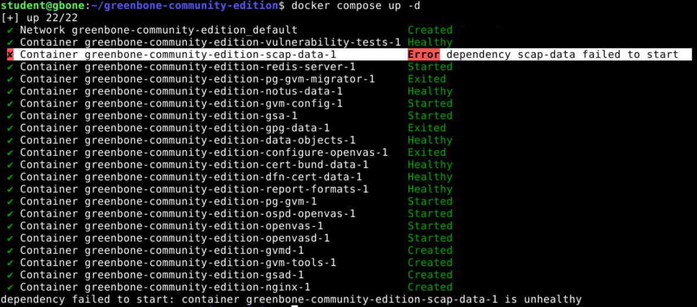
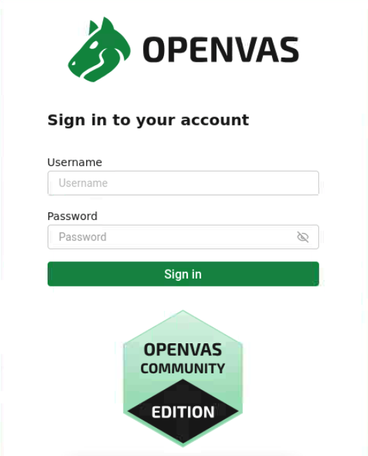
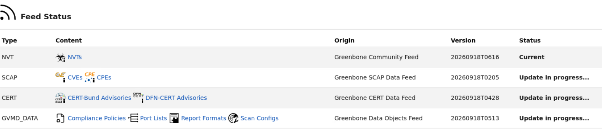
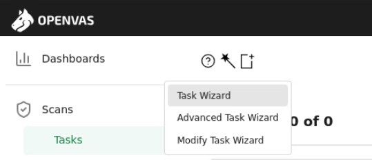

# Praktiline töö: Greenbone Community Edition (OpenVAS)

## Eesmärk

Praktilise töö eesmärk on õppida paigaldama ja kasutama Greenbone
Community Editioni haavatavuste skannerit, skaneerima üksikut
võrguseadet ja alamvõrku ning analüüsima leitud turvanõrkusi.

Töö käigus õpid:

-   paigaldama ja käivitama Greenbone Community Editioni konteinerites;
-   kontrollima konteinerite ja Greenbone'i teenuste olekut;
-   kasutama Greenbone Security Assistant veebiliidest;
-   skaneerima üksikut IP-aadressi ja tervet alamvõrku;
-   hindama skannimise tulemusi ja haavatavuste tõsidust;
-   leidma haavatavuse kirjelduse ja soovitatud parandusmeetmed.

!!! warning "Oluline" 
    Skaneeri ainult süsteeme ja võrke, mille skaneerimiseks on sul luba. Selles praktilises     töös kasuta ainult selleks ette nähtud laborivõrgu virtuaalmasinaid.

------------------------------------------------------------------------

## 1. Debian virtuaalmasina ettevalmistamine

Greenbone Community Edition käivitatakse selles töös Dockeri
konteinerites.

Paigalda kooli laborikeskkonda **Debian 13** virtuaalmasinat,
millel on võrgukaardiks "Internet".

Virtuaalmasina nimeks "greenbone-sinunimi".

**Kindlasti vali maisna loomisel "VIKK Thin Policy" salvestuspoliitika!**

Soovituslikud ressursid:

| Ressurss | Soovitus |
| --- | --- |
|  CPU |  2 vCPU |
|  RAM |  8 GB RAM |
|  Ketas |  100 GB |
|  OS |  Debian 13 |


!!! info "Miks on vaja nii palju kettaruumi?"
    Greenbone'i konteinerid,
    haavatavuste andmebaasid ehk *feed'id* ja skannimise tulemused vajavad
    märkimisväärselt kettaruumi. Varasemast 16 GB kettast ei piisa.


### 1.1. Uuenda Debian

``` bash
sudo apt update
sudo apt upgrade -y
```

------------------------------------------------------------------------

## 2. Docker Engine'i paigaldamine

### 2.1. Paigalda vajalikud paketid

``` bash
sudo apt install ca-certificates curl
```

### 2.2. Lisa Dockeri ametlik repositoorium

Loo võtmete kataloog:

``` bash
sudo install -m 0755 -d /etc/apt/keyrings
```

Laadi alla Dockeri allkirjastamisvõti:

``` bash
sudo curl -fsSL https://download.docker.com/linux/debian/gpg \
  -o /etc/apt/keyrings/docker.asc
```

Anna võtmele lugemisõigus:

``` bash
sudo chmod a+r /etc/apt/keyrings/docker.asc
```

Lisa Dockeri repositoorium:

``` bash
sudo tee /etc/apt/sources.list.d/docker.sources <<EOF
Types: deb
URIs: https://download.docker.com/linux/debian
Suites: $(. /etc/os-release && echo "$VERSION_CODENAME")
Components: stable
Architectures: $(dpkg --print-architecture)
Signed-By: /etc/apt/keyrings/docker.asc
EOF
```

Uuenda pakettide nimekirja:

``` bash
sudo apt update
```

### 2.3. Paigalda Docker

``` bash
sudo apt install docker-ce docker-ce-cli containerd.io \
  docker-buildx-plugin docker-compose-plugin
```

Kontrolli Dockeri versiooni:

``` bash
docker --version
```

Kontrolli Docker Compose'i versiooni:

``` bash
docker compose version
```

### 2.4. Lisa kasutaja gruppi `docker`

``` bash
sudo usermod -aG docker $USER
```

Muudatuse rakendamiseks **logi Debianist välja ja uuesti sisse**.

Pärast uuesti sisselogimist kontrolli, kas Docker töötab:

``` bash
docker run hello-world
```

Kui näed teadet **Hello from Docker!**, töötab Docker korrektselt.

------------------------------------------------------------------------

## 3. Greenbone Community Editioni paigaldamine

Greenbone Community Edition koosneb mitmest teenusest, mis käivitatakse
eraldi Dockeri konteinerites. Nende haldamiseks kasutatakse Docker
Compose'i.

### 3.1. Loo Greenbone'i kataloog

``` bash
export DOWNLOAD_DIR=$HOME/greenbone-community-edition
mkdir -p "$DOWNLOAD_DIR"
```

### 3.2. Laadi alla Greenbone'i Compose-fail

``` bash
curl -f -O -L \
  https://greenbone.github.io/docs/latest/_static/compose.yaml \
  --output-dir "$DOWNLOAD_DIR"
```

Kontrolli, kas fail on olemas:

``` bash
ls -l "$DOWNLOAD_DIR"
```

Kataloogis peab olema fail:

``` text
compose.yaml
```

------------------------------------------------------------------------

## 4. Greenbone'i konteinerite allalaadimine

Liigu Greenbone'i kataloogi:

``` bash
cd "$DOWNLOAD_DIR"
```

Laadi konteinerid alla:

``` bash
docker compose pull
```

!!! info 
    Allalaadimine võib võtta mitu minutit ja vajada mitu gigabaiti
    kettaruumi.

------------------------------------------------------------------------

## 5. Greenbone'i käivitamine

Käivita Greenbone:

``` bash
docker compose up -d
```

!!! note "Esimesel käivitamisel võib mõni konteiner vajada rohkem aega"
    Greenbone'i esmakordsel käivitamisel valmistatakse ette ja imporditakse
    haavatavuste andmeid. Seetõttu võib juhtuda, et mõni andmekonteiner,
    näiteks scap-data, kuvatakse alguses olekus unhealthy ja käivitamine
    peatub teatega dependency failed to start.

{ width="75%" }

Kui saad vea anna natuke aega ja käivita uuesti:

``` bash
docker compose up -d
```


Kontrolli konteinerite olekut:

``` bash
docker ps
```

Greenbone koosneb mitmest konteinerist, seega on normaalne, et
nimekirjas kuvatakse palju teenuseid. Vaata et kõigi konteinerite staatus oleks "Up".

Probleemide korral vaata logisid:

``` bash
docker compose logs -f
```

Logide jälgimise lõpetamiseks vajuta:

``` text
Ctrl+C
```

!!! tip "Kasulikud käsud" 
    Greenbone'i saab hiljem käivitada käsuga:
    ```bash
    cd "$HOME/greenbone-community-edition"
    docker compose up -d
    ```

    Peatamiseks kasuta:

    ```bash
    docker compose down
    ```

------------------------------------------------------------------------

## 6. Administraatori parooli muutmine

Greenbone'i administraatori kasutajanimi on:

``` text
admin
```

Määra administraatorile uus parool:

``` bash
docker compose -f "$DOWNLOAD_DIR/compose.yaml" \
  exec -u gvmd gvmd gvmd \
  --user=admin --new-password='SINU-TURVALINE-PAROOL'
```

Asenda `SINU-TURVALINE-PAROOL` enda valitud parooliga.


------------------------------------------------------------------------

## 7. Greenbone'i veebiliidese avamine

Ava oma Greenbone serveri veebibrauseris Greenbone'i HTTPS-aadress (kuna asub samas masinal saame kasutada aadressi 127.0.0.1)

``` text
https://127.0.0.1
```

Logi sisse:

-   **kasutaja:** `admin`
-   **parool:** eelmises sammus määratud parool 

!!! warning "Sertifikaadihoiatus" 
    Laboris kasutab Greenbone ise allkirjastatud TLS-sertifikaati. Seetõttu võib brauser        kuvada sertifikaadihoiatuse. Ignoreeri seda praegu ja liigu edasi saidile.

{ width="40%" }


------------------------------------------------------------------------

## 8. Greenbone'i feed'ide kontrollimine

Greenbone vajab haavatavuste tuvastamiseks ajakohaseid andmebaase ehk
*feed'e*.

Veebiliideses ava:

**Administration → Feed Status**

Pärast Greenbone'i esmakordset käivitamist toimub andmete laadimine ja
importimine automaatselt.

{ width="75%" }


!!! danger "Ära alusta skannimist liiga vara" 
    Enne esimese skanni tegemist oota, kuni vajalikud feed'id on alla laaditud ja töödeldud.
    Esmane sünkroniseerimine võib võtta kaua aega, isegi tunde. Lase maisnal töötada mõnda      aega ja tule siis labori juurde tagasi.

Puuduliku feed'i korral ei ole Greenbone'i haavatavuste andmebaas
täielik ning skannimise tulemus ei pruugi olla usaldusväärne. Oota ära kuni feed sünkroniseerimise lõpetab.

------------------------------------------------------------------------

## 9. Ühe kohtvõrgu masina skaneerimine

Kui feedid on uuendatud, siis saame skaneerimisega alustada. 

Kõigepealt skaneerid ühte kooli laborivõrgu virtuaalmasinat.

Sobivaks sihtmärgiks võib olla näiteks sinu enda Zabbixi või mõni muu
õpetaja lubatud virtuaalmasin.

!!! danger "Skaneeri ainult lubatud süsteeme" 
    Ära sisesta sihtmärgiks suvalist Internetist leitud IP-aadressi või domeeninime.

1.  Ava Greenbone'i veebiliides.
2.  Navigeeri **Scans → Tasks**.
3.  Ava **Task Wizard**.
4.  Sisesta skaneeritava laborimasina IP-aadress.
5.  Käivita skaneerimine.
6.  Oota, kuni skann on lõpetanud.




Skannimine võib sõltuvalt sihtmärgist võtta mitu minutit.

------------------------------------------------------------------------

## 10. Ühe masina skanni tulemuste analüüsimine

Ava lõpetatud skanni raport.

Tutvu leitud tulemustega ning vasta kirjalikult järgmistele küsimustele:

1.  Millist IP-aadressi skaneerisid?
2.  Mitu turvaleidu Greenbone tuvastas?
3.  Milliseid **Severity** tasemeid tulemustes esines?
4.  Milline oli kõige kõrgema **CVSS/severity** väärtusega leid (kui samal tasemel on mitu leidu, vali üks)?
5.  Mis oli selle leiu nimi?
6.  Kirjelda oma sõnadega, milles probleem seisneb.
7.  Millist lahendust või parandusmeedet (**Solution**) Greenbone
    soovitab?

!!! info "Severity ja CVSS" 
    Greenbone kasutab leidude tõsiduse
    hindamisel CVSS-põhist skoori. Mida suurem skoor, seda tõsisemaks
    hinnatakse võimalikku turvariski. Kõrge skoor ei tähenda siiski
    automaatselt, et süsteemi saab kindlasti rünnata -- tulemusi tuleb alati
    analüüsida kontekstis.

------------------------------------------------------------------------

## 11. Alamvõrgu skaneerimine

Järgmisena skaneerid ühe IP-aadressi asemel tervet kooli laborivõrgu
alamvõrku.

Selles ülesandes kasutatav alamvõrk on:

``` text
172.16.200.0/24
```
!!! warning "Hoiatus"
    Vaata, et sisestaksid alamvõrgu korrektselt, teisi võrke skannerrida ei tohi!


Käivita skaneerimine:

1.  Ava **Scans → Tasks**.

2.  Ava **Task Wizard**.

3.  Sisesta sihtmärgiks:

    ``` text
    172.16.200.0/24
    ```

4.  Käivita skaneerimine.

5.  Oota, kuni skann on lõpetanud.

!!! info 
    Terve `/24` alamvõrgu skaneerimine võtab märgatavalt rohkem
    aega kui ühe IP-aadressi skaneerimine.

------------------------------------------------------------------------

## 12. Alamvõrgu skanni tulemuste analüüsimine

Ava lõpetatud skanni raport ja vasta kirjalikult:

1.  Mitu aktiivset hosti Greenbone leidis?
2.  Milliste hostide juures tuvastati turvaleide?
3.  Millise hosti juures tuvastati kõige rohkem turvaleide?
4.  Kas erinevate hostide juures esines samu haavatavusi või probleeme?
    Too üks näide.
5.  Milline oli kogu alamvõrgu kõige kõrgema severity-väärtusega leid?

------------------------------------------------------------------------

## 13. Mõtle ja võrdle

Vasta oma töö lõpus lühidalt järgmistele küsimustele.

### Haavatavuse skanneri kasulikkus

Milleks võiks süsteemiadministraator Greenbone'i organisatsiooni võrgus
kasutada?

### Tulemuste tõlgendamine

Kas Greenbone'i leitud kõrge severity-väärtusega probleem tähendab
alati, et süsteemi on võimalik kohe edukalt rünnata? Põhjenda lühidalt.

------------------------------------------------------------------------

## Avalike teenuste skaneerimine

Haavatavuste skaneerimine tekitab sihtsüsteemile aktiivset võrguliiklust
ja võib olla käsitletav turvatestimisena.

!!! danger "Ära skaneeri suvalisi Interneti-teenuseid" 
    **Skaneeri ainult
    süsteeme ja võrke, mille skaneerimiseks on sul selge luba.**

Ära sisesta Greenbone'i proovimiseks suvalisi:

-   avalikke IP-aadresse;
-   veebiservereid;
-   ettevõtete servereid;
-   kooliväliseid võrke;
-   domeeninimesid.

Turvatestimise õppimiseks saab kasutada spetsiaalselt selleks loodud
harjutuskeskkondi ja haavatavaid virtuaalmasinaid, näiteks Hack The Boxi
või VulnHubi keskkondi. Ka nende puhul tuleb järgida konkreetse
platvormi kasutustingimusi ja lubatud testimise piire.

------------------------------------------------------------------------

## Töö esitamine

Esita töö **ühe PDF-failina**.

PDF peab sisaldama järgmisi kuvatõmmiseid:

1.  Greenbone'i veebiliides, kuhu oled administraatorina sisse loginud.
2.  **Administration → Feed Status** vaade, millest on näha feed'ide
    olek.
3.  Ühe IP-aadressi lõpetatud skanni tulemus.
4.  Alamvõrgu `172.16.200.0/24` lõpetatud skanni tulemus.
5.  terminalis `docker ps` käsu tulemus koos käsureal nähtava masina nimega.

Lisaks peavad PDF-is olema vastused peatükkide küsimustele:

-   **Ühe masina skanni tulemuste analüüsimine**;
-   **Alamvõrgu skanni tulemuste analüüsimine**;
-   **Mõtle ja võrdle**

------------------------------------------------------------------------

!!! success "Töö tulemus" 
    Kui oled ülesande lõpetanud, oskad paigaldada
    Greenbone Community Editioni, käivitada haavatavuste skanne ning teha
    skannimise tulemustest esmase turvaanalüüsi.
