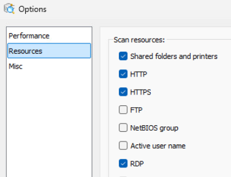
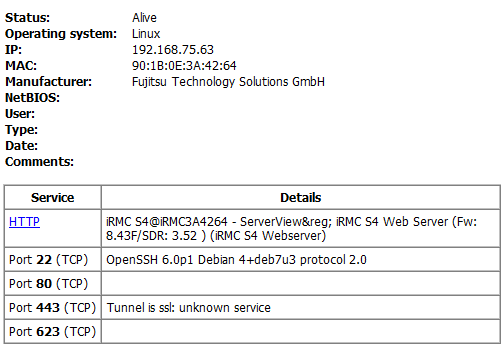
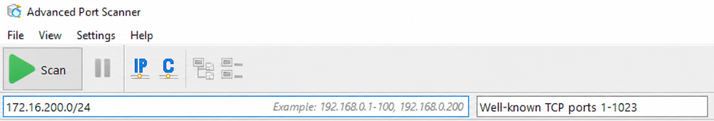

# Praktiline töö: võrgu ja portide skaneerimine

## Eesmärk

Praktilise töö eesmärk on õppida tuvastama võrgus olevaid seadmeid, avatud TCP-porte ja nende taga töötavaid teenuseid ning võrrelda kahe võrguskannimise tööriista võimalusi.

Töö käigus kasutad:

-   **Advanced Port Scannerit** lihtsamaks hostide ja portide
    avastamiseks;
-   **Nmap/Zenmapi** detailsemaks portide, teenuste ja
    operatsioonisüsteemide tuvastamiseks;
-   Zenmapi **Topology** vaadet võrgu visuaalseks kaardistamiseks.
  

Töö lõpuks oskad:

-   skaneerida ühte hosti ja tervet alamvõrku;
-   selgitada, mida tähendab avatud port;
-   seostada levinud porte nende taga töötavate teenustega;
-   kasutada Nmap teenuse ja versiooni tuvastamiseks;
-   kasutada Nmap operatsioonisüsteemi tuvastamiseks;
-   lugeda Zenmapi genereeritud Nmap käsku;
-   võrrelda Advanced Port Scanneri ja Nmap/Zenmapi tulemusi.

!!! warning "Skaneeri ainult lubatud süsteeme" 

    Skaneeri ainult kooli laborivõrgu seadmeid või süsteeme, mille skaneerimiseks on sul    selge luba. Avaliku Interneti skaneerimiseks kasutatakse selles ülesandes ainult
    `scanme.nmap.org` serverit, mille Nmap projekt on loonud Nmap skannide
    harjutamiseks.

------------------------------------------------------------------------

# 1. Advanced Port Scanner

Advanced Port Scanner on Windowsi-põhine võrgu skannimise tööriist,
millega saab otsida võrgus olevaid seadmeid ning nende avatud porte ja
teenuseid.

## 1.1. Advanced Port Scanneri paigaldamine

Kasuta ülesande sooritamiseks mõnda kooli laborikeskkonnas olevat Windowsi virtuaalmasinat, mis asub "Internet" võrgukaardiga võrgus (näiteks PRTG labori masin). Sobiva VM-i puudumisel tuleb see paigaldada.

!!! warning "Microsoft Defender SmartScreeni hoiatus"
    
    Advanced Port Scanneri allalaadimisel võib Windows kuvada Microsoft
    Defender SmartScreeni hoiatuse. SmartScreen kasutab muu hulgas
    rakenduse ja väljaandja reputatsiooni ning hoiatus ei tähenda
    automaatselt, et fail sisaldab pahavara. Kontrolli enne jätkamist, et installer on alla laaditud Advanced Port Scanneri ametlikult veebilehelt ja võid jätkata.

1.  Ava veebileht [Advanced Port
    Scanner](https://www.advanced-port-scanner.com/){ target="_blank" rel="noopener" }.
2.  Vajuta **Free Download**.
3.  Käivita alla laaditud installer.
4.  Vali inglise keel ja vajuta **OK**.
5.  Vali **Install** ja jätka paigaldamist.
6.  Nõustu litsentsitingimustega.
7.  Lõpeta paigaldamine.

## 1.2. Ühe hosti skaneerimine Advanced Port Scanneriga

Selles osas skaneerid kahte enda laborikeskkonnas olevat seadet, mille lõid Zabbixi laboris:

-   MikroTik ruuterit (ükskõik kumb);
-   Zabbix serverit.

Tee nii:

1.  Käivita **Advanced Port Scanner**.
2.  Ava **Settings → Options → Resources**.
3.  Lülita sisse vähemalt **Shared folders and printers**, **HTTP**,
    **HTTPS** ja **RDP**.
4.  Ava **Settings → Options → Performance**.
5.  Sea **Scanning speed** sobivalt kiireks (võid jätta ka vaikevaliku).




!!! info "Skannimise kiirus" 
    
    Suurem skannimiskiirus võimaldab kontrollida porte kiiremini, kuid tekitab rohkem võrguliiklust ja kasutab rohkem arvuti ressursse.

## 1.3. MikroTik ruuteri skaneerimine

Sisesta aadressiväljale oma MikroTik ruuteri IP-aadress.

Portideks vali (tee portide lahter tühjaks siis saad valida):

``` text
All TCP ports 1-65535
```

Käivita skann. Kui skann on lõppenud, ava leitud hosti detailid (parempoolne tulp) ja vaata:

-   kas host vastab;
-   milline MAC-aadress tuvastati;
-   milline tootja kuvatakse;
-   millised TCP-pordid on avatud;
-   millised teenused on portidega seotud.

*Tulemuse näide:*



- **Status:** Näitab, kas masin töötab.
- **Operating system:** Näitab, mis operatsioonisüsteem masina peal jookseb.
- **MAC:** Näitab skannitud masina MAC-aadressi.
- **Manufacturer:** Näitab skannitud masina tootjat (pole alati täpne).
- **Service:** siit näeb ära, mis pordid skannitud masinal lahti on ja mille jaoks neid kasutatakse.
Antud masinal on näha, et avatud on pordid 22, 80, 443 ja 623. Pordi numbrite järgi on võimalik leida ka infot internetist, isegi kui kirjeldust pole.


!!! info "Operatsioonisüsteemi tuvastamine" 

    Võrguskanner võib võrgust saadud info põhjal proovida hinnata, milline operatsioonisüsteem seadmel töötab. Selline tulemus ei pruugi alati olla täpne.

!!! tip "Kuvatõmmis"
    
    Tee skanni tulemuse detailidest kuvatõmmis 1!


## 1.4. Zabbix serveri skaneerimine

Korda sama skanni oma Zabbix serveri IP-aadressiga.

!!! tip "Kuvatõmmis"
    
    Tee skanni tulemuse detailidest kuvatõmmis 2!

**Vasta kirjalikult nend kahe kuvatõmmise juurde:**

1.  Millised TCP-pordid olid MikroTik ruuteril avatud?
2.  Millised TCP-pordid olid Zabbix serveril avatud?
3.  Millised teenused suutis Advanced Port Scanner tuvastada?
4.  Millised pordid esinesid mõlemal seadmel?
5.  Mille poolest kahe seadme tulemused erinesid?

## 1.5. Alamvõrgu skaneerimine Advanced Port Scanneriga

Sisesta aadressiks:

``` text
172.16.200.0/24
```

Portideks vali:

``` text
Well-known TCP ports 1-1023
```




Käivita skann ja oota selle lõppemist.


!!! tip "Kuvatõmmis"
    
    Tee skanni tulemusest kuvatõmmis 3 (leitud hostid)!

## 1.6. Tulemuste analüüsimine

Vali tulemustest vähemalt **kolm erinevat hosti** ja koosta nende põhjal
tabel, mis tuleb lisada ka töö esitusse.


| IP-aadress | Avatud pordid | Tuvastatud teenused | Arvatav seadme roll |
| --- | --- | --- | --- |
|host1   |   |   |   |
|host2   |   |   |   |
|host3   |   |   |   |
                                      

!!! question "Mõtle" 

    Mille põhjal saab avatud portide ja teenuste järgi hinnata, millist rolli seade võrgus täidab?

# 2. Nmap ja Zenmap

**Nmap (Network Mapper)** on avatud lähtekoodiga võrgu avastamise ja
turbeauditi tööriist.

**Zenmap** on Nmap graafiline kasutajaliides. Zenmap võimaldab kasutada
Nmap võimalusi graafilise kasutajaliidese kaudu ning näitab samal ajal
ka käsku, millega Nmap tegelikult käivitatakse.

## 2.1. Nmap ja Zenmap paigaldamine Windowsile

1.  Ava [Nmap Download](https://nmap.org/download.html){ target="_blank" rel="noopener" }.
2.  Laadi alla Windowsi **Latest stable release self-installer**.
3.  Käivita installer.
4.  Jäta paigaldatuks vähemalt **Nmap**, **Zenmap** ja **Npcap**.
5.  Jäta Npcapi paigaldamisel vaikimisi valikud.
6.  Lõpeta paigaldamine.
7.  Kontrolli, et Windowsi Start-menüüs oleks olemas **Zenmap**.

## 2.2. Ühe hosti skaneerimine Zenmapiga

Käivita **Zenmap**.

Sisesta **Target** väljale kõigepealt oma MikroTik ruuteri IP-aadress.

Vali profiil:

``` text
Intense scan, all TCP ports
```

## 2.3. Vaata Nmap käsku

Enne skanni käivitamist vaata Zenmapi **Command** väljale ja kopeeri
genereeritud käsk oma töö vastusesse.

!!! info "Zenmap ja Nmap" 

    Zenmap ei kasuta eraldi skannimismootorit. Graafiline kasutajaliides koostab valikute põhjal Nmap käsu ja käivitab selle.

Käivita skann.

Kui skann on lõppenud:

1.  vali vasakult skannitud host;
2.  ava **Ports/Hosts**;
3.  vaata avatud porte;
4.  vaata tuvastatud teenuseid;
5.  vaata, kas Nmap suutis tuvastada teenuste versioone.

Korda skanni oma Zabbix serveriga.

## 2.4 Nmap käsureavõtmete uurimine

Vaata Zenmapi **Command** väljale genereeritud käsku.

Kirjuta üles vähemalt **kolm käsureavõtit** ja selgita, mida need
teevad.

Näiteks võivad Nmap käskudes esineda:

``` text
-p
-sV
-O
-A
-T4
-v
```

Windowsi käsureal saab Nmap abi kuvada käsuga:

``` powershell
nmap -h
```

## 2.5 Teenuse ja versiooni tuvastamine

Zenmapi **Command** väljale sisesta:

``` bash
nmap -sV SIHTMÄRGI-IP
```

Asenda `SIHTMÄRGI-IP` oma Zabbix serveri IP-aadressiga.

`-sV` käsib Nmapil proovida tuvastada avatud portide taga töötavaid
teenuseid ja nende versioone.

Vasta:

1.  Millised teenused Nmap tuvastas?
2.  Milliste teenuste versiooni suutis Nmap tuvastada?
3.  Kas Advanced Port Scanner näitas sama palju infot?

## 2.6 Operatsioonisüsteemi tuvastamine

Kasuta Zenmapi **Command** väljal:

``` bash
nmap -O SIHTMÄRGI-IP
```

!!! note "Administraatori õigused" 

    Operatsioonisüsteemi tuvastamine võib vajada Zenmapi käivitamist administraatori õigustes.

Vasta:

1.  Millise operatsioonisüsteemi Nmap tuvastas või pakkus?
2.  Kas tulemus vastab tegelikult masinasse paigaldatud
    operatsioonisüsteemile?
3.  Kui täpne oli Nmap hinnang?

!!! info "OS fingerprinting" 

    Nmap hindab operatsioonisüsteemi võrguprotokollide käitumise ja TCP/IP pinule iseloomulike tunnuste põhjal. Tulemus on hinnang ja ei pruugi alati olla täpne.

## 2.7. Alamvõrgu skaneerimine Zenmapiga

Sisesta **Target** väljale:

``` text
172.16.200.0/24
```

Vali profiil:

``` text
Intense scan
```

Käivita skann.

Kui skann on lõppenud:

1.  vaata vasakul **Hosts** nimekirja;
2.  vali erinevaid hoste;
3.  ava **Ports/Hosts**;
4.  võrdle avatud porte ja teenuseid;
5.  vaata, kas Nmap suutis tuvastada seadmete operatsioonisüsteeme.

Vasta:

1.  Kas Advanced Port Scanner ja Zenmap leidsid sama palju hoste?
2.  Kas mõlemad leidsid samad avatud pordid?
3.  Kumb tööriist andis teenuste kohta rohkem infot?
4.  Millist lisainfot andis Nmap/Zenmap?

## 2.8. Võrgu topoloogia

Pärast alamvõrgu skannimist ava **Topology** ja seejärel vajadusel
**Fisheye**.

!!! question "Mõtle" 

    Kas Zenmapi topoloogia näitab kindlasti võrgu tegelikku füüsilist ülesehitust? Millise info põhjal saab Nmap võrgus olevate seadmete kaugust hinnata?

Salvesta alamvõrgu skann:

**Scan → Save Scan**

## 2.9. Lubatud välise serveri skaneerimine

Nmap projekt pakub õppimiseks serverit:

``` text
scanme.nmap.org
```

!!! warning "Piira skannimist" 

    `scanme.nmap.org` on mõeldud Nmap skannide harjutamiseks. Ära tee sellele koormusteste, exploit-katseid ega suurel hulgal korduvaid skanne.

Sisesta Zenmapi **Target** väljale:

``` text
scanme.nmap.org
```

Kasuta profiili:

``` text
Intense scan
```

Käivita skann.

Kui skann on valmis:

1.  ava **Ports/Hosts**;
2.  vaata, millised TCP-pordid leiti;
3.  vaata, milliseid teenuseid Nmap tuvastas;
4.  võrdle tulemust mõne laborivõrgu hostiga;
5.  ava **Topology** ja vaata, kuidas väline host seal paikneb.


## 3. Advanced Port Scanneri ja Nmap/Zenmapi võrdlus

Täida tabel enda katsete põhjal.

  Omadus                             Advanced Port Scanner   Nmap / Zenmap
  ---------------------------------- ----------------------- ---------------
  Hostide avastamine                                         
  Avatud portide leidmine                                    
  Teenuste tuvastamine                                       
  Teenuse versiooni tuvastamine                              
  Operatsioonisüsteemi tuvastamine                           
  Võrgu topoloogia                                           
  Kasutamise lihtsus                                         
  Tulemuste detailsus                                        

Vasta:

**Millises olukorras kasutaksid Advanced Port Scannerit ja millises
Nmap/Zenmapi? Põhjenda.**

# Töö esitamine

Esita töö **ühe PDF-failina**.

PDF peab sisaldama järgmisi kuvatõmmiseid:

1.  Advanced Port Scanneri Mikrotiki ja Zabbix serveri skanni tulemus (1 ja 2);
2.  Advanced Port Scanneri alamvõrgu skanni tulemus (3).
3.  Zenmapi ühe hosti **Ports/Hosts** tulemus.
4.  Zenmapi alamvõrgu skanni tulemus.
5.  Zenmapi **Topology** vaade, kus on näha laborivõrk ja
    `scanme.nmap.org`.

Lisaks peavad töös olema:

-   Advanced Port Scanneriga skannitud MikroTik ruuteri ja Zabbix
    serveri võrdlus ehk vastused küsimustele;
-   vähemalt kolme alamvõrgu hosti analüüsi tabel;
-   Zenmapi genereeritud Nmap käsk;
-   vähemalt kolme Nmap käsureavõtme selgitus;
-   `-sV` skanni tulemuste analüüs;
-   `-O` skanni tulemuste analüüs;
-   Advanced Port Scanneri ja Nmap/Zenmapi võrdlustabel;
-   vastused ülesandes olevatele **Mõtle** küsimustele.

!!! success "Töö tulemus" 

    Kui oled praktilise töö lõpetanud, oskad kasutada võrguskannereid hostide, avatud portide ja teenuste leidmiseks ning oskad hinnata, millist infot saab võrgu kohta Nmapiga koguda.
