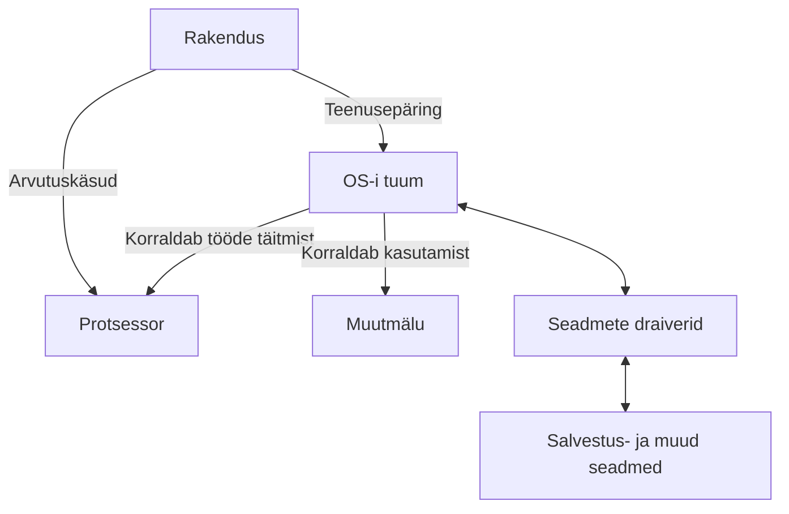

# Operatsioonisüsteemi olemus

Arvuti või telefon ei koosne ainult riistvarast ja kasutaja avatud rakendustest. Nende koostööd korraldab **operatsioonisüsteem**. Selles materjalis vaatame, milleks seda vaja on, millistest osadest see koosneb ja kuidas kasutaja sellega suhtleb.

!!! info "Õpieesmärgid"

    Pärast materjali läbimist oskad:

    - eristada riistvara, operatsioonisüsteemi ja rakendust;
    - selgitada operatsioonisüsteemi peamisi ülesandeid;
    - selgitada tuuma, draiveri ja süsteemiteenuse rolli;
    - võrrelda graafilist kasutajaliidest ja käsurida;
    - eristada terminali, käsukesta ja skripti;
    - tuua näiteid operatsioonisüsteemi teenuste kasutamisest igapäevases töös.

## 1. Milleks on operatsioonisüsteemi vaja?

Kujuta ette, et kuulad sülearvutis muusikat, avad brauseri ja laadid alla faili. Kõik need rakendused vajavad protsessori aega ja mälu. Lisaks tuleb juhtida heliseadet, võrguadapterit ning salvestusseadet. Rakendused peavad saama töötada nii, et ühe tegevus ei rikuks teise andmeid.

**Operatsioonisüsteem** ehk **OS** (*operating system*) on süsteemitarkvara, mis haldab seadme ressursse ning pakub rakendustele ja kasutajale vajalikke teenuseid. Ressursid on näiteks protsessori aeg, muutmälu, salvestusruum ja ühendatud seadmed.

OS on tarkvara kogum. Selle hulka kuuluvad tuum, mitmesugused süsteemiteenused ja tööriistad. Kasutajale tuttav töölaud on ainult osa tervikust.

| Mõiste | Mida see tähendab? | Näited |
| --- | --- | --- |
| **Riistvara** | Seadme füüsilised osad. | Protsessor, RAM, SSD, kuvar, klaviatuur. |
| **Operatsioonisüsteem** | Tarkvara, mis korraldab ressursside kasutamist ja rakenduste tööd. | Windows, macOS, Debian Linux, Android. |
| **Rakendus** | Tarkvara, millega kasutaja täidab kindlat ülesannet. | Veebibrauser, tekstiredaktor, mäng, fototöötlusprogramm. |
| **Andmed** | Teave, mida tarkvara töötleb või salvestab. | Tekst, fotod, helifailid ja seadistused. |

!!! example "Näide: foto avamine"

    Foto on andmefail. Pildivaatur on rakendus, mis oskab foto faili sisu tõlgendada. Operatsioonisüsteem kontrollib ligipääsu failile, korraldab selle lugemise salvestusseadmelt ja võimaldab rakendusel kasutada mälu ning ekraani. Riistvara täidab vajalikud arvutused ja kuvab tulemuse.

Operatsioonisüsteem ja rakendus ei ole sama asi. Näiteks brauseri vahetamine ei tähenda operatsioonisüsteemi vahetamist. Samuti ei tähenda uue töölauateema valimine uue OS-i paigaldamist.

## 2. Operatsioonisüsteemi peamised ülesanded

| Ülesanne | Mida OS korraldab? | Igapäevane näide |
| --- | --- | --- |
| **Programmide töö** | Programmide käivitamine, töötavate protsesside haldamine ja protsessoriaja jagamine. | Brauser ja muusikapleier saavad mõlemad töötada. |
| **Mäluhaldus** | Mälu eraldamine ja vabastamine ning protsesside mälu kaitsmine. | Fototöötlusprogramm saab tööks vajaliku mälu. |
| **Failide ja salvestusruumi haldus** | Failide ja kaustade loomine, leidmine, lugemine ning kirjutamine. | Dokumendi salvestamine oma kausta. |
| **Seadmete kasutamine** | Suhtlus seadmetega draiverite ja teiste süsteemikomponentide kaudu. | Heli jõuab kõrvaklappidesse. |
| **Kaitse ja õigused** | Kasutajate ja rakenduste lubatud tegevuste kontrollimine. | Üks õppija ei saa lugeda teise õppija kaitstud faile. |
| **Suhtlus ja jälgimine** | Võrguühenduste, protsessidevahelise suhtluse ning töö jälgimiseks vajalike andmete pakkumine. | Rakendus saab võrku kasutada ja süsteem kuvab ressursikasutust. |

Kasutaja suhtleb OS-iga näiteks töölaua, seadistusakende või käsurea kaudu. Rakendused kasutavad OS-i pakutavaid programmeerimisliideseid ja teenuseid.

!!! tip "Pea meeles"

    OS ei tee kõiki kasutaja ülesandeid ise. Brauser tõlgendab veebilehte ja pildivaatur fotot. Operatsioonisüsteem loob rakendustele töötamiseks vajaliku keskkonna.

## 3. Tuum ja operatsioonisüsteemi ülejäänud osad

**Tuum** ehk **kernel** on operatsioonisüsteemi keskne osa. See korraldab muu hulgas protsessori ja mälu kasutamist ning vahendab kaitstud toiminguid. Tuum on vajalik ka siis, kui ekraanil ei ole graafilist töölauda.

**Süsteemiteenused** teevad taustal vajalikke töid, näiteks haldavad võrguühendusi või prindijärjekorda. **Draiverid** võimaldavad operatsioonisüsteemil kasutada konkreetseid seadmeid. **Kasutajaliides** pakub kasutajale võimaluse süsteemi juhtida.

Tuum, töölaud ja kasutajaliidese seadistusaken võivad kuuluda sama operatsioonisüsteemi juurde, kuid nende ülesanded on erinevad.

Järgmine skeem näitab lihtsustatult rakenduse ja süsteemikomponentide koostööd. Protsessor täidab rakenduse arvutuskäske. OS korraldab tööde täitmist ja vahendab kaitstud toiminguid, näiteks seadmete kasutamist.

Skeem ei näita kõiki OS-i komponente ega iga tegevuse täpset teed. Tuuma ja draiverite töökorraldus võib süsteemiti erineda.

## 4. Graafiline kasutajaliides, käsurida ja skriptid

**Graafiline kasutajaliides** ehk **GUI** (*graphical user interface*) kasutab aknaid, ikoone, menüüsid ja muid visuaalseid elemente. Seda saab juhtida näiteks hiire, klaviatuuri või puuteekraani kaudu.

**Käsurealiides** ehk **CLI** (*command-line interface*) võimaldab arvutit juhtida tekstikäskudega. Kasutaja sisestab käsu ning saab vastuseks tulemuse või teate.

**Käsukest** ehk **shell** on programm, mis tõlgendab kasutaja sisestatud käske. See teeb käsule vastava toimingu ise või käivitab selleks teise programmi. Näiteks saab käsukesta kaudu käivitada rakendusi, luua kaustu ja korraldada failidega tehtavaid toiminguid. Levinud käsukestad on **Bash**, **Zsh** ja **PowerShell**.

**Terminal** võimaldab teksti sisestada ja väljundit kuvada. Graafilises töölauas kasutatakse selleks tavaliselt terminalirakendust, mille sees töötab käsukest. Terminal ja käsukest täidavad erinevaid ülesandeid: terminal pakub suhtlemiseks akna, käsukest tõlgendab selles sisestatud käske.

!!! example "Näide: kausta loomine"

    Kasutaja sisestab käsu terminali. Käsukest tõlgendab seda ja korraldab kausta loomise. Võimalik tulemus või veateade kuvatakse terminalis. Edukas käsk ei pruugi alati tekstilist vastust anda.

**Skript** on fail, millesse on salvestatud tõlgendaja täidetavad käsud. Käsukest saab sobivat skripti käivitades täita need käsud ilma, et kasutaja peaks iga käsku eraldi sisestama. Näiteks võib skript luua mitu kausta ja kopeerida neisse vajalikud failid.

!!! tip "Pea meeles"

    - **CLI** on tekstikäskudel põhinev suhtlusviis.
    - **Terminal** võimaldab käske sisestada ja väljundit näha.
    - **Shell** ehk käsukest tõlgendab käske ja korraldab nende täitmise.
    - **Skript** võimaldab salvestatud käske automatiseeritult täita.

| Võrdlus | GUI | CLI |
| --- | --- | --- |
| Kuidas tegevus antakse? | Valikute, nuppude ja graafiliste objektide kaudu. | Tekstikäskude ja nende argumentidena. |
| Millal on mugav? | Visuaalsete tegevuste ja valikute uurimisel. | Korduvate toimingute, kaugjuhtimise ja täpsete käskude puhul. |
| Mida on vaja õppida? | Rakenduse ülesehitust ja valikute tähendust. | Käskude nimetusi, süntaksit ja argumente. |
| Kas saab automatiseerida? | Jah, sobivate tööriistadega. | Jah, näiteks käskude skriptiks ühendamisega. |

!!! tip "IT-spetsialisti tööriistad"

    GUI ja CLI oskused täiendavad teineteist. Hea valik sõltub ülesandest: üht pilti võib olla mugav töödelda graafiliselt, sadadele failidele sama muudatuse tegemiseks võib sobida skript.

## 5. Enesekontroll

Vasta kõigepealt ise. Seejärel ava vastus ja võrdle oma põhjendust.

### 1. Kas Firefox, Windows ja SSD kuuluvad samasse kategooriasse?

??? success "Vaata vastust"

    Ei. Firefox on rakendus, Windows operatsioonisüsteem ja SSD riistvara. Need teevad arvutis koostööd, kuid täidavad erinevaid ülesandeid.

### 2. Miks on muusikapleieril ja brauseril vaja operatsioonisüsteemi?

??? success "Vaata vastust"

    OS korraldab nende protsessori- ja mälukasutust ning pakub failide, võrgu ja seadmete kasutamiseks vajalikke teenuseid. Näiteks muusikapleier vajab heli väljastamist ja brauser võrguühendust.

### 3. Kas Linuxi kasutamiseks peab alati käske sisestama?

??? success "Vaata vastust"

    Ei. Linuxi süsteemi saab kasutada graafilise töölauaga. Käsurida on lisavõimalus ning eriti kasulik haldamisel ja automatiseerimisel. Ka Windowsis kasutatakse käsurida.

### 4. Kas graafiline töölaud ja OS-i tuum on sama asi?

??? success "Vaata vastust"

    Ei. Graafiline töölaud pakub kasutajale visuaalse suhtlemisvõimaluse. Tuum korraldab muu hulgas protsessori ja mälu kasutamist ning kaitstud toiminguid. Tuum on vajalik ka siis, kui graafilist töölauda ei kasutata.

### 5. Mis vahe on terminalil ja käsukestal? Too üks käsukesta näide.

??? success "Vaata vastust"

    Terminal võimaldab teksti sisestada ja väljundit kuvada. Käsukest tõlgendab käske ning täidab toimingu ise või käivitab teise programmi. Käsukestad on näiteks Bash, Zsh ja PowerShell.

### 6. Millal võiks käske skripti salvestada?

??? success "Vaata vastust"

    Siis, kui sama toimingut on vaja korrata või mitu käsku järjest täita. Näiteks saab skriptiga luua õppematerjalide jaoks mitu kausta ja kopeerida neisse vajalikud failid.

### 7. Miks peab OS kontrollima rakenduste ja kasutajate ligipääsu failidele?

??? success "Vaata vastust"

    Selleks, et faile saaksid lugeda või muuta ainult selleks õiguse saanud kasutajad ja rakendused. Nii kaitstakse teiste kasutajate andmeid ja vähendatakse soovimatute muudatuste võimalust.

## Kokkuvõte

- Riistvara all mõtleme seadme füüsilisi osasid, OS korraldab nende kasutamist ja rakendus täidab kasutaja ülesannet.
- OS haldab protsessoriaega, mälu, faile, seadmeid, õigusi ja suhtlust.
- Tuum ehk *kernel* on OS-i keskne osa. Draiverid võimaldavad kasutada konkreetseid seadmeid ja süsteemiteenused täidavad taustal vajalikke ülesandeid.
- Graafiline töölaud on üks võimalus süsteemiga suhelda. OS saab töötada ka ilma graafilise töölauata.
- GUI kasutab visuaalseid elemente, CLI tekstikäske. Mõlemad on IT-töös kasulikud.
- Terminal võimaldab käske sisestada ja väljundit näha; käsukest ehk *shell* tõlgendab käske.
- Skript salvestab tõlgendaja täidetavad käsud ning aitab toiminguid automatiseerida.

### Mõtle õpitule

1. Mõtle oma arvutile või telefonile. Kirjelda üht igapäevast tegevust ning selgita, mida teevad selle juures rakendus, operatsioonisüsteem ja riistvara.
2. Millist toimingut teeksid meelsamini graafiliselt ja millist käsureal? Põhjenda ning too näide tegevusest, mille kordamist võiks skriptiga lihtsustada.
3. Milline mõiste vajab veel harjutamist: tuum, draiver, terminal või käsukest? Selgita seda oma sõnadega ja sõnasta üks küsimus, millele tahaksid vastuse leida.

## Teema sõnastik

| Mõiste | Selgitus |
| --- | --- |
| Operatsioonisüsteem; OS (*operating system*) | Süsteemitarkvara, mis haldab seadme ressursse ning pakub rakendustele ja kasutajale teenuseid. |
| Riistvara (*hardware*) | Seadme füüsilised osad, näiteks protsessor, muutmälu ja salvestusseade. |
| Rakendus (*application*) | Tarkvara, millega kasutaja täidab kindlat ülesannet, näiteks kirjutab teksti või töötleb fotosid. |
| Ressurss (*resource*) | Tööks kasutatav võimalus või vahend, näiteks protsessori aeg, mälu või salvestusruum. |
| Tuum (*kernel*) | OS-i keskne osa, mis korraldab muu hulgas protsessori ja mälu kasutamist ning kaitstud toiminguid. |
| Draiver (*driver*) | Tarkvarakomponent, mis võimaldab OS-il kasutada konkreetset seadet. |
| Süsteemiteenus (*system service*) | Taustal töötav tarkvara, mis täidab süsteemi jaoks vajalikku ülesannet, näiteks haldab prindijärjekorda. |
| Protsess (*process*) | Käivitatud programmi töötav eksemplar koos täitmiseks vajaliku oleku ja ressurssidega. |
| Mäluhaldus (*memory management*) | Mälu eraldamine ja vabastamine ning protsesside mälukasutuse korraldamine ja kaitsmine. |
| Interaktiivne töö (*interactive operation*) | Tööviis, kus kasutaja annab sisendi ja saab töö käigus vastuseid. |
| Graafiline kasutajaliides; GUI (*graphical user interface*) | Kasutajaliides, mis kasutab aknaid, ikoone, menüüsid ja muid visuaalseid elemente. |
| Käsurealiides; CLI (*command-line interface*) | Tekstikäskudel põhinev suhtlusviis arvuti või programmiga. |
| Terminal (*terminal*) | Teksti sisestamise ja väljundi kuvamise keskkond; graafilises töölauas tavaliselt terminalirakendus. |
| Käsukest (*shell*) | Programm, mis tõlgendab käske, täidab oma sisseehitatud toiminguid või käivitab teisi programme. |
| Skript (*script*) | Fail, millesse on salvestatud tõlgendaja täidetavad käsud. |

## Allikad ja lisalugemine

1. [Debian: Definitions and overview](https://www.debian.org/doc/manuals/debian-faq/basic-defs.en.html){ target="_blank" rel="noopener" }.
2. [Operating System Tutorial](https://www.tutorialspoint.com/operating_system/index.htm){ target="_blank" rel="noopener" }
3. [What is Operating System? Tutorial](https://www.guru99.com/operating-system-tutorial.html){ target="_blank" rel="noopener" }

---
*Õppematerjali koostaja: Priit Paap, 2026*
