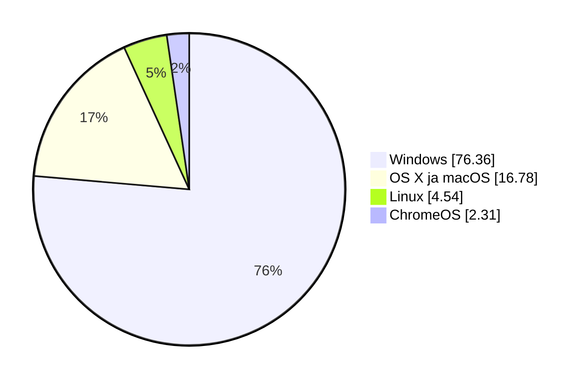
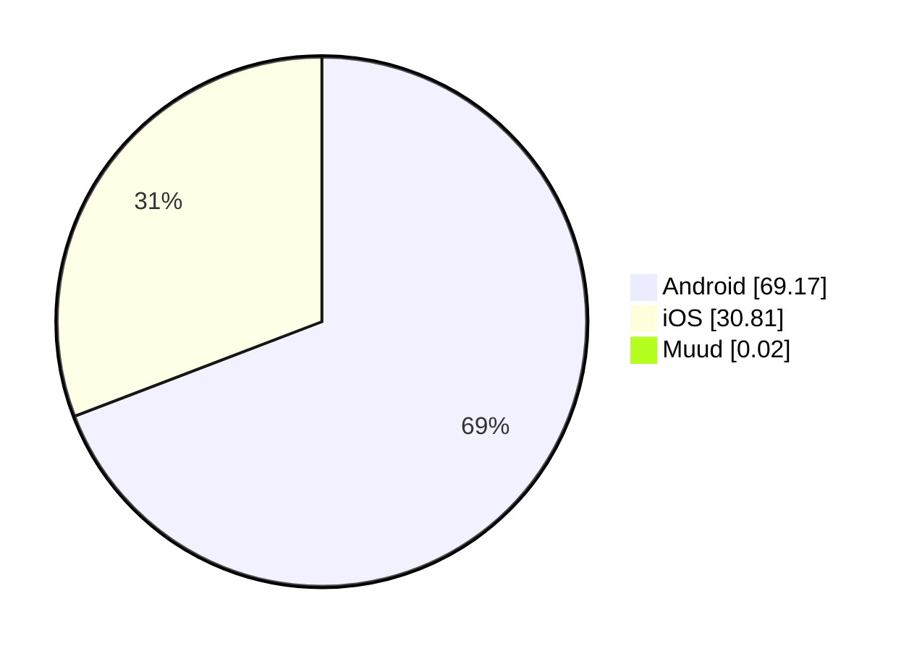

# Operatsioonisüsteemide liigid ja kasutus

Operatsioonisüsteemi sobivus sõltub seadme ja kasutaja vajadustest. Selles materjalis tutvume levinud süsteemidega, võrdleme nende liike ja kasutuskohti ning uurime, mida saab järeldada turujaotusest.

!!! info "Õpieesmärgid"

    Pärast materjali läbimist oskad:

    - tuua näiteid levinud operatsioonisüsteemidest ja nende kasutuskohtadest;
    - kirjeldada ja võrrelda pakktöötluslikku, ajajaotuslikku, reaalajalist ja võrguoperatsioonisüsteemi;
    - kasutada nende liikide eestikeelseid ja ingliskeelseid nimetusi ning lühendeid RTOS ja NOS;
    - selgitada, kuidas OS-i liigid ja kasutusotstarbed võivad kattuda;
    - tõlgendada turujaotuse andmeid, arvestades seadmerühma ja mõõtmismeetodit;
    - põhjendada operatsioonisüsteemi valikut kasutaja ja seadme vajaduste järgi.

## 1. Levinud operatsioonisüsteemid

| Operatsioonisüsteem või süsteemipere | Levinud kasutuskoht | Mida meeles pidada? |
| --- | --- | --- |
| **Microsoft Windows** | Laua- ja sülearvutid; Windows Serveri tooted serverites. | Tööjaama ja serveri süsteemid on eri vajadustega tooted. |
| **Apple macOS** | Apple'i Mac-arvutid. | Kuulub Apple'i arvutite tarkvarakeskkonda. |
| **Linuxi distributsioonid** | Tööjaamad, serverid ja mitmesugused eriseadmed. | Linuxi süsteem võib töötada graafilise töölauaga või ilma selleta. |
| **Android** | Telefonid, tahvelarvutid ja muud nutiseadmed. | Põhineb Linuxi tuumal ja pakub oma rakenduskeskkonda. |
| **Apple iOS ja iPadOS** | iPhone'id ja iPadid. | Telefoni ja tahvelarvuti süsteemid on kohandatud nende seadmete kasutamiseks. |
| **ChromeOS** | Chromebookid ja teised sobivad seadmed. | ChromeOS on operatsioonisüsteem; Chrome on veebibrauser. |

!!! warning "Levinud eksiarvamus"

    Linux ei tähenda ainult käsurida ning Windows ei tähenda ainult graafilist töölauda. Mõlemas saab kasutada graafilisi tööriistu ja käsurida. Ubuntu Desktop on näiteks graafilise töölauaga Linuxi süsteem.

## 2. Süsteemide liigitamine kasutusotstarbe järgi

Üks võimalus süsteeme võrrelda on vaadata, **millise seadme või ülesande jaoks neid kasutatakse**.

| Kasutusotstarve | Iseloomulik vajadus | Näide |
| --- | --- | --- |
| **Tööjaam** | Inimese igapäevane töö ja rakenduste kasutamine. | Windowsi, Linuxi või macOS-iga sülearvuti. |
| **Server** | Teenuste pakkumine teistele seadmetele ja kasutajatele. | Linuxi veebiserver või Windows Serveriga failiserver. |
| **Mobiilseade** | Puutejuhtimine, aku kasutamine ja mobiilirakendused. | Androidiga telefon. |
| **Võrguseade** | Võrguliikluse suunamine ja seadme haldamine. | RouterOS-iga ruuter või Cisco IOS-iga võrguseade. |
| **Manusseade (*embedded system*)** | Konkreetse seadme juhtimine. | Juhtseade, tööstusseade või nutikas koduseade. |

**Manussüsteem** on arvutisüsteem, mis on osa suuremast seadmest ja täidab selles kindlat ülesannet. Kõik manussüsteemid ei kasuta Linuxit ega isegi terviklikku operatsioonisüsteemi. Mõne seadme juhtimiseks piisab väikesest püsivaraprogrammist.

Need kategooriad võivad kattuda. Sama Linuxi distributsiooni saab kasutada nii tööjaamas kui ka serveris. Serveri määrab eelkõige tema ülesanne: ta pakub teenust.

### Operatsioonisüsteemide liigid töökorralduse ja eesmärgi järgi

Operatsioonisüsteeme saab liigitada ka nende **töökorralduse ja peamise eesmärgi** järgi. Järgnevad neli liiki kuuluvad selle teema põhimõistete hulka. Õpi tundma nii nende eestikeelseid kui ka ingliskeelseid nimetusi.

### 2.1. Pakktöötluslik operatsioonisüsteem — Batch Operating System

**Pakktöötluslik operatsioonisüsteem** korraldab ettevalmistatud tööde ehk **pakktööde** (*batch jobs*) automaatset täitmist. Kasutaja annab ette programmi, vajalikud andmed ja tööjuhised. Süsteem võtab tööd vastu, hoiab neid järjekorras ja suunab täitmisele. Tavapärasel täitmisel ei küsita kasutajalt iga sammu juures uut sisendit. [9], [10]

Töökorralduse võib jagada neljaks sammuks:

1. Kasutaja või teine süsteem valmistab töö ja sisendandmed ette.
2. Töö antakse süsteemile täitmiseks.
3. Süsteem täidab töö, kui selle käivitamise tingimused ja vajalikud ressursid on olemas.
4. Tulemus salvestatakse või väljastatakse ning töö õnnestumine või viga registreeritakse.

**Näide:** ettevõtte töötajate palgaandmed kogutakse kokku ja palgaarvestus käivitatakse ühe pakktööna. Kasutaja vaatab tulemusi pärast töötlemist.

Pakktöötlus sobib mahukate ja korduvate tööde jaoks. Kasutaja võib tulemuse saamiseks oodata ning sisendandmete viga võib selguda alles töö käigus. Pakktöötlus ei nõua, et kõik tööd täidetaks alati ükshaaval: süsteem võib võimaluse korral täita mitut tööd paralleelselt.

**Süsteeminäide:** IBM z/OS-i pakktöötluskeskkond. z/OS toetab ka teisi töötlusviise. Pakktöötlust kasutatakse samuti tänapäevases Windowsis ja Linuxis, näiteks automatiseeritud aruannete või failitöötluse jaoks. Üks pakktöö ei muuda kogu OS-i ainult pakktöötluslikuks. [10]

### 2.2. Ajajaotuslik operatsioonisüsteem — Time-Sharing Operating System

**Ajajaotuslik operatsioonisüsteem** jagab protsessori tööaega mitme töö ja kasutaja vahel, et võimaldada **interaktiivset kasutamist**. Interaktiivne tähendab, et kasutaja annab sisendi ja saab töö käigus vastuse. [11]

Lihtsustatud mudelis saab üks töö protsessorit kasutada lühikese **ajaviilu** (*time slice*) jooksul, seejärel saab võimaluse teine töö. Kiire vahetamine jätab kasutajale mulje, et tööd liiguvad edasi korraga. Tegelik ajajaotus arvestab ka näiteks tööde prioriteete ja seda, kas töö ootab andmeid. Mitmetuumalises protsessoris saab osa töid ka päriselt paralleelselt täita.

**Näide:** mitu õppijat kasutab samal ajal sama Linuxi serverit käsurea kaudu. Üks kirjutab teksti, teine käivitab programmi ja kolmas uurib faile. OS jagab ressursse ning kaitseb kasutajate tööd üksteise eest.

Ajajaotus võimaldab jagada ühte arvutit paljude tööde vahel. Koormuse kasvades võib reageerimine aeglustuda. Protsessoriaja jagamist käsitleme lähemalt materjalis „Operatsioonisüsteemi põhifunktsioonid”.

**Süsteeminäited:** Unix ja Linux. Protsessoriaja jagamist kasutavad ka tänapäevased Windows ja macOS.

### 2.3. Reaalajaline operatsioonisüsteem — Real-Time Operating System

**Reaalajaline operatsioonisüsteem**, ka **reaalajaoperatsioonisüsteem** ehk **RTOS** (*real-time operating system*), on kavandatud ajakriitiliste ülesannete täitmiseks. Tulemus peab olema nii sisuliselt õige kui ka saabuma nõutud **tähtaja** (*deadline*) jooksul. Oluline on reageerimisaja ennustatavus. [3], [12]

**Näide:** tööstusroboti juhtsüsteem peab anduri signaali põhjal mootori juhtkäsku muutma ettenähtud aja jooksul. Hilinenud õige käsk võib saabuda liiga hilja, et vältida seadme kahjustamist.

Reaalajanõuded võivad olla erineva rangusega:

- **Range reaalajanõue** (*hard real-time*): tähtaja ületamine tähendab süsteemi nõude rikkumist ja võib põhjustada ohtliku olukorra.
- **Pehme reaalajanõue** (*soft real-time*): hilinemine halvendab teenuse kvaliteeti, näiteks põhjustab heli katkemise.

RTOS aitab korraldada ülesannete ajastamist ja prioriteete. Kogu süsteemi suutlikkus tähtaegu täita sõltub ka riistvarast ning rakenduse ülesehitusest.

**Süsteeminäited:** FreeRTOS ja QNX. Need sobivad näiteks juhtseadmete ja muude manussüsteemide tarkvara aluseks.

!!! tip "Reaalajaline ei tähenda lihtsalt väga kiiret"

    Võrdle kaht süsteemi: esimene vastab tavaliselt kiiresti, kuid vahel väga suure viivitusega; teise vastamisaeg püsib nõutud piirides. Ajaliselt kriitilise juhtimise puhul on oluline teise süsteemi ennustatavus. Kiire mänguarvuti ei ole selle kiiruse tõttu automaatselt reaalajasüsteem.

### 2.4. Võrguoperatsioonisüsteem — Network Operating System

**Võrguoperatsioonisüsteem** ehk **NOS** (*network operating system*) on selles liigituses operatsioonisüsteem, mille oluline ülesanne on pakkuda ja hallata võrgus ühiseid ressursse ning teenuseid.

Serverikeskkonnas kuuluvad nende hulka näiteks:

- failide ja printerite jagamine;
- kasutajakontode ning ligipääsuõiguste haldamine;
- kasutajate sisselogimise kontrollimine;
- võrguteenuste ja nende töö jälgimine.

**Näide:** õppija logib kooli arvutisse oma kontoga ja avab serveris asuva isikliku kausta. Server kontrollib tema õigusi ning lubab kasutada talle määratud faile.

**Süsteeminäited:** Windows Server või võrguteenuste jaoks seadistatud Linuxi server. Vajalikud teenused tuleb paigaldada ja seadistada. Näiteks Samba võimaldab Linuxis pakkuda võrgus failide ja printerite jagamist. [13], [14]

Ühine haldus lihtsustab ressursside jagamist, kuid teenuse katkestus või valesti määratud õigused võivad mõjutada paljusid kasutajaid.

Mõistet *network operating system* kasutatakse ka võrguseadmete, näiteks ruuterite ja kommutaatorite OS-ide kohta. Nende põhiülesanne on võrguliikluse juhtimine. Seetõttu tuleb termini tähendus siduda kontekstiga: kas räägitakse serveri võrguteenustest või võrguseadme juhtimisest.

### 2.5. Nelja liigi võrdlus

| Liik ja ingliskeelne nimetus | Peamine eesmärk | Millal tulemust vajatakse? | Näidisülesanne |
| --- | --- | --- | --- |
| **Pakktöötluslik** — *Batch Operating System* | Ettevalmistatud tööde automaatne täitmine. | Pärast töö valmimist; kasutaja ei pea iga sammu juhtima. | Kuu palgaarvestus. |
| **Ajajaotuslik** — *Time-Sharing Operating System* | Ressursside jagamine ja interaktiivse töö võimaldamine. | Kasutaja ootab töö käigus piisavalt kiiret vastust. | Mitu kasutajat töötab samas serveris. |
| **Reaalajaline** — *Real-Time Operating System*, **RTOS** | Ajaliselt kriitiliste ülesannete ennustatav täitmine. | Määratud tähtaja jooksul. | Tööstusroboti juhtimine. |
| **Võrguoperatsioonisüsteem** — *Network Operating System*, **NOS** | Ühiste võrguressursside ja teenuste pakkumine ning haldamine. | Vastavalt pakutava teenuse vajadustele. | Koolis kontode ja jagatud kaustade haldamine. |

!!! info "Liigid võivad kattuda"

    Need nimetused kirjeldavad eri rõhuasetusi. Pakktöötlus ja ajajaotus kirjeldavad töökorraldust, reaalajalisus ajalisi nõudeid ning võrguoperatsioonisüsteem teenuste pakkumise rolli.

    Näiteks Linuxi server võib pakkuda võrgu kaudu jagatud kaustu, jagada protsessoriaega mitme kasutaja vahel ja käivitada öiseid pakktöid. Süsteemi kirjeldamisel selgita, millist omadust parasjagu võrdled.

## 3. Operatsioonisüsteemide turujaotus

**Turujaotus** näitab, kui suure osa vaadeldavast turust või kasutusest moodustab mingi operatsioonisüsteem. Tulemus sõltub sellest, milliseid seadmeid, piirkonda ja ajavahemikku uuritakse ning mida mõõdetakse.

!!! info "Andmete aeg ja ulatus"

    Arvutite, telefonide ja tahvelarvutite andmed pärinevad **Statcounter Global Statsist** ning kirjeldavad **2026. aasta septembri ülemaailmset veebikasutust**. Veebisaitide serverite andmed pärinevad **W3Techsist seisuga 4. oktoober 2026**.

    Need on eri meetoditega koostatud ülevaated. Maailma jaotus võib erineda Eesti, sinu kooli või konkreetse ettevõtte jaotusest.

Statcounter hindab operatsioonisüsteemide osakaalu oma mõõtmises osalevate veebisaitide **lehevaatamiste** põhjal. See tähendab, et aktiivselt veebis surfav seade võib anda rohkem lehevaatamisi kui harva kasutatav seade.

Näiteks Windowsi 76,36% osakaal arvutite tabelis tähendab, et ligikaudu 76 lehevaatamist sajast tehti Windowsiga arvutist. See ei tähenda, et täpselt 76 arvutit sajast kasutaks Windowsi.

**Veebikasutuse osakaal, seadmete arv ja uute seadmete müük on erinevad näitajad.** Allpool olevad tabelid ei mõõda müüki ega loenda kõiki maailma seadmeid.

### Laua- ja sülearvutid

Statcounteri arvutite ehk *desktop*-kategoorias on Windows suurima osakaaluga operatsioonisüsteem.

| Operatsioonisüsteem või rühm | Osakaal arvutite veebikasutuses |
| --- | ---: |
| Windows | 76,36% |
| Apple'i arvutite OS-id: OS X ja macOS kokku | 16,78% |
| Linux | 4,54% |
| ChromeOS | 2,31% |

### Nutitelefonid

Telefonide veebikasutuses on kaks peamist operatsioonisüsteemi: Android ja iOS.

| Operatsioonisüsteem või rühm | Osakaal telefonide veebikasutuses |
| --- | ---: |
| Android | 69,17% |
| iOS | 30,81% |
| Muud kokku | 0,02% |

### Tahvelarvutid

Tahvelarvutite jaotus erineb telefonide jaotusest: Apple'i ja Androidi osakaalud on selles ülevaates peaaegu võrdsed.

| Operatsioonisüsteem või rühm | Osakaal tahvelarvutite veebikasutuses |
| --- | ---: |
| Apple'i tahvelarvutite OS-id | 50,35% |
| Android | 49,57% |
| Muud kokku | 0,08% |

### Seadmerühmad koos

Kui vaadata Statcounteri mõõdetud veebikasutust eri seadmerühmade peale kokku, on esikohal Android.

| Operatsioonisüsteem või rühm | Osakaal veebikasutuses üle seadmerühmade |
| --- | ---: |
| Android | 42,54% |
| Windows | 28,98% |
| iOS | 19,45% |
| Apple'i arvutite OS-id: OS X ja macOS kokku | 6,37% |
| Linux | 1,73% |
| Ülejäänud kategooriad kokku, arvutatud | 0,93% |

Apple'i arvutite rühm on arvutatud **4,05% + 2,32% = 6,37%**. Ülejäänud kategooriate osakaal on saadud tabeli teiste rühmade summa lahutamisel 100%-st.

See tabel arvestab seadmerühmade lehevaatamisi koos. See ei ole eelnevate tabelite protsentide lihtne keskmine ega hõlma kõiki maailma servereid ja nutiseadmeid.

### Veebisaitide serverite operatsioonisüsteemid

**Server** pakub teistele seadmetele teenuseid. Näiteks veebiserver saadab sinu brauserile veebilehe sisu. Serverite operatsioonisüsteemide jaotus võib kasutajate arvutite jaotusest tugevalt erineda.

W3Techs uurib veebisaitide kasutatavaid tehnoloogiaid. Järgnev tabel näitab osakaalu **veebisaitide hulgas, mille serveri operatsioonisüsteem on W3Techsile teada**.

| Operatsioonisüsteemide rühm | Seda rühma kasutavate veebisaitide osakaal |
| --- | ---: |
| Unix ja Unixi-laadsed süsteemid | 92,1% |
| Windows | 8,1% |

W3Techsi **Unix**-rühm hõlmab ka Linuxit ja BSD-süsteeme. **92,1% ei ole Linuxi eraldi turuosa.**

Üks veebisait võib kasutada mitut operatsioonisüsteemi, mistõttu osakaalude summa võib ületada 100%. See ülevaade ei loenda kõiki füüsilisi ega virtuaalseid servereid ning ei kirjelda eraldi näiteks kooli failiservereid või ettevõtte sisevõrku.

### Mida sellest järeldada?

- **Täpsusta alati keskkonda.** Küsimusele „Milline OS on kõige levinum?” vastamiseks peab teadma, kas räägitakse arvutitest, telefonidest või serveritest.
- **Väiksem osakaal ühes keskkonnas ei tähenda vähest tähtsust kõikjal.** Näiteks Linuxi väike osakaal arvutite veebikasutuses ei kirjelda selle rolli serverites.
- **IT-töös on kasulik tunda mitut operatsioonisüsteemi.** Kasutaja tööarvuti ja talle teenust pakkuv server võivad kasutada erinevaid süsteeme.
- **Populaarsus ei määra sobivust.** OS-i valikul loevad ka vajalike rakenduste tugi, riistvara, turvauuendused, hind ja kasutusotstarve.
- **Vaata andmete kuupäeva ja allikat.** Osakaalud muutuvad ning eri mõõtmismeetodid võivad anda erineva tulemuse.

## 4. Kuidas operatsioonisüsteemi valida?

Sobiv süsteem peab vastama kasutaja ja seadme vajadustele. Valiku tegemisel tuleb arvestada järgmisega:

- **Rakendused:** kas vajalik tarkvara toetab seda OS-i?
- **Riistvara:** kas protsessor, mälu ja seadmete draiverid sobivad?
- **Kasutusotstarve:** kas eesmärk on õppimine, mängimine, serveriteenuse pakkumine või seadme juhtimine?
- **Hooldus ja tootetugi:** kui kaua saab süsteem turvauuendusi ning kes seda haldab?
- **Litsents ja kulud:** millised kasutustingimused kehtivad ning mida maksavad litsents ja tugi?
- **Kasutajate oskused:** kas süsteemi kasutamiseks ja haldamiseks on vajalikud teadmised olemas?

**Avatud lähtekood** tähendab, et lähtekood on kättesaadav ja litsents lubab seda kindlatel tingimustel kasutada, muuta ning levitada. See ei tähenda automaatselt tasuta tugiteenust. **Omandusliku tarkvara** muutmise ja levitamise võimalusi piirab tavaliselt tootja litsents ning lähtekood ei ole üldjuhul avalik.

Rakendus peab sobima nii OS-i kui ka protsessori arhitektuuriga. Näiteks x86-64 ja ARM64 on erinevad arhitektuurid. Failivormingu toetamine ja rakenduse käivitamine on samuti eri asjad: foto võib avaneda mitmes OS-is, kuid ühe OS-i jaoks tehtud programm ei pruugi teises otse töötada.

## 5. Enesekontroll

Vasta kõigepealt ise. Seejärel ava vastus ja võrdle oma põhjendust.

### 1. Mis erinevus on Linuxi tuumal ja Debianil?

??? success "Vaata vastust"

    Linuxi tuum on operatsioonisüsteemi keskne komponent. Debian on distributsioon, mis ühendab tuuma süsteemitööriistade, paketihalduse ja muu tarkvaraga terviklikuks kasutatavaks süsteemiks.

### 2. Kas paljude fotode automaatne töötlemine nõuab eraldi pakktöötluslikku OS-i?

??? success "Vaata vastust"

    Ei. See on pakktöötluse näide, mida saab teha rakenduse või skriptiga ka tavalises tööjaama operatsioonisüsteemis. Töötlusviis ja OS-i kasutusotstarve on erinevad liigitamise alused.

### 3. Kas iga väga kiire arvuti on reaalajasüsteem?

??? success "Vaata vastust"

    Ei. Reaalajasüsteemi puhul on oluline määratud ajaliste piirangute täitmine ja ennustatav käitumine. Suur keskmine kiirus üksi ei taga, et kriitiline tegevus saab õigel ajal valmis.

### 4. Miks ei pruugi Windowsi rakendus Linuxis otse käivituda?

??? success "Vaata vastust"

    Rakendus võib sõltuda Windowsi pakutavatest liidestest ja kasutada selle OS-i käivitatava faili vormingut. Toimimine sõltub ka protsessori arhitektuurist. Mõne rakenduse jaoks on olemas teise OS-i versioon, ühilduvuskiht või virtualiseerimislahendus, kuid seda tuleb eraldi kontrollida.

### 5. Mille järgi valiksid kooli tööarvutile operatsioonisüsteemi?

??? success "Vaata vastust"

    Arvestaksin vajalike rakenduste, riistvara ja draiverite, litsentsi, turvauuenduste ning kasutajate ja haldajate oskustega. Ainult tuttav välimus või populaarsus ei ole piisav valikukriteerium.

### 6. Nimeta neli käsitletud OS-i liiki eesti ja inglise keeles. Mida tähendavad RTOS ja NOS?

??? success "Vaata vastust"

    - Pakktöötluslik operatsioonisüsteem — *Batch Operating System*.
    - Ajajaotuslik operatsioonisüsteem — *Time-Sharing Operating System*.
    - Reaalajaline operatsioonisüsteem — *Real-Time Operating System*, lühend **RTOS**.
    - Võrguoperatsioonisüsteem — *Network Operating System*, lühend **NOS**.

### 7. Millisele liigile viitab iga olukord? Põhjenda põhieesmärgi järgi.

- A. Öösel töödeldakse automaatselt päeva jooksul kogutud arveid.
- B. Mitu kasutajat sisestab samas serveris käske ja ootab töö käigus vastuseid.
- C. Juhtseade peab anduri signaalile reageerima määratud tähtaja jooksul.
- D. Kool haldab serveris kasutajakontosid ja jagatud kaustu.

??? success "Vaata vastust"

    - **A: pakktöötluslik** — ettevalmistatud andmeid töödeldakse automaatselt.
    - **B: ajajaotuslik** — süsteem jagab ressursse mitme kasutaja interaktiivseks tööks.
    - **C: reaalajaline** — vastus peab valmima määratud tähtajaks.
    - **D: võrguoperatsioonisüsteem** — süsteem pakub ja haldab võrgus ühiseid ressursse.

    Tegelik süsteem võib toetada korraga mitut neist omadustest. Siin määrab vastuse kirjeldatud ülesande põhirõhk.

### 8. Kas võrguoperatsioonisüsteem võib olla ka ajajaotuslik ja täita pakktöid?

??? success "Vaata vastust"

    Jah. Näiteks Linuxi server võib pakkuda võrgu kaudu faile, jagada protsessoriaega mitme kasutaja tööde vahel ning teha öösel automaatset aruandetöötlust. Liigid kirjeldavad süsteemi erinevaid omadusi ega pea üksteist välistama.

## Kokkuvõte

- Operatsioonisüsteeme kasutatakse tööjaamades, serverites, mobiilseadmetes, võrguseadmetes ja manussüsteemides.
- Pakktöötluslik OS (*Batch Operating System*) korraldab ettevalmistatud tööde automaatset täitmist.
- Ajajaotuslik OS (*Time-Sharing Operating System*) jagab protsessoriaega mitme töö ja kasutaja interaktiivseks tööks.
- Reaalajaline OS (*Real-Time Operating System*, RTOS) toetab ajakriitiliste ülesannete ennustatavat täitmist nõutud tähtaegade järgi.
- Võrguoperatsioonisüsteem (*Network Operating System*, NOS) pakub ja haldab ühiseid võrguressursse ning teenuseid.
- Liigid võivad kattuda: sama server võib pakkuda võrguteenuseid, jagada protsessoriaega ja täita pakktöid.
- OS-ide levik sõltub seadmerühmast ja mõõtmismeetodist. Veebikasutuse osakaal ei võrdu seadmete arvu ega müügiosakaaluga.
- OS-i valikul loevad rakendused, riistvara, kasutusotstarve, turvauuendused, litsents ja kasutajate ning haldajate oskused.

### Mõtle õpitule

1. Millise OS-i liigi tähendus tekitas kõige rohkem segadust? Selgita seda oma sõnadega ja too näide, kus selle omadused on vajalikud.
2. Milline turujaotuse tulemus sind kõige rohkem üllatas? Selgita, mida see mõõdab ja millist lisateavet vajaksid, et võrrelda tulemust oma kooli või kodu seadmetega.
3. Kui valiksid kooli arvutile või serverile OS-i, millised kolm tegurit oleksid sinu jaoks kõige olulisemad? Põhjenda valikut ja nimeta üks allikas või kontroll, mille abil sobivust uuriksid.

## Teema sõnastik

| Mõiste | Selgitus |
| --- | --- |
| Operatsioonisüsteem; OS (*operating system*) | Süsteemitarkvara, mis haldab seadme ressursse ning pakub rakendustele ja kasutajale teenuseid. |
| Ressurss (*resource*) | Tööks kasutatav võimalus või vahend, näiteks protsessori aeg, mälu või salvestusruum. |
| Interaktiivne töö (*interactive operation*) | Tööviis, kus kasutaja annab sisendi ja saab töö käigus vastuseid. |
| Pakktöö (*batch job*) | Ettevalmistatud töö, mida täidetakse automaatselt ilma iga sammu juures kasutajalt sisendit küsimata. |
| Pakktöötluslik operatsioonisüsteem (*Batch Operating System*) | OS, mille töökorraldus keskendub ettevalmistatud pakktööde vastuvõtmisele ja automaatsele täitmisele. |
| Ajajaotuslik operatsioonisüsteem (*Time-Sharing Operating System*) | OS, mis jagab protsessoriaega mitme töö ja kasutaja interaktiivseks tööks. |
| Ajaviil (*time slice*) | Lühike ajavahemik, mille jooksul saab töö ajajaotuse korral protsessorit kasutada. |
| Reaalajaline operatsioonisüsteem; RTOS (*Real-Time Operating System*) | OS, mis on kavandatud ajakriitiliste ülesannete ennustatavaks täitmiseks nõutud ajaliste piirangute järgi. |
| Tähtaeg (*deadline*) | Ajaline piir, milleks ülesanne või vajalik vastus peab olema valmis. |
| Võrguoperatsioonisüsteem; NOS (*Network Operating System*) | OS, mis pakub ja haldab ühiseid võrguressursse ja teenuseid; võrguseadme kontekstis selle seadme OS. |
| Server (*server*) | Seade või tarkvara, mis pakub teistele seadmetele või kasutajatele teenust. |
| Manussüsteem (*embedded system*) | Arvutisüsteem, mis on osa suuremast seadmest ja täidab selles kindlat ülesannet. |
| Linuxi distributsioon (*Linux distribution*) | Terviklik tarkvarakomplekt, mis ühendab Linuxi tuuma süsteemitööriistade ja muu tarkvaraga, näiteks Debian. |
| Turujaotus (*market share*) | Vaadeldava süsteemi osakaal kindlas turus või kasutuses; selle tähendus sõltub mõõtmismeetodist. |
| Avatud lähtekood (*open source*) | Lähtekood on kättesaadav ja litsents lubab seda kindlatel tingimustel kasutada, muuta ning levitada. |
| Omanduslik tarkvara (*proprietary software*) | Tarkvara, mille muutmist ja levitamist piirab tootja litsents ning mille lähtekood ei ole üldjuhul avalik. |
| Litsents (*license*) | Tingimused, mis määravad tarkvara kasutamise, muutmise ja levitamise õigused. |
| Protsessori arhitektuur (*processor architecture*) | Protsessori töö ja toetatud masinkäskude ülesehitus, näiteks x86-64 või ARM64. |
| Tööjaam (*workstation*) | Arvuti, mida inimene kasutab oma tööks ja rakenduste käitamiseks. |

## Allikad ja lisalugemine

1. [Debian: Definitions and overview](https://www.debian.org/doc/manuals/debian-faq/basic-defs.en.html){ target="_blank" rel="noopener" }.
2. [Android Developers: Platform architecture](https://developer.android.com/guide/platform){ target="_blank" rel="noopener" }.
3. [FreeRTOS: What is FreeRTOS?](https://freertos.org/Why-FreeRTOS/What-is-FreeRTOS){ target="_blank" rel="noopener" }.
4. [Statcounter – arvutid, september 2026](https://gs.statcounter.com/os-market-share/desktop/worldwide/#monthly-202609-202609-bar){ target="_blank" rel="noopener" }.
5. [Statcounter – telefonid, september 2026](https://gs.statcounter.com/os-market-share/mobile/worldwide/#monthly-202609-202609-bar){ target="_blank" rel="noopener" }.
6. [Statcounter – tahvelarvutid, september 2026](https://gs.statcounter.com/os-market-share/tablet/worldwide/#monthly-202609-202609-bar){ target="_blank" rel="noopener" }.
7. [Statcounter – kõik platvormid, september 2026](https://gs.statcounter.com/os-market-share/worldwide/#monthly-202609-202609-bar){ target="_blank" rel="noopener" }.
8. [W3Techs – veebisaitide operatsioonisüsteemid](https://w3techs.com/technologies/overview/operating_system){ target="_blank" rel="noopener" }.
9. [IBM: What are batch jobs?](https://www.ibm.com/think/topics/batch-jobs){ target="_blank" rel="noopener" } — pakktööde olemus ja kasutamine.
10. [IBM: Processing work on z/OS](https://www.ibm.com/docs/en/zos-basic-skills?topic=zc-processing-work-zos-how-system-starts-manages-batch-jobs){ target="_blank" rel="noopener" } — pakktööde vastuvõtmine, ajastamine ja täitmine z/OS-is.
11. [IBM: Time-sharing](https://www.ibm.com/history/time-sharing){ target="_blank" rel="noopener" } — ajajaotuse põhimõte ja mitme kasutaja töö.
12. [QNX: What is Real Time and Why Do I Need It?](https://www.qnx.com/developers/docs/8.0/com.qnx.doc.neutrino.sys_arch/topic/what_is_realtime.html){ target="_blank" rel="noopener" } — reaalajanõuded ja ennustatav reageerimine.
13. [Microsoft Learn: What is Windows Server?](https://learn.microsoft.com/en-us/windows-server/get-started/overview){ target="_blank" rel="noopener" } — serveriteenused ja keskne haldus.
14. [Samba: What is Samba?](https://www.samba.org/samba/what_is_samba.html){ target="_blank" rel="noopener" } — failide ja printerite jagamine Linuxi ja Unixi-laadsetes süsteemides.

Eelmine materjal: [Operatsioonisüsteemi olemus ja kasutamine](operatsioonisusteemi_olemus_ja_kasutamine.md).

---
*Õppematerjali koostaja: Priit Paap, 2026*
