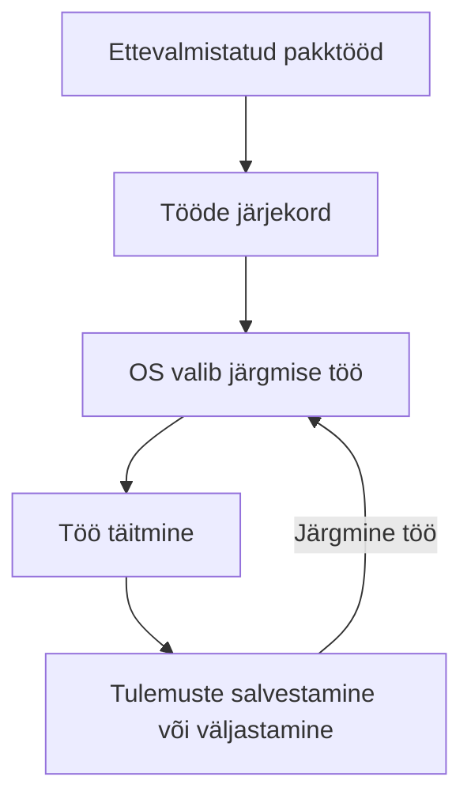
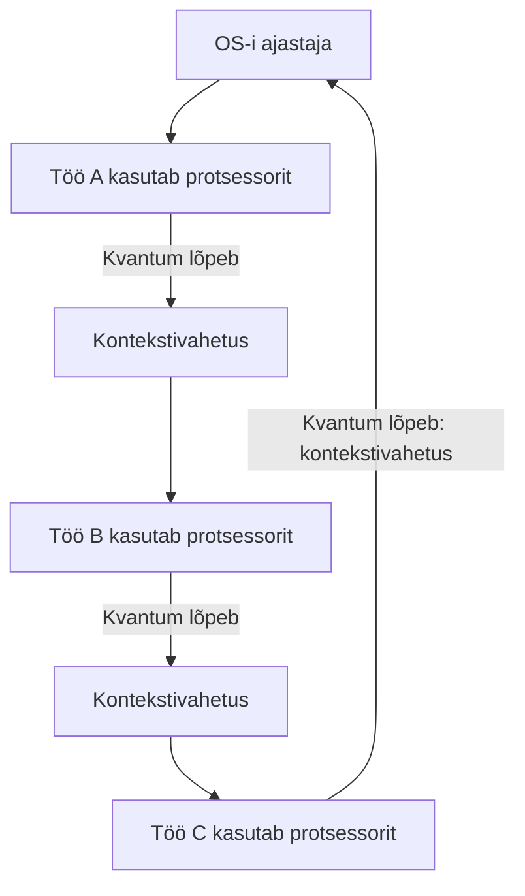
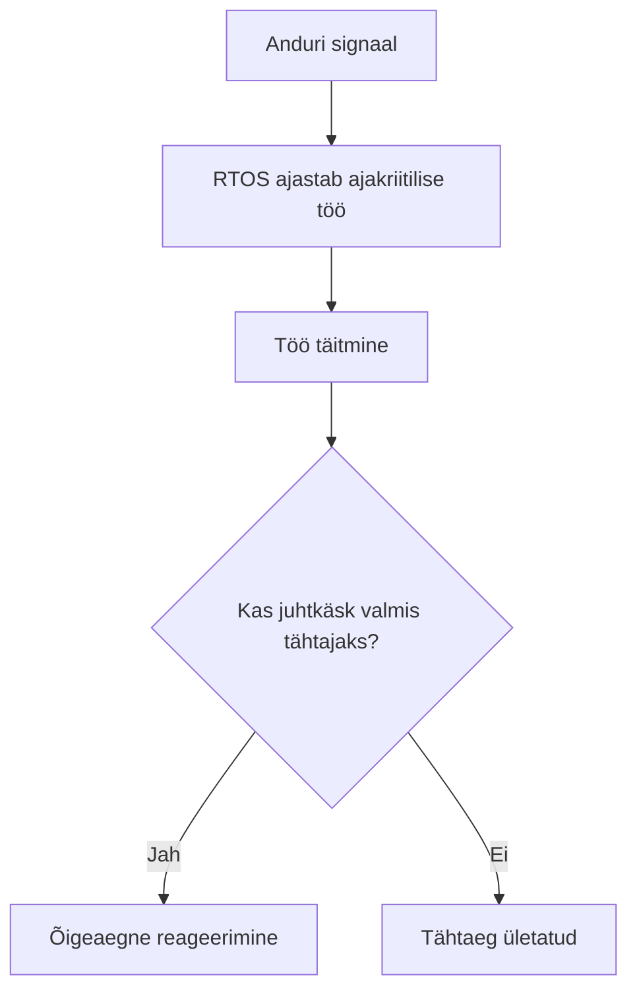
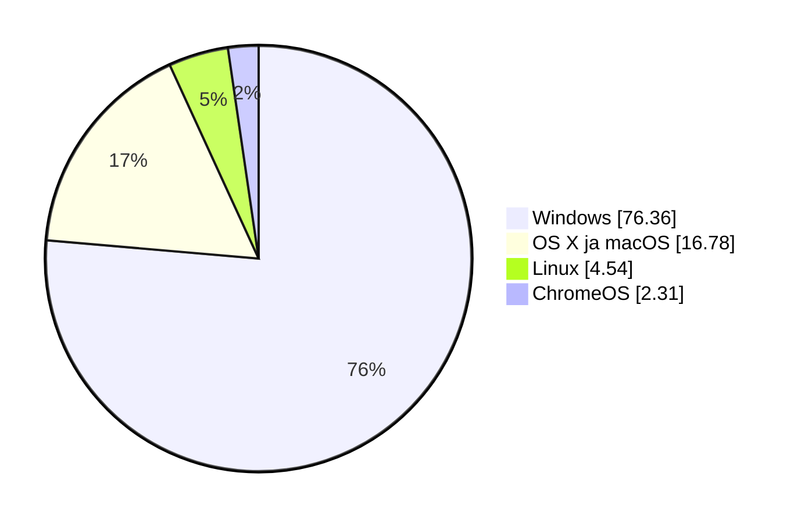
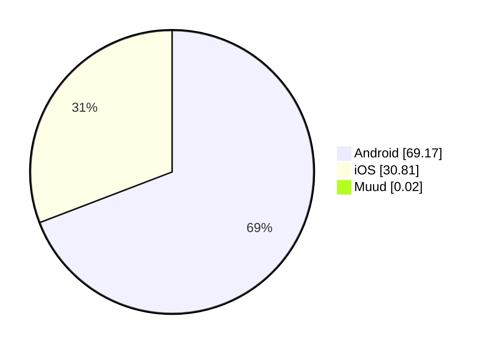

# Operatsioonisüsteemide liigid ja kasutus

Operatsioonisüsteemi sobivus sõltub seadme ja kasutaja vajadustest. Selles materjalis tutvume levinud süsteemidega, võrdleme nende liike ja kasutuskohti ning uurime, mida saab järeldada turujaotusest.

!!! info "Õpieesmärgid"

    Pärast materjali läbimist oskad:

    - tuua näiteid levinud operatsioonisüsteemidest ja nende kasutuskohtadest;
    - kirjeldada ja võrrelda pakktöötluslikku, ajajaotuslikku, reaalajalist ja võrguoperatsioonisüsteemi;
    - kasutada nende liikide eestikeelseid ja ingliskeelseid nimetusi ning lühendeid RTOS ja NOS;
    - selgitada, kuidas OS-i liigid ja kasutusotstarbed võivad kattuda;
    - tõlgendada turujaotuse andmeid, arvestades seadmerühma ja mõõtmismeetodit;
    - põhjendada operatsioonisüsteemi valikut kasutaja ja seadme vajaduste järgi.

## 1. Levinud operatsioonisüsteemid

| Operatsioonisüsteem või süsteemipere | Levinud kasutuskoht | Mida meeles pidada? |
| --- | --- | --- |
| **Microsoft Windows** | Laua- ja sülearvutid; Windows Serveri tooted serverites. | Tööjaama ja serveri süsteemid on eri vajadustega tooted. |
| **Apple macOS** | Apple'i Mac-arvutid. | Kuulub Apple'i arvutite tarkvarakeskkonda. |
| **Linuxi distributsioonid** | Tööjaamad, serverid ja mitmesugused eriseadmed. | Linuxi süsteem võib töötada graafilise töölauaga või ilma selleta. |
| **Android** | Telefonid, tahvelarvutid ja muud nutiseadmed. | Põhineb Linuxi tuumal ja pakub oma rakenduskeskkonda. |
| **Apple iOS ja iPadOS** | iPhone'id ja iPadid. | Telefoni ja tahvelarvuti süsteemid on kohandatud nende seadmete kasutamiseks. |
| **ChromeOS** | Chromebookid ja teised sobivad seadmed. | ChromeOS on operatsioonisüsteem; Chrome on veebibrauser. |

!!! warning "Levinud eksiarvamus"

    Linux ei tähenda ainult käsurida ning Windows ei tähenda ainult graafilist töölauda. Mõlemas saab kasutada graafilisi tööriistu ja käsurida. Ubuntu Desktop on näiteks graafilise töölauaga Linuxi süsteem.

## 2. Süsteemide liigitamine kasutusotstarbe järgi

Üks võimalus süsteeme võrrelda on vaadata, **millise seadme või ülesande jaoks neid kasutatakse**.

| Kasutusotstarve | Iseloomulik vajadus | Näide |
| --- | --- | --- |
| **Tööjaam** | Inimese igapäevane töö ja rakenduste kasutamine. | Windowsi, Linuxi või macOS-iga sülearvuti. |
| **Server** | Teenuste pakkumine teistele seadmetele ja kasutajatele. | Linuxi veebiserver või Windows Serveriga failiserver. |
| **Mobiilseade** | Puutejuhtimine, aku kasutamine ja mobiilirakendused. | Androidiga telefon. |
| **Võrguseade** | Võrguliikluse suunamine ja seadme haldamine. | RouterOS-iga ruuter või Cisco IOS-iga võrguseade. |
| **Manusseade (*embedded system*)** | Konkreetse seadme juhtimine. | Juhtseade, tööstusseade või nutikas koduseade. |

**Manussüsteem** on arvutisüsteem, mis on osa suuremast seadmest ja täidab selles kindlat ülesannet. Kõik manussüsteemid ei kasuta Linuxit ega isegi terviklikku operatsioonisüsteemi. Mõne seadme juhtimiseks piisab väikesest püsivaraprogrammist.

Need kategooriad võivad ka kattuda. Sama Linuxi distributsiooni saab kasutada nii tööjaamas kui ka serveris. Serveri määrab eelkõige tema ülesanne: ta pakub teenust.

## 3. Operatsioonisüsteemide liigid töökorralduse ja eesmärgi järgi

Operatsioonisüsteeme saab liigitada ka nende **töökorralduse ja peamise eesmärgi** järgi. Järgnevad neli liiki kuuluvad selle teema põhimõistete hulka. Õpi tundma nii nende eestikeelseid kui ka ingliskeelseid nimetusi.

### 3.1. Pakktöötluslik operatsioonisüsteem — Batch Operating System

**Pakktöötluslik operatsioonisüsteem** korraldab ettevalmistatud tööde ehk **pakktööde** (*batch jobs*) automaatset täitmist. Kasutaja annab ette programmi, vajalikud andmed ja tööjuhised. Süsteem võtab tööd vastu, hoiab neid järjekorras ja suunab täitmisele. Tavapärasel täitmisel ei küsita kasutajalt iga sammu juures uut sisendit.

!!! info "Info"
    
    Varased operatsioonisüsteemid olid peamiselt pakktöötluslikud. Nende ülesanne oli käivitada ettevalmistatud töid automaatselt üksteise järel, vähendades tööde vahele jäävat arvuti jõudeaega. Kasutaja esitas programmi ja andmed ning sai tulemused pärast töö täitmist. Näiteks 1956. aastal kasutusele võetud GM-NAA I/O, üks esimesi operatsioonisüsteeme, töötles ettevalmistatud tööde jada pakina.

Pakktöötlusliku OS-i töökorralduse võib jagada neljaks sammuks:

1. Kasutaja või teine süsteem valmistab töö ja sisendandmed ette.
2. Töö antakse süsteemile täitmiseks.
3. Süsteem täidab töö, kui selle käivitamise tingimused ja vajalikud ressursid on olemas.
4. Tulemus salvestatakse või väljastatakse ning töö õnnestumine või viga registreeritakse.

**Näited:** 

- Ettevõtte töötajate palgaandmed kogutakse kokku ja palgaarvestus käivitatakse ühe pakktööna. Kasutaja vaatab tulemusi pärast töötlemist;
- Piltide töötlemine. Kasutaja määrab pildikogumi ja vajalikud toimingud, näiteks mõõtmete muutmise või vesimärgi lisamise. Programm töötleb pilte automaatselt, ilma et kasutaja peaks iga pildi juures toimingut kordama;
- Andmete varundamine ja taastamine. Suured ettevõtted ja andmekeskused kasutavad pakktöötlust, et ajastada regulaarseid andmete varundamisi ja vajadusel taastamisi.
- Teaduslikud arvutused. Suured teadusprojektid, nagu ilmastikumudelid või genoomi järjestamine, kasutavad pakktöötlust, et töödelda suuri andmekogumeid.

Pakktöötlus sobib mahukate ja korduvate tööde jaoks. Kasutaja võib tulemuse saamiseks oodata ning sisendandmete viga võib selguda alles töö käigus. Pakktöötlus ei nõua, et kõik tööd täidetaks alati ükshaaval: süsteem võib võimaluse korral täita mitut tööd paralleelselt.

Pakktöötlust kasutatakse samuti tänapäevases Windowsis ja Linuxis, näiteks automatiseeritud aruannete või failitöötluse jaoks. Üks pakktöö ei muuda aga kogu OS-i ainult pakktöötluslikuks. 

### 3.2. Ajajaotuslik operatsioonisüsteem — Time-Sharing Operating System

**Ajajaotuslik operatsioonisüsteem** jagab protsessori tööaega mitme töö ja kasutaja vahel, et võimaldada **interaktiivset kasutamist**. Interaktiivne tähendab, et kasutaja annab sisendi ja saab töö käigus vastuse.

**Multitegumtöö** (*multitasking*) tähendab, et operatsioonisüsteem võimaldab mitmel ülesandel edeneda samal ajavahemikul. Näiteks saab kasutaja kirjutada teksti, kuulata muusikat ja laadida alla faili. Ajajaotus aitab sellist töökorraldust võimaldada ning toetab ka mitme kasutaja samaaegset tööd.

Lihtsustatud ajajaotuse mudelis saab üks töö protsessorit kasutada lühikese **ajaviilu ehk ajakvantumi** (*time slice*, *time quantum*) jooksul. Kvantum on sellele tööle eraldatud protsessoriaja lõik.

Kui kvantum lõpeb ja teised tööd ootavad, võib OS poolelioleva töö peatada ning anda protsessori järgmisele tööle. Poolelioleva töö jätkamiseks vajalik olek salvestatakse ja järgmise töö olek taastatakse. Seda nimetatakse **kontekstivahetuseks** (*context switch*).

Töö võib protsessori vabastada ka enne kvantumi lõppu, näiteks siis, kui peab ootama andmete saabumist kettalt või võrgust. Nii saab protsessor vahepeal täita mõnda teist tööd.

!!! example "Lihtsustatud näide"

    Oletame, et kolm tööd saavad igaüks kuni 10 millisekundit protsessoriaega. Esmalt töötab esimene, seejärel teine ja siis kolmas. Seejärel võib järg taas esimese tööni jõuda.

    10 millisekundit on siin näitlik väärtus. Tegelik ajastus sõltub OS-ist ja kasutatavast ajastusalgoritmist; kõigi tööde kvantumid ei pea olema võrdsed ega muutumatud.

Kiire vahetamine jätab kasutajale mulje, et programmid töötavad korraga. Ühel protsessorituumal jagatakse täitmisaega tööde vahel; mitmetuumalises protsessoris saab osa töid ka päriselt paralleelselt täita. Täpsemalt ajastab OS tavaliselt protsesside **täitmislõimi** (*threads*), kuid siin kasutame lihtsustamiseks sõna „töö”.

Ajajaotusliku süsteemi iseloomulikud omadused:

- **Interaktiivsus:** kasutaja saab töö käigus käske anda ja vastuseid saada.
- **Multitegumtöö:** mitu programmi või ülesannet saavad edeneda samal ajavahemikul.
- **Mitme kasutaja tugi:** sama süsteemi ressursse saavad kasutada mitu kasutajat.
- **Ressursside jagamine:** OS korraldab protsessoriaja, mälu ja seadmete kasutamist.
- **Tööde kaitse:** kasutajate õigused ja protsesside mälu kaitse aitavad vältida teiste töö häirimist.
- **Ajastamine:** järgmise töö valikul arvestatakse ajastusreegleid, prioriteete ja töö valmisolekut.
- **Koormusest sõltuv reageerimine:** paljude aktiivsete tööde korral võib vastuse saamine aeglustuda.

**Näide:** mitu õppijat kasutab samal ajal sama Linuxi serverit käsurea kaudu. Üks kirjutab teksti, teine käivitab programmi ja kolmas uurib faile. OS jagab ressursse ning kaitseb kasutajate tööd üksteise eest.

!!! tip "Multitegumtöö ja mitme kasutaja töö"

    Multitegumtöö võib toimuda ka ühe kasutaja arvutis. Ajajaotusliku süsteemi oluline kasutusviis on võimaldada mitmel kasutajal jagada sama arvutit interaktiivselt.

Multitegumtööd ning **protsessoriaja jagamist kasutavad kõik tänapäevased arvutite operatsioonisüsteemid** nagu Windows, Linux ja macOS.

Protsessoriaja jagamist käsitleme lähemalt materjalis „Operatsioonisüsteemi põhifunktsioonid”.

### 3.3. Reaalajaline operatsioonisüsteem — Real-Time Operating System

**Reaalajaline operatsioonisüsteem**, ka **reaalajaoperatsioonisüsteem** ehk **RTOS** (*real-time operating system*), on kavandatud ajakriitiliste ülesannete täitmiseks. Tulemus peab olema nii sisuliselt õige kui ka saabuma nõutud **tähtaja** (*deadline*) jooksul. Oluline on reageerimisaja ennustatavus.

Reaalajasüsteeme kasutatakse seal, kus õige tulemus peab saabuma **ettenähtud aja jooksul**. Hilinemine võib halvendada teenuse kvaliteeti, põhjustada seadme rikke või ohustada inimesi.

**Näited:**

- **Tööstusautomaatika:** tööstusroboti juhtsüsteem peab anduri signaali põhjal mootori juhtkäsku muutma ettenähtud aja jooksul. Hilinenud õige käsk võib saabuda liiga hilja, et vältida kokkupõrget või seadme kahjustamist.
- **Autode juhtsüsteemid:** pidurite blokeerumisvastane süsteem ehk **ABS** jälgib rataste pöörlemist ja reguleerib pidurdamisel pidurisurvet. Juhtsüsteem peab reageerima piisavalt kiiresti ja ennustatavalt, et vältida rataste blokeerumist. Reaalajanõuded esinevad ka mootori ja teiste sõidukisüsteemide juhtimisel.
- **Meditsiiniseadmed:** patsiendi jälgimisseade peab töötlema mõõteandmeid ja andma vajaduse korral häire nõutud aja jooksul. Kirurgilise roboti juhtimisel peab liikumine vastama juhtkäskudele täpselt ja ennustatavalt.
- **Kosmosetehnika:** satelliidi või kosmosesondi juhtarvuti peab töötlema andurite andmeid ning juhtima näiteks seadme asendit ja side toimimist vastavalt ajalistele nõuetele.

!!! info "RTOS on üks osa tervikust"

    Neid ülesandeid saab teostada RTOS-i abil, kuid iga reaalajanõuetega seade ei kasuta tingimata operatsioonisüsteemi. Lihtsam juhtseade võib töötada ka otse riistvaral käivitatava programmiga.

    RTOS üksi ei taga kogu süsteemi ohutust ega tähtaegade täitmist. Selleks peavad sobima ka riistvara, rakendustarkvara ja süsteemi ülesehitus.

Reaalajanõuded võivad olla erineva rangusega:

- **Range reaalajanõue** (*hard real-time*): tähtaja ületamine tähendab süsteemi nõude rikkumist ja võib põhjustada ohtliku olukorra.
- **Pehme reaalajanõue** (*soft real-time*): hilinemine halvendab teenuse kvaliteeti, näiteks põhjustab heli katkemise.

RTOS aitab korraldada ülesannete ajastamist ja prioriteete. Kogu süsteemi suutlikkus tähtaegu täita sõltub ka riistvarast ning rakenduse ülesehitusest.

### 3.4. Võrguoperatsioonisüsteem — Network Operating System

**Võrguoperatsioonisüsteem** ehk **NOS** (*network operating system*) juhib võrguseadme, näiteks **ruuteri, kommutaatori või tulemüüri** tööd. See võimaldab seadistada võrguliikluse edastamist, turvareegleid ja seadme haldamist.

Sõltuvalt seadmest ja selle võimalustest korraldab võrguoperatsioonisüsteem näiteks:

- **võrguliikluse edastamist:** kommutaatori töö ja ruutimise seadistamine;
- **võrguliideste haldamist:** portide, IP-aadresside ja ühenduste seadistamine;
- **võrgu jagamist:** virtuaalsete kohtvõrkude ehk **VLAN-ide** loomine;
- **turvalisust:** lubatud liikluse ja haldajate ligipääsu kontrollimine;
- **töö jälgimist:** ühenduste oleku, liiklusstatistika ja logide kuvamine;
- **seadme haldamist:** seadistuste salvestamine ja tarkvara uuendamine.

**Näide:** kooli kommutaatoris (*switchis*) eraldatakse õppijate ja õpetajate seadmed eri VLAN-idesse. Ruuteris määratakse nende võrkude vaheline lubatud liiklus. Võrguoperatsioonisüsteem võimaldab haldajal need seadistused teha ja nende toimimist jälgida.

**Võrguoperatsioonisüsteemide näited:**

| Operatsioonisüsteem | Tootja | Kasutusnäited |
| --- | --- | --- |
| **Cisco IOS ja IOS XE** | Cisco | Ruuterid ja kommutaatorid; konkreetne OS sõltub seadmemudelist. |
| **Junos OS** | Juniper | Ruuterid, kommutaatorid ja tulemüüriseadmed. |
| **RouterOS** | MikroTik | Ruuterid ja muud toetatud võrguseadmed. |
| **SwOS** | MikroTik | Toetatud MikroTiki kommutaatorite haldamine. |
| **EOS** (*Extensible Operating System*) | Arista | Kommutaatorid, näiteks andmekeskuste võrkudes. |

Võrguseadet saab hallata näiteks **käsurea**, **veebiliidese** või **programmeerimisliidese ehk API** kaudu. Võimalused sõltuvad operatsioonisüsteemist ja seadmemudelist.

!!! tip "Sarnased ülesanded, erinevad käsud"

    Eri tootjate võrguseadmed võivad täita sarnaseid ülesandeid, kuid nende käsud ja seadistamise viisid erinevad. Seetõttu on oluline mõista nii võrgu tööpõhimõtteid kui ka konkreetse seadme operatsioonisüsteemi.

Valesti määratud seadistus võib katkestada ühenduse või lubada soovimatut liiklust. Seetõttu on oluline kontrollida muudatusi, säilitada seadistuste varukoopiad ja paigaldada sobivad turvauuendused.

### 3.5. Nelja liigi lühikokkuvõte

| Liik ja ingliskeelne nimetus | Peamine eesmärk | Millal tulemust vajatakse? | Näidisülesanne |
| --- | --- | --- | --- |
| **Pakktöötluslik** — *Batch Operating System* | Ettevalmistatud tööde automaatne täitmine. | Pärast töö valmimist; kasutaja ei pea iga sammu juhtima. | Suurele hulgale piltidele vesimärgi lisamine. |
| **Ajajaotuslik** — *Time-Sharing Operating System* | Ressursside jagamine ja interaktiivse töö võimaldamine. | Kasutaja ootab töö käigus piisavalt kiiret vastust. | Mitu kasutajat töötab samas serveris. |
| **Reaalajaline** — *Real-Time Operating System*, **RTOS** | Ajaliselt kriitiliste ülesannete ennustatav täitmine. | Määratud tähtaja jooksul. | Tööstusroboti juhtimine. |
| **Võrguoperatsioonisüsteem** — *Network Operating System*, **NOS** | Võrguseadme töö, liikluse edastamise ja turvareeglite haldamine. | Võrguliiklust töödeldakse pidevalt, vastavalt seadme ülesannetele. | Kooli kommutaatoris VLAN-ide seadistamine ja ruuteris võrkudevahelise liikluse juhtimine. |

## 4. Operatsioonisüsteemide turujaotus

**Turujaotus** näitab, kui suure osa vaadeldavast turust või kasutusest moodustab mingi operatsioonisüsteem. Tulemus sõltub sellest, milliseid seadmeid, piirkonda ja ajavahemikku uuritakse ning mida mõõdetakse.

!!! info "Andmete aeg ja ulatus"

    Arvutite, telefonide ja tahvelarvutite andmed pärinevad **Statcounter Global Statsist** ning kirjeldavad **2026. aasta septembri ülemaailmset veebikasutust**. Veebisaitide serverite andmed pärinevad **W3Techsist seisuga 4. oktoober 2026**.

Statcounter hindab operatsioonisüsteemide osakaalu oma mõõtmises osalevate veebisaitide **lehevaatamiste** põhjal. See tähendab, et aktiivselt veebis surfav seade võib anda rohkem lehevaatamisi kui harva kasutatav seade.

### 4.1. Laua- ja sülearvutid

Statcounteri arvutite ehk *desktop*-kategoorias on Windows suurima osakaaluga operatsioonisüsteem.

| Operatsioonisüsteem või rühm | Osakaal arvutite veebikasutuses |
| --- | ---: |
| Windows | 76,36% |
| Apple'i arvutite OS-id: OS X ja macOS kokku | 16,78% |
| Linux | 4,54% |
| ChromeOS | 2,31% |

### 4.2. Nutitelefonid

Telefonide veebikasutuses on kaks peamist operatsioonisüsteemi: Android ja iOS.

| Operatsioonisüsteem või rühm | Osakaal telefonide veebikasutuses |
| --- | ---: |
| Android | 69,17% |
| iOS | 30,81% |
| Muud kokku | 0,02% |

### 4.3. Tahvelarvutid

Tahvelarvutite jaotus erineb telefonide jaotusest: Apple'i ja Androidi osakaalud on selles ülevaates peaaegu võrdsed.

| Operatsioonisüsteem või rühm | Osakaal tahvelarvutite veebikasutuses |
| --- | ---: |
| Apple'i tahvelarvutite OS-id | 50,35% |
| Android | 49,57% |
| Muud kokku | 0,08% |

### 4.4. Seadmerühmad koos

Kui vaadata Statcounteri mõõdetud veebikasutust eri seadmerühmade peale kokku, on esikohal Android.

| Operatsioonisüsteem või rühm | Osakaal veebikasutuses üle seadmerühmade |
| --- | ---: |
| Android | 42,54% |
| Windows | 28,98% |
| iOS | 19,45% |
| Apple'i arvutite OS-id: OS X ja macOS kokku | 6,37% |
| Linux | 1,73% |
| Ülejäänud kategooriad kokku, arvutatud | 0,93% |

See tabel arvestab seadmerühmade lehevaatamisi koos. See ei ole eelnevate tabelite protsentide lihtne keskmine ega hõlma kõiki maailma servereid ja nutiseadmeid.

### 4.5. Serverite operatsioonisüsteemid

**Server** pakub teistele seadmetele teenuseid. Näiteks veebiserver saadab sinu brauserile veebilehe sisu. Serverite operatsioonisüsteemide jaotus võib kasutajate arvutite jaotusest tugevalt erineda. Kohtvõrgus kasutatavate serverite kohta on statistikat keeruline teha, aga saame vaadata veebiservereid.

W3Techs uurib veebisaitide kasutatavaid tehnoloogiaid. Järgnev tabel näitab osakaalu **veebisaitide hulgas, mille serveri operatsioonisüsteem on W3Techsile teada**.

| Operatsioonisüsteemide rühm | Seda rühma kasutavate veebisaitide osakaal |
| --- | ---: |
| Unix ja Unixi-laadsed süsteemid (sh Linux ja BSD) | 92,1% |
| Windows | 8,1% |

Üks veebisait võib kasutada mitut operatsioonisüsteemi, mistõttu osakaalude summa võib ületada 100%. 

### 4.6. Mida sellest järeldada?

- **Täpsusta alati keskkonda.** Küsimusele „Milline OS on kõige levinum?” vastamiseks peab teadma, kas räägitakse arvutitest, telefonidest või serveritest.
- **Väiksem osakaal ühes keskkonnas ei tähenda vähest tähtsust kõikjal.** Näiteks Linuxi väike osakaal arvutite veebikasutuses ei kirjelda selle rolli serverites.
- **IT-töös on kasulik tunda mitut operatsioonisüsteemi.** Kasutaja tööarvuti ja talle teenust pakkuv server võivad kasutada erinevaid süsteeme.
- **Populaarsus ei määra sobivust.** OS-i valikul loevad ka vajalike rakenduste tugi, riistvara, turvauuendused, hind ja kasutusotstarve.
- **Vaata andmete kuupäeva ja allikat.** Osakaalud muutuvad ning eri mõõtmismeetodid võivad anda erineva tulemuse.

## 5. Kuidas operatsioonisüsteemi valida?

Sobiv süsteem peab vastama kasutaja ja seadme vajadustele. Valiku tegemisel tuleb arvestada järgmisega:

- **Rakendused:** kas vajalik tarkvara toetab seda OS-i?
- **Riistvara:** kas protsessor, mälu ja seadmete draiverid sobivad?
- **Kasutusotstarve:** kas eesmärk on õppimine, mängimine, serveriteenuse pakkumine või seadme juhtimine?
- **Hooldus ja tootetugi:** kui kaua saab süsteem turvauuendusi ning kes seda haldab?
- **Litsents ja kulud:** millised kasutustingimused kehtivad ning mida maksavad litsents ja tugi?
- **Kasutajate oskused:** kas süsteemi kasutamiseks ja haldamiseks on vajalikud teadmised olemas?

**Avatud lähtekood** tähendab, et lähtekood on kättesaadav ja litsents lubab seda kindlatel tingimustel kasutada, muuta ning levitada. See ei tähenda automaatselt tasuta tugiteenust. **Omandusliku tarkvara** muutmise ja levitamise võimalusi piirab tavaliselt tootja litsents ning lähtekood ei ole üldjuhul avalik.

**Rakendus peab sobima nii OS-i kui ka protsessori arhitektuuriga.** Näiteks x86-64 ja ARM64 on erinevad arhitektuurid. Failivormingu toetamine ja rakenduse käivitamine on samuti eri asjad: foto võib avaneda mitmes OS-is, kuid ühe OS-i jaoks tehtud programm ei pruugi teises otse töötada.

## 6. Enesekontroll

Vasta kõigepealt ise. Seejärel ava vastus ja võrdle oma põhjendust.

### 1. Mis erinevus on Linuxi tuumal ja Debianil?

??? success "Vaata vastust"

    Linuxi tuum on operatsioonisüsteemi keskne komponent. Debian on distributsioon, mis ühendab tuuma süsteemitööriistade, paketihalduse ja muu tarkvaraga terviklikuks kasutatavaks süsteemiks.

### 2. Kas paljude fotode automaatne töötlemine nõuab eraldi pakktöötluslikku OS-i?

??? success "Vaata vastust"

    Ei. See on pakktöötluse näide, mida saab teha rakenduse või skriptiga ka tavalises tööjaama operatsioonisüsteemis. Töötlusviis ja OS-i kasutusotstarve on erinevad liigitamise alused.

### 3. Kas iga väga kiire arvuti on reaalajasüsteem?

??? success "Vaata vastust"

    Ei. Reaalajasüsteemi puhul on oluline määratud ajaliste piirangute täitmine ja ennustatav käitumine. Suur keskmine kiirus üksi ei taga, et kriitiline tegevus saab õigel ajal valmis.

### 4. Miks ei pruugi Windowsi rakendus Linuxis otse käivituda?

??? success "Vaata vastust"

    Rakendus võib sõltuda Windowsi pakutavatest liidestest ja kasutada selle OS-i käivitatava faili vormingut. Toimimine sõltub ka protsessori arhitektuurist. Mõne rakenduse jaoks on olemas teise OS-i versioon, ühilduvuskiht või virtualiseerimislahendus, kuid seda tuleb eraldi kontrollida.

### 5. Mille järgi valiksid kooli tööarvutile operatsioonisüsteemi?

??? success "Vaata vastust"

    Arvestaksin vajalike rakenduste, riistvara ja draiverite, litsentsi, turvauuenduste ning kasutajate ja haldajate oskustega. Ainult tuttav välimus või populaarsus ei ole piisav valikukriteerium.

### 6. Nimeta neli käsitletud OS-i liiki eesti ja inglise keeles. Mida tähendavad RTOS ja NOS?

??? success "Vaata vastust"

    - Pakktöötluslik operatsioonisüsteem — *Batch Operating System*.
    - Ajajaotuslik operatsioonisüsteem — *Time-Sharing Operating System*.
    - Reaalajaline operatsioonisüsteem — *Real-Time Operating System*, lühend **RTOS**.
    - Võrguoperatsioonisüsteem — *Network Operating System*, lühend **NOS**.

### 7. Millisele liigile viitab iga olukord? Põhjenda põhieesmärgi järgi.

- A. Öösel töödeldakse automaatselt päeva jooksul kogutud arveid.
- B. Mitu kasutajat sisestab samas serveris käske ja ootab töö käigus vastuseid.
- C. Juhtseade peab anduri signaalile reageerima määratud tähtaja jooksul.
- D. Koolis luuakse õpetajate ja õpilaste võrgule eraldi VLAN-id.

??? success "Vaata vastust"

    - **A: pakktöötluslik** — ettevalmistatud andmeid töödeldakse automaatselt.
    - **B: ajajaotuslik** — süsteem jagab ressursse mitme kasutaja interaktiivseks tööks.
    - **C: reaalajaline** — vastus peab valmima määratud tähtajaks.
    - **D: võrguoperatsioonisüsteem** — võrguseadme OS võimaldab seadistada VLAN-e ja korraldada võrguliikluse edastamist.

    Tegelik süsteem võib toetada korraga mitut neist omadustest. Siin määrab vastuse kirjeldatud ülesande põhirõhk.

## Kokkuvõte

- Operatsioonisüsteeme kasutatakse tööjaamades, serverites, mobiilseadmetes, võrguseadmetes ja manussüsteemides.
- Pakktöötluslik OS (*Batch Operating System*) korraldab ettevalmistatud tööde automaatset täitmist.
- Ajajaotuslik OS (*Time-Sharing Operating System*) jagab protsessoriaega mitme töö ja kasutaja interaktiivseks tööks.
- Reaalajaline OS (*Real-Time Operating System*, RTOS) toetab ajakriitiliste ülesannete ennustatavat täitmist nõutud tähtaegade järgi.
- Võrguoperatsioonisüsteem (*Network Operating System*, NOS) juhib võrguseadme, näiteks **ruuteri, kommutaatori või tulemüüri** tööd.
- Liigid võivad kattuda: sama server võib jagada protsessoriaega ja täita pakktöid.
- OS-ide levik sõltub seadmerühmast ja mõõtmismeetodist. Veebikasutuse osakaal ei võrdu seadmete arvu ega müügiosakaaluga.
- OS-i valikul loevad rakendused, riistvara, kasutusotstarve, turvauuendused, litsents ja kasutajate ning haldajate oskused.

### Mõtle õpitule

1. Millise OS-i liigi tähendus tekitas kõige rohkem segadust? Selgita seda oma sõnadega ja too näide, kus selle omadused on vajalikud.
2. Milline turujaotuse tulemus sind kõige rohkem üllatas? Selgita, mida see mõõdab ja millist lisateavet vajaksid, et võrrelda tulemust oma kooli või kodu seadmetega.
3. Kui valiksid kooli arvutile või serverile OS-i, millised kolm tegurit oleksid sinu jaoks kõige olulisemad? Põhjenda valikut ja nimeta üks allikas või kontroll, mille abil sobivust uuriksid.

## Teema sõnastik

| Mõiste | Selgitus |
| --- | --- |
| Operatsioonisüsteem; OS (*operating system*) | Süsteemitarkvara, mis haldab seadme ressursse ning pakub rakendustele ja kasutajale teenuseid. |
| Ressurss (*resource*) | Tööks kasutatav võimalus või vahend, näiteks protsessori aeg, mälu või salvestusruum. |
| Interaktiivne töö (*interactive operation*) | Tööviis, kus kasutaja annab sisendi ja saab töö käigus vastuseid. |
| Pakktöö (*batch job*) | Ettevalmistatud töö, mida täidetakse automaatselt ilma iga sammu juures kasutajalt sisendit küsimata. |
| Pakktöötluslik operatsioonisüsteem (*Batch Operating System*) | OS, mille töökorraldus keskendub ettevalmistatud pakktööde vastuvõtmisele ja automaatsele täitmisele. |
| Ajajaotuslik operatsioonisüsteem (*Time-Sharing Operating System*) | OS, mis jagab protsessoriaega mitme töö ja kasutaja interaktiivseks tööks. |
| Ajaviil ehk ajakvantum (*time slice*, *time quantum*) | Tööle eraldatud protsessoriaja lõik, mille järel võib OS anda protsessori teisele tööle. |
| Reaalajaline operatsioonisüsteem; RTOS (*Real-Time Operating System*) | OS, mis on kavandatud ajakriitiliste ülesannete ennustatavaks täitmiseks nõutud ajaliste piirangute järgi. |
| Tähtaeg (*deadline*) | Ajaline piir, milleks ülesanne või vajalik vastus peab olema valmis. |
| Võrguoperatsioonisüsteem; NOS (*Network Operating System*) | OS, mis juhib võrguseadme tööd ning võimaldab seadistada liikluse edastamist, turvareegleid ja seadme haldamist. |
| Server (*server*) | Seade või tarkvara, mis pakub teistele seadmetele või kasutajatele teenust. |
| Manussüsteem (*embedded system*) | Arvutisüsteem, mis on osa suuremast seadmest ja täidab selles kindlat ülesannet. |
| Linuxi distributsioon (*Linux distribution*) | Terviklik tarkvarakomplekt, mis ühendab Linuxi tuuma süsteemitööriistade ja muu tarkvaraga, näiteks Debian. |
| Avatud lähtekood (*open source*) | Lähtekood on kättesaadav ja litsents lubab seda kindlatel tingimustel kasutada, muuta ning levitada. |
| Omanduslik tarkvara (*proprietary software*) | Tarkvara, mille muutmist ja levitamist piirab tootja litsents ning mille lähtekood ei ole üldjuhul avalik. |
| Litsents (*license*) | Tingimused, mis määravad tarkvara kasutamise, muutmise ja levitamise õigused. |
| Protsessori arhitektuur (*processor architecture*) | Protsessori töö ja toetatud masinkäskude ülesehitus, näiteks x86-64 või ARM64. |
| Tööjaam (*workstation*) | Arvuti, mida inimene kasutab oma tööks ja rakenduste käitamiseks. |
| Multitegumtöö (*multitasking*) | Mitme programmi või ülesande edenemine samal ajavahemikul OS-i korraldatud ressursijaotuse abil. |
| Kontekstivahetus (*context switch*) | Ühe töö täitmisoleku salvestamine ja teise töö oleku taastamine, et vahetada protsessoril täidetavat tööd. |
| Ajastaja (*scheduler*) | OS-i komponent, mis valib, milline täitmiseks valmis töö saab järgmisena protsessorit kasutada. |
| Täitmislõim (*thread*) | Programmi täitmise üksus protsessi sees. Ühes protsessis võib olla mitu lõime. |
| Prioriteet (*priority*) | Töö suhteline tähtsus, mida ajastaja võib protsessoriaja jagamisel arvestada. |
| Virtuaalne kohtvõrk; VLAN (*Virtual Local Area Network*) | Loogiliselt eraldatud kohtvõrk, mis võimaldab jagada sama füüsilise kommutaatorivõrgu eraldi võrkudeks. |
| Programmeerimisliides; API (*Application Programming Interface*) | Määratletud viis, mille kaudu programmid saavad kasutada teise tarkvara või seadme pakutavaid toiminguid. |

## Allikad ja lisalugemine

1. [Debian: Definitions and overview](https://www.debian.org/doc/manuals/debian-faq/basic-defs.en.html){ target="_blank" rel="noopener" }.
2. [Android Developers: Platform architecture](https://developer.android.com/guide/platform){ target="_blank" rel="noopener" }.
3. [Statcounter – arvutid, september 2026](https://gs.statcounter.com/os-market-share/desktop/worldwide/#monthly-202609-202609-bar){ target="_blank" rel="noopener" }.
4. [Statcounter – telefonid, september 2026](https://gs.statcounter.com/os-market-share/mobile/worldwide/#monthly-202609-202609-bar){ target="_blank" rel="noopener" }.
5. [Statcounter – tahvelarvutid, september 2026](https://gs.statcounter.com/os-market-share/tablet/worldwide/#monthly-202609-202609-bar){ target="_blank" rel="noopener" }.
6. [Statcounter – kõik platvormid, september 2026](https://gs.statcounter.com/os-market-share/worldwide/#monthly-202609-202609-bar){ target="_blank" rel="noopener" }.
7. [W3Techs – veebisaitide operatsioonisüsteemid](https://w3techs.com/technologies/overview/operating_system){ target="_blank" rel="noopener" }.
8. [IBM: What are batch jobs?](https://www.ibm.com/think/topics/batch-jobs){ target="_blank" rel="noopener" } — pakktööde olemus ja kasutamine.
9. [IBM: Time-sharing](https://www.ibm.com/history/time-sharing){ target="_blank" rel="noopener" } — ajajaotuse põhimõte ja mitme kasutaja töö.
10. [QNX: What is Real Time and Why Do I Need It?](https://www.qnx.com/developers/docs/8.0/com.qnx.doc.neutrino.sys_arch/topic/what_is_realtime.html){ target="_blank" rel="noopener" } — reaalajanõuded ja ennustatav reageerimine.

---
*Õppematerjali koostaja: Priit Paap, 2026*
