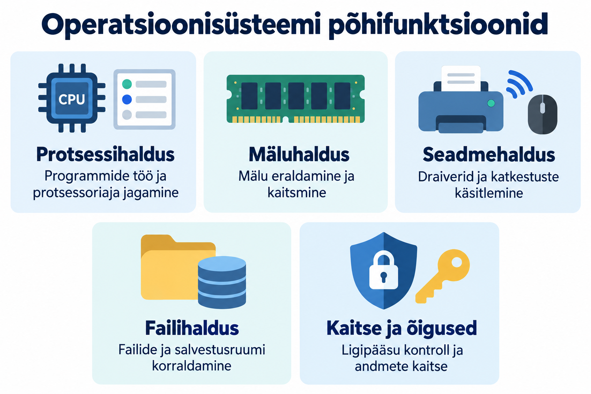
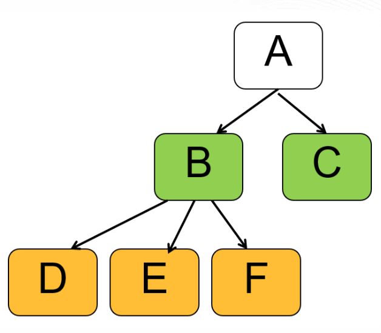
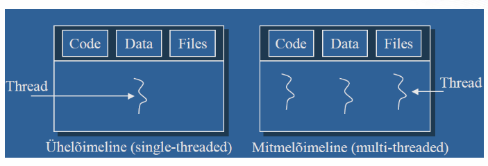
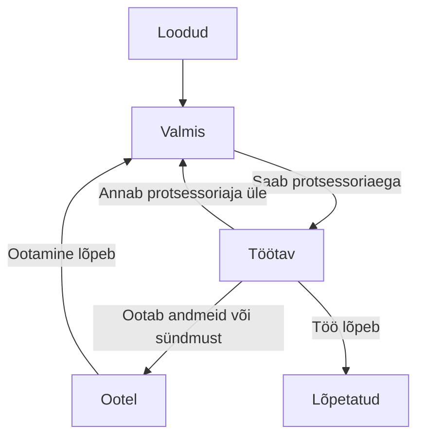
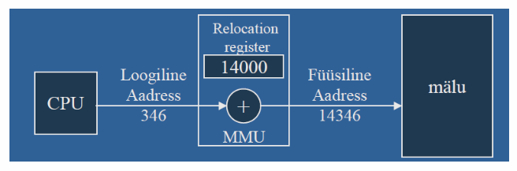

# Operatsioonisüsteemi põhifunktsioonid

Operatsioonisüsteem korraldab protsessori, mälu, failide ja seadmete kasutamist ning süsteemi kaitset. Selles materjalis vaatame, millised on operatsioonisüsteemi põhilised ülesanded. 

{ width="75%" }

!!! info "Õpieesmärgid"

    Pärast materjali läbimist oskad:

    - eristada programmi, protsessi ja lõime;
    - selgitada protsessoriaja jagamise ja paralleelse töö erinevust;
    - eristada RAM-i, salvestusruumi, virtuaalmälu ja vahemälu;
    - kirjeldada failisüsteemi ja draiveri ülesannet;
    - selgitada kasutajaõiguste ning protsesside eraldamise vajadust;
    - seostada arvuti aeglustumise võimalikke põhjuseid ressursside kasutamisega.

## 1. Protsessihaldus

**Programm** on käskude ja muu vajaliku sisu kogum, mille abil arvuti täidab ülesandeid. Paigaldatud rakenduse failid asuvad tavaliselt salvestusseadmel. Nende olemasolu ei tähenda veel, et rakendus töötab.

Kui programm pannakse käima, siis saab sellest protsess. **Protsess** on töötava programmi eksemplar koos selle täitmiseks vajalike ressursside ja olekuga. Protsessil on näiteks identifikaator, mäluaadressiruum ja kasutatavate failide kohta käiv teave. **PID** (*process identifier*) on protsessi identifitseeriv number. Protsesse võivad käivitada kasutaja, operatsioonisüsteem või teised juba töötavad protsessid. Vanemprotsessid (parent) võivad luua lapsprotsesse (children). Iga lapsprotsess võib olla teistele protsessidele omakorda vanemaks. Nii tekib protsesside puu:

{ width="50%" }

Sama programmi võib käivitada rohkem kui ühe korra. Üks rakendus võib ka ise luua mitu protsessi.

!!! example "Näide: brauser"

    Brauser võib kasutada eraldi protsesse eri veebisisu, laienduste või muude komponentide jaoks. Seetõttu ei tähenda mitu brauseri nimega protsessi automaatselt viga. Samuti ei ole kindlat reeglit, et igale vahekaardile vastab täpselt üks protsess: jaotus sõltub brauseri ülesehitusest.

### Lõim kui protsessi sees töötav täitmisüksus

**Lõim** ehk *thread* on protsessi sees olev täitmisüksus. Protsessil on vähemalt üks lõim. Mitme lõimega protsess võib korraldada näiteks kasutajaliidese tööd ja andmete töötlemist eraldi. Sama protsessi lõimed jagavad selle mäluaadressiruumi ja mitmeid ressursse.

{ width="75%" }

| Mõiste | Lihtne seletus | Näide |
| --- | --- | --- |
| **Programm** | Salvestatud tarkvara, mida saab käivitada. | Tekstiredaktori failid SSD-l. |
| **Protsess** | Programmi töötav eksemplar koos oma ressurssidega. | Käivitatud tekstiredaktor. |
| **Lõim** | Protsessi sees toimuv käskude täitmine. | Üks lõim reageerib sisendile, teine teeb taustal arvutust. |

!!! tip "Pea meeles"

    Programm, protsess ja lõim on seotud, kuid erinevad mõisted. Üks rakendus võib kasutada mitut protsessi ning ühes protsessis võib olla mitu lõime. Mitme lõime olemasolu ei taga iseenesest, et kõik need parajasti paralleelselt töötavad.

## 2. Kuidas mitu programmi korraga töötavad?

**Protsessor** ehk **CPU** täidab programmide käske. Operatsioonisüsteemi **planeerija** (*scheduler*) otsustab, milline töötamiseks valmis lõim saab protsessoriaega. Planeerimine on üks op. süsteemi põhitegevustest. Valikut võivad mõjutada prioriteedid, ootel tööd ja muud süsteemi reeglid.

Ühel protsessori täitmisüksusel saavad eri tööd kiiresti vahelduda. Seda nimetatakse **ajajaotuseks**. Kasutajale võib jääda mulje, et kõik rakendused töötavad ühel ajal.

Mitme tuumaga protsessor võimaldab ka tegelikku **paralleelset täitmist**: eri tööd saavad töötada samal ajal eri tuumadel. Mõnel protsessoril on ühe füüsilise tuuma kohta mitu loogilist protsessorit. Alguses piisab teadmisest, et ajajaotus ja paralleelne töö on erinevad nähtused.

!!! example "Näide: muusika ja faili allalaadimine"

    Muusikapleier vajab aeg-ajalt protsessoriaega heliandmete töötlemiseks. Brauser vajab seda saabunud andmete käsitlemiseks. Kui brauser ootab võrgust järgmisi andmeid, saab CPU teha muud tööd. Ootamine ei tähenda, et kogu arvuti peab peatuma.

### Protsessi olekud

Protsess ei kasuta kogu oma eluea jooksul pidevalt protsessorit. Lihtsustatud mudelis eristame järgmisi olekuid:

| Olek | Tähendus |
| --- | --- |
| **Loodud** (*New*) | Protsessi tööks valmistatakse ressursse ette. |
| **Valmis** (*Ready*) | Protsess on valmis töötama, kuid ootab protsessoriaega. |
| **Töötav** (*Running*) | Protsessi lõim täidab parajasti käske. |
| **Ootel** (*Waiting / Blocked*) | Töö jätkamiseks on vaja näiteks faili lugemise lõppu või uusi andmeid. |
| **Lõpetatud** (*Terminated*) | Protsessi töö on lõppenud ja ressursid vabastatakse. |

See on õppimiseks mõeldud mudel. Tegelikud olekunimed ja üksikasjad sõltuvad operatsioonisüsteemist. Mitmelõimelise protsessi eri lõimed võivad olla eri olekutes.

**Ennetav planeerimine** (*preemtive*) võimaldab OS-il töötava lõime täitmise katkestada ja anda protsessoriaega teisele. Rakendus ei pea ise otsustama, millal teised rakendused töötada tohivad. See ei tähenda, et OS lõpetab automaatselt iga pikalt arvutava programmi.
**Mitte-ennetava **(*non-preemtive)** planeerija puhul peab iga protsess ise hoolitsema, et ta liiga kaua süsteemi aega ei raiskaks. Aktiivse protsesse tööd ei katkestata.

## 3. Mäluhaldus: tööruum programmidele

**Muutmälu** ehk **RAM** on tööruum, kus hoitakse töötamiseks vajalikke käske ja andmeid. Tavapärane RAM kaotab sisu toite kadumisel.

**Salvestusseade**, näiteks SSD või kõvaketas, hoiab programme ja faile ka siis, kui arvuti on välja lülitatud. Andmete lugemine salvestusseadmelt on üldjuhul aeglasem kui nende kasutamine RAM-ist.

| Võrdlus | RAM | SSD või kõvaketas |
| --- | --- | --- |
| Peamine ülesanne | Töötavate programmide ja kasutatavate andmete hoidmine. | Programmide ja failide püsiv salvestamine. |
| Sisu toite kadumisel | Tavaliselt kaob. | Säilib. |
| Näide | Avatud dokumendi töötlemiseks kasutatav mälu. | Salvestatud dokumendifail. |

!!! warning "Salvestamine on vajalik"

    See, et dokument on ekraanil avatud, ei tähenda, et kõik viimased muudatused on juba püsivalt salvestatud. Automaatse salvestamise olemasolu ja töö sõltuvad rakendusest ning selle seadistustest.

OS eraldab protsessidele mälu, peab kasutuse üle arvestust ning vabastab mälu, mida enam vaja ei ole. Mälu kaitsmine aitab vältida olukorda, kus üks protsess muudab kogemata teise protsessi või OS-i andmeid.

### Virtuaalmälu ja saalimine

**Virtuaalmälu** pakub protsessile oma mäluaadressiruumi. OS ja riistvara seostavad selles kasutatavad aadressid tegeliku füüsilise mäluga. Nii saab mälukasutust korraldada ja protsesse üksteisest eraldada.

Osa mälus olevatest andmetest võib vajaduse korral ajutiselt salvestusseadmele viia ja hiljem tagasi tuua. Seda nimetatakse **saalimiseks**. Windowsis kasutatakse selleks muu hulgas saalefaili (*pagefile*), Linuxis saaleala või saalefaili (*swap*).

Virtuaalmälu ei ole ainult saalefaili teine nimi. Protsesside virtuaalsed aadressiruumid on kasutusel ka siis, kui parajasti andmeid kettale ei saalita.

!!! example "Näide: liiga palju avatud rakendusi"

    Kui rakenduste aktiivsed andmed ei mahu RAM-i ja neid tuleb sageli salvestusseadmelt tagasi tuua, võib arvuti muutuda aeglaseks. Kettal oleva vaba ruumi suurendamine ei muuda seda sama kiireks kui piisava RAM-iga töötamine.

### Vahemälu

**Vahemälu** ehk *cache* hoiab ajutiselt andmeid, mille korduv kasutamine võiks muidu olla aeglasem. Näiteks saab OS hoida hiljuti loetud faili andmeid RAM-is, et neid ei peaks iga kord SSD-lt uuesti lugema. Protsessoril on lisaks oma kiired vahemälud.

Kõigil neil mõistetel on eri tähendus: **RAM** on muutmälu, **virtuaalmälu** on mälukasutuse korraldamise mehhanism ja **vahemälu** kirjeldab andmete hoidmist kiirema korduskasutuse jaoks.

??? info "Lisalugemine: leheküljed, raamid ja MMU"

    Virtuaalne aadressiruum jagatakse mälulehekülgedeks ning füüsiline mälu vastava suurusega raamidesse. Leheküljetabelid kirjeldavad nende vastavusi. Lehekülje suurus sõltub süsteemist; üks levinud suurus on 4 KiB.

    **MMU** (*memory management unit*) on riistvaraline mäluhaldusüksus, mis osaleb virtuaalsete aadresside teisendamisel füüsilisteks. OS korraldab selleks vajalikke tabeleid ja käsitleb olukordi, kus vajalik lehekülg ei ole kättesaadav. 

    { width="75%" }

    Oluline on aru saada, et programmi nähtav mäluaadress ei pea olema sama mis füüsiline aadress RAM-is.

    **Mälu leheküljed**: Kujuta ette, et mälu on suur raamat, mis on jagatud lehekülgedeks. Iga lehekülg on kindla suurusega plokk mälu, näiteks 4 KB.
    
    **Raamid:** Raamid on füüsilise mälu osad, kuhu need leheküljed paigutatakse. Mõtle raamidest kui riiulikohtadest, kuhu leheküljed asetatakse.
    
    **Virtuaalmälu** võimaldab programmidel kasutada rohkem mälu, kui füüsiliselt saadaval on. Kui mälu saab täis, saab osa andmeid ajutiselt kõvakettale salvestada ja vajadusel tagasi laadida. Näide: Kujuta ette, et sul on rohkem raamatuid, kui riiulile mahub. Sa võid osa raamatuid ajutiselt kasti panna ja vajadusel tagasi riiulile tõsta.
    
    Lehekülgede ja raamide süsteem aitab vältida mälu raiskamist, kuna mälu saab jaotada väiksemateks osadeks ja kasutada vastavalt vajadusele. Näide: Kui sul on suur raamat, mida sa ei loe tervikuna, vaid ainult mõned leheküljed korraga, siis on mõistlik hoida ainult neid lehekülgi käepärast, mida sa hetkel vajad.

## 4. Failid, kaustad ja failisüsteem

**Fail** on nimega käsitletav andmekogum. **Kaust** ehk **kataloog** aitab faile ja teisi kaustu korraldada. **Failitee** kirjeldab faili või kausta asukohta kataloogistruktuuris.

**Failisüsteem** korraldab, kuidas failide sisu ja nende kohta käiv teave salvestusruumis paiknevad ning kuidas neid leitakse. Selline lisateave ehk **metaandmed** võib sisaldada näiteks faili nime, suurust, ajatemplite väärtusi ja ligipääsuõigusi.

| Failisüsteem | Tüüpiline kasutuskoht | Põhiteadmine |
| --- | --- | --- |
| **NTFS** | Windowsi süsteemi- ja andmeköited. | Toetab näiteks kasutajaõigusi ja päevikut. |
| **ext4** | Paljud Linuxi süsteemid. | Levinud Linuxi failisüsteem, mis toetab õigusi ja päevikut. |
| **APFS** | Tänapäevased Mac-arvutid. | Apple'i failisüsteem, mis toetab näiteks krüpteerimist ja hetktõmmiseid. |
| **exFAT** | Eemaldatavad andmekandjad. | Sobib suurte failide jaoks; toetatud paljudes arvutisüsteemides, kuid seadmete sobivust tuleb kontrollida. |
| **FAT32** | Mitmesugused eemaldatavad andmekandjad ja eriseadmed. | Ühe faili suurus peab jääma alla 4 GiB. |

Failisüsteemide omaduste kohta on kursusel ka põhjalikum materjal. 

!!! example "Näide: fail ei mahu, kuigi vaba ruumi on"

    FAT32-ga USB-mälupulgal võib olla 20 GiB vaba ruumi, kuid sinna ei saa kirjutada üht 6 GiB suurust faili. Piirang puudutab ühe faili suurust, mitte üksnes vaba ruumi hulka. Seda probleemi ei lahenda sama faili kopeerimise korduv proovimine.

### Salvestusseade, partitsioon ja failisüsteem

Need mõisted kirjeldavad eri asju:

- **Salvestusseade** on näiteks terve SSD.
- **Partitsioon** on salvestusseadmele määratud piirkond.
- **Failisüsteem** korraldab failide hoidmist näiteks selle piirkonna sees.

Ühel seadmel võib olla mitu partitsiooni. Failisüsteemi saab luua ka muudele salvestusruumi üksustele, kuid tavalisel paigaldatud arvutil on partitsioon hea lähtekoht nende mõistete eristamiseks.

## 5. Seadmed, sisend ja väljund

**Sisend** on andmete jõudmine süsteemi, näiteks klaviatuurilt, mikrofonist või võrgust. **Väljund** on andmete saatmine süsteemist välja, näiteks ekraanile, kõlarisse või printerisse. Ingliskeelne lühend **I/O** tähendab *input/output*. Ka sisend- ja väljundseadmete haldus on osa os-i tööst. 

**Draiver** on tarkvarakomponent, mis võimaldab operatsioonisüsteemil konkreetse seadme või seadmeklassiga suhelda. Rakendus ei pea seetõttu tundma iga printeri või võrguadapteri kõiki tehnilisi üksikasju.

!!! example "Näide: dokumendi printimine"

    Tekstiredaktor annab printimistöö süsteemi prinditeenusele. Teenus korraldab töö järjekorda ja sobivad draiverid aitavad printeriga suhelda. Kui printer ei ole kättesaadav, võib töö jääda järjekorda, kuigi tekstiredaktor ise jätkab töötamist.

### Katkestused ja süsteemikutsed

Riistvara saab protsessorile teatada tähelepanu vajavast sündmusest **katkestuse** abil. Näiteks võib võrguadapter teatada andmete saabumisest. Süsteem käsitleb sündmust ja jätkab seejärel sobiva tööga. Katkestus ei tähenda tingimata rakenduse sulgemist.

Kui rakendus vajab tuuma teenust, näiteks faili avamiseks, jõuab ta tavaliselt selleni programmeerimisliideste kaudu tehtava **süsteemikutsega**. Süsteemikutse on rakenduse teadlik teenusepäring; riistvarakatkestus on seadme teavitus. Nende täpne teostus sõltub protsessorist ja OS-ist.

Tavalisi arvutuskäske täidab protsessor ka rakenduse kasutajarežiimis. Kõik rakenduse käsud ei läbi eraldi operatsioonisüsteemi. OS vahendab muu hulgas kaitstud toiminguid ja korraldab ressursside kasutamist.

## 6. Kasutajad, õigused ja protsesside kaitse

Mitme kasutaja või rakendusega arvutis ei saa kõigile anda piiramatut ligipääsu kõigele.

**Autentimine** kontrollib, kes kasutaja on. **Õiguste kontroll** määrab, mida tuvastatud kasutaja või protsess teha tohib.

Näiteks saab OS lubada kasutajal lugeda mõnda faili, kuid keelata selle muutmise. Programm töötab talle antud õigustega ega tohi tavaliselt teiste protsesside mälu vabalt muuta.

| Õigus | Mida see võimaldab? |
| --- | --- |
| **Lugemine** | Faili sisu vaadata või töödelda. |
| **Kirjutamine** | Faili sisu muuta. |
| **Käivitamine** | Sobivat faili programmina käivitada. |

Täpne õiguste mudel sõltub OS-ist ja failisüsteemist. Ka faili kustutamise võimalus võib sõltuda kausta õigustest.

**Tavakasutaja** ja **administraatori** õigused erinevad. Administraator saab muuta seadistusi, mille mõju ulatub kogu süsteemile. Tavakasutus ei vaja iga tegevuse jaoks selliseid õigusi.

!!! warning "Õiguste küsimine on otsustuskoht"

    Kui rakendus küsib suuremaid õigusi, tuleb mõista, miks neid vaja on. Näiteks kogu süsteemi mõjutav paigaldus võib õigusi vajada. Õiguste andmine ei muuda programmi automaatselt usaldusväärseks.

Protsesside eraldamine aitab piirata vigade mõju. Ühe kasutajarakenduse kokkujooksmine ei pea kogu OS-i peatama. Kaitse ei ole siiski absoluutne: õigustega lubatud suhtlus, vigased süsteemikomponendid ja haavatavused võivad olukorda muuta.

## 7. Protsesside suhtlus, teenused ja vead

Eraldatud protsessidel on mõnikord vaja koostööd teha. OS pakub selleks kontrollitud suhtlusvõimalusi. Näiteks võib rakendus saata prinditeenusele töö või küsida teiselt protsessilt andmeid.

**Teenus** on taustal vajalikku ülesannet täitev tarkvarakomponent. Linuxis kasutatakse paljude taustaprotsesside kohta ka sõna *daemon*. Teenus ei vaja oma tööks tingimata nähtavat rakendusakent.

OS ja rakendused saavad registreerida sündmusi **logidesse**. Logi võib aidata selgitada, miks programm ei käivitunud või miks seadme kasutamine ebaõnnestus. Iga logikirje ei tähenda viga ning iga tõrge ei ole OS-i viga.

## 8. Miks võib arvuti aeglaseks muutuda?

| Tähelepanek | Üks võimalik seletus | Mida sellest järeldada? |
| --- | --- | --- |
| CPU kasutus on suur. | Rakendus teeb palju arvutusi. | See võib olla normaalne töö, mitte tingimata rike. |
| RAM on tugevalt koormatud ja salvestusseade töötab palju. | Toimub sage saalimine või muu mahukas andmetöötlus. | Põhjust tuleb hinnata mitme näitaja abil. |
| Salvestusruum on peaaegu täis. | Ajutiste failide ja uuenduste jaoks jääb vähe ruumi. | Vaba salvestusruum ja vaba RAM on erinevad asjad. |
| Veebileht avaneb aeglaselt. | Võrk või kaugserver on aeglane. | Kohaliku arvuti CPU ei pruugi olla probleemi põhjus. |
| Üks rakendus ei reageeri, teised töötavad. | Rakendus ootab midagi või on tõrkesse sattunud. | Kogu arvuti ei pruugi vajada taaskäivitamist. |

**Pudelikael** on piirav tegur, mis takistab tegevuse kiiremat täitmist. Rohkem RAM-i ei paranda automaatselt aeglast võrku ning kiirem protsessor ei lahenda kõiki salvestusseadme probleeme.

Ressursikasutust näitavad näiteks Windowsi tegumihaldur ja Linuxi süsteemimonitorid. Nende näidud kirjeldavad mõõtmise hetke, mitte üksinda kogu probleemi põhjust.

## 9. Enesekontroll

Vasta kõigepealt ise. Seejärel ava vastus ja võrdle oma põhjendust.

### 1. Tekstiredaktor on arvutisse paigaldatud, kuid suletud. Kas selle olemasolu tähendab, et redaktori protsess töötab?

??? success "Vaata vastust"

    Ei. Paigaldatud programmifailid ja töötav protsess on eri asjad. Rakenduse taustakomponent võib eraldi töötada, kuid paigaldus üksi ei tõenda redaktori protsessi töötamist.

### 2. Miks võib tegumihalduris näha ühe rakenduse jaoks mitut protsessi?

??? success "Vaata vastust"

    Rakendus võib jagada oma töö eri protsesside vahel. See võimaldab näiteks komponente eraldada ja eri ülesandeid korraldada. Mitme protsessi olemasolu ei tõenda automaatselt riket.

### 3. Mis erinevus on ajajaotusel ja paralleelsel täitmisel?

??? success "Vaata vastust"

    Ajajaotuse korral eri tööd vahelduvad ühe täitmisüksuse protsessoriajas. Paralleelse täitmise korral tehakse eri töid tegelikult samal ajal eri täitmisüksustel. Arvuti võib kasutada mõlemat.

### 4. Kas kettal olev 100 GiB vaba ruumi tähendab, et arvutil ei saa olla RAM-i puudust?

??? success "Vaata vastust"

    Ei. Salvestusruum ja RAM täidavad eri ülesandeid. Saalimine võib võimaldada osa andmeid ajutiselt kettal hoida, kuid sage andmete liigutamine ei anna sama jõudlust kui piisav RAM.

### 5. Kas virtuaalmälu on saalefaili sünonüüm?

??? success "Vaata vastust"

    Ei. Virtuaalmälu korraldab protsesside aadressiruume ja nende seostamist füüsilise mäluga. Saalefail on üks võimalik vahend osa andmete ajutiseks hoidmiseks salvestusseadmel.

### 6. Miks ei mahu 6 GiB fail FAT32-mälupulgale, millel on 20 GiB vaba ruumi?

??? success "Vaata vastust"

    FAT32 ühe faili suuruse piirang jääb alla 4 GiB. Vaba ruumi on piisavalt, kuid fail on selle failisüsteemi jaoks liiga suur.

### 7. Miks võib tekstiredaktor edasi töötada, kui printer ei vasta?

??? success "Vaata vastust"

    Printimist saab korraldada taustal prinditeenuse ja järjekorra kaudu. Printeri ootamine ei pea peatama redaktori ega teiste rakenduste kogu tööd.

### 8. Kas CPU suur kasutus tähendab alati, et programm tuleb lõpetada?

??? success "Vaata vastust"

    Ei. Näiteks video töötlemine või mahukas arvutus võib CPU-d õiguspäraselt palju kasutada. Tuleb arvestada tegevuse eesmärki, kestust ja mõju muudele töödele.

### 9. Mille poolest erinevad autentimine ja õiguste kontroll?

??? success "Vaata vastust"

    Autentimine kontrollib kasutaja identiteeti. Õiguste kontroll otsustab, mida see kasutaja teha tohib. Edukas sisselogimine ei anna automaatselt õigust lugeda kõiki teiste kasutajate faile.

## Kokkuvõte

- Programm on salvestatud tarkvara, protsess selle töötav eksemplar ja lõim protsessi sees olev täitmisüksus.
- OS-i ajastaja ehk planeerija jagab protsessoriaega. Ajajaotus tähendab tööde vaheldumist; paralleelne täitmine tähendab tegelikku samaaegset tööd eri täitmisüksustel.
- RAM on programmide töömälu, salvestusseade hoiab programme ja faile püsivalt. Vaba kettaruum ei asenda piisavat RAM-i.
- Virtuaalmälu korraldab protsesside aadressiruume. Saalimine võimaldab osa andmeid ajutiselt salvestusseadmel hoida; vahemälu kiirendab andmete korduskasutust.
- Failisüsteem korraldab failide ja metaandmete hoidmist. Salvestusseade, partitsioon ja failisüsteem on erinevad mõisted.
- Sisend ja väljund ehk I/O hõlmavad andmete liikumist süsteemi ning sellest välja. Draiverid võimaldavad OS-il seadmetega suhelda.
- Riistvarakatkestus teatab sündmusest; süsteemikutse kaudu küsib rakendus tuuma teenust.
- Autentimine kontrollib identiteeti, õiguste kontroll lubatud tegevusi. Protsesside eraldamine aitab piirata vigade mõju.
- Teenused töötavad sageli taustal ja logid aitavad sündmusi uurida. Arvuti aeglustumise põhjust tuleb hinnata mitme näitaja põhjal.

### Mõtle õpitule

1. Milliseid mälu mõisteid oli kõige raskem eristada: RAM, virtuaalmälu, saalimine või vahemälu? Selgita nende erinevust oma sõnadega ja too üks kasutusnäide.
2. Kujutle, et brauser muutub aeglaseks, aga muusika mängib edasi. Millist teavet koguksid enne põhjuse kohta järelduse tegemist? Põhjenda, miks üks ressursikasutuse näit ei pruugi vastust anda.
3. Vali igapäevane tegevus, näiteks faili salvestamine või printimine. Milliseid OS-i põhifunktsioone see vajab? Milline osa sellest tegevusest on sulle veel ebaselge?

## Teema sõnastik

| Mõiste | Selgitus |
| --- | --- |
| Programm (*program*) | Käskude ja muu vajaliku sisu kogum, mille abil arvuti täidab ülesandeid. |
| Protsess (*process*) | Töötava programmi eksemplar koos täitmiseks vajalike ressursside ja olekuga. |
| PID (*process identifier*) | Number, millega OS protsessi identifitseerib. |
| Lõim (*thread*) | Protsessi sees olev täitmisüksus; sama protsessi lõimed jagavad selle mälu ja mitmeid ressursse. |
| Protsessor; CPU (*Central Processing Unit*) | Riistvarakomponent, mis täidab programmide käske. |
| Protsessorituum (*processor core*) | Protsessori osa, mis saab käske täita; mitu tuuma võimaldavad eri töid paralleelselt täita. |
| Ajastaja ehk planeerija (*scheduler*) | OS-i komponent, mis valib, milline töötamiseks valmis lõim saab protsessoriaega. |
| Prioriteet (*priority*) | Töö suhteline tähtsus, mida ajastaja võib protsessoriaja jagamisel arvestada. |
| Ajajaotus (*time-sharing*) | Protsessoriaja jagamine tööde vahel nii, et need saavad vaheldumisi edeneda. |
| Paralleelne täitmine (*parallel execution*) | Eri tööde tegelik samaaegne täitmine eri täitmisüksustel. |
| Ennetav planeerimine (*preemptive scheduling*) | Töökorraldus, kus OS saab töötava lõime täitmise katkestada ja anda protsessoriaega teisele. |
| Muutmälu; RAM (*Random Access Memory*) | Töötamiseks vajalike käskude ja andmete töömälu; tavapärane RAM kaotab sisu toite kadumisel. |
| Salvestusseade (*storage device*) | Seade, näiteks SSD või kõvaketas, mis hoiab programme ja andmeid püsivalt. |
| Virtuaalmälu (*virtual memory*) | Mälukasutuse korraldamise mehhanism, mis pakub protsessidele virtuaalseid aadressiruume. |
| Mäluaadressiruum (*memory address space*) | Mäluaadresside kogum, mille kaudu protsess oma käske ja andmeid kasutab. |
| Saalimine (*swapping*) | Osa mälus olevate andmete ajutine viimine salvestusseadmele ja vajaduse korral tagasi toomine. |
| Saalefail või saaleala (*pagefile*, *swap*) | Salvestusruum, mida süsteem saab kasutada saalitavate andmete hoidmiseks. |
| Vahemälu (*cache*) | Ajutine andmete hoidmise koht nende kiiremaks korduskasutuseks. |
| Mäluhaldusüksus; MMU (*Memory Management Unit*) | Riistvarakomponent, mis osaleb virtuaalsete mäluaadresside teisendamisel füüsilisteks. |
| Fail (*file*) | Nimega käsitletav andmekogum. |
| Kaust ehk kataloog (*directory*) | Struktuur, mis aitab faile ja teisi kaustu korraldada. |
| Failitee (*path*) | Faili või kausta asukohta kirjeldav tee kataloogistruktuuris. |
| Failisüsteem (*file system*) | Korraldus, mille järgi failide sisu ja metaandmeid salvestatakse ning leitakse. |
| Metaandmed (*metadata*) | Andmed faili või muu andmekogumi kohta, näiteks suurus, ajatemplid ja õigused. |
| Partitsioon (*partition*) | Salvestusseadmele määratud piirkond. |
| Failisüsteemi päevik (*journal*) | Failisüsteemi muudatuste arvestus, mis aitab pärast katkestust taastamist korraldada. |
| Sisend ja väljund; I/O (*input/output*) | Andmete jõudmine süsteemi ja nende saatmine süsteemist välja. |
| Draiver (*driver*) | Tarkvarakomponent, mis võimaldab OS-il seadme või seadmeklassiga suhelda. |
| Riistvarakatkestus (*hardware interrupt*) | Riistvara teavitus protsessorile tähelepanu vajavast sündmusest. |
| Süsteemikutse (*system call*) | Rakenduse teenusepäring OS-i tuumale, näiteks faili avamiseks. |
| Autentimine (*authentication*) | Kasutaja identiteedi kontrollimine. |
| Õiguste kontroll (*authorization*) | Kontroll, mis määrab, milliseid tegevusi kasutaja või protsess teha tohib. |
| Administraator (*administrator*) | Kasutaja, kelle õigused võimaldavad teha kogu süsteemi mõjutavaid muudatusi. |
| Protsesside eraldamine (*process isolation*) | Protsesside töö ja ligipääsu piiramine nii, et need ei saaks teiste andmeid vabalt muuta. |
| Teenus (*service*); *daemon* | Taustal vajalikku ülesannet täitev tarkvarakomponent; Linuxis nimetatakse paljusid taustaprotsesse deemoniteks. |
| Logi (*log*) | Registreeritud sündmuste kogum, mis aitab süsteemi tööd ja tõrkeid uurida. |
| Pudelikael (*bottleneck*) | Piirav tegur, mis takistab tegevuse kiiremat täitmist. |

## Allikad ja lisalugemine

1. [Microsoft Learn: About Processes and Threads](https://learn.microsoft.com/en-us/windows/win32/procthread/about-processes-and-threads){ target="_blank" rel="noopener" }.
2. [Microsoft Learn: Scheduling](https://learn.microsoft.com/en-us/windows/win32/procthread/scheduling){ target="_blank" rel="noopener" }.
3. [Microsoft Learn: Virtual Address Spaces](https://learn.microsoft.com/en-us/windows-hardware/drivers/gettingstarted/virtual-address-spaces){ target="_blank" rel="noopener" }.
4. [Linux Kernel Documentation: Page Tables](https://docs.kernel.org/mm/page_tables.html){ target="_blank" rel="noopener" }.
5. [Microsoft Learn: File System Functionality Comparison](https://learn.microsoft.com/en-us/windows/win32/fileio/filesystem-functionality-comparison){ target="_blank" rel="noopener" }.
6. [Apple Support: File system formats available in Disk Utility on Mac](https://support.apple.com/guide/disk-utility/file-system-formats-dsku19ed921c/mac){ target="_blank" rel="noopener" }.
7. [Linux Kernel Documentation: ext4](https://docs.kernel.org/filesystems/ext4/index.html){ target="_blank" rel="noopener" }.
8. [Microsoft Learn: User Mode and Kernel Mode](https://learn.microsoft.com/en-us/windows-hardware/drivers/gettingstarted/user-mode-and-kernel-mode){ target="_blank" rel="noopener" }.

---

*Õppematerjali koostaja: Priit Paap, 2026*
