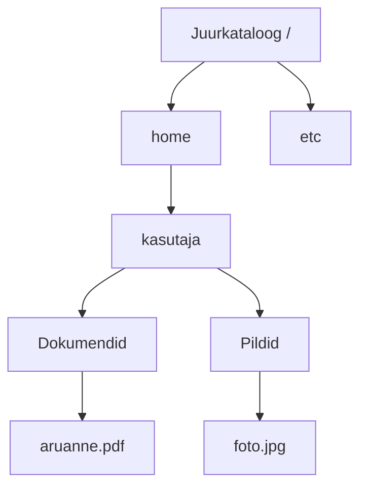

# Failisüsteemid

Fail võib olla olemas, kuid arvuti peab teadma ka selle nime, asukohta ja suurust ning seda, kes tohib faili kasutada. Selle korraldamisega tegeleb **failisüsteem**. Selles materjalis tutvume failisüsteemide ülesannete ja levinud näidetega ning õpime põhjendama nende valikut.

!!! info "Õpieesmärgid"

    Pärast materjali läbimist oskad:

    - selgitada failisüsteemi rolli andmete talletamisel;
    - eristada salvestusseadet, partitsiooni, köidet, failisüsteemi ja failivormingut;
    - kirjeldada kataloogipuu, failitee ja metaandmete tähendust;
    - võrrelda erinevate failisüsteemide kasutusotstarvet;
    - tuua näiteid failisüsteemide kasutamisest;
    - eristada päeviku, kontrollsumma, krüpteerimise, hetktõmmise ja varukoopia ülesandeid;
    - valida olukorrale sobiva failisüsteemi ning põhjendada oma valikut.

## 1. Mis on failisüsteem?

**Failisüsteem** (*file system*) on andmete talletamise ja korraldamise viis ning seda toetav tarkvara. See võimaldab operatsioonisüsteemil käsitleda andmeid failide ja kataloogidena. Kasutaja ei pea teadma, millisesse salvestusseadme füüsilisse kohta iga failiosa kirjutatakse.

Failisüsteemi ülesanded on näiteks:

- korraldada failide ja kataloogide nimesid ning asukohti;
- pidada arvestust kasutatud ja vaba salvestusruumi üle;
- võimaldada andmete lugemist, kirjutamist ja kustutamist;
- talletada teavet failide kohta;
- toetada ligipääsuõigusi ja töökindluse mehhanisme, kui failisüsteem neid pakub.

Failisüsteem võib paikneda näiteks SSD-l, kõvakettal või mälupulgal. Kõik failisüsteemid ei asu siiski otse kohalikul kettal: andmetele võib ligi pääseda ka võrgu kaudu ning mõned failisüsteemid esitavad mälus olevat või operatsioonisüsteemi loodud teavet.

### 1.1. Seade, partitsioon, köide ja failisüsteem

| Mõiste | Selgitus | Näide |
| --- | --- | --- |
| **Salvestusseade** | Füüsiline seade andmete talletamiseks. | 1 TB SSD. |
| **Partitsioon** ehk kettajaotis | Partitsioonitabelis määratletud osa salvestusseadmest. | SSD-l eraldi süsteemi- ja andmejaotis. |
| **Köide** (*volume*) | Loogiline salvestusüksus, mida OS saab kasutada. Lihtsal juhul vastab see ühele partitsioonile, kuid keerukamates lahendustes võib seos olla teistsugune. | Windowsis draivitähega `C:` nähtav süsteemiköide. |
| **Failisüsteem** | Korraldus, mille abil köitel faile hallatakse. | NTFS, ext4 või APFS. |
| **Failivorming** (*file format*) | Ühe faili sisu ülesehitus. | PDF, JPEG või MP3. |

**Näide:** SSD-l on Windowsi süsteemiköide failisüsteemiga NTFS. Sellel asub fail `aruanne.pdf`, mille failivorming on PDF. NTFS korraldab faili talletamist; PDF määrab dokumendi sisu ülesehituse.

**GPT** ja **MBR** kirjeldavad kettajaotiste korraldust. Need on partitsiooniskeemid, mitte failisüsteemid. Ühel seadmel võivad eri partitsioonidel olla erinevad failisüsteemid.

## 2. Kataloogipuu, failitee ja metaandmed

### 2.1. Hierarhiline ülesehitus

Tavaliselt korraldatakse failid **hierarhiliselt**, kataloogide ja alamkataloogide puuna. **Kataloog** ehk kaust võib sisaldada faile ja teisi katalooge. Puu lähtekoht on **juurkataloog**.

See on lihtsustatud Linuxi kataloogipuu. Kaust `Dokumendid` asub kasutaja kaustas ning fail `aruanne.pdf` kaustas `Dokumendid`.

**Failitee** (*path*) kirjeldab faili või kataloogi asukohta:

- Windowsi näide: `C:\Users\kasutaja\Documents\aruanne.pdf`;
- Linuxi näide: `/home/kasutaja/Dokumendid/aruanne.pdf`.

Windowsis kasutatakse sageli draivitähti, Linuxis ühendatakse eri failisüsteemid ühe kataloogipuu külge. **Haakimine** (*mounting*) tähendab failisüsteemi kasutamiseks ühendamist; **haakepunkt** (*mount point*) on koht kataloogipuus, mille kaudu selle sisule ligi pääseb. Näiteks võib mälupulga sisu olla kättesaadav kataloogis `/media/kasutaja/USB`.

### 2.2. Metaandmed ja salvestusruum

**Metaandmed** (*metadata*) on andmed faili kohta: näiteks faili suurus, ajatemplid, omanik ja õigused. Toetatavad metaandmed sõltuvad failisüsteemist. Faili nimi ja kataloogiseosed on samuti osa failisüsteemi hallatavast teabest.

Faili sisu talletatakse ruumi jaotamise üksustes, mida nimetatakse sageli **plokkideks** või **klastriteks**. Üks fail võib hõivata mitu üksust ning need ei pea asuma järjest.

!!! example "Miks võib fail võtta rohkem ruumi kui selle sisu?"

    Kui failisüsteemi jaotusüksus on 4 KiB, võib 1 KiB sisuga fail lihtsustatud juhul hõivata ühe 4 KiB üksuse. Lisaks kulub ruumi failisüsteemi enda teabele. Täpne ruumikasutus sõltub failisüsteemist ja selle võimalustest.

## 3. Kuidas failisüsteem aitab andmeid kaitsta?

Erinevad mehhanismid lahendavad erinevaid probleeme. Ükski neist ei asenda kõiki teisi.

### 3.1. Ligipääsuõigused ja krüpteerimine

**Ligipääsuõigused** määravad, kes tohib faili näiteks lugeda või muuta. **ACL** (*access control list*) ehk juurdepääsu kontrollnimekiri võimaldab määrata õigusi kasutajatele ja rühmadele. NTFS toetab ACL-e; FAT32 ja exFAT samaväärseid failipõhiseid õigusi ei talleta.

**Krüpteerimine** muudab andmed võtmeta loetamatuks. Seda võib pakkuda failisüsteem ise või eraldi ketta krüpteerimise lahendus. Krüpteerimine kaitseb andmete konfidentsiaalsust, kuid ei taasta kogemata kustutatud faili ega paranda iseenesest rikkis salvestusseadet.

### 3.2. Päevik ehk journaling

**Päevikupidamine** (*journaling*) tähendab, et failisüsteem talletab oluliste muudatuste kohta taastamiseks vajaliku teabe. Katkestuse järel saab selle abil taastada failisüsteemi kooskõlalise oleku. Näiteks ext4 tavapärases töörežiimis tehaks nii metaandmetega; iga faili kogu sisu ei salvestata päevikusse.

**Näide:** vool katkeb faili loomise ajal. Päevik aitab vältida olukorda, kus kataloogikirjed ja salvestusruumi arvestus jäävad omavahel vastuollu. See ei taga, et kõik vahetult enne katkestust sisestatud andmed säilivad.

### 3.3. Kontrollsummad ja veaparandus

**Kontrollsumma** (*checksum*) on andmete põhjal arvutatud väärtus, mille abil saab kontrollida, kas andmed on muutunud. Kui lugemisel arvutatud väärtus erineb talletatud väärtusest, võib see viidata andmete rikkumisele ehk *data corruption*'ile.

**Vea avastamine ja parandamine on erinevad asjad.** Parandamiseks peab olema kättesaadav terve koopia või muu taastamiseks piisav liiane teave. Näiteks Btrfs ja ZFS saavad salvestuslahenduses kasutada vigase ploki asemel tervet koopiat (peab loomulikult ruumi olema).

### 3.4. Kopeerimine kirjutamisel ja hetktõmmised

**Kopeerimine kirjutamisel** ehk **CoW** (*copy-on-write*) tähendab lihtsustatud mudelis, et muudetav plokk kirjutatakse uude kohta ja seejärel uuendatakse viiteid. Muutmata plokke ei pea uuesti kopeerima. See ei tähenda, et iga muudatuse korral tehakse kogu failist täiskoopia.

Seda põhimõtet kasutavad näiteks Btrfs ja ZFS. **Hetktõmmis** (*snapshot*) säilitab viited kindla ajahetke andmetele ning aitab hiljem varasema oleku juurde tagasi pöörduda. Kui hetktõmmis hoiab vanu plokke kasutuses, kulub muudatuste lisandudes ka rohkem salvestusruumi.

!!! warning "Hetktõmmis ei asenda eraldi varukoopiat"

    Samal salvestusseadmel olev hetktõmmis võib aidata eksliku muudatuse tagasi võtta. Kui seade hävib, võivad kaduda nii praegused andmed kui ka hetktõmmised. Olulistest failidest peab olema eraldi varukoopia.

## 4. Windowsiga seotud failisüsteemid

### 4.1. FAT32 — File Allocation Table 32

**FAT32** on vanem, laialt toetatud failisüsteem. Seda kohtab näiteks mälupulkadel ja seadmetes, mis vajavad ühilduvust vanema tarkvara või riistvaraga.

Selle olulised piirangud on:

- ühe faili suurus peab olema **alla 4 GiB**: täpne ülempiir on 4 294 967 295 baiti ehk 4 GiB miinus üks bait;
- puuduvad NTFS-iga võrreldavad failipõhised ligipääsuõigused;
- puudub failisüsteemi päevik. [2, 18]

**Näide:** 32 GB mälupulgal võib olla 20 GB vaba ruumi, kuid sellele ei saa FAT32 korral kopeerida ühte 6 GiB videofaili. Takistus on ühe faili suuruse piir.

### 4.2. exFAT — Extended File Allocation Table

**exFAT** on mõeldud eelkõige eemaldatavatele salvestusseadmetele. See võimaldab talletada üle 4 GiB faile ning sobib sageli andmete vahetamiseks Windowsi ja macOS-i vahel. Ka tänapäevased Linuxi süsteemid võivad exFAT-i kasutada; konkreetse seadme ja tarkvara tuge tuleb siiski kontrollida. [2, 12, 17]

exFAT-il puuduvad tavapärased failipõhised ACL-õigused ja failisüsteemi päevik. See on andmevahetuse jaoks kasulik, kuid ei ole Windowsi tavapärase süsteemiköite failisüsteem. [2]

### 4.3. NTFS — New Technology File System

**NTFS** on tänapäevase Windowsi tavapärane süsteemiköite failisüsteem. See toetab näiteks:

- kasutajate ja rühmade ligipääsuõigusi;
- metaandmete päevikut;
- suuri faile;
- failide pakkimist ning EFS-i abil failipõhist krüpteerimist, kui vastav Windowsi väljaanne ja seadistus seda võimaldavad. [2, 3]

**Näide:** kooli Windowsi arvutis saab määrata, et õppija tohib oma faile muuta, kuid teiste kasutajate failidele ligi ei pääse.

NTFS on sobiv valik Windowsi sisemise andmeköite jaoks. Teistes operatsioonisüsteemides ei pruugi lugemis- ja kirjutamistugi olla samasugune: näiteks macOS-is saab NTFS-kettalt üldjuhul lugeda, kuid kirjutamiseks on vaja lisalahendust. [12]

### 4.4. ReFS — Resilient File System

**ReFS** keskendub suurte andmekogumite ja töökindla salvestuse vajadustele. Seda kasutatakse Windows Serveri salvestuslahendustes ning Windows 11 arendustööks mõeldud **Dev Drive**'i köidetel. [5, 13]

ReFS kasutab metaandmete kontrollsummasid ja võib kasutada ka failiandmete kontrollsummasid. Sobiva Storage Spacesi liiasuse korral saab see kahjustatud andmeid tervest koopiast parandada. Automaatne parandamine ei ole võimalik iga vea ja iga seadistuse korral. [5]

**ReFS ei ole Windowsi alglaaditava süsteemiköite failisüsteem.** Seda ei saa valida NTFS-i asemel tavapärase Windowsi süsteemiköite jaoks. Võimalused sõltuvad Windowsi versioonist ja kasutusjuhtumist. [5]

## 5. Linuxiga seotud failisüsteemid

Linux toetab mitut failisüsteemi. Kõigil distributsioonidel ja väljaannetel ei ole ühtset vaikimisi valikut.

### 5.1. ext2, ext3 ja ext4

**ext** tähendab *extended file system*. ext2, ext3 ja ext4 on sama failisüsteemiperekonna eri põlvkonnad. [4, 6, 14]

| Failisüsteem | Oluline erinevus | Mida algaja peaks teadma? |
| --- | --- | --- |
| **ext2** — *second extended file system* | Tavapärane ext2 ei pea failisüsteemi päevikut. | Vanem lahendus; uue üldotstarbelise süsteemi jaoks eelistatakse enamasti muud valikut. |
| **ext3** — *third extended file system* | Lisab ext-perekonda päeviku. | Aitas pärast katkestust failisüsteemi olekut kiiremini taastada. |
| **ext4** — *fourth extended file system* | Täiustab muu hulgas ruumi jaotamist ning suurte failide käsitlemist. | Levinud üldotstarbeline Linuxi failisüsteem, mis toetab õigusi ja päevikut. |

ext4 on sobiv näide Linuxi süsteemi- ja andmeköite failisüsteemist. See ei tähenda, et iga Linuxi paigaldus kasutab ext4: näiteks Fedora töölauaväljaanded kasutavad tavapärases automaatses paigalduses Btrfs-i ning RHEL 10 vaikimisi failisüsteem on XFS. [6, 8]

### 5.2. XFS

**XFS** on päevikuga failisüsteem, mis sobib suurtele salvestusmahtudele ja paljudele samaaegsetele sisend-väljundtoimingutele. Seda kasutatakse muu hulgas serverites ning see on RHEL 10 vaikimisi valik. [6]

**Näide:** server töötleb mitme rakenduse suuri andmefaile korraga.

XFS-i ei saa nimetada kõigi töökoormuste puhul ext4-st kiiremaks. Tulemus sõltub failide suurusest, toimingutest, salvestusseadmest ja seadistusest. Valikut hinnatakse konkreetse kasutuse järgi. [6]

### 5.3. Btrfs — B-tree File System

**Btrfs** pakub muu hulgas CoW-d, hetktõmmiseid, alamköiteid, andmete pakkimist ning andmete ja metaandmete kontrollsummasid. **Alamköide** (*subvolume*) on eraldi hallatav osa Btrfs-failisüsteemist; see ei ole sama mis eraldi kettapartitsioon. [7]

**Näide:** süsteemist tehakse enne tarkvarauuendust hetktõmmis, et probleemi korral saaks varasema oleku taastada.

Btrfs on kasutusel näiteks Fedora töölauaväljaannetes. Selle võimaluste töökindlust tuleb hinnata kasutatava funktsiooni ja seadistuse järgi, mitte üldise väitega „uus ja ebastabiilne”. Näiteks Btrfs-i dokumentatsioon eristab tavapäraseid võimalusi eksperimentaalsetest RAID 5/6 lahendustest. [7, 8]

### 5.4. ZFS ja OpenZFS

**ZFS** ühendab failisüsteemi ja salvestusruumi haldamise võimalusi. Linuxis kasutatakse seda muu hulgas **OpenZFS-i** kaudu. ZFS ei ole ainult Linuxi failisüsteem; see pärineb Solarise keskkonnast. [15]

Salvestusseadmeid koondatakse **salvestuskogumiks** (*storage pool*), millest luuakse failisüsteeme või muid salvestusüksusi. ZFS kasutab CoW-d, kontrollsummasid ja hetktõmmiseid. Sobiva liiasuse korral saab kahjustatud andmeid parandada. [9, 10, 15]

**Näide:** ettevõtte failide hoidmiseks kasutatakse mitme kettaga salvestusserverit. ZFS aitab hallata salvestusruumi ja kontrollida andmete terviklikkust.

ZFS-i mälu- ja jõudlusvajadus sõltub töökoormusest ning valitud võimalustest. „Peaaegu piiramatu maht” ei ole praktiline valikukriteerium: alati tuleb arvestada tegeliku riistvara ja toetatud seadistusega.

## 6. Apple'i failisüsteemid

### 6.1. HFS ja HFS+

**HFS** (*Hierarchical File System*) ja **HFS+** (*Hierarchical File System Plus*, tuntud ka kui **Mac OS Extended**) on Apple'i vanemad failisüsteemid. HFS+ oli kasutusel enne APFS-i ning seda võib endiselt kohata vanematel ketastel ja vanemate süsteemidega ühilduvust vajavates lahendustes. HFS+ olemasolu ei tähenda iseenesest, et ketas on vigane. [11, 16]

Selles materjalis piisab nende nimetuste äratundmisest. Failisüsteemide üksikasjalikku arengulugu käsitleme eraldi.

### 6.2. APFS — Apple File System

**APFS** on tänapäevase macOS-i peamine failisüsteem; seda kasutavad ka Apple'i mobiiliplatvormid. See on optimeeritud välkmälule ja SSD-dele, kuid seda saab kasutada ka kõvaketastel. [11, 16]

APFS toetab näiteks:

- krüpteeritud köiteid;
- hetktõmmiseid;
- mitme köite ühist ruumikasutust APFS-konteineris;
- nii suur- ja väiketähti eristavat kui ka neid mitteeristavat vormingut. [11]

**Näide:** suur- ja väiketähti eristava vormingu korral võivad `Töö.txt` ja `töö.txt` olla samas kaustas eri failid. Neid mitteeristava vormingu korral käsitletakse nimesid samana.

APFS ei ole tavaliselt sobiv valik kettale, mida peab lisatarkvarata lugema ja muutma ka Windowsi arvutis. Selleks võib sobida exFAT. [11, 12]

## 7. Kuidas valida failisüsteemi?

Valik sõltub sellest, **kus**, **milleks** ja **milliste failidega** salvestusseadet kasutatakse.

| Olukord | Võimalik valik | Põhjendus või kontrollitav tingimus |
| --- | --- | --- |
| Windowsi tavapärane süsteemiköide | **NTFS** | Windowsi süsteemi jaoks vajalikud võimalused ja õigused. |
| Windowsi sisemine andmeköide | **NTFS** | Suured failid, õigused ja päevik. |
| Windowsi ja macOS-i vahel liigutatav ketas, millel on suured videofailid | **exFAT** | Mõlemas keskkonnas toetatud andmevahetus ning üle 4 GiB failid. |
| Mälupulk vanema seadme jaoks | **FAT32**, kui seade seda nõuab | Kontrolli seadme juhendist tuge; ühe faili piir on alla 4 GiB. |
| Linuxi süsteemi- või andmeköide | **ext4**, **XFS** või **Btrfs** | Lähtu distributsiooni toest ja töökoormusest; üht universaalset valikut ei ole. |
| Linuxi keskkond, kus soovitakse alamköiteid ja hetktõmmiseid | **Btrfs** | Vajalikud võimalused ja kasutatava distributsiooni tugi. |
| Mitme kettaga salvestusserver | **ZFS/OpenZFS** või muu toetatud lahendus | Salvestuskogumid, kontrollsummad ja liiasus; vajadusel spetsialisti kavandatud seadistus. |
| Tänapäevase Maci süsteemi- või ainult Macis kasutatav andmeköide | **APFS** | macOS-i tugi ning vajaduse korral krüpteeritud köited ja hetktõmmised. |
| Windowsi spetsiaalne salvestus- või arendusköide | **ReFS** | Ainult sobiva Windowsi versiooni ja toetatud kasutusjuhtumi korral. |

Tabel on õppimiseks mõeldud lähtekoht. Konkreetse seadme, operatsioonisüsteemi versiooni ja kasutusjuhtumi dokumentatsioon määrab lõpliku valiku. [2, 3, 5–8, 11–13, 15]

### 7.1. Mahupiirid: faili suurus ei ole köite suurus

Erista alati kolme küsimust:

1. Kui suur võib olla **üks fail**?
2. Kui suur võib olla **kogu köide**?
3. Mida toetab **konkreetne operatsioonisüsteem ja tööriist**?

Failisüsteemi kirjeldusest leitud teoreetiline ülempiir ei pruugi olla arvutis tegelikult kasutatav piir. Näiteks NTFS-i praktilised võimalused sõltuvad Windowsi versioonist ja klastrisuurusest. Ka failinime pikkus ja kogu failitee pikkus on erinevad näitajad. [2, 3, 5]

!!! tip "Ühikud tuleb kirjutada õigesti"

    **GB ja TB** on 1000-põhised, **GiB ja TiB** 1024-põhised ühikud. Seega 1000 GB = 1 TB, kuid 1024 GiB = 1 TiB. FAT32 ühe faili piir on alla **4 GiB**, mitte täpselt 4 GB.

### 7.2. Vormindamine ja ühilduvus

**Vormindamine** (*formatting*) loob köitele failisüsteemi. Tavapärane uuesti vormindamine muudab senised failid tavapärasel viisil kättesaamatuks. See ei ole sama mis failide kopeerimine ega garanteeri vana sisu turvalist kustutamist.

Enne failisüsteemi valikut kontrolli:

- kas kõik vajalikud seadmed ja operatsioonisüsteemid saavad seda lugeda **ja** sellele kirjutada;
- kas ühe faili suuruse piir sobib;
- kas vajad failipõhiseid õigusi, krüpteerimist või hetktõmmiseid;
- kas alglaadimine ja vajalikud rakendused on selles seadistuses toetatud.

!!! warning "Enne vormindamist"

    Tee vajalikest andmetest varukoopia ja veendu, et valisid õige seadme ning köite. Failisüsteemi muutmine ei ole probleemse mälupulga puhul automaatselt esimene lahendus.

## 8. Enesekontroll

Vasta kõigepealt ise. Seejärel ava vastus ja võrdle oma põhjendust.

### 1. Mille poolest erinevad NTFS ja PDF?

??? question "Vaata vastust"

    NTFS on failisüsteem: see korraldab failide talletamist ja haldamist. PDF on failivorming: see kirjeldab ühe dokumendifaili sisu ülesehitust. PDF-fail võib asuda näiteks NTFS-, exFAT- või ext4-failisüsteemis.

### 2. FAT32 mälupulgal on 20 GB vaba ruumi. Miks ei õnnestu sinna kopeerida ühte 6 GiB faili?

??? question "Vaata vastust"

    FAT32 ühe faili suurus peab jääma alla 4 GiB. Kogu vaba ruum ja ühe faili suuruse piir on erinevad näitajad.

### 3. Milline failisüsteem sobib sageli suure videofaili liigutamiseks Windowsi ja Maci vahel?

??? question "Vaata vastust"

    exFAT, sest see toetab üle 4 GiB faile ja mõlemad operatsioonisüsteemid saavad seda kasutada. Kontrollida tuleb konkreetsete süsteemide ja seadmete tuge. exFAT ei paku NTFS-iga võrreldavaid failipõhiseid õigusi ega päevikut.

### 4. Milline failisüsteem on tänapäevase Windowsi tavapärasel süsteemiköitel?

??? question "Vaata vastust"

    NTFS. ReFS sobib teatud salvestus- ja arendusköidetele, kuid ei ole Windowsi alglaaditava süsteemiköite failisüsteem.

### 5. Kas kõik Linuxi distributsioonid kasutavad vaikimisi ext4?

??? question "Vaata vastust"

    Ei. Vaikimisi valik sõltub distributsioonist ja väljaandest. Näiteks Fedora töölauaväljaanded kasutavad tavapärases automaatses paigalduses Btrfs-i, RHEL 10 XFS-i. ext4 on samuti levinud üldotstarbeline valik.

### 6. Kas päevik säilitab alati kogu faili sisu ja asendab varukoopia?

??? question "Vaata vastust"

    Ei. Päevik aitab taastada failisüsteemi kooskõlalist olekut pärast katkestust. Näiteks ext4 tavapärane päevik kaitseb eelkõige metaandmete kooskõla. See ei taga kõigi viimaste muudatuste säilimist ega asenda eraldi varukoopiat.

### 7. Kontrollsumma näitab, et plokk on vigane. Kas failisüsteem saab selle alati parandada?

??? question "Vaata vastust"

    Ei. Kontrollsumma aitab vea avastada. Parandamiseks peab olema terve koopia või muu taastamiseks piisav teave ning seda toetav seadistus.

### 8. Millist failisüsteemi kasutatakse tänapäevase macOS-i süsteemiköitel ning mida tähendab HFS+?

??? question "Vaata vastust"

    Tänapäevase macOS-i süsteemiköitel kasutatakse APFS-i. HFS+ ehk Mac OS Extended on Apple'i vanem failisüsteem, mida võib endiselt kohata vanematel ketastel ja ühilduvust vajavates lahendustes.

### 9. Kas CoW tähendab, et iga väikese muudatuse korral kopeeritakse kogu fail?

??? question "Vaata vastust"

    Ei. Lihtsustatud mudelis kirjutatakse uude kohta muutunud plokid ja uuendatakse viited. Muutmata plokke võivad praegune olek ja hetktõmmis jagada.

### 10. Miks ei piisa oluliste failide kaitsmiseks samal kettal olevast hetktõmmisest?

??? question "Vaata vastust"

    See võib aidata varasema oleku taastamisel, kuid ketta hävimisel võivad kaduda nii failid kui ka hetktõmmis. Olulistest failidest on vaja eraldi varukoopiat.

## Kokkuvõte

- Failisüsteem korraldab failide talletamist, leidmist ja salvestusruumi kasutamist.
- Salvestusseade, partitsioon, köide, failisüsteem ja failivorming on erinevad mõisted.
- Kataloogipuu kirjeldab failide korraldust; failitee näitab asukohta.
- FAT32 ühe faili piir on alla 4 GiB. exFAT sobib sageli suurte failide vahetamiseks eri süsteemide vahel.
- NTFS on Windowsi tavapärane süsteemiköite failisüsteem; APFS on tänapäevase macOS-i peamine failisüsteem.
- Linuxis kasutatakse muu hulgas ext4, XFS-i ja Btrfs-i. Kõigil distributsioonidel ei ole sama vaikimisi valikut.
- ReFS ja ZFS pakuvad võimalusi spetsiaalsete salvestusvajaduste jaoks.
- Õigused, krüpteerimine, päevik ja kontrollsummad täidavad erinevaid ülesandeid.
- CoW aitab luua hetktõmmiseid ilma kogu andmestiku kohese täiskoopiata. Hetktõmmis ei asenda eraldi varukoopiat.
- Failisüsteemi valikul kontrolli ühilduvust, mahupiire ja vajalikke võimalusi.

### Mõtle õpitule

1. Sul on vaja viia üks 8 GiB videofail Windowsi arvutist Maci. Millise failisüsteemi valiksid mälupulgale ja mida kontrolliksid enne vormindamist?
2. Selgita oma sõnadega, kuidas erinevad faili ligipääsuõigused, krüpteerimine ja varukoopia. Millist probleemi igaüks lahendab?
3. Sõber ütleb: „Valin alati kõige uuema failisüsteemi, sest see on kõige kiirem ja turvalisem.” Milliseid täpsustavaid küsimusi sa talle esitaksid?

## Teema sõnastik

| Mõiste | Selgitus |
| --- | --- |
| **Failisüsteem — file system** | Failide talletamise ja korraldamise viis ning seda toetav tarkvara. |
| **Failivorming — file format** | Ühe faili sisu ülesehitus, näiteks PDF või JPEG. |
| **Salvestusseade — storage device** | Füüsiline seade andmete talletamiseks, näiteks SSD või mälupulk. |
| **Partitsioon — partition** | Partitsioonitabelis määratletud osa salvestusseadmest. |
| **Köide — volume** | OS-i kasutatav loogiline salvestusüksus; see ei pea alati vastama ühele partitsioonile. |
| **Partitsiooniskeem — partition scheme** | Kettajaotiste kirjeldamise korraldus, näiteks GPT või MBR. |
| **Kataloog — directory** | Kaust, mis korraldab faile ja alamkatalooge. |
| **Juurkataloog — root directory** | Kataloogipuu lähtekoht. |
| **Failitee — path** | Faili või kataloogi asukoha kirjeldus kataloogipuus. |
| **Metaandmed — metadata** | Andmed faili kohta, näiteks suurus, ajatemplid ja õigused. |
| **Plokk; klaster — block; cluster** | Salvestusruumi jaotamise üksus; täpne tähendus sõltub süsteemist. |
| **Haakimine — mounting** | Failisüsteemi ühendamine, et selle sisu saaks kasutada. |
| **Haakepunkt — mount point** | Koht kataloogipuus, mille kaudu ühendatud failisüsteemile ligi pääseb. |
| **Vormindamine — formatting** | Failisüsteemi loomine köitele. |
| **Ligipääsuõigused — permissions** | Reeglid selle kohta, kes tohib faili või kataloogi kasutada ja muuta. |
| **ACL — access control list** | Kasutajate ja rühmade juurdepääsuõiguste kontrollnimekiri. |
| **Krüpteerimine — encryption** | Andmete muutmine võtmeta loetamatuks. |
| **Päeviku pidamine — journaling** | Taastamiseks vajaliku teabe talletamine failisüsteemi muudatuste kohta. |
| **Andmete terviklikkus — data integrity** | Andmete kooskõla ja rikkumata säilimine. |
| **Andmete rikkumine — data corruption** | Andmete kahjustumine, näiteks salvestus- või edastusvea tõttu. |
| **Kontrollsumma — checksum** | Andmetest arvutatud väärtus, mis aitab avastada muutusi ja vigu. |
| **Liiasus — redundancy** | Täiendavad koopiad või teave, mida saab kasutada rikke korral taastamiseks. |
| **CoW — copy-on-write** | Kopeerimine kirjutamisel: muutunud plokid kirjutatakse uude kohta ja uuendatakse viited. |
| **Hetktõmmis — snapshot** | Andmete kindla ajahetke oleku säilitamine. |
| **Varukoopia — backup** | Andmete taastamiseks mõeldud eraldi koopia. |
| **Alamköide — subvolume** | Btrfs-failisüsteemi eraldi hallatav osa. |
| **Salvestuskogum — storage pool** | Ühiselt hallatav salvestusruum, mida saab moodustada mitmest seadmest. |
| **FAT32 — File Allocation Table 32** | Laia seadmetoega failisüsteem, mille ühe faili piir on alla 4 GiB. |
| **exFAT — Extended File Allocation Table** | Eemaldatavate seadmete ja suurte failide andmevahetuse failisüsteem. |
| **NTFS — New Technology File System** | Windowsi tavapärane failisüsteem õiguste ja päeviku toega. |
| **EFS — Encrypting File System** | Windowsi failipõhise krüpteerimise võimalus NTFS-is. |
| **ReFS — Resilient File System** | Microsofti failisüsteem spetsiaalseteks töökindla salvestuse kasutusjuhtudeks. |
| **ext2, ext3, ext4 — extended file system** | Linuxi ext-failisüsteemiperekonna teine, kolmas ja neljas põlvkond. |
| **XFS** | Päevikuga failisüsteem, mis sobib muu hulgas suurtele salvestusmahtudele ja samaaegsetele I/O-toimingutele. |
| **Btrfs — B-tree File System** | Linuxi failisüsteem CoW, alamköidete, hetktõmmiste ja kontrollsummadega. |
| **ZFS; OpenZFS** | Failisüsteemi ja salvestusruumi haldust ühendav tehnoloogia; OpenZFS on selle avatud lähtekoodiga arendus. |
| **HFS; HFS+ — Hierarchical File System; Hierarchical File System Plus** | Apple'i vanemad failisüsteemid; HFS+ on tuntud ka kui Mac OS Extended. |
| **APFS — Apple File System** | Tänapäevane Apple'i failisüsteem. |
| **Suur- ja väiketähtede eristamine — case sensitivity** | Nime suur- ja väiketähtedega variante käsitletakse erinevate nimedena. |
| **GB; GiB** | GB = 1 000 000 000 baiti; GiB = 1 073 741 824 baiti. |
| **I/O — input/output** | Sisend-väljund; siin näiteks andmete lugemine ja kirjutamine. |

## Allikad ja lisalugemine

Materjal põhineb H5P-esitlusel „Failisüsteemid” (Priit Paap, 08.2025). Sisu on ümber töötatud ning täpsustatud järgmiste esmaste allikate abil. Veebiallikad kontrollitud **04.10.2026**.

1. Linux Kernel Documentation: [Overview of the Linux Virtual File System](https://www.kernel.org/doc/html/latest/filesystems/vfs.html).
2. Microsoft Learn: [File System Functionality Comparison](https://learn.microsoft.com/en-us/windows/win32/fileio/filesystem-functionality-comparison). Erista teoreetilisi formaadipiire ning konkreetse Windowsi versiooni rakenduspiire.
3. Microsoft Learn: [NTFS overview](https://learn.microsoft.com/en-us/windows-server/storage/file-server/ntfs-overview).
4. Linux Kernel Documentation: [ext4 Journal (jbd2)](https://www.kernel.org/doc/html/latest/filesystems/ext4/journal.html).
5. Microsoft Learn: [Resilient File System (ReFS) overview](https://learn.microsoft.com/en-us/windows-server/storage/refs/refs-overview).
6. Red Hat Documentation: [RHEL 10 — Overview of available file systems](https://docs.redhat.com/en/documentation/red_hat_enterprise_linux/10/html/managing_file_systems/overview-of-available-file-systems).
7. Btrfs Documentation: [Introduction](https://btrfs.readthedocs.io/en/latest/Introduction.html).
8. Fedora Project: [Btrfs](https://fedoraproject.org/wiki/Btrfs).
9. OpenZFS Documentation: [Copy-on-Write](https://openzfs.github.io/openzfs-docs/Basic%20Concepts/Copy-on-write.html).
10. OpenZFS Documentation: [Snapshots, Clones and Bookmarks](https://openzfs.github.io/openzfs-docs/Basic%20Concepts/Datasets/Snapshots%20and%20Clones.html).
11. Apple Support: [File system formats available in Disk Utility on Mac](https://support.apple.com/guide/disk-utility/file-system-formats-dsku19ed921c/mac).
12. Apple Support: [If your Mac can't save files to an external drive](https://support.apple.com/en-ie/101830).
13. Microsoft Learn: [Set up a Dev Drive on Windows 11](https://learn.microsoft.com/en-us/windows/dev-drive/).
14. Linux Kernel Documentation: [The Second Extended Filesystem](https://www.kernel.org/doc/html/latest/filesystems/ext2.html).
15. OpenZFS Documentation: [Basic Concepts](https://openzfs.github.io/openzfs-docs/Basic%20Concepts/index.html).
16. Apple Developer, dokumentatsiooni arhiiv: [File System Details](https://developer.apple.com/library/archive/documentation/FileManagement/Conceptual/FileSystemProgrammingGuide/FileSystemDetails/FileSystemDetails.html). Kasutatud vanemate failisüsteemide tausta jaoks; arhiivi soovitused ei pruugi kirjeldada tänapäevast macOS-i.

17. Linuxi lähtekood: [exFAT-i toe seadistus](https://github.com/torvalds/linux/blob/master/fs/exfat/Kconfig).
18. Microsofti draiverinäide: [FAT-i failisuuruse 32-bitine piir](https://github.com/microsoft/Windows-driver-samples/blob/main/filesys/fastfat/fatprocs.h).

---

Seotud materjalid: [Operatsioonisüsteemi põhifunktsioonid](operatsioonisusteemi_pohifunktsioonid.md) ja [Alglaadimine ja OS-i hooldus](alglaadimine_ja_os_hooldus.md).

*Õppematerjali koostaja: Priit Paap, 2026*
