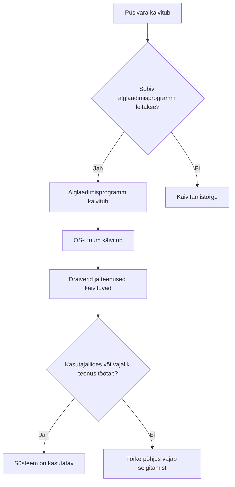

# Alglaadimine ja operatsioonisüsteemi hooldus

Toitenupu vajutamise ja kasutajale töölaua ilmumise vahel toimub mitu erinevat tegevust. Käivitamiseks vajalik tarkvara ei koosne ainult operatsioonisüsteemist. Selles materjalis vaatame arvuti alglaadimist ning põhimõtteid, mille abil süsteemi töökorras ja ajakohasena hoida.

!!! info "Õpieesmärgid"

    Pärast materjali läbimist oskad:

    - selgitada püsivara, UEFI, BIOS-i ja alglaaduri rolli;
    - kirjeldada arvuti alglaadimise põhietappe;
    - eristada Secure Booti, TPM-i ja kettakrüpteerimist;
    - selgitada draiverite ja teenuste osa süsteemi käivitumisel;
    - põhjendada uuenduste ja tootetoe tähtsust;
    - eristada varukoopiat, hetktõmmist ja taastamisvõimalust;
    - kirjeldada lihtsa tõrkeotsingu põhimõtet ning virtuaalmasina rolli õppimisel.

## 1. Mis käivitub enne operatsioonisüsteemi?

**Püsivara** ehk *firmware* on seadme tööks vajalik tarkvara, mida hoitakse tavaliselt seadme püsimälus. Näiteks arvuti emaplaadi püsivara aitab riistvara käivitada ja valmistab ette OS-i laadimise.

Püsivara ei ole sama mis muutmälu ehk RAM. Püsivaraprogramm säilib ka siis, kui arvuti ei saa toidet. Vajaduse korral saab seda tootja ettenähtud viisil uuendada.

**UEFI** (*Unified Extensible Firmware Interface*) määratleb tänapäevase liidese arvuti püsivara ja operatsioonisüsteemi vahel. Igapäevases kõnes nimetatakse „UEFI-ks“ ka sellel põhinevat püsivara ja seadistusmenüüd. [1]

**BIOS** (*Basic Input/Output System*) tähistab varasemat PC püsivara lahendust. UEFI on selle tänapäevane asendaja. Seadistusmenüüd nimetatakse kõnekeeles mõnikord BIOS-iks ka UEFI-ga arvutil.

| Mõiste | Peamine roll |
| --- | --- |
| **Püsivara** | Seadme käivitamine ja algne juhtimine. |
| **UEFI või BIOS** | Arvuti käivitamise ettevalmistamine ja alglaadimise käivitamine. |
| **Alglaadur** | OS-i tuuma laadimise ja käivitamise korraldamine. |
| **OS-i tuum** | Ressursside ja kaitstud toimingute haldamine pärast selle käivitumist. |

Kui OS juba töötab, korraldavad tavalist seadmete kasutamist eelkõige OS-i komponendid ja draiverid. Seda ei ole õige kirjeldada nii, nagu kogu OS-i ja riistvara andmevahetus käiks pidevalt vana BIOS-i kaudu.

## 2. Alglaadimise põhietapid

**Alglaadimine** ehk *boot* on tegevuste jada, mille käigus süsteem valmistatakse tööks ette ja operatsioonisüsteem käivitatakse.

Tavalise UEFI-ga arvuti käivitumist saab lihtsustada järgmiselt:

1. **Käivitub püsivara.** See valmistab vajalikud riistvarakomponendid ette ja teeb käivituskontrolle. Nende kontrollide kohta kasutatakse ka nimetust POST (*power-on self-test*).
2. **Valitakse alglaadimisvõimalus.** Püsivara seadistused määravad näiteks, millist alglaadimiskirjet kasutada. Käivitada saab eri lahendustes salvestusseadmelt, paigaldusmeedialt või võrgust.
3. **Käivitatakse alglaadimisprogramm.** See võib olla näiteks Windows Boot Manager või GRUB. Alglaadimisahelas võib olla rohkem kui üks programm.
4. **Laaditakse ja käivitatakse OS-i tuum.** Vajalik tuumakood jõuab RAM-i ning alustab süsteemi töö korraldamist.
5. **Käivitatakse vajalikud draiverid ja teenused.** Süsteem valmistab ette näiteks failide, võrgu ja kasutajate haldamise.
6. **Kasutaja saab süsteemi kasutada.** Tööjaamas ilmub tavaliselt sisselogimisvaade või töölaud. Server võib olla kasutatav käsurea või võrgu kaudu ilma graafilise töölauata.

Skeem on lihtsustatud. Mõned draiverid laaditakse väga varakult ja mitu teenust võivad käivituda paralleelselt. Erinevad OS-id ning käivitamisviisid kasutavad erinevaid üksikasju. Näiteks unerežiimist naasmine ei ole sama tegevus mis täielik alglaadimine.

!!! tip "RAM ja vahemälu"

    OS-i käivitamisel laaditakse vajalik kood ja andmed muutmällu ehk RAM-i. Seda ei tule kirjeldada operatsioonisüsteemi laadimisena „kõvakettalt vahemällu“. RAM ja vahemälu ei ole sama mõiste.

## 3. GPT, MBR ja EFI süsteemipartitsioon

Arvuti peab teadma, kuidas salvestusseade on jaotatud ning kust leida käivitamiseks vajalik tarkvara.

**GPT** (*GUID Partition Table*) ja **MBR** (*Master Boot Record*) on erinevad viisid salvestusseadme partitsioonide kirjeldamiseks. Need ei ole failisüsteemid. NTFS ja ext4 kirjeldavad failide korraldamist; GPT ja MBR partitsioonide jaotust.

UEFI-käivitusega tänapäevases Windowsi süsteemis kasutatakse GPT-d. Vanema BIOS-põhise käivituse puhul on levinud MBR. Need on tüüpilised seosed, mitte kõigi seadmete ja OS-ide kohta kehtiv universaalne reegel. [2]

UEFI-süsteemi salvestusseadmel võib olla **EFI süsteemipartitsioon** ehk **ESP** (*EFI System Partition*). Seal asuvad alglaadimisfailid, mille kaudu OS-i käivitamine algab. See partitsioon kasutab tavaliselt FAT32 failisüsteemi ning on eraldi OS-i põhilistest andmetest.

!!! warning "Käivitamisfailid ei ole kasutaja dokumendid"

    Väikese süsteemipartitsiooni sisu muutmine või kustutamine võib muuta arvuti mittekäivitatavaks, kuigi kasutaja failid on teisel partitsioonil alles. Samuti võib käivitusrežiimi muutmine muuta olemasoleva paigalduse käivitamise võimatuks. Muudatuse eesmärk ja tagajärjed peavad olema enne teada.

??? info "Lisalugemine: vanem BIOS-põhine käivitus"

    Klassikalise BIOS- ja MBR-põhise käivituse korral laadib BIOS käivitusseadme algusest käivituskoodi. See suunab töö edasi järgmisele alglaadimiskomponendile, näiteks partitsiooni käivituskoodile või alglaaduri järgmisele osale.

    Seda mudelit kasutatakse vanemate süsteemide mõistmiseks. UEFI puhul ei pea käivitusahel järgima sama sektoripõhist teed: püsivara saab käivitada EFI-programmi.

## 4. Secure Boot, TPM ja kettakrüpteerimine

Need kolm mõistet kuuluvad turvalisuse juurde, kuid neil on erinevad ülesanded.

| Mõiste | Mida see teeb? | Millega ei tohi segi ajada? |
| --- | --- | --- |
| **Secure Boot** | Kontrollib alglaadimisel käivitatava tarkvara lubatavust digitaalallkirjade ja usaldusreeglite abil. | Ei krüpteeri kasutaja dokumente. |
| **TPM** | Turvakomponent, mis aitab kaitsta võtmeid ja toetab süsteemi turvatoiminguid. | Ei ole tavalise viirusetõrje asendaja ega iseseisev täielik krüpteerimislahendus. |
| **Kettakrüpteerimine** | Muudab salvestatud andmete lugemise ilma vajalike võtmeteta raskeks. | Ei tõenda, et kõik käivituvad programmid on usaldusväärsed. |

**Secure Boot** on UEFI-põhine turvafunktsioon. Selle eesmärk on takistada keelatud või ebausaldusväärse alglaadimistarkvara käivitamist. See ei tähenda, et süsteemis saavad töötada ainult ühe tootja operatsioonisüsteemid: toetatud Linuxi alglaadimislahendused saavad samuti Secure Booti kasutada. [3]

**TPM** tähendab *Trusted Platform Module*. TPM võib olla eraldi kiip või muu vastav turvalahendus. Näiteks saab kettakrüpteerimise lahendus seda võtmete kaitsmisel kasutada. TPM-i olemasolu ei tähenda automaatselt, et ketas on krüpteeritud. [10]

Kettakrüpteerimise näited on Windowsi **BitLocker**, macOS-i **FileVault** ja Linuxis **LUKS**-põhised lahendused. Kui kasutaja on süsteemi sisse loginud ja andmed on talle ligipääsetavad, saavad vastavate õigustega rakendused neid tavaliselt kasutada. Seega ei asenda krüpteerimine rakenduste usaldusväärsuse kontrolli ega varukoopiat. FileVaulti kohta vaata allikat [11].

!!! example "Näide: kaotatud sülearvuti"

    Kettakrüpteerimine aitab kaitsta salvestatud andmeid olukorras, kus võõras inimene saab seadme või selle ketta enda kätte. Secure Boot aitab kaitsta käivitusahelat. Need lahendused toetavad eri eesmärke ja neid saab kasutada koos.

### Windows 11 kui süsteeminõuete näide

Windows 11 ametlike nõuete hulka kuuluvad muu hulgas sobiv protsessor, **UEFI**, **Secure Booti võimekus** ja **TPM 2.0**. Secure Booti võimekus ja selle parajasti sisselülitatud olek on erinevad asjad. Kõik nõuded tuleb vaadata ametlikust loetelust; ainult RAM-i ja vaba kettaruumi kontrollimisest ei piisa. [4]

Miinimumnõuetele vastamine tähendab sobivust süsteemi nõuete järgi. See ei tõenda, et kõik kasutaja rakendused töötavad soovitud kiirusega.

## 5. Draiverid ja teenused käivitumisel

Tuuma käivitumisest üksi ei piisa kõigi kasutaja tegevuste jaoks. Vaja on ka seadmete kasutamist ja taustal töötavaid teenuseid.

- **Draiver** võimaldab OS-il seadmega suhelda. Puuduv või sobimatu draiver võib põhjustada näiteks heli, võrgu või graafika probleeme.
- **Teenus** teeb taustal süsteemi või rakenduse jaoks vajalikku tööd. Näiteks võrguühenduste haldus ja printimine võivad sõltuda teenustest.
- **Kasutajaliides** pakub süsteemi juhtimiseks sobiva vaate. Graafiline töölaud on üks võimalik liides.

!!! example "Näide: server töötab ilma töölauata"

    Veebiserver saab käivitada OS-i ja veebiteenuse ilma graafilise töölauata. Teenust kasutav inimene näeb oma brauseris veebilehte, mitte serveri kohalikku ekraani. Graafilise töölaua puudumine ei tähenda, et serveri OS ei tööta.

Kui graafiline töölaud ei käivitu, võib osa süsteemist endiselt töötada. Tõrge võib olla näiteks graafikadraiveris või kasutajaliidese teenuses. Põhjus tuleb välja selgitada, mitte järeldada automaatselt, et kogu OS on rikutud.

## 6. Tarkvara paigaldamine ja paketihaldus

**Tarkvarapakett** sisaldab tarkvara paigaldamiseks vajalikku sisu ja selle kohta käivat teavet. Pakett võib sisaldada programmi, teeki, draiverit või muud komponenti. Üks rakendus võib koosneda mitmest paketist.

**Sõltuvus** on teine komponent, mida tarkvara oma tööks vajab. **Paketihaldur** aitab pakette paigaldada, uuendada ja eemaldada ning võib korraldada ka sõltuvuste leidmist.

| Keskkond | Näiteid tarkvara haldamisest |
| --- | --- |
| **Debian ja Ubuntu** | APT ning süsteemi paketihoidlad. |
| **Windows** | Paigaldusprogrammid, Microsoft Store ja WinGet. |
| **macOS** | App Store ja tootja pakutavad paigalduslahendused. |

**Paketihoidla** ehk *repository* on tarkvarapakettide ja nende teabe allikas. Paketihalduri kasutamine ei muuda suvalist hoidlat automaatselt usaldusväärseks: tähtis on ka see, kust tarkvara pärineb. APT ja WinGeti kohta vaata allikaid [5] ja [6].

!!! tip "Usaldusväärne paigaldusallikas"

    Tarkvara puhul tuleb kontrollida allikat, sobivat OS-i, protsessori arhitektuuri ja litsentsitingimusi. Veebilehel suurena nähtav „Laadi alla“ nupp võib olla reklaam, mitte soovitud programmi ametlik allikas.

## 7. Uuendused ja tootetugi

Operatsioonisüsteemi, rakenduste ja püsivara uuendused võivad parandada turvavigu, töökindlust, seadmete tuge või funktsioone.

| Uuenduse liik | Peamine eesmärk |
| --- | --- |
| **Turvauuendus** | Parandada nõrkusi, mida võidakse ründamiseks kasutada. |
| **Veaparandus** | Parandada näiteks kokkujooksmist või valesti töötavat funktsiooni. |
| **Funktsiooni- või versiooniuuendus** | Lisada võimalusi või viia süsteem järgmisele versioonile. |
| **Draiveri või püsivara uuendus** | Parandada seadme tuge, turvalisust või töökindlust. |

**Tootetugi** kirjeldab muu hulgas seda, kui kaua tootja või projekt süsteemile parandusi pakub. **LTS** (*long-term support*) tähendab pikema toega väljaannet, kuid toe kestus ja ulatus sõltuvad konkreetsest tootest. LTS ei tähenda piiramatut tuge. [7]

!!! example "Näide: Windows 10 toe lõpp"

    Windows 10 Home'i ja Pro tavapärane tugi lõppes 14.10.2025. Arvuti ei lõpetanud selle tõttu automaatselt töötamist. Muutus uuenduste ja toe kättesaadavus. ESU on eraldi turvauuenduste programm, mille tingimusi tuleb kontrollida. Mõne eriväljaande tugiaeg võib erineda. [8]

    Õppimisel on oluline eristada kahte väidet: „süsteem käivitub“ ja „süsteem saab vajalikku turvatuge“.

Uuendamise kavandamisel arvestatakse vajalike rakenduste sobivust, vaba salvestusruumi, varukoopia olemasolu ja võimalikku taaskäivitamist. Suurema muudatuse mõju saab esmalt katsetada eraldi keskkonnas.

## 8. Varukoopia, hetktõmmis ja taastamine

**Varukoopia** on andmete või süsteemi koopia, mille abil saab neid taastada. Kasulik varukoopia peab olema taastatav ning kaitstud ka nende rikete eest, mis võivad algset süsteemi kahjustada. Seepärast ei piisa üksnes samale kettale teise kausta kopeerimisest.

**Hetktõmmis** ehk *snapshot* salvestab süsteemi või andmete seisundi kindlal hetkel. Selle teostus sõltub lahendusest. Näiteks VMware virtuaalmasina hetktõmmis sõltub alusketastest ja ei asenda sõltumatut varukoopiat. [9]

**Taastamisvõimalus** võib parandada käivitust, taastada mõne süsteemiseadistuse või viia süsteemi varasemasse seisundisse. See ei tähenda tingimata kõigi kasutaja failide varundamist.

| Lahendus | Milleks see sobib? | Mida kontrollida? |
| --- | --- | --- |
| **Failide varukoopia** | Dokumentide ja muude andmete taastamiseks. | Kas vajalikud failid on kaasatud ja taastamine toimib? |
| **Süsteemi varukoopia** | Terve süsteemi taastamiseks sobiva varunduslahenduse abil. | Kas taastamisvahendid ja vajalikud võtmed on olemas? |
| **Hetktõmmis** | Muudatuse lühiajaliseks katsetamiseks ja tagasipööramiseks. | Millest tõmmis sõltub ja milliseid andmeid see hõlmab? |
| **Failide sünkroonimine** | Failide hoidmiseks mitmes kohas kooskõlas. | Kas kustutamine levib teistesse kohtadesse ja kas on olemas versiooniajalugu? |

!!! warning "Sünkroonimine ei taga taastamist"

    Kui kustutus või vigane muudatus levib sünkroonimise kaudu teistesse seadmetesse, ei pruugi nendes olla enam vana tervet faili. Taastamisvõimalus sõltub teenuse versiooniajaloost, säilitamisajast ja muudest seadistustest.

## 9. Tõrkeotsingu põhimõte

Tõrkeotsing algab probleemi täpsest kirjeldusest. Teade „arvuti ei tööta“ võib tähendada toite puudumist, käivitustõrget, sisselogimisprobleemi või ühe rakenduse viga.

| Tähelepanek | Võimalik uurimissuund |
| --- | --- |
| Arvuti ei reageeri toitenupule. | Toide, ühendused ja riistvara. |
| Püsivara ei leia käivitatavat süsteemi. | Käivitusvalik, salvestusseadme tuvastamine ja alglaadimisfailid. |
| Tuum käivitub, kuid töölaud ei ilmu. | Draiverid, kasutajaliides ja vajalikud teenused. |
| Üks rakendus ei käivitu. | Rakenduse sobivus, sõltuvused, õigused ja logid. |
| Internet ei tööta. | Võrguühendus, aadressiseaded, nimelahendus või kaugteenus. |

Need on uurimissuunad, mitte tõestatud põhjused. Näiteks võrguühenduse puudumine ei tõenda automaatselt, et võrguadapteri draiver on vigane.

Tõrke uurimisel on kasulik teada:

- mis täpselt ebaõnnestub ja kas probleem kordub;
- milline OS, väljaanne ja versioon on kasutusel;
- millal probleem algas ning mis enne seda muutus;
- milline on veateade ja mida näitavad asjakohased logid;
- kas probleem puudutab üht rakendust, üht kasutajat või tervet süsteemi.

Ühe muudatuse tegemine korraga aitab hinnata selle mõju. Enne parandamist tuleb arvestada andmete säilimisega. OS-i uuesti paigaldamine ei ole iga probleemi esimene lahendus.

## 10. Virtuaalmasin kui õppekeskkond

**Virtuaalmasin** ehk **VM** (*virtual machine*) on tarkvaraliselt loodud arvutikeskkond, millele antakse virtuaalne riistvara. Selles saab töötada oma operatsioonisüsteem.

**Host** on füüsiline arvuti või keskkond, mille ressursse kasutatakse. **Külalisoperatsioonisüsteem** ehk *guest OS* töötab virtuaalmasinas. **Hüperviisor** korraldab virtuaalmasinate töö ja nende ligipääsu hosti ressurssidele.

Virtuaalmasinale määratakse näiteks virtuaalsed protsessorid, RAM, virtuaalketas ja võrguadapter. Need kasutavad hosti tegelikke ressursse. Kui korraga töötab liiga palju VM-e, võib hosti ressurssidest puudu jääda.

!!! example "Näide: kooli virtuaallabor"

    Sama VMware vSphere'i keskkond võib käitada ühele õppijale Windowsi virtuaalmasinat ja teisele Linuxi virtuaalmasinat. Mõlemal on oma külalis-OS, virtuaalketas ning seadistused. Seetõttu saab OS-e õppida ilma füüsilise õppearvuti põhiseadistust iga kord vahetamata.

Virtuaalmasin on tervikliku külalis-OS-iga keskkond. **Konteiner** on teistsugune eraldamise viis: tavaliselt kasutavad konteinerid neid käitava süsteemi sama tuuma. Näiteks tööjaama konteinerilahendus võib ise kasutada taustal virtuaalmasinat. Neid mõisteid käsitleme edasistes teemades täpsemalt. [12]

## 11. Enesekontroll

### 1. Mis tarkvara saab töötada enne, kui SSD-l asuv operatsioonisüsteem on käivitatud?

??? success "Vaata vastust"

    Arvuti püsivara. See valmistab riistvara ette ja korraldab alglaadimise alustamist. Püsivara säilib seadme püsimälus ega sõltu SSD-l oleva OS-i käivitumisest.

### 2. Kas GPT ja NTFS kirjeldavad sama asja?

??? success "Vaata vastust"

    Ei. GPT kirjeldab salvestusseadme partitsioonide jaotust. NTFS on failisüsteem, mis korraldab failide ja nende metaandmete hoidmist salvestusruumis.

### 3. Kas Secure Boot krüpteerib sülearvuti dokumendid?

??? success "Vaata vastust"

    Ei. Secure Boot kontrollib alglaadimisel käivitatavat tarkvara. Dokumentide kaitsmiseks salvestusseadmel kasutatakse kettakrüpteerimist või muud vastavat krüpteerimislahendust.

### 4. Kas TPM-i olemasolu tõendab, et ketas on krüpteeritud?

??? success "Vaata vastust"

    Ei. TPM saab toetada võtmete kaitsmist, kuid kettakrüpteerimise olemasolu ja olekut tuleb eraldi kontrollida.

### 5. Serveril ei ilmu graafilist töölauda, kuid veebiteenus vastab. Kas OS võib korralikult töötada?

??? success "Vaata vastust"

    Jah. Serveri OS ja teenused saavad töötada ilma kohaliku graafilise töölauata. Süsteemi kasutatavus sõltub sellest, millist liidest ja teenust on vaja.

### 6. Kas tarkvara tootetoe lõpp tähendab, et arvuti järgmisel päeval enam ei käivitu?

??? success "Vaata vastust"

    Üldjuhul ei. Süsteem võib edasi töötada, kuid vajalikud uuendused ja tugi võivad lõppeda. Seetõttu tuleb hinnata turvatuge ning kavandada sobiv uuendamine või muu lahendus.

### 7. Miks ei piisa VM-i hetktõmmisest alati varukoopiana?

??? success "Vaata vastust"

    Hetktõmmis võib sõltuda samadest alusfailidest ja salvestusseadmest nagu VM. Nende kahjustumine võib muuta ka hetktõmmise kasutuks. Sõltumatu varukoopia peab võimaldama vajalikud andmed taastada ka sellise rikke korral.

### 8. Miks on tõrkeotsingul vaja täpset veateadet ja OS-i versiooni?

??? success "Vaata vastust"

    Need aitavad eristada probleemi põhjuseid ja leida sobiva lahenduse. Sama üldine sümptom võib eri versioonides ning eri käivitusetappides tuleneda erinevatest põhjustest.

### 9. Kas Debianiga VM muudab kogu VMware hosti operatsioonisüsteemiks Debiani?

??? success "Vaata vastust"

    Ei. Debian on selles VM-is külalisoperatsioonisüsteem. Hosti ja hüperviisori keskkond jäävad eraldi ning saavad samal ajal käitada teisi külalis-OS-e.

## Allikad ja lisalugemine

Kontrollitud 03.10.2026. Tootetoe ja süsteeminõuete puhul tuleb edaspidi vaadata konkreetse väljaande ajakohaseid tingimusi.

1. [UEFI Forum: Frequently Asked Questions](https://uefi.org/faq) — UEFI, BIOS ja käivitamine.
2. [Microsoft Learn: UEFI/GPT-based hard drive partitions](https://learn.microsoft.com/en-us/windows-hardware/manufacture/desktop/configure-uefigpt-based-hard-drive-partitions) — GPT, UEFI ja EFI süsteemipartitsioon.
3. [Microsoft Learn: Secure Boot](https://learn.microsoft.com/en-us/windows-hardware/design/device-experiences/oem-secure-boot) — alglaadimistarkvara kontrollimine.
4. [Microsoft Learn: Windows 11 requirements](https://learn.microsoft.com/en-us/windows/whats-new/windows-11-requirements) — Windows 11 nõuded.
5. [Debian Reference: Debian package management](https://www.debian.org/doc/manuals/debian-reference/ch02.en.html) — paketid, sõltuvused ja APT.
6. [Microsoft Learn: Windows Package Manager](https://learn.microsoft.com/en-us/windows/package-manager/winget/) — WinGet ja rakenduste haldamine.
7. [Ubuntu: Release cycle](https://ubuntu.com/about/release-cycle) — näide väljaannete ning toe kestuse korraldamisest.
8. [Microsoft Lifecycle: Windows 10 reaching end of support](https://learn.microsoft.com/en-us/lifecycle/announcements/windows-10-end-of-support) ja [Windows 10 Extended Security Updates](https://www.microsoft.com/en-us/windows/extended-security-updates) — tavatoe lõpp ja eraldi turvauuenduste võimalus.
9. [Broadcom: Best practices for using VMware snapshots in the vSphere environment](https://knowledge.broadcom.com/external/article/318825/best-practices-for-using-vmware-snapshot.html) — hetktõmmiste piirangud.
10. [Microsoft Learn: TPM overview](https://learn.microsoft.com/en-us/windows/security/hardware-security/tpm/trusted-platform-module-overview) — TPM-i ülesanded.
11. [Apple Support: Protect data on your Mac with FileVault](https://support.apple.com/guide/mac-help/protect-data-on-your-mac-with-filevault-mh11785/mac) — kettakrüpteerimise näide.
12. [Docker Docs: What is a container?](https://docs.docker.com/get-started/docker-concepts/the-basics/what-is-a-container/) — konteineri ja virtuaalmasina erinevus.

---

Eelmine materjal: [Operatsioonisüsteemi põhifunktsioonid](operatsioonisusteemi_pohifunktsioonid.md).
