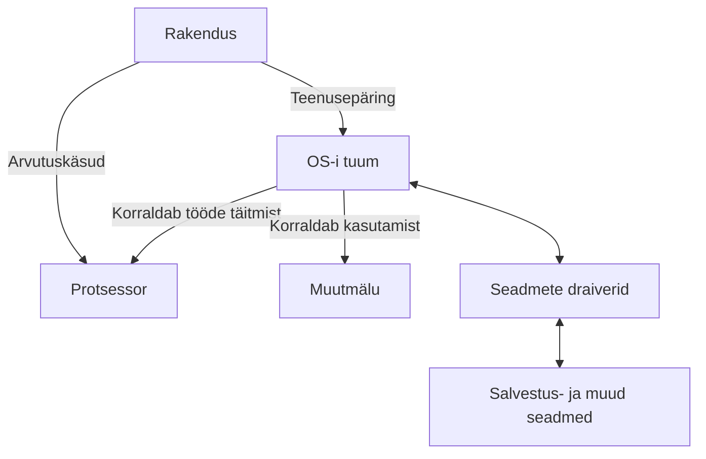
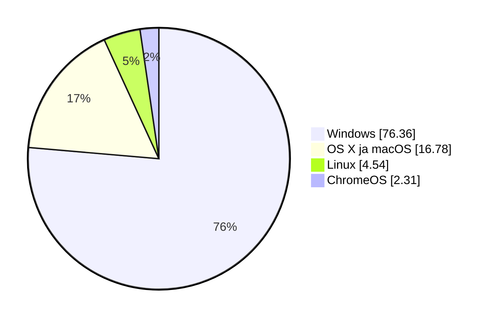
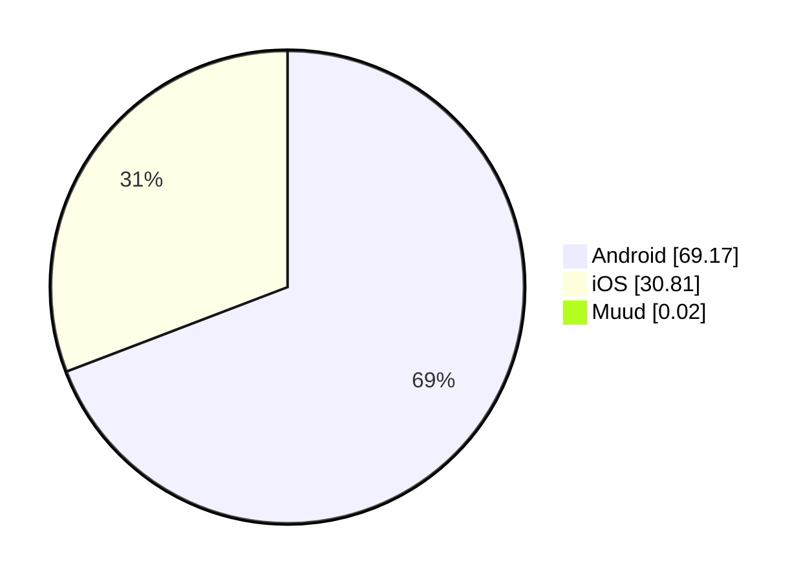

# Operatsioonisüsteemi roll ja liigid

Arvuti või telefon ei koosne ainult riistvarast ja kasutaja avatud rakendustest. Nende koostööd korraldab **operatsioonisüsteem**. Selles materjalis vaatame, milleks seda vaja on, milliseid operatsioonisüsteeme kasutatakse ja kuidas kasutaja nendega suhtleb.

!!! info "Õpieesmärgid"

    Pärast materjali läbimist oskad:

    - eristada riistvara, operatsioonisüsteemi ja rakendust;
    - selgitada operatsioonisüsteemi peamisi ülesandeid;
    - tuua näiteid arvutite, telefonide, serverite ja võrguseadmete operatsioonisüsteemidest;
    - selgitada operatsioonisüsteemi tuuma mõistet;
    - võrrelda graafilist kasutajaliidest ja käsurida;
    - nimetada tegureid, millest sõltub operatsioonisüsteemi valik.

## 1. Milleks on operatsioonisüsteemi vaja?

Kujuta ette, et kuulad sülearvutis muusikat, avad brauseri ja laadid alla faili. Kõik need rakendused vajavad protsessori aega ja mälu. Lisaks tuleb juhtida heliseadet, võrguadapterit ning salvestusseadet. Rakendused peavad saama töötada nii, et ühe tegevus ei rikuks teise andmeid.

**Operatsioonisüsteem** ehk **OS** (*operating system*) on süsteemitarkvara, mis haldab seadme ressursse ning pakub rakendustele ja kasutajale vajalikke teenuseid. Ressursid on näiteks protsessori aeg, muutmälu, salvestusruum ja ühendatud seadmed.

OS on tarkvara kogum. Selle hulka kuuluvad tuum, mitmesugused süsteemiteenused ja tööriistad. Kasutajale tuttav töölaud on ainult osa tervikust.

| Mõiste | Mida see tähendab? | Näited |
| --- | --- | --- |
| **Riistvara** | Seadme füüsilised osad. | Protsessor, RAM, SSD, kuvar, klaviatuur. |
| **Operatsioonisüsteem** | Tarkvara, mis korraldab ressursside kasutamist ja rakenduste tööd. | Windows, macOS, Debian Linux, Android. |
| **Rakendus** | Tarkvara, millega kasutaja täidab kindlat ülesannet. | Veebibrauser, tekstiredaktor, mäng, fototöötlusprogramm. |
| **Andmed** | Teave, mida tarkvara töötleb või salvestab. | Tekst, fotod, helifailid ja seadistused. |

!!! example "Näide: foto avamine"

    Foto on andmefail. Pildivaatur on rakendus, mis oskab foto faili sisu tõlgendada. Operatsioonisüsteem kontrollib ligipääsu failile, korraldab selle lugemise salvestusseadmelt ja võimaldab rakendusel kasutada mälu ning ekraani. Riistvara täidab vajalikud arvutused ja kuvab tulemuse.

Operatsioonisüsteem ja rakendus ei ole sama asi. Näiteks brauseri vahetamine ei tähenda operatsioonisüsteemi vahetamist. Samuti ei tähenda uue töölauateema valimine uue OS-i paigaldamist.

## 2. Operatsioonisüsteemi peamised ülesanded

| Ülesanne | Mida OS korraldab? | Igapäevane näide |
| --- | --- | --- |
| **Programmide töö** | Programmide käivitamine, töötavate protsesside haldamine ja protsessoriaja jagamine. | Brauser ja muusikapleier saavad mõlemad töötada. |
| **Mäluhaldus** | Mälu eraldamine ja vabastamine ning protsesside mälu kaitsmine. | Fototöötlusprogramm saab tööks vajaliku mälu. |
| **Failide ja salvestusruumi haldus** | Failide ja kaustade loomine, leidmine, lugemine ning kirjutamine. | Dokumendi salvestamine oma kausta. |
| **Seadmete kasutamine** | Suhtlus seadmetega draiverite ja teiste süsteemikomponentide kaudu. | Heli jõuab kõrvaklappidesse. |
| **Kaitse ja õigused** | Kasutajate ja rakenduste lubatud tegevuste kontrollimine. | Üks õppija ei saa lugeda teise õppija kaitstud faile. |
| **Suhtlus ja jälgimine** | Võrguühenduste, protsessidevahelise suhtluse ning töö jälgimiseks vajalike andmete pakkumine. | Rakendus saab võrku kasutada ja süsteem kuvab ressursikasutust. |

Kasutaja suhtleb OS-iga näiteks töölaua, seadistusakende või käsurea kaudu. Rakendused kasutavad OS-i pakutavaid programmeerimisliideseid ja teenuseid.

!!! tip "Pea meeles"

    OS ei tee kõiki kasutaja ülesandeid ise. Brauser tõlgendab veebilehte ja pildivaatur fotot. Operatsioonisüsteem loob nende töötamiseks vajaliku keskkonna.

## 3. Tuum ja operatsioonisüsteemi ülejäänud osad

**Tuum** ehk **kernel** on operatsioonisüsteemi keskne osa. See korraldab muu hulgas protsessori ja mälu kasutamist ning vahendab kaitstud toiminguid. Tuum on vajalik ka siis, kui ekraanil ei ole graafilist töölauda.

**Süsteemiteenused** teevad taustal vajalikke töid, näiteks haldavad võrguühendusi või prindijärjekorda. **Draiverid** võimaldavad operatsioonisüsteemil kasutada konkreetseid seadmeid. **Kasutajaliides** pakub kasutajale võimaluse süsteemi juhtida.

Tuum, töölaud ja kasutajaliidese seadistusaken võivad kuuluda sama operatsioonisüsteemi juurde, kuid nende ülesanded on erinevad.

Järgmine skeem näitab lihtsustatult rakenduse ja süsteemikomponentide koostööd. Protsessor täidab rakenduse arvutuskäske. OS korraldab tööde täitmist ja vahendab kaitstud toiminguid, näiteks seadmete kasutamist.

Skeem ei näita kõiki OS-i komponente ega iga tegevuse täpset teed. Tuuma ja draiverite töökorraldus võib süsteemiti erineda.

## 4. Levinud operatsioonisüsteemid

| Operatsioonisüsteem või süsteemipere | Levinud kasutuskoht | Mida meeles pidada? |
| --- | --- | --- |
| **Microsoft Windows** | Laua- ja sülearvutid; Windows Serveri tooted serverites. | Tööjaama ja serveri süsteemid on eri vajadustega tooted. |
| **Apple macOS** | Apple'i Mac-arvutid. | Kuulub Apple'i arvutite tarkvarakeskkonda. |
| **Linuxi distributsioonid** | Tööjaamad, serverid ja mitmesugused eriseadmed. | Linuxi süsteem võib töötada graafilise töölauaga või ilma selleta. |
| **Android** | Telefonid, tahvelarvutid ja muud nutiseadmed. | Põhineb Linuxi tuumal ja pakub oma rakenduskeskkonda. |
| **Apple iOS ja iPadOS** | iPhone'id ja iPadid. | Telefoni ja tahvelarvuti süsteemid on kohandatud nende seadmete kasutamiseks. |
| **ChromeOS** | Chromebookid ja teised sobivad seadmed. | ChromeOS on operatsioonisüsteem; Chrome on veebibrauser. |

!!! warning "Levinud eksiarvamus"

    Linux ei tähenda ainult käsurida ning Windows ei tähenda ainult graafilist töölauda. Mõlemas saab kasutada graafilisi tööriistu ja käsurida. Ubuntu Desktop on näiteks graafilise töölauaga Linuxi süsteem.

## 5. Süsteemide liigitamine kasutusotstarbe järgi

Üks võimalus süsteeme võrrelda on vaadata, **millise seadme või ülesande jaoks neid kasutatakse**.

| Kasutusotstarve | Iseloomulik vajadus | Näide |
| --- | --- | --- |
| **Tööjaam** | Inimese igapäevane töö ja rakenduste kasutamine. | Windowsi, Linuxi või macOS-iga sülearvuti. |
| **Server** | Teenuste pakkumine teistele seadmetele ja kasutajatele. | Linuxi veebiserver või Windows Serveriga failiserver. |
| **Mobiilseade** | Puutejuhtimine, aku kasutamine ja mobiilirakendused. | Androidiga telefon. |
| **Võrguseade** | Võrguliikluse suunamine ja seadme haldamine. | RouterOS-iga ruuter või Cisco IOS-iga võrguseade. |
| **Manusseade (*embedded system*)** | Konkreetse seadme juhtimine. | Juhtseade, tööstusseade või nutikas koduseade. |

**Manussüsteem** on arvutisüsteem, mis on osa suuremast seadmest ja täidab selles kindlat ülesannet. Kõik manussüsteemid ei kasuta Linuxit ega isegi terviklikku operatsioonisüsteemi. Mõne seadme juhtimiseks piisab väikesest püsivaraprogrammist.

Need kategooriad võivad kattuda. Sama Linuxi distributsiooni saab kasutada nii tööjaamas kui ka serveris. Serveri määrab eelkõige tema ülesanne: ta pakub teenust.

### Töötlusviisid ja reaalajasüsteemid

Kasutusotstarbest eraldi saab kirjeldada, kuidas töid täidetakse.

- **Interaktiivne töö:** kasutaja annab sisendi ja jälgib tulemust, näiteks kirjutab teksti.
- **Pakktöötlus:** ettevalmistatud töid täidetakse ilma iga sammu juures kasutaja sisendit küsimata, näiteks muudetakse paljude fotode mõõtmeid.
- **Ajajaotus:** protsessori tööaega jagatakse eri tööde vahel. Täpsemalt käsitleme seda järgmises materjalis.
- **Reaalajasüsteem:** süsteem on kavandatud täitma ülesandeid määratud ajaliste piirangute järgi. Oluline on ennustatav reageerimine.

Üks tänapäevane OS võib toetada nii interaktiivset tööd kui ka pakktöötlust. Fotode automaatseks töötlemiseks ei ole tingimata vaja eraldi „pakktöötluslikku operatsioonisüsteemi“.

!!! example "Mida tähendab reaalajas töötamine?"

    Tööstusseadme juhtsüsteem peab reageerima ettenähtud tähtaja jooksul. Võimalikult hea keskmine kiirus üksi ei ole piisav, kui mõni kriitiline vastus hilineb. See, et mäng või videokõne tundub kiire, ei muuda arvuti OS-i automaatselt reaalajaoperatsioonisüsteemiks.

## 6. Graafiline kasutajaliides, käsurida ja skriptid

**Graafiline kasutajaliides** ehk **GUI** (*graphical user interface*) kasutab aknaid, ikoone, menüüsid ja muid visuaalseid elemente. Seda saab juhtida näiteks hiire, klaviatuuri või puuteekraani kaudu.

**Käsurealiides** ehk **CLI** (*command-line interface*) võimaldab arvutit juhtida tekstikäskudega. Kasutaja sisestab käsu ning saab vastuseks tulemuse või teate.

**Käsukest** ehk **shell** on programm, mis tõlgendab kasutaja sisestatud käske. See teeb käsule vastava toimingu ise või käivitab selleks teise programmi. Näiteks saab käsukesta kaudu käivitada rakendusi, luua kaustu ja korraldada failidega tehtavaid toiminguid. Levinud käsukestad on **Bash**, **Zsh** ja **PowerShell**.

**Terminal** võimaldab teksti sisestada ja väljundit kuvada. Graafilises töölauas kasutatakse selleks tavaliselt terminalirakendust, mille sees töötab käsukest. Terminal ja käsukest täidavad erinevaid ülesandeid: terminal pakub suhtlemiseks akna, käsukest tõlgendab selles sisestatud käske.

!!! example "Näide: kausta loomine"

    Kasutaja sisestab käsu terminali. Käsukest tõlgendab seda ja korraldab kausta loomise. Võimalik tulemus või veateade kuvatakse terminalis. Edukas käsk ei pruugi alati tekstilist vastust anda.

**Skript** on fail, millesse on salvestatud tõlgendaja täidetavad käsud. Käsukest saab sobivat skripti käivitades täita need käsud ilma, et kasutaja peaks iga käsku eraldi sisestama. Näiteks võib skript luua mitu kausta ja kopeerida neisse vajalikud failid.

!!! tip "Pea meeles"

    - **CLI** on tekstikäskudel põhinev suhtlusviis.
    - **Terminal** võimaldab käske sisestada ja väljundit näha.
    - **Shell** ehk käsukest tõlgendab käske ja korraldab nende täitmise.
    - **Skript** võimaldab salvestatud käske automatiseeritult täita.

| Võrdlus | GUI | CLI |
| --- | --- | --- |
| Kuidas tegevus antakse? | Valikute, nuppude ja graafiliste objektide kaudu. | Tekstikäskude ja nende argumentidena. |
| Millal on mugav? | Visuaalsete tegevuste ja valikute uurimisel. | Korduvate toimingute, kaugjuhtimise ja täpsete käskude puhul. |
| Mida on vaja õppida? | Rakenduse ülesehitust ja valikute tähendust. | Käskude nimetusi, süntaksit ja argumente. |
| Kas saab automatiseerida? | Jah, sobivate tööriistadega. | Jah, näiteks käskude skriptiks ühendamisega. |

!!! tip "IT-spetsialisti tööriistad"

    GUI ja CLI oskused täiendavad teineteist. Hea valik sõltub ülesandest: üht pilti võib olla mugav töödelda graafiliselt, sadadele failidele sama muudatuse tegemiseks võib sobida skript.

## 7. Operatsioonisüsteemide turujaotus

**Turujaotus** näitab, kui suure osa vaadeldavast turust või kasutusest moodustab mingi operatsioonisüsteem. Tulemus sõltub sellest, milliseid seadmeid, piirkonda ja ajavahemikku uuritakse ning mida mõõdetakse.

!!! info "Andmete aeg ja ulatus"

    Arvutite, telefonide ja tahvelarvutite andmed pärinevad **Statcounter Global Statsist** ning kirjeldavad **2026. aasta septembri ülemaailmset veebikasutust**. Veebisaitide serverite andmed pärinevad **W3Techsist seisuga 4. oktoober 2026**.

    Need on eri meetoditega koostatud ülevaated. Maailma jaotus võib erineda Eesti, sinu kooli või konkreetse ettevõtte jaotusest.

Statcounter hindab operatsioonisüsteemide osakaalu oma mõõtmises osalevate veebisaitide **lehevaatamiste** põhjal. See tähendab, et aktiivselt veebis surfav seade võib anda rohkem lehevaatamisi kui harva kasutatav seade.

Näiteks Windowsi 76,36% osakaal arvutite tabelis tähendab, et ligikaudu 76 lehevaatamist sajast tehti Windowsiga arvutist. See ei tähenda, et täpselt 76 arvutit sajast kasutaks Windowsi.

**Veebikasutuse osakaal, seadmete arv ja uute seadmete müük on erinevad näitajad.** Allpool olevad tabelid ei mõõda müüki ega loenda kõiki maailma seadmeid.

### Laua- ja sülearvutid

Statcounteri arvutite ehk *desktop*-kategoorias on Windows suurima osakaaluga operatsioonisüsteem.

| Operatsioonisüsteem või rühm | Osakaal arvutite veebikasutuses |
| --- | ---: |
| Windows | 76,36% |
| Apple'i arvutite OS-id: OS X ja macOS kokku | 16,78% |
| Linux | 4,54% |
| ChromeOS | 2,31% |

### Nutitelefonid

Telefonide veebikasutuses on kaks peamist operatsioonisüsteemi: Android ja iOS.

| Operatsioonisüsteem või rühm | Osakaal telefonide veebikasutuses |
| --- | ---: |
| Android | 69,17% |
| iOS | 30,81% |
| Muud kokku | 0,02% |

### Tahvelarvutid

Tahvelarvutite jaotus erineb telefonide jaotusest: Apple'i ja Androidi osakaalud on selles ülevaates peaaegu võrdsed.

| Operatsioonisüsteem või rühm | Osakaal tahvelarvutite veebikasutuses |
| --- | ---: |
| Apple'i tahvelarvutite OS-id | 50,35% |
| Android | 49,57% |
| Muud kokku | 0,08% |

### Seadmerühmad koos

Kui vaadata Statcounteri mõõdetud veebikasutust eri seadmerühmade peale kokku, on esikohal Android.

| Operatsioonisüsteem või rühm | Osakaal veebikasutuses üle seadmerühmade |
| --- | ---: |
| Android | 42,54% |
| Windows | 28,98% |
| iOS | 19,45% |
| Apple'i arvutite OS-id: OS X ja macOS kokku | 6,37% |
| Linux | 1,73% |
| Ülejäänud kategooriad kokku, arvutatud | 0,93% |

Apple'i arvutite rühm on arvutatud **4,05% + 2,32% = 6,37%**. Ülejäänud kategooriate osakaal on saadud tabeli teiste rühmade summa lahutamisel 100%-st.

See tabel arvestab seadmerühmade lehevaatamisi koos. See ei ole eelnevate tabelite protsentide lihtne keskmine ega hõlma kõiki maailma servereid ja nutiseadmeid.

### Veebisaitide serverite operatsioonisüsteemid

**Server** pakub teistele seadmetele teenuseid. Näiteks veebiserver saadab sinu brauserile veebilehe sisu. Serverite operatsioonisüsteemide jaotus võib kasutajate arvutite jaotusest tugevalt erineda.

W3Techs uurib veebisaitide kasutatavaid tehnoloogiaid. Järgnev tabel näitab osakaalu **veebisaitide hulgas, mille serveri operatsioonisüsteem on W3Techsile teada**.

| Operatsioonisüsteemide rühm | Seda rühma kasutavate veebisaitide osakaal |
| --- | ---: |
| Unix ja Unixi-laadsed süsteemid | 92,1% |
| Windows | 8,1% |

W3Techsi **Unix**-rühm hõlmab ka Linuxit ja BSD-süsteeme. **92,1% ei ole Linuxi eraldi turuosa.**

Üks veebisait võib kasutada mitut operatsioonisüsteemi, mistõttu osakaalude summa võib ületada 100%. See ülevaade ei loenda kõiki füüsilisi ega virtuaalseid servereid ning ei kirjelda eraldi näiteks kooli failiservereid või ettevõtte sisevõrku.

### Mida sellest järeldada?

- **Täpsusta alati keskkonda.** Küsimusele „Milline OS on kõige levinum?” vastamiseks peab teadma, kas räägitakse arvutitest, telefonidest või serveritest.
- **Väiksem osakaal ühes keskkonnas ei tähenda vähest tähtsust kõikjal.** Näiteks Linuxi väike osakaal arvutite veebikasutuses ei kirjelda selle rolli serverites.
- **IT-töös on kasulik tunda mitut operatsioonisüsteemi.** Kasutaja tööarvuti ja talle teenust pakkuv server võivad kasutada erinevaid süsteeme.
- **Populaarsus ei määra sobivust.** OS-i valikul loevad ka vajalike rakenduste tugi, riistvara, turvauuendused, hind ja kasutusotstarve.
- **Vaata andmete kuupäeva ja allikat.** Osakaalud muutuvad ning eri mõõtmismeetodid võivad anda erineva tulemuse.

## 8. Kuidas operatsioonisüsteemi valida?

Sobiv süsteem peab vastama kasutaja ja seadme vajadustele. Valiku tegemisel tuleb arvestada järgmisega:

- **Rakendused:** kas vajalik tarkvara toetab seda OS-i?
- **Riistvara:** kas protsessor, mälu ja seadmete draiverid sobivad?
- **Kasutusotstarve:** kas eesmärk on õppimine, mängimine, serveriteenuse pakkumine või seadme juhtimine?
- **Hooldus ja tootetugi:** kui kaua saab süsteem turvauuendusi ning kes seda haldab?
- **Litsents ja kulud:** millised kasutustingimused kehtivad ning mida maksavad litsents ja tugi?
- **Kasutajate oskused:** kas süsteemi kasutamiseks ja haldamiseks on vajalikud teadmised olemas?

**Avatud lähtekood** tähendab, et lähtekood on kättesaadav ja litsents lubab seda kindlatel tingimustel kasutada, muuta ning levitada. See ei tähenda automaatselt tasuta tugiteenust. **Omandusliku tarkvara** muutmise ja levitamise võimalusi piirab tavaliselt tootja litsents ning lähtekood ei ole üldjuhul avalik.

Rakendus peab sobima nii OS-i kui ka protsessori arhitektuuriga. Näiteks x86-64 ja ARM64 on erinevad arhitektuurid. Failivormingu toetamine ja rakenduse käivitamine on samuti eri asjad: foto võib avaneda mitmes OS-is, kuid ühe OS-i jaoks tehtud programm ei pruugi teises otse töötada.

## 9. Lühike arengulugu

Ajajoone eesmärk on mõista muutusi. Kõiki aastaarve ei ole vaja pähe õppida.

| Aeg | Oluline areng | Miks see oluline oli? |
| --- | --- | --- |
| **1956** | GM-NAA I/O, üks varaseid operatsioonisüsteeme. | Aitas automatiseerida tööde järjestikust täitmist. |
| **1969** | Algab Unixi arendus. | Unixi ideed mõjutasid hilisemaid operatsioonisüsteeme. |
| **1983–1984** | Apple Lisa ja Macintosh. | Graafiline kasutajaliides jõudis personaalarvutite kasutajateni; selle ideed olid arenenud varem. |
| **1985** | Windows 1.0. | Pakkus MS-DOS-i keskkonnas graafilisi kasutusvõimalusi. |
| **1991** | Linus Torvalds alustab Linuxi tuuma arendamist. | Sellest kujunes paljude tänapäevaste süsteemide alus. |
| **1995** | Windows 95. | Muutis Windowsi kasutajaliidese ja personaalarvuti kasutamise paljudele tuttavaks. |

Ajaloost räägime sellel kursusel veel edaspidi lähemalt, see on vaid kiire ülevaade.

## 10. Enesekontroll

Vasta kõigepealt ise. Seejärel ava vastus ja võrdle oma põhjendust.

### 1. Kas Firefox, Windows ja SSD kuuluvad samasse kategooriasse?

??? success "Vaata vastust"

    Ei. Firefox on rakendus, Windows operatsioonisüsteem ja SSD riistvara. Need teevad arvutis koostööd, kuid täidavad erinevaid ülesandeid.

### 2. Miks on muusikapleieril ja brauseril vaja operatsioonisüsteemi?

??? success "Vaata vastust"

    OS korraldab nende protsessori- ja mälukasutust ning pakub failide, võrgu ja seadmete kasutamiseks vajalikke teenuseid. Näiteks muusikapleier vajab heli väljastamist ja brauser võrguühendust.

### 3. Mis erinevus on Linuxi tuumal ja Debianil?

??? success "Vaata vastust"

    Linuxi tuum on operatsioonisüsteemi keskne komponent. Debian on distributsioon, mis ühendab tuuma süsteemitööriistade, paketihalduse ja muu tarkvaraga terviklikuks kasutatavaks süsteemiks.

### 4. Kas Linuxi kasutamiseks peab alati käske sisestama?

??? success "Vaata vastust"

    Ei. Linuxi süsteemi saab kasutada graafilise töölauaga. Käsurida on lisavõimalus ning eriti kasulik haldamisel ja automatiseerimisel. Ka Windowsis kasutatakse käsurida.

### 5. Kas paljude fotode automaatne töötlemine nõuab eraldi pakktöötluslikku OS-i?

??? success "Vaata vastust"

    Ei. See on pakktöötluse näide, mida saab teha rakenduse või skriptiga ka tavalises tööjaama operatsioonisüsteemis. Töötlusviis ja OS-i kasutusotstarve on erinevad liigitamise alused.

### 6. Kas iga väga kiire arvuti on reaalajasüsteem?

??? success "Vaata vastust"

    Ei. Reaalajasüsteemi puhul on oluline määratud ajaliste piirangute täitmine ja ennustatav käitumine. Suur keskmine kiirus üksi ei taga, et kriitiline tegevus saab õigel ajal valmis.

### 7. Miks ei pruugi Windowsi rakendus Linuxis otse käivituda?

??? success "Vaata vastust"

    Rakendus võib sõltuda Windowsi pakutavatest liidestest ja kasutada selle OS-i käivitatava faili vormingut. Toimimine sõltub ka protsessori arhitektuurist. Mõne rakenduse jaoks on olemas teise OS-i versioon, ühilduvuskiht või virtualiseerimislahendus, kuid seda tuleb eraldi kontrollida.

### 8. Mille järgi valiksid kooli tööarvutile operatsioonisüsteemi?

??? success "Vaata vastust"

    Arvestaksin vajalike rakenduste, riistvara ja draiverite, litsentsi, turvauuenduste ning kasutajate ja haldajate oskustega. Ainult tuttav välimus või populaarsus ei ole piisav valikukriteerium.

## Allikad ja lisalugemine

1. [Debian: Definitions and overview](https://www.debian.org/doc/manuals/debian-faq/basic-defs.en.html){ target="_blank" rel="noopener" }.
2. [Android Developers: Platform architecture](https://developer.android.com/guide/platform){ target="_blank" rel="noopener" }.
3. [FreeRTOS: What is FreeRTOS?](https://freertos.org/Why-FreeRTOS/What-is-FreeRTOS){ target="_blank" rel="noopener" }.
4. [Operating System Tutorial](https://www.tutorialspoint.com/operating_system/index.htm){ target="_blank" rel="noopener" }
5. [What is Operating System? Tutorial](https://www.guru99.com/operating-system-tutorial.html){ target="_blank" rel="noopener" }
6. [Statcounter – arvutid, september 2026](https://gs.statcounter.com/os-market-share/desktop/worldwide/#monthly-202609-202609-bar){ target="_blank" rel="noopener" }.
7. [Statcounter – telefonid, september 2026](https://gs.statcounter.com/os-market-share/mobile/worldwide/#monthly-202609-202609-bar){ target="_blank" rel="noopener" }.
8. [Statcounter – tahvelarvutid, september 2026](https://gs.statcounter.com/os-market-share/tablet/worldwide/#monthly-202609-202609-bar){ target="_blank" rel="noopener" }.
9. [Statcounter – kõik platvormid, september 2026](https://gs.statcounter.com/os-market-share/worldwide/#monthly-202609-202609-bar){ target="_blank" rel="noopener" }.
10. [W3Techs – veebisaitide operatsioonisüsteemid](https://w3techs.com/technologies/overview/operating_system){ target="_blank" rel="noopener" }.

---
*Õppematerjali koostaja: Priit Paap, 2026*
